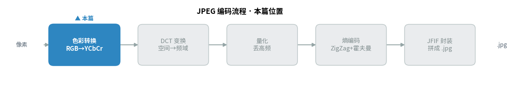
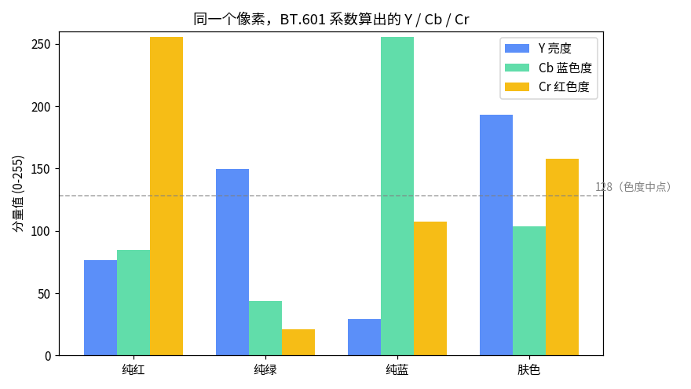
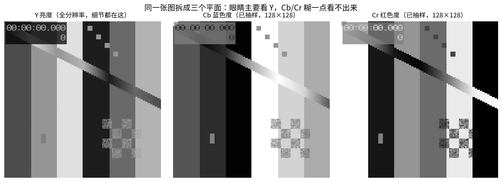
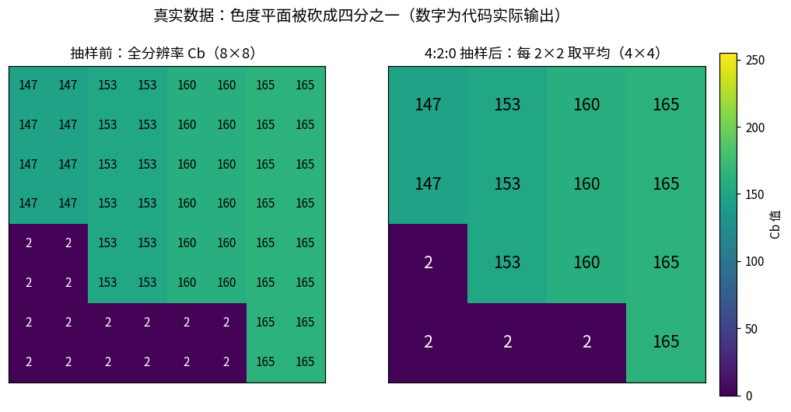
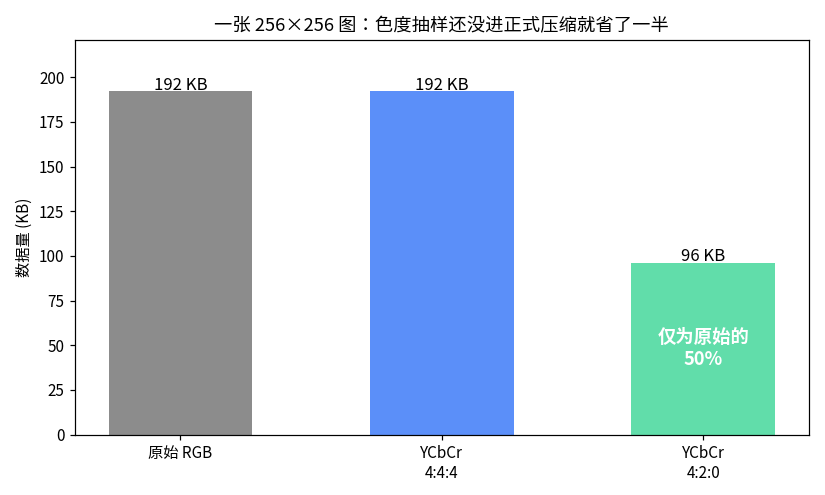
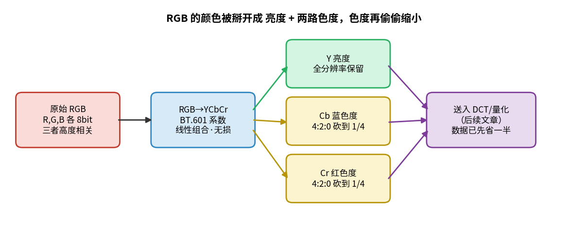

> 作者：Jone
> 日期：2026-09-12
> 风格：深度分析
> 状态：待发布

# 手搓 JPEG 编码器 #01：为什么压缩图片第一步是把颜色"掰开"

很多人以为图片压缩的第一步是什么高深的数学变换。

不是。JPEG 编码器拿到一张图，干的第一件事朴素得有点反常：把每个像素的红绿蓝三个颜色分量，重新算成"一个亮度 + 两个色度"，然后趁你不注意，把两个色度悄悄缩小到原来的四分之一。

就这一步，还没进入任何真正意义上的"压缩算法"，一张图的数据量已经先掉了一半。

这是《从 0 到 1 手搓编解码器》系列的第一篇。整个系列我会用 C++ 从零实现一个能跑的 JPEG 编码器、解码器，再往后是 MJPEG 和 H.264，代码全部开源在 [codec-from-scratch](https://github.com/Joneyao/codec-from-scratch)。文中每张配图都是配套代码实际运行的结果。

这一篇先讲清楚开头这件事：为什么要把颜色掰开，以及掰开之后凭什么能白省一半。

先看这一篇在整个 JPEG 编码流程里的位置——色彩转换是第一站：



## RGB 有个毛病：三个通道都在重复同一件事

先说为什么 RGB（红绿蓝三原色，Red-Green-Blue）不适合直接压缩。

一个像素用红、绿、蓝三个 8 bit 数值表示，这是屏幕显示的方式，也是相机传感器最自然的输出。问题在于，这三个通道高度相关——一块偏亮的区域，它的 R、G、B 通常一起偏大；一块偏暗的，三个一起偏小。

换句话说，"这个像素有多亮"这条信息，在 R、G、B 里被存了三遍。压缩最恨的就是这种重复。

更关键的是，人眼对这三个通道的敏感度根本不一样。人眼里负责感知亮暗的视杆细胞，数量远多于负责感知颜色的视锥细胞。同一个道理落到图像上就是：你对画面明暗的边缘极其敏感，对颜色的细微变化则相当迟钝。

RGB 把这三样搅在一起，就没法区别对待。要想"该精细的地方精细、该偷懒的地方偷懒"，第一步必须把"亮度"从"颜色"里分离出来。

这就是 YCbCr（亮度-蓝色度-红色度色彩空间）干的事。

## 一个像素，怎么变成 Y、Cb、Cr

YCbCr 把颜色拆成三份：

- **Y**：亮度（luma），这个像素有多亮，黑白电视时代就是只传这一路。
- **Cb**：蓝色色度，蓝色成分相对亮度偏了多少。
- **Cr**：红色色度，红色成分相对亮度偏了多少。

转换用的是一组固定系数。这里有个容易搞混的点值得说清楚：JPEG 的标准文本（ITU-T T.81）本身**并不规定**这组系数，它只谈抽象的"分量（component）"。真正规定 RGB 怎么变 YCbCr 的，是 JFIF（JPEG 文件交换格式，JPEG File Interchange Format）约定（后来写进 ITU-T T.871），用的是 BT.601 全范围系数：

```
Y  =  0.299·R + 0.587·G + 0.114·B
Cb = -0.168736·R - 0.331264·G + 0.5·B + 128
Cr =  0.5·R - 0.418688·G - 0.081312·B + 128
```

注意 Y 那行的系数：绿色占 0.587，接近六成。这不是随便定的——人眼对绿光最敏感，所以亮度里绿的权重最大。Cb、Cr 后面都加了 128，是为了把可正可负的色度差平移到 0-255 的无符号范围里，128 就是"没有色偏"的中点。

这套公式落到 C++ 里就是逐像素套用，核心几行：

```cpp
uint8_t ClampToByte(double v) {
    int iv = static_cast<int>(std::lround(v));
    return static_cast<uint8_t>(iv < 0 ? 0 : (iv > 255 ? 255 : iv));
}

void RgbPixelToYCbCr(uint8_t r, uint8_t g, uint8_t b,
                     uint8_t& y, uint8_t& cb, uint8_t& cr) {
    double rf = r, gf = g, bf = b;
    y  = ClampToByte(0.299 * rf + 0.587 * gf + 0.114 * bf);
    cb = ClampToByte(-0.168736 * rf - 0.331264 * gf + 0.5 * bf + 128.0);
    cr = ClampToByte(0.5 * rf - 0.418688 * gf - 0.081312 * bf + 128.0);
}
```

拿几个典型颜色代进去看结果，规律很直观：



纯红的 Y 只有 76——红色在人眼里其实不算亮，但它的 Cr 冲到 240 以上，因为 Cr 就是管红色偏移的。纯绿的 Y 最高（150），因为绿色贡献了亮度的大头。这几个数都是上面那段代码真实算出来的。

到这一步，数据一个字节都没少：三个 8 bit 进去，三个 8 bit 出来。这只是换了个表示方式。真正省数据的是下一步。

## 关键一步：色度可以缩小，亮度不能动

既然亮度和颜色分开了，就能区别对待。

编码器的判断是：Y 全分辨率保留，一个像素都不能少；Cb、Cr 直接缩小——最常用的做法叫 **4:2:0**，横竖各取一半，每 2×2 个像素的色度合并成一个。

凭什么敢这么干？因为前面说的——人眼对颜色的空间细节极不敏感。你把一张照片的颜色分辨率砍到四分之一，绝大多数人肉眼看不出区别，但把亮度砍四分之一，立刻满屏马赛克。

把同一张图拆成三个平面看得很清楚：



左边 Y 平面，那些锐利的文字、边缘、纹理细节全在这。中间和右边是 Cb、Cr，已经缩到 128×128，明显比 Y 平滑、糊。可把这三个平面重新合成一张彩色图，你几乎看不出色度被砍过。

说白了，4:2:0 是一笔精算过的账：花最小的画质代价，换最大的数据削减。

## 抽样到底怎么砍？看真实的数字

光说"每 2×2 合并成一个"太抽象。直接看代码在一个真实的 8×8 色度块上做了什么。

抽样用的是最简单的 box 平均——2×2 四个值取平均，四舍五入成一个：

```cpp
// 对色度平面做 box 平均抽样，factor_x/factor_y 为 2（4:2:0）
Plane BoxDownsample(const Plane& full, int factor_x, int factor_y) {
    Plane out;
    out.width  = (full.width  + factor_x - 1) / factor_x;
    out.height = (full.height + factor_y - 1) / factor_y;
    out.data.resize(size_t(out.width) * out.height);
    for (int oy = 0; oy < out.height; ++oy)
      for (int ox = 0; ox < out.width; ++ox) {
        int sum = 0, cnt = 0;
        for (int dy = 0; dy < factor_y; ++dy)
          for (int dx = 0; dx < factor_x; ++dx) {
            int sx = ox * factor_x + dx, sy = oy * factor_y + dy;
            if (sx < full.width && sy < full.height) { sum += full.at(sx, sy); ++cnt; }
          }
        out.at(ox, oy) = uint8_t((sum + cnt / 2) / cnt);  // 四舍五入
      }
    return out;
}
```

我让编码器从测试图里挑了一个色度变化最剧烈的 8×8 块（这样最能看出抽样的影响），把抽样前后的真实数值都 dump 出来：



左边是抽样前的 8×8，右边是抽样后的 4×4。看左上角：四个 147 平均还是 147，稳稳保留。再看左下那片剧变区，147 和 2 挨在一起（这是一条颜色硬边缘），2×2 平均后有的格子变成 2、有的还是中间值——边缘信息被抹掉了一部分。

这就是 4:2:0 的代价所在：平滑区域几乎无损，硬色边缘会轻微模糊。但这种模糊落在色度上，人眼确实很难察觉。

一个 8×8 的块，色度从 64 个数变成 16 个数。整张图的两个色度平面，就这么各自缩到了四分之一。

## 一张图先省了一半，压缩还没真正开始

把账算总。

编码器处理的这张测试图是 256×256。原始 RGB 要存多少？256×256×3 = 196608 字节。转成 YCbCr 之后做 4:2:0 抽样：Y 还是 256×256 = 65536 字节，Cb 和 Cr 各缩到 128×128 = 16384 字节。加起来 98304 字节。



正好一半。这个数字是编码器直接统计出来写进文件的，不是估的。

这里要强调一件容易被忽略的事：**这一半是在真正的压缩算法之前省下的**。DCT 变换、量化、霍夫曼编码——这些 JPEG 的看家本领一个都还没上场。色彩转换加抽样，只是把数据摆成一个"方便后面压"的姿势，顺手就白赚了 50%。

整个第一步的流程串起来是这样：



RGB 进来，先无损地变成 YCbCr，Y 原样留着，Cb、Cr 缩到四分之一，然后三个平面各自送进后面的 DCT 环节。

## 小结

回头看，这一步的逻辑其实特别朴素：

人眼对亮度敏感、对颜色迟钝。所以把颜色从亮度里拆出来，亮度精细伺候，颜色大胆偷工。RGB 做不到这种区别对待，YCbCr 可以——这就是为什么压缩图片的第一件事不是变换，而是换一套颜色表示。

到这里，我们的编码器已经能把一张 PPM 图读进来，输出三个 YCbCr 平面，数据量减半。这里的 PPM（Portable Pixmap）是一种极简的无压缩图片格式，文件里就是逐个像素明文存着 RGB 值，没有任何编码——正好适合当编码器的输入，省去先解析别人压缩格式的麻烦。代码、测试、这篇文章用的全部数据导出脚本，都在 [codec-from-scratch 仓库的 jpeg/encoder](https://github.com/Joneyao/codec-from-scratch/tree/main/jpeg/encoder) 里，`make` 就能跑，跑出来的数字和这篇文章里的一模一样。

下一篇进入真正的核心：8×8 的 DCT 变换。它不压缩任何一个字节，却能把一个块的能量"扫"到左上角几个数字里，为后面的量化铺好路。到时候你会看到，一个 8×8 像素块经过 DCT 之后，右下角是怎么变成一片接近零的——那才是 JPEG 能狠狠压缩的真正入口。

---

[ITU-T T.81 (JPEG) 标准原文](https://www.itu.int/rec/T-REC-T.81)

[ITU-T T.871 (JFIF) — 规定 RGB↔YCbCr 转换的文件格式标准](https://www.itu.int/rec/T-REC-T.871)

[YCbCr - Wikipedia](https://en.wikipedia.org/wiki/YCbCr)

[Chroma subsampling 色度抽样详解 - Wikipedia](https://en.wikipedia.org/wiki/Chroma_subsampling)

[libjpeg-turbo（对照用的生产级 JPEG 实现，当前 3.2.x）](https://github.com/libjpeg-turbo/libjpeg-turbo)

[一文读懂 YUV 采样与格式 - 博客园](https://www.cnblogs.com/wainiwann/p/7477794.html)

[图像压缩中的色彩空间转换 - 知乎](https://zhuanlan.zhihu.com/p/85578282)
