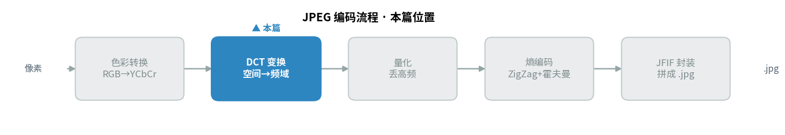
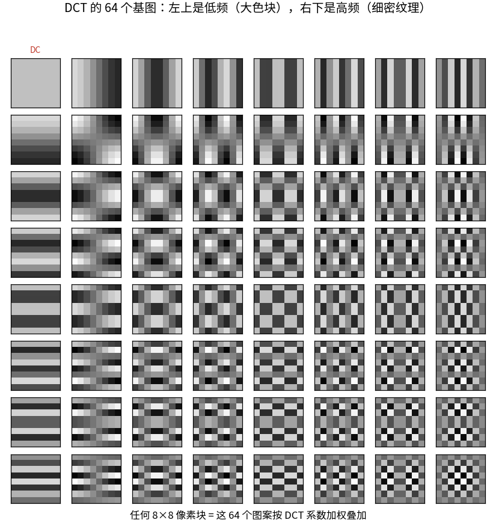
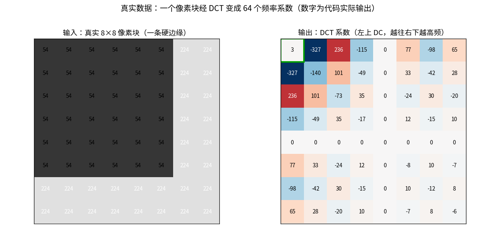
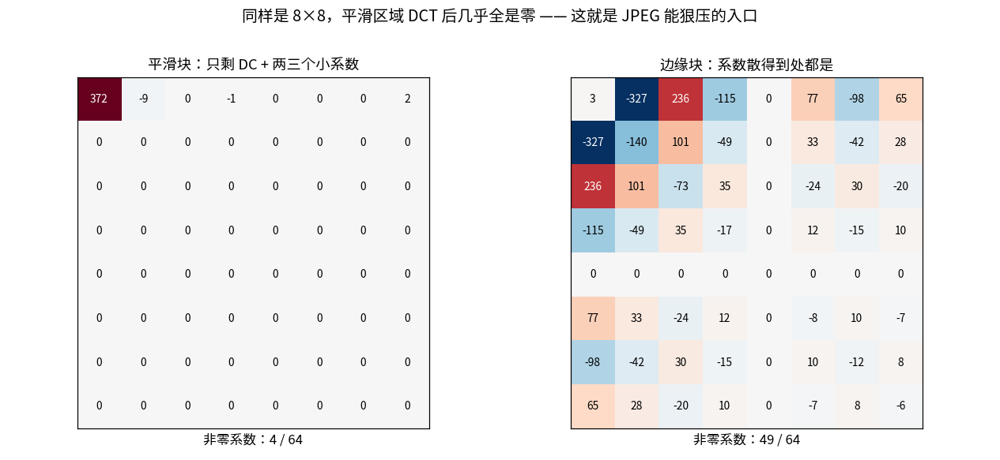
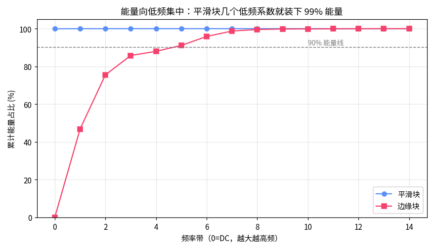
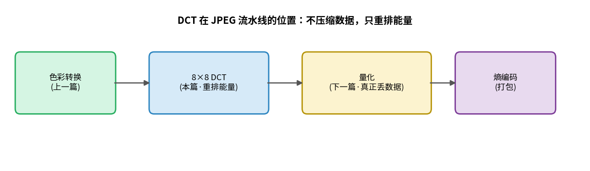

> 作者：Jone
> 日期：2026-09-12
> 风格：深度分析
> 状态：待发布

# 手搓 JPEG 编码器 #02：8×8 的 DCT 到底把图片变成了什么

先说一个容易让人误会的事实：DCT（离散余弦变换，Discrete Cosine Transform）这一步，一个字节都不压缩。

上一篇我们把 RGB（红绿蓝三原色，Red-Green-Blue）掰成了 YCbCr（亮度-蓝色度-红色度色彩空间），色度抽样白省了一半数据。这一篇的主角 DCT，输入是 64 个数，输出还是 64 个数，进出一样多。它甚至还把整数变成了浮点，数据量不减反增。

那 JPEG 为什么离不开它？

因为 DCT 干的不是压缩，是**重排**。它把一个 8×8 像素块里的能量，重新洗牌、集中到少数几个数字上，剩下的大片系数逼近零。真正的压缩是下一篇的量化——但量化能狠狠压，全靠 DCT 先把"哪些能扔"这件事标记清楚。

这一篇就讲清楚：DCT 到底把像素变成了什么，以及为什么这个"重排"是后面所有压缩的前提。代码在 [codec-from-scratch/jpeg/encoder](https://github.com/Joneyao/codec-from-scratch/tree/main/jpeg/encoder)，图里的系数都是它真跑出来的。

DCT 是编码流程的第二站，紧接在上一篇的色彩转换之后——先看它在整条流水线里的位置：



## 换个角度看一个像素块：它是 64 种图案叠出来的

要理解 DCT，先换一种看图片的方式。

我们平时觉得一个 8×8 的块，就是 64 个像素值。DCT 提供了另一个视角：任何一个 8×8 块，都可以看成 64 种固定"图案"按不同比例叠加的结果。

这 64 种图案是死的，对所有图片都一样，叫 **DCT 基图**（basis patterns）：



左上角那个纯灰的方块，代表"整块的平均亮度"——它没有任何变化，是频率最低的成分，专门有个名字叫 **DC（直流分量，代表整块平均值）**。往右走，竖条纹越来越密（水平方向的变化越来越快）；往下走，横条纹越来越密（垂直方向）。到右下角，就是最细密的棋盘格，代表最高频的细节。

DCT 干的事，就是回答一个问题：**要把眼前这个像素块拼出来，这 64 种图案各自要用多少？**

每种图案用多少，就是一个"系数"。64 种图案，对应 64 个 DCT 系数。左上角 DC 系数管整体亮度，越往右下的系数管越精细的纹理。

这就是 DCT 的全部直觉。剩下的都是数学细节。

## 公式其实很短，代码更短

DCT 的数学定义（JPEG 标准 ITU-T T.81 的 A.3.3 节给的正向变换）写成代码化的形式是这样：

```
F(u,v) = 1/4 · C(u) · C(v) · ΣΣ f(x,y) · cos((2x+1)uπ/16) · cos((2y+1)vπ/16)
         其中 x,y 各从 0 遍历到 7；C(0)=1/√2，其余 C=1
```

看着唬人，拆开就三件事：拿每个像素 f(x,y)，乘上对应频率的余弦波，把 64 个乘积全部加起来。C(u) 是个归一化系数，u=0 时取 1/√2，其余取 1。u、v 就是前面基图里"第几号图案"的横竖编号。

不过在做变换之前，标准要求先做一步 **level shift**：8 bit 像素是 0-255 的无符号数，先统一减去 128，变成 -128 到 127 的有符号数。为什么？因为 DCT 处理的是"围绕 0 的波动"，把数据中心挪到 0，变换出来的系数才对称、好处理。解码时再加回 128。

落到 C++，核心就是照着公式抄，双重循环套双重循环：

```cpp
Block8d ForwardDct(const Block8u& pixels) {
    double s[8][8];
    for (int y = 0; y < 8; ++y)
      for (int x = 0; x < 8; ++x)
        s[y][x] = double(pixels[y][x]) - 128.0;   // level shift

    Block8d out{};
    for (int v = 0; v < 8; ++v)
      for (int u = 0; u < 8; ++u) {
        double sum = 0.0;
        for (int y = 0; y < 8; ++y)
          for (int x = 0; x < 8; ++x)
            sum += s[y][x] * kCos[x][u] * kCos[y][v];   // 余弦查表
        out[v][u] = 0.25 * C(u) * C(v) * sum;
      }
    return out;
}
```

`kCos` 是预先算好的余弦表，避免在四重循环里反复调三角函数。这个实现是 O(N⁴) 的笨办法——真实编码器会用快速 DCT 把它降到 O(N²logN)，但笨办法和公式一一对应，看代码就等于看公式，这一篇要的就是这个。

## 真实数据：一个像素块被 DCT 变成了什么

光看公式没感觉。直接让代码跑一个真实的块。

我从测试图的亮度平面里挑了一个变化最剧烈的 8×8 块——它横跨一条硬边缘，左边一片暗（值 54），右边一片亮（值 224）。看它 DCT 前后：



左边是输入的像素块，右边是 DCT 输出的 64 个系数（绿框圈出的左上角就是 DC）。

注意几件事。DC 系数不大（这个块明暗各半，平均下来接近中值）。真正大的系数集中在左边一列和上边一行——因为这是一条竖直边缘，主要是"水平方向的变化"，对应的正是那些管水平频率的系数。而右下角那片高频区，值都很小。

这就是 DCT 的效果：它没减少数据，但把"这个块的能量都在哪"这件事，明明白白摊在了系数的位置上。能量集中在哪，一眼就能看出来。

## 平滑的地方，DCT 后几乎全是零

上面那个边缘块其实是 DCT 的"困难样本"。真正能体现威力的，是图片里大量存在的平滑区域。

我又让代码挑了一个最平滑的块——它的像素值在 173 到 176 之间轻微浮动，肉眼看基本是一片纯色。对比一下两个块 DCT 之后的系数：



左边平滑块，DCT 之后只剩一个大的 DC（372）和两三个很小的系数，其余 60 个格子四舍五入之后全是 0。右边边缘块，非零系数散得到处都是。

这一对比就是 JPEG 压缩的命门所在。自然图像里，绝大多数区域是平滑的——天空、墙面、皮肤、虚化的背景。这些块 DCT 之后，信息高度浓缩到左上角几个数字里，剩下一大片零。

一大片零意味着什么？意味着后面的量化和熵编码可以几乎不花代价地把它们处理掉。**DCT 没有压缩，但它把"可以被压缩的部分"从一整块数据里拎了出来，堆在了角落。**

说白了，DCT 是个分拣员：把重要的（低频、大色块）和不重要的（高频、细节）分开码放，方便后面那道工序精准地扔掉不重要的。

## 能量集中，到底集中到什么程度

"集中"不是个感觉，是能算出来的数。

我统计了这两个块的系数能量，按频率从低到高排开，看累计能量涨得多快：



平滑块那条线几乎是贴着左边墙壁竖直往上——头几个低频系数就装下了 99% 以上的能量，后面几十个高频系数加起来贡献不到 1%。边缘块虽然平缓些，但也在中低频就越过了 90% 线。

这条曲线解释了两个日常现象。为什么一张蓝天白云的照片能压得特别小？因为它满是平滑块，能量极度集中，高频那一大片零几乎不占空间。为什么一张布满树叶、草地、噪点的照片压不动、文件死活下不来？因为高频细节多，能量摊得开，DCT 之后到处都是非零系数，没得省。

理解了这条曲线，你就能预判一张图好不好压——看它有多少平滑区域就行。

## DCT 在流水线里的位置

把这一篇放回整个 JPEG 流程看：



色彩转换把数据摆好姿势，DCT 把每个块的能量重排到角落，接下来的量化才是真正动刀丢数据的地方，最后熵编码打包。

这里要再强调一次那个反直觉的点：DCT 本身是**可逆无损**的。我在代码里加了一个测试——把像素块做 DCT，再做反变换 IDCT（逆离散余弦变换，Inverse DCT），还原出来的像素和原始的最多差 1（纯粹是浮点取整的误差）。也就是说，如果只做 DCT 不做量化，图片质量几乎不掉，但文件一点没小。

真正的取舍发生在下一步。DCT 只是尽职地把牌理好，至于扔哪些牌、扔多狠，那是量化的事。

## 小结

回头看 DCT 这一步，逻辑其实很干净：

它不压缩，只重排。把一个 8×8 块看成 64 种固定图案的叠加，算出每种图案用多少（就是 64 个系数）。自然图像里平滑区域居多，这些块的能量会高度集中到左上角的低频系数，右下角的高频系数逼近零。

DCT 的价值，就是把"哪些数据可以扔"这个信息，从一堆均匀的像素里显影出来，摊在系数的位置上，交给下一道工序处理。

代码、测试、这篇所有图的数据导出脚本都在 [仓库的 jpeg/encoder](https://github.com/Joneyao/codec-from-scratch/tree/main/jpeg/encoder)，`make dct8x8_demo` 就能复现文中每一个系数。

下一篇进入 JPEG 唯一真正"有损"的那一步：量化。你会看到那张你随手拖动的"图片质量"滑块，背后其实就是在缩放一张 8×8 的量化表——DCT 摊出来的那片系数，就是在这一步被成批抹成零的。

---

[ITU-T T.81 (JPEG) 标准原文 — Annex A DCT 定义](https://www.itu.int/rec/T-REC-T.81)

[Discrete cosine transform - Wikipedia](https://en.wikipedia.org/wiki/Discrete_cosine_transform)

[JPEG - Wikipedia（DCT 与基图部分）](https://en.wikipedia.org/wiki/JPEG)

[The Discrete Cosine Transform (DCT) 讲解 - 知乎](https://zhuanlan.zhihu.com/p/85299446)

[图像压缩之 DCT 变换详解 - CSDN](https://blog.csdn.net/newchenxf/article/details/51719597)

[libjpeg-turbo — 生产级实现用的快速 DCT（当前 3.2.x）](https://github.com/libjpeg-turbo/libjpeg-turbo)
