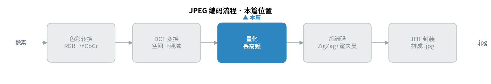
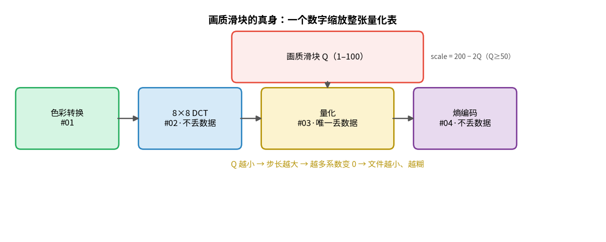
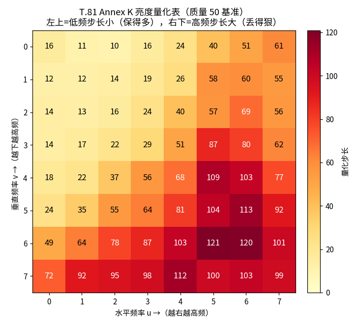
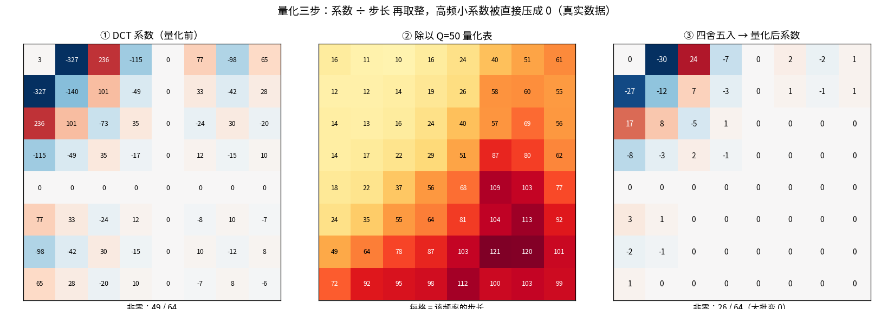
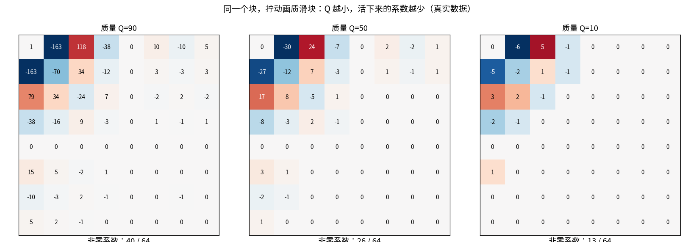
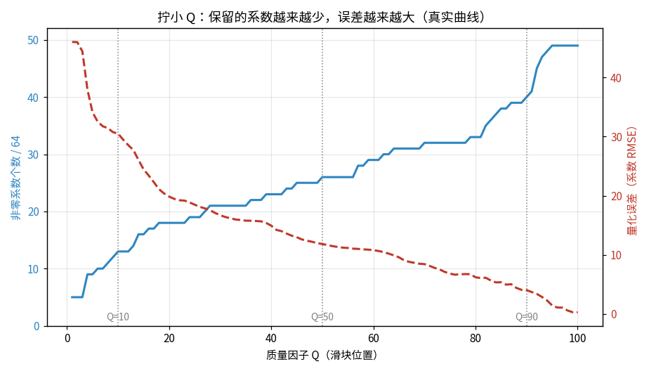

> 作者：Jone
> 日期：2026-09-12
> 风格：深度分析
> 状态：待发布

# 手搓 JPEG 编码器 #03：量化——JPEG 唯一"有损"的一步，画质滑块的真身

你在导出图片时拖过那个"质量"滑块。拖到 90，文件几百 KB，看不出差别；拖到 10，文件几十 KB，满屏马赛克。

这个滑块到底在控制什么？

答案出乎意料地具体：它在缩放一张 8×8 的表。这张表有 64 个数字，每个数字是一个"步长"。滑块拧小，步长整体变大；步长变大，就有更多数据被四舍五入抹掉。

说白了，你拖动的不是什么抽象的"画质",而是一个乘在量化表上的缩放系数。

这一篇讲的量化，是整条 JPEG 流水线里唯一丢数据的一步。前面的色彩转换和 DCT（离散余弦变换，Discrete Cosine Transform）都不丢——DCT 输入 64 个数、输出 64 个数，一个不少；后面的熵编码是无损打包，也不丢。真正把信息扔进垃圾桶的，只有量化这一关。代码在 [codec-from-scratch/jpeg/encoder](https://github.com/Joneyao/codec-from-scratch/tree/main/jpeg/encoder)，本文所有系数、步长、非零个数，都是它真跑出来的。

量化是编码流程的第三站，夹在 DCT 和熵编码之间——先看它在整条流水线里的位置：





## 量化只有一个动作：系数除以步长，然后取整

先把最核心的操作摆出来，它简单到一行就能写完：量化后的系数 = round(DCT系数 ÷ 步长)。

就这么一步。ITU-T T.81 标准 A.3.4 节的公式 (A.7) 写的就是这件事：

```cpp
// quantize.cpp —— 照 T.81 A.3.4 式 (A.7) 写
Block8d Quantize(const Block8d& coeffs, const QuantTable& table) {
    Block8d out{};
    for (int v = 0; v < 8; ++v)
        for (int u = 0; u < 8; ++u) {
            double step = table[v][u];
            out[v][u] = std::round(coeffs[v][u] / step);  // 除，然后取整
        }
    return out;
}
```

关键在那个 `std::round`。

一个 DCT 系数是 236，步长是 10，除完是 23.6，取整成 24。这里丢了 0.6。另一个系数是 3，步长是 16，除完是 0.19，取整——变成 0。这个系数就彻底消失了。

问题来了——为什么小系数消失是好事？

因为上一篇讲过，DCT 把能量集中到了左上角的低频区，右下角的高频系数本来就小。这些小系数对应的是图像里最细微的纹理，人眼几乎看不出来。用一个大步长去除它们，它们成批变成 0。而一整片 0，正是压缩最喜欢的东西——下一篇的熵编码能把连续的 0 榨成几个比特。

量化干的事，本质是"拿人眼不敏感的精度，换文件体积"。它是有损的，因为取整丢掉的小数再也回不来。

## 反量化能乘回步长，但乘不回精度

解码时要做反量化，动作是量化的逆：量化后的系数 × 步长。T.81 A.3.4 的公式 (A.8) 就一行：

```cpp
// R(u,v) = Sq(u,v) * Q(u,v)，T.81 A.3.4 式 (A.8)
Block8d Dequantize(const Block8d& quantized, const QuantTable& table) {
    Block8d out{};
    for (int v = 0; v < 8; ++v)
        for (int u = 0; u < 8; ++u)
            out[v][u] = quantized[v][u] * static_cast<double>(table[v][u]);
    return out;
}
```

有意思的是，反量化不是"还原"。

还拿刚才那个例子：系数 236，步长 10，量化成 24，反量化乘回去是 240。原来是 236，现在是 240，差了 4。那个变成 0 的系数 3，反量化后还是 0，直接丢了。

这就是量化"有损"的全部真相：量化和反量化是一对不对称的操作。除法配四舍五入，把连续的系数值塞进了离散的格子里；乘法只能把你送回格子的中心，送不回格子里原本的位置。

不过这个误差有个数学上的硬上限：因为是四舍五入，每个系数的误差绝对不会超过半个步长。这一条我在单元测试里逐格验证过，后面会讲。

## 那张神秘的量化表，是标准直接给的

步长不是随便定的。JPEG 标准 T.81 的 Annex K 直接给了两张推荐表：Table K.1 是亮度用的，Table K.2 是色度用的。我把 K.1 原样抄进了代码：

```cpp
// Table K.1 —— 亮度量化表（质量 50 基准）。T.81 Annex K。
const QuantTable kBaseLuma = {{
    {{16, 11, 10, 16, 24, 40, 51, 61}},
    {{12, 12, 14, 19, 26, 58, 60, 55}},
    {{14, 13, 16, 24, 40, 57, 69, 56}},
    {{14, 17, 22, 29, 51, 87, 80, 62}},
    {{18, 22, 37, 56, 68, 109, 103, 77}},
    {{24, 35, 55, 64, 81, 104, 113, 92}},
    {{49, 64, 78, 87, 103, 121, 120, 101}},
    {{72, 92, 95, 98, 112, 100, 103, 99}},
}};
```

看这张表的分布：左上角是 16、11、10，右下角是 100、99、103。左上小、右下大。

这个布局不是巧合。左上是低频，人眼敏感，所以步长小、保留得多；右下是高频，人眼迟钝，所以步长大、丢得狠。这张表本身就是一份"人眼敏感度地图"，是标准制定者拿真人做心理视觉实验测出来的经验值。



色度表 K.2 更狠，除了左上角几个，其余全是 99。因为上一篇说过色度已经抽样缩小，人眼对颜色的高频细节几乎无感，可以往死里压。

## 滑块拧动的，就是这张表的整体缩放

标准只给了质量 50 的基准表。那质量 90、质量 10 的表从哪来？

答案是一个缩放公式。质量因子 Q 先换算成一个百分比 scale，再乘到基准表上。这套算法是 libjpeg 用了三十年的经典做法：

```cpp
QuantTable ScaleTable(const QuantTable& base, int quality) {
    // Q<50 时 scale=5000/Q，否则 scale=200-2Q
    int scale = quality < 50 ? 5000 / quality : 200 - 2 * quality;
    QuantTable out{};
    for (int v = 0; v < 8; ++v)
        for (int u = 0; u < 8; ++u) {
            int step = (base[v][u] * scale + 50) / 100;
            if (step < 1) step = 1;      // 步长最小 1，不能为 0
            if (step > 255) step = 255;  // 8 bit 上限
            out[v][u] = static_cast<uint16_t>(step);
        }
    return out;
}
```

拿 Q=50 代入：scale = 200 − 100 = 100，每项 = base × 100 ÷ 100 = base 本身。所以 Q=50 就是原表，这也是"50 是基准"的由来。

拿 Q=100 代入：scale = 0，每项 = (base×0 + 50)/100 = 0，被 clamp 到 1。整张表全是 1，除以 1 等于不变，几乎无损。

拿 Q=10 代入：scale = 5000/10 = 500，每项放大 5 倍。基准表里的 16 变成 80，右下角好几个直接顶到 255 上限。步长一大，成片的系数被压成 0。

说白了，滑块从 100 拧到 10，就是把这张表的每个数字从 1 一路放大到几十上百。步长越大，丢得越多。

## 一个真实的块，量化后活下来几个系数

光说不够，看真数据。

我让 demo 从 256×256 的测试图里，挑了一个方差最大、细节最丰富的 8×8 亮度块（坐标 96,32），做完 DCT 得到 64 个系数，其中 49 个非零。然后用质量 50 的表量化。

结果：49 个非零系数，量化后只剩 26 个。近一半直接归零。



看中间那张量化表和右边的结果对照：DCT 系数矩阵里，右下角那些 77、-98、65 之类的中高频值，除以 40、100 这种大步长，取整后全成了 0。而左上角的 -327、236，除以 11、10 的小步长，还能留下 -30、24 这样的值。

保下来的是骨架，扔掉的是毛刺。这一步之后，那个块的信息量已经实打实地少了。

## Q=90、50、10，同一个块的三种命运

把同一个块用三档质量分别量化，差距一目了然。

- Q=90：40 个非零系数活下来，DC（直流分量，代表整块平均值）步长只有 3
- Q=50：26 个非零，DC 步长 16
- Q=10：只剩 13 个非零，DC 步长 80，高频步长顶到 255



从 49 到 13，Q=10 扔掉了四分之三的系数。剩下的 13 个几乎全挤在左上角——整个块被简化成"一个平均色调加几笔粗糙的低频轮廓"。这就是低质量 JPEG 看起来一块一块、边缘发糊的根源：高频没了，细节就没了。

有意思的是 DC 那一格（左上角）。Q=10 时它的步长也涨到了 80，意味着连整块的平均亮度都被量化得很粗。相邻块的平均亮度一旦对不上，就出现了肉眼可见的"块效应"——那些 8×8 的方格边界。

## 误差和压缩率，是同一根滑块的两端

把质量从 1 扫到 100，每一档都统计"活下来几个非零系数"和"反量化后系数的均方根误差"，画成一条曲线。



两条线呈完美的反向关系。

蓝线（非零个数）随质量升高而爬升，从 Q=1 时的 5 个，到 Q=100 时的 49 个全保留。红线（误差）随质量升高而俯冲，从 Q=1 的均方根误差 46，一路降到 Q=100 的 0.28。

非零系数越多，文件越大，但误差越小、画质越好；非零系数越少，文件越小，但误差越大、画质越糟。压缩率和失真，就是这一根滑块的两端，你没法同时要。

这也解释了为什么大多数软件默认质量给到 75~85 附近：那是曲线上误差还很低、但已经能扔掉不少系数的甜点区。再往上,文件涨得快、画质提升却很有限；再往下，画质掉得比文件省得还快。

## 用测试守住那条"半个步长"的红线

量化有损，但损失得有边界。前面提过一条数学保证：因为量化用的是四舍五入，反量化后每个系数和原值的差，绝对不超过半个步长。

这条不是嘴上说说，是可以逐格验证的。测试里我造了一个系数块，走一遍量化再反量化，检查每一格的误差：

```cpp
// test_quantize.cpp
cfs::Block8d q = cfs::Quantize(c, t);
cfs::Block8d dq = cfs::Dequantize(q, t);
for (int v = 0; v < 8; ++v)
    for (int u = 0; u < 8; ++u) {
        double err = std::fabs(c[v][u] - dq[v][u]);
        if (err > t[v][u] / 2.0 + 1e-6) within_half_step = false;
    }
Check(within_half_step, "|coeff - dequant| <= step/2 for every position");
```

测试还顺手验证了另外几条直觉：Q=100 时量化表应该全是 1、Q 越小非零系数越少、量化输出必须是整数。全部通过：

```
[ok]   Q=100 luma table is all 1 (near lossless)
[ok]   smaller Q -> larger DC step
[ok]   nonzero count decreases as Q decreases
[ok]   |coeff - dequant| <= step/2 for every position
[ok]   quantized coefficients are integers
ALL TESTS PASSED
```

有了这条红线，我们心里就有底：量化虽然丢数据，但丢多少是可控、可预测的，不会失控。

## 小结

回到开头那个滑块。它的真身，是缩放在一张 8×8 量化表上的一个系数。拧小它，步长成倍放大，DCT 系数被成片压成 0——这既是 JPEG 唯一丢数据的地方，也是它能狠狠压缩的根本原因。

量化做完，那个 8×8 块从 49 个非零系数变成了 26 个（Q=50）甚至 13 个（Q=10），矩阵里出现了大片连续的 0。

但此刻它们还是 64 个明晃晃的整数，一个字节都没省。真正把这堆 0 变小的，是下一步。

下一篇我们讲熵编码：先用 Zig-Zag 扫描把这个 8×8 矩阵拉成一维，让所有的 0 排到队尾连成一串；再用游程编码（Run-Length Encoding, RLE）和霍夫曼编码，把"后面还有 40 个 0"这句话压成几个比特。到那时，你才会看到文件体积真正塌下去的那一刻。

代码、量化表、扫描曲线都在仓库里，欢迎自己跑一遍改改质量看数字怎么变。

[ITU-T T.81 官方标准（JPEG，量化见 A.3.4、量化表见 Annex K）](https://www.itu.int/rec/T-REC-T.81)
[libjpeg-turbo 源码（质量缩放的经典实现）](https://github.com/libjpeg-turbo/libjpeg-turbo)
[Wikipedia：JPEG 中的量化步骤](https://en.wikipedia.org/wiki/JPEG)
[Wikipedia：Quantization（signal processing）](https://en.wikipedia.org/wiki/Quantization_(signal_processing))
[知乎：JPEG 压缩原理详解（量化与量化表）](https://zhuanlan.zhihu.com/p/85578282)
[CSDN：JPEG 编码之量化过程与质量因子](https://blog.csdn.net/newchenxf/article/details/51719597)
