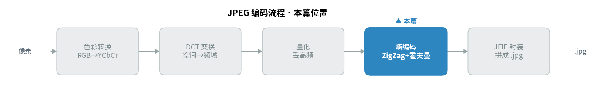
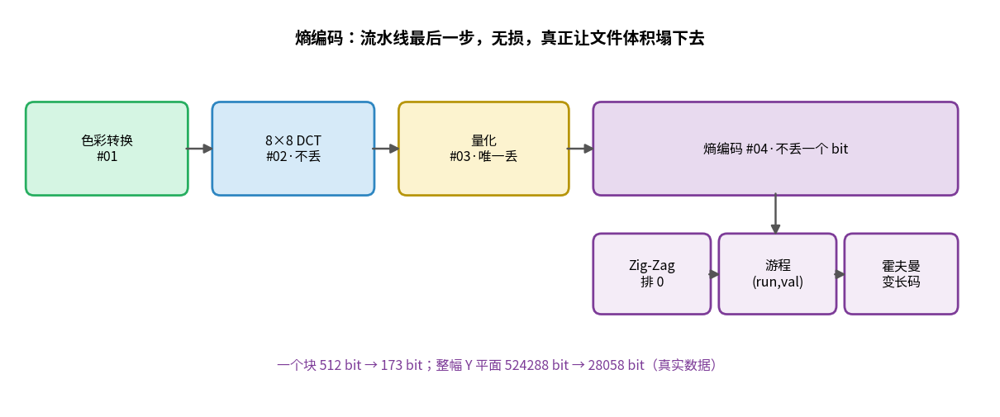
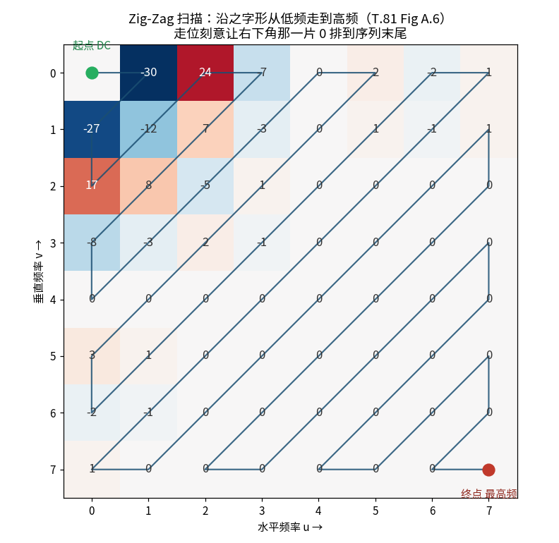
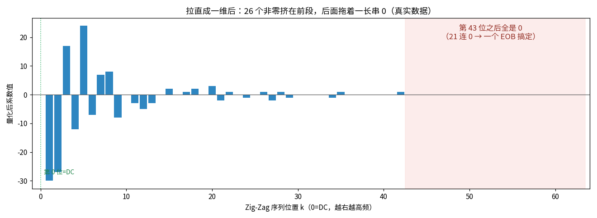
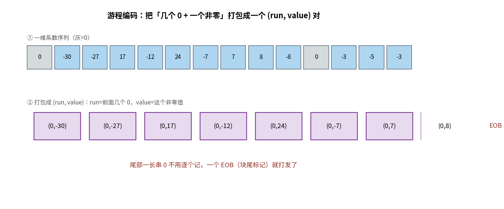
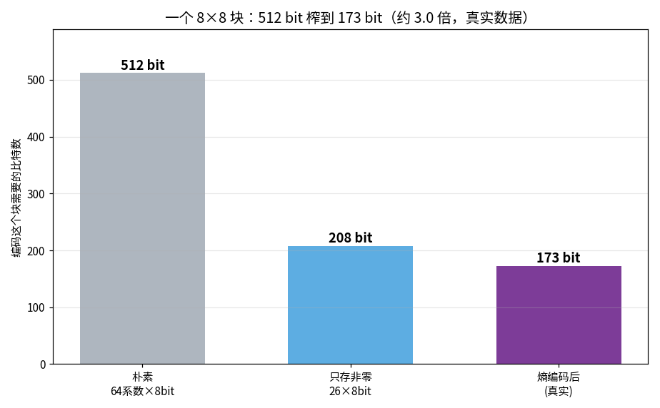

> 作者：Jone
> 日期：2026-09-12
> 风格：深度分析
> 状态：待发布

# 手搓 JPEG 编码器 #04：Zig-Zag + 霍夫曼，把一堆零榨成几个比特

上一篇量化做完，那个 8×8 的块从 49 个非零系数塌到了 26 个，矩阵右下角出现了大片连续的 0。

可它们此刻还是 64 个明晃晃的整数，一个字节都没省。

这一篇，我们要让文件体积真正塌下去。

先把结论摆出来：这一步分三招——Zig-Zag 扫描、游程编码（Run-Length Encoding, RLE）、霍夫曼编码。前两招都不真正压缩，只是"整理"；真正把 bit 数榨下来的是霍夫曼。而整条流水线里，这是**最后一步，也是完全无损的一步**——解码端能一位不差还原。前面量化丢的数据已经丢了，这里一个 bit 都不再丢。

代码在 [codec-from-scratch/jpeg/encoder](https://github.com/Joneyao/codec-from-scratch/tree/main/jpeg/encoder)，本文所有序列、游程对、比特数，都是它真跑出来的。用的还是上一篇那个块——图像坐标 (96, 32)，Q=50。

熵编码是编码流程的第四站，也是像素变成比特流前的最后一道工序——先看它在整条流水线里的位置：





## Zig-Zag 的走位，是为了让 0 排成一队

量化后那些 0 有个特点：它们扎堆在矩阵的右下角。

因为 DCT（离散余弦变换，Discrete Cosine Transform）把能量扫到了左上角低频区，右下角全是被量化抹掉的高频。问题是，这些 0 在二维矩阵里是散着的——你按行扫，每一行末尾几个 0，中间又冒出非零，凑不成一长串。

Zig-Zag 扫描解决的就是这件事。它不按行、不按列，而是沿着反对角线来回走之字形，从左上角的 DC 一路拐到右下角的最高频。



为什么这么走？因为沿反对角线的方向，恰好是"频率从低到高"的方向。低频（大系数）先出，高频（小系数、大批是 0）后出。走完一圈，右下角那一整片 0 全被排到了一维序列的尾部，连成一根长长的尾巴。

扫描顺序是 T.81 Figure A.6 钉死的一张表，直接照抄：

```cpp
// zigzag_rle.cpp —— T.81 Figure A.6 的之字形顺序（行主序索引 row*8+col）
const std::array<int, 64> kZigZagOrder = {
    0,  1,  8,  16, 9,  2,  3,  10,
    17, 24, 32, 25, 18, 11, 4,  5,
    12, 19, 26, 33, 40, 48, 41, 34,
    // ... 一路走到 63（最高频）
};

std::array<int, 64> ZigZagScan(const Block8d& quantized) {
    std::array<int, 64> zz{};
    for (int k = 0; k < 64; ++k) {
        int idx = kZigZagOrder[k];
        zz[k] = std::lround(quantized[idx / 8][idx % 8]);
    }
    return zz;
}
```

拉直之后长什么样？看真实数据：



前 44 个位置里星星点点都是非零，第 44 位之后——整整 20 个 0，一个非零都没有。

这就是揭示性时刻：Zig-Zag 本身不省一个 bit，它只是把散落的 0 归拢成一条尾巴。但正是这条尾巴，让下一步的游程编码有了偷懒的空间。

## 游程编码：不逐个记 0，记"几个 0 加一个值"

有了这条尾巴，游程编码（Run-Length）就好办了。

它的想法很朴素：与其把 `0 0 0 5` 老老实实记四个数，不如记成"前面 3 个 0，然后一个 5"，写作一个 `(3, 5)` 对。run 是前导 0 的个数，value 是那个非零值。



DC（直流分量，代表整块平均值）系数（第 0 个）单独处理，不参与游程。它走的是差分（DPCM，差分脉冲编码调制，Differential Pulse-Code Modulation）：记当前块的 DC 减去前一块的 DC。因为相邻块的平均亮度往往接近，差分后的值更小、更好压。这个块的 DC 差分真实值是 16。

后面 63 个 AC（交流分量，代表块内变化）系数才做游程。代码就是一个累计 0、遇非零吐一对的循环：

```cpp
// zigzag_rle.cpp —— AC 游程编码，照 T.81 F.1.2.2
std::vector<RleSymbol> RunLengthEncodeAc(const std::array<int, 64>& zz) {
    std::vector<RleSymbol> out;
    int run = 0;  // 当前累计的前导 0 个数
    for (int k = 1; k < 64; ++k) {
        if (zz[k] == 0) { ++run; continue; }
        while (run >= 16) { out.push_back({15, 0}); run -= 16; }  // ZRL
        out.push_back({run, zz[k]});
        run = 0;
    }
    if (run > 0) out.push_back({0, 0});  // EOB：尾部还有 0
    return out;
}
```

两个特殊符号要记住。

一个是 EOB（End Of Block）。扫到序列末尾，如果后面全是 0，就不逐个记了，吐一个 EOB 说"这个块剩下的全是 0，收工"。这个块尾部那 20 个 0，就靠一个 EOB 打发。

另一个是 ZRL。run 字段只有 4 个 bit，最多表示 15 个 0。要是遇到超过 15 连 0，先吐一个 ZRL（代表 16 连 0）把 run 减下来。

这个块最后编出 27 个游程符号，包含 26 个非零值加末尾一个 EOB。到这一步，64 个整数已经被整理成了一串紧凑的 (run, value) 对。但注意——这些对还是整数，还没变成 bit。

## 霍夫曼：常客给短码，稀客给长码

真正动刀的是霍夫曼编码。

它的核心思想一句话：出现频繁的符号用短码，罕见的用长码。这样整体的平均码长最短，bit 数就塌下来了。JPEG 不让你现算频率表，而是提供了一套从海量图像统计出来的标准表（T.81 Annex K），绝大多数基线 JPEG 直接沿用。我们用的是 Table K.3（亮度 DC）和 Table K.5（亮度 AC）。

但霍夫曼码只负责编"这个系数有几个 bit 长"这件事，不直接编数值本身。数值靠后面跟的幅值 bit。这里有个概念叫 category（标准里写作 SSSS）：一个系数需要几个 bit 才能表示。0 需要 0 位，±1 需要 1 位，±2~3 需要 2 位，依此类推。

```cpp
// huffman_encode.cpp —— category(SSSS)：这个值需要几个 bit
int Category(int value) {
    int a = std::abs(value), size = 0;
    while (a > 0) { ++size; a >>= 1; }
    return size;  // 0->0, ±1->1, ±2..3->2, ±4..7->3, ...
}
```

于是每个 AC 符号的编码分两段：先把 `(run, size)` 拼成一个字节去查霍夫曼表得到变长码字，再直接跟上 size 位的幅值 bit。DC 类似，只是查的是 DC 表。

```cpp
// huffman_encode.cpp —— 编码一个 AC 符号，照 T.81 F.1.2.2
int size = Category(s.value);
uint8_t sym = (s.run << 4) | size;                     // run/size 拼成符号
bw.WriteBits(ac_table.code[sym], ac_table.len[sym]);   // 霍夫曼码字
bw.WriteBits(MagnitudeBits(s.value, size), size);      // 幅值 bit
```

幅值编码有个小陷阱：正数直接取本身的低 size 位，负数要取 `value-1` 的低 size 位（T.81 F.1.2.1）。比如 +5 在 3 位下是 `101`，而 -5 是 `010`。这套约定让解码端不用额外存符号位，靠码字长度就能反推正负。

那些 (run, value) 对经过霍夫曼一走，就变成了真正的比特流。

## 512 bit 榨到 173 bit

现在把账算清楚。

一个 8×8 块，64 个系数。最朴素地存，每个系数 8 bit，共 512 bit。就算只存 26 个非零、其余不管，也要 26×8=208 bit。而这个块熵编码后实际用了多少？

173 bit。



512 到 173，接近 3 倍。而且这还只是一个块。把整幅 Y 平面 1024 个块全跑一遍，真实数字是：524288 bit 榨到 28058 bit，压缩比 18.69 倍，最终熵编码数据 3508 字节。

为什么整幅的压缩比（18.69 倍）比单个块（约 3 倍）高这么多？因为测试图里大量平坦块——它们量化后几乎全 0，一个 DC 加一个 EOB 就编完了，几个 bit 搞定一个块。挑出来算账的这个块是刻意选的细节最丰富的块，压缩比自然保守。真实图像里，平坦块占大多数，整体压缩比被它们拉高。

这里也能看清"有损"和"无损"的分工。量化（上一篇）已经决定了要丢多少精度、留下多少非零系数——那一步定了压缩的下限。熵编码这一步不再丢任何东西，它只是把量化留下的结果**无损地、紧凑地打包**。你可以把量化理解成"决定扔掉多少行李"，熵编码理解成"把剩下的行李用真空袋抽干净空气"。

## 验证：编出来的能原样解回去

无损不是嘴上说的。游程编码这一环，我写了个逆过程做验证——从 (run, value) 对加 DC 值重建原始一维序列，比对是否逐位相同：

```cpp
// test_entropy.cpp —— 编码可逆性验证
std::vector<cfs::RleSymbol> ac = cfs::RunLengthEncodeAc(zz);
std::array<int, 64> back = cfs::RebuildZigZag(zz[0], ac);
// 逐位比对 zz 与 back，全等才算过
Check(same, "RebuildZigZag reconstructs the original sequence");
```

测试还覆盖了几个关键边界：全 0 块必须只编出一个 EOB；20 连 0 必须先吐 ZRL 再吐游程对；标准 DC 表 category 0 的码字必须是 `00`；负数幅值编码 -5 必须是 `010`。全部通过：

```text
[ok]   zigzag order is a permutation of 0..63
[ok]   all-zero AC produces exactly one symbol
[ok]   run of 20 zeros -> ZRL + {4,3} + EOB
[ok]   luma DC cat0 = '00' (len2)
[ok]   magnitude(-5,3)=010b
[ok]   RebuildZigZag reconstructs the original sequence
ALL TESTS PASSED
```

有了这条底线，才敢说这一步是无损的：进去的系数序列，出来的比特流，能一位不差还原回去。

## 小结

回到开头那个问题——文件体积到底在哪一刻塌下去？

就在这一步。量化决定了扔掉多少信息，但那时数据还是 64 个整数，占着满满的空间。Zig-Zag 把 0 排成一队，游程编码把连续的 0 打包成 (run, value)，霍夫曼给常客发短码、给稀客发长码，最后一个块从 512 bit 塌到 173 bit，整幅图压掉了将近 19 倍。整个过程无损，一个 bit 都没多丢。

但此刻我们手里还只是一堆散落的比特流，不是一个文件。系统的图片查看器打不开它——它不知道图像多大、用了哪张量化表、哪张霍夫曼表。

下一篇我们拼文件结构：把量化表、霍夫曼表、图像尺寸这些"元数据"按 JFIF（JPEG 文件交换格式，JPEG File Interchange Format）规范塞进一个个标记段（SOI 图像开始、APP0 应用标记、DQT 量化表、DHT 霍夫曼表、SOF 帧头、SOS 扫描头、EOI 图像结束），再把这段熵编码数据接在后面，输出一个真能被系统双击打开、也能被 libjpeg 解码的 `.jpg`。到那时，这个手搓编码器才算真正跑通了从像素到文件的全程。

代码、扫描顺序表、游程序列都在仓库里，欢迎自己跑一遍，改改质量看比特数怎么变。

[ITU-T T.81 官方标准（JPEG，熵编码见 Annex F、霍夫曼表见 Annex K）](https://www.itu.int/rec/T-REC-T.81)
[libjpeg-turbo 源码（jchuff.c 是霍夫曼编码的工业级实现）](https://github.com/libjpeg-turbo/libjpeg-turbo)
[Wikipedia：JPEG 的熵编码与 Zig-Zag 扫描](https://en.wikipedia.org/wiki/JPEG)
[Wikipedia：Huffman coding](https://en.wikipedia.org/wiki/Huffman_coding)
[知乎：JPEG 编码原理之熵编码（游程 + 霍夫曼）](https://zhuanlan.zhihu.com/p/85578282)
[CSDN：JPEG 之 Zig-Zag、DC 差分与 AC 游程编码详解](https://blog.csdn.net/newchenxf/article/details/51719597)
