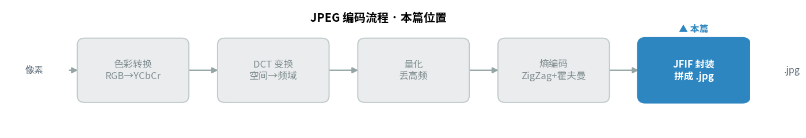
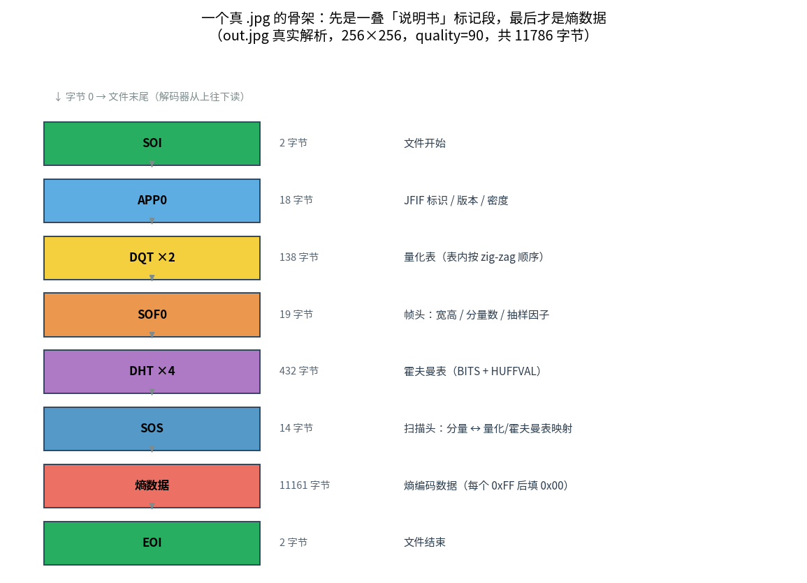
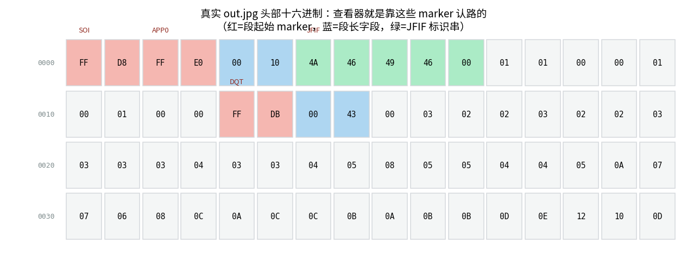
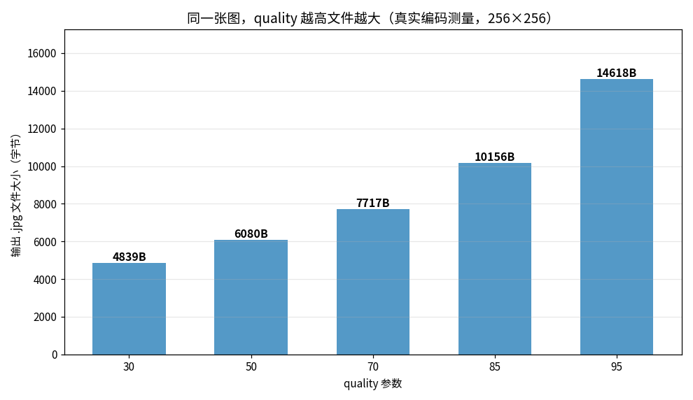
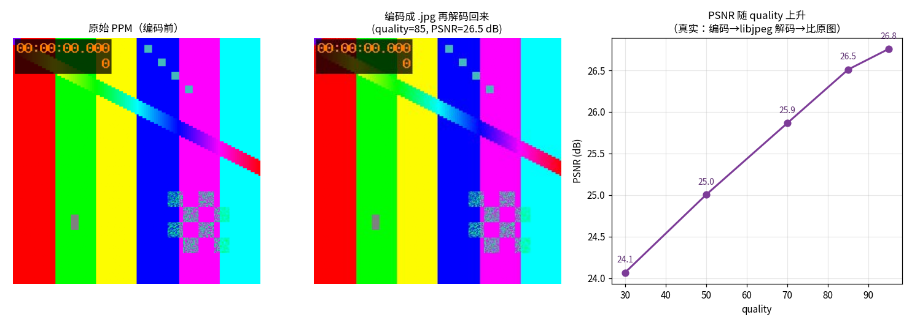

> 作者：Jone
> 日期：2026-09-12
> 风格：深度分析
> 状态：待发布

# 手搓 JPEG 编码器 #05：拼出一个真能被系统打开的 .jpg

上一篇结束时，我们手里有了一串比特流。

它是对的——进去的系数能一位不差还原回去。可它存进文件，双击一下，系统图片查看器只会甩给你一句"无法打开"。

问题出在哪？这一篇把它补上，也给这个手搓编码器画上句号。

先把结论摆出来：一个 `.jpg` 文件，绝大部分内容根本不是"像素"，而是一串**标记段（marker）加一段熵编码数据**。查看器要还原出图像，靠的不是那段数据本身，而是前面那一叠标记段——它们写清楚了图像多大、用了哪张量化表、哪张霍夫曼表、色度怎么抽样。你的编码器写下这些约定，别人的解码器读懂这些约定，两边素未谋面却能对上话，全靠 JFIF（JPEG 文件交换格式，JPEG File Interchange Format）这套标准格式。

这一篇干的事，就是把前面几步的产物（YCbCr（亮度-蓝色度-红色度色彩空间）、DCT（离散余弦变换，Discrete Cosine Transform）、量化、熵编码）按这套格式拼成一个真文件。代码在 [codec-from-scratch/jpeg/encoder](https://github.com/Joneyao/codec-from-scratch/tree/main/jpeg/encoder)，本文所有字节数、文件大小、PSNR，都是它真跑出来的。

JFIF 封装是编码流程的最后一站，把前面几步的产物打包成真文件——先看它在整条流水线里的位置：





## 一个 .jpg 文件到底长什么样

先看骨架。上面这张图是我们真编出来的 `out.jpg`（256×256，quality=90）解析出来的结构，从文件头到文件尾一段段排下来。

每一段都以一个两字节的 marker 开头。marker 的第一个字节固定是 `0xFF`，第二个字节标明这是什么段。SOI 是 `0xFFD8`（文件开始），EOI 是 `0xFFD9`（文件结束），中间那些各司其职。

除了 SOI 和 EOI，每个段的 marker 后面紧跟一个两字节的段长字段。这个长度算它自己，但不算 marker。marker、段长、图像宽高，全都是大端（高字节在前，T.81 B.1.1.4）。

说白了，解码器读一个 `.jpg` 就像读一封格式固定的信：先看 `0xFF` 知道"一个段来了"，再看第二个字节知道"这是量化表还是帧头"，再读两字节长度知道"这段有多长、该跳到哪读下一段"。

各段的分工是这样的：

- SOI / EOI：文件的开始和结束，光杆两字节。
- APP0：JFIF 标识段，写上 "JFIF" 字样、版本号、像素密度。它是 JFIF 之所以叫 JFIF 的招牌。
- DQT：量化表。解码端要靠它反量化，所以必须原样带上。
- SOF0：帧头。图像宽高、几个分量、每个分量怎么抽样、用哪张量化表，都在这。
- DHT：霍夫曼表。四张——DC（直流分量，代表整块平均值）和 AC（交流分量，代表块内变化），各配亮度和色度。
- SOS：扫描头，说清楚接下来的熵数据里每个分量用哪张 DC/AC 表。它后面紧跟的就是那一大段比特流。

## 量化表和霍夫曼表，为什么必须写进文件

这是最容易被忽略、也最能说明问题的一点。

编码时我们用一张量化表把系数除下去，解码时必须用**同一张表**乘回来。可解码器怎么知道你用的哪张？它不知道。所以你得把整张表塞进文件里带给它。DQT 段干的就是这件事。

这里有个坑：量化表里 64 个步长写进 DQT 时，不是按行主序，而是按 **Zig-Zag 顺序**（T.81 B.2.4.1）。这跟上一篇扫描系数用的是同一条之字形路径。写反了，解码器反量化时就会把步长套错位置，颜色全乱。

```cpp
// jfif_writer.cpp —— DQT：量化表按 zig-zag 顺序展开成 64 字节
void WriteDqt(std::vector<uint8_t>& out, const QuantTable& q,
              uint8_t table_id) {
    out.push_back(0xFF); out.push_back(0xDB);   // DQT marker
    PushU16(out, 2 + 1 + 64);                   // 段长
    out.push_back((0 << 4) | (table_id & 0x0F));// Pq=0(8bit) / Tq=表号
    for (int k = 0; k < 64; ++k) {
        int idx = kZigZagOrder[k];              // 关键：zig-zag 顺序
        out.push_back((uint8_t)q[idx / 8][idx % 8]);
    }
}
```

霍夫曼表同理。上一篇给系数发短码用的那张标准表，解码端也得有一份一模一样的，才能把变长码字反查回符号。DHT 段用的是 T.81 规定的 BITS + HUFFVAL 两段式描述：先 16 个数字说"码长 1 到 16 各有几个符号"，再按码长升序列出所有符号值。解码器拿这两段就能重建出整张码表。

一个细节值得补一句。上一篇我们只写了亮度的霍夫曼表，因为那时只编 Y 分量。这一篇要编真彩色，色度分量得配自己的表（T.81 Table K.4 的色度 DC、Table K.6 的色度 AC）。所以文件里一共四张 DHT。

## 帧头：把"这是一张多大的图"写清楚

SOF0 是 baseline JPEG 的帧头（`0xFFC0`）。它回答解码器最基本的三个问题：图多大、有几个分量、每个分量怎么抽样。

```cpp
// jfif_writer.cpp —— SOF0 帧头，照 T.81 B.2.2
out.push_back(8);                          // 采样精度 8 bit
PushU16(out, (uint16_t)height);            // 图像高（大端）
PushU16(out, (uint16_t)width);             // 图像宽
out.push_back((uint8_t)comps.size());      // 分量数 Nf
for (const ComponentSpec& c : comps) {
    out.push_back(c.id);                            // 分量号
    out.push_back((c.h_sample << 4) | c.v_sample);  // 水平/垂直抽样因子
    out.push_back(c.quant_id);                      // 用哪张量化表
}
```

抽样因子这里就体现出 4:2:0 了。我们给 Y 分量填 `2×2`，给 Cb、Cr 各填 `1×1`。意思是：在一个最小编码单元里，亮度采 2×2 共四块，色度各只采一块。解码器读到这组因子，就知道该把缩小的色度平面放大回去对齐亮度。

这也是为什么色度抽样不需要额外的开关——它就藏在帧头这三个字节里，编解码双方靠它达成一致。

## MCU 的顺序：4:2:0 下一个块跟着一个块的规矩

熵数据不是随便堆的。它按 MCU（最小编码单元，Minimum Coded Unit）一个接一个排，MCU 内部的块顺序也是钉死的。

4:2:0 下，一个 MCU 覆盖 16×16 像素。这块地方里，亮度有四个 8×8 块（2×2 排布），抽样后的 Cb、Cr 各只有一个 8×8 块。写进熵数据时，顺序严格是：四个 Y 块，然后一个 Cb，一个 Cr（T.81 A.2.3 的交错顺序）。

```cpp
// encoder_main.cpp —— 一个 MCU 内：4 个 Y 块 + 1 个 Cb + 1 个 Cr
for (int j = 0; j < 2; ++j)
    for (int i = 0; i < 2; ++i) {
        Block8u yb = ExtractBlock(img.y, mx*16 + i*8, my*16 + j*8);
        EncodeOneBlock(yb, luma_q, luma_dc, luma_ac, dc_y, bw);
    }
Block8u cbb = ExtractBlock(img.cb, mx*8, my*8);   // 色度平面已减半
EncodeOneBlock(cbb, chroma_q, chroma_dc, chroma_ac, dc_cb, bw);
Block8u crb = ExtractBlock(img.cr, mx*8, my*8);
EncodeOneBlock(crb, chroma_q, chroma_dc, chroma_ac, dc_cr, bw);
```

还有个隐蔽的点：DC 差分是**按分量各走各的**。Y 的 DC 差分只跟前一个 Y 块比，Cb 只跟前一个 Cb 比，Cr 同理（T.81 F.1.2.1）。所以代码里维护了 `dc_y`、`dc_cb`、`dc_cr` 三条独立的链。混在一起，解码出来就是一团糟。

## 熵数据里的 0xFF 是个雷，得拆

比特流拼进文件前，还有最后一道手续，很小，但漏了整个文件就废。

marker 都以 `0xFF` 打头。可熵编码出来的比特流是纯数据，里面完全可能凑巧出现一个 `0xFF` 字节。解码器扫到它，会以为"一个新段来了"，然后彻底跑偏。

JPEG 的解法叫 byte stuffing（T.81 F.1.2.3）：熵数据里每遇到一个 `0xFF`，就在它后面强行插一个 `0x00`。解码器读到 `0xFF 0x00` 就知道"这是数据里的真 0xFF，不是 marker"，把那个 `0x00` 丢掉即可。而 `0xFF` 后面跟别的（比如 `0xD9`）才是真 marker。

```cpp
// jfif_writer.cpp —— byte stuffing：每个 0xFF 后补一个 0x00
void AppendStuffedScanData(std::vector<uint8_t>& out,
                           const std::vector<uint8_t>& scan_data) {
    for (uint8_t b : scan_data) {
        out.push_back(b);
        if (b == 0xFF) out.push_back(0x00);
    }
}
```

一句话：`0xFF` 在 JPEG 里是保留字，数据里想用它，必须转义。

## 见证时刻：它真能被打开

代码写完，把七段拼起来，接上熵数据，写盘。真章在这里。

先问系统这是什么文件：

```text
$ file out.jpg
out.jpg: JPEG image data, JFIF standard 1.01, baseline,
         precision 8, 256x256, components 3
```

系统认了：JFIF 标准 1.01、baseline、8 bit 精度、256×256、三分量。全对。

再让 libjpeg 亲自解一遍。Pillow 底层就是 libjpeg-turbo，让它打开并强制加载像素：

```text
$ python3 -c "from PIL import Image; im=Image.open('out.jpg'); \
              im.load(); print(im.size, im.format, im.mode)"
(256, 256) JPEG RGB
```

再用 ffmpeg 走一遍解码，探一下它眼里的格式：

```text
$ ffmpeg -v error -i out.jpg -f null -   # 无报错
$ ffprobe out.jpg
codec_name=mjpeg  width=256  height=256  pix_fmt=yuvj420p
```

`pix_fmt=yuvj420p` 这行尤其踏实——ffmpeg 认出了我们写的 4:2:0 抽样。三个互不相干的工具，从三个角度确认：这是一个合法的、能解码的 `.jpg`。

还有一个旁证。同一张图，我们的编码器 quality=90 输出 11786 字节，libjpeg-turbo 自己编 quality=90 输出 11765 字节——差距 0.2%。手搓的产物和工业级实现几乎一样大，说明我们不是碰巧拼出个能打开的文件，而是真的走对了整条标准流程。



## 质量、体积、失真：拧同一个旋钮

编码器收了个 quality 参数（1 到 100），它最终落到量化表的缩放上。旋钮一拧，文件大小和画质跟着动。

同一张测试图，跑五个 quality，量出来的文件大小是这样：



quality=30 时 4839 字节，quality=95 时 14618 字节，三倍差距。道理不复杂：quality 越高，量化步长越小，被压成 0 的高频系数越少，熵数据自然越长。

那画质呢？把每个 quality 编出来的 `.jpg` 用 libjpeg 解回来，跟原图逐像素比，算 PSNR（峰值信噪比，Peak Signal-to-Noise Ratio；越高越像原图）：



左边原图，中间是 quality=85 编码再解码回来的结果，右边是 PSNR 随 quality 上升的曲线。曲线一路往上，跟直觉一致：花更多字节，换更高保真。

有意思的是这条曲线到高质量段就压平了，卡在 26 dB 出头上不去。原因是这张测试图用了 4:2:0——色度被横竖各砍一半。图里那些锐利的彩色竖条，边缘的颜色信息在抽样那一步就丢了，后面 quality 开再高也补不回来。想突破这个天花板，得换 4:4:4 不抽样。这恰好印证了一件事：JPEG 的失真是**多个环节叠加**的，量化只是其中一个旋钮，抽样是另一个。

## 编码器跑通，下一步反过来拆

到这里，这个手搓 JPEG 编码器终于闭环了。

从一张 PPM（无压缩的裸像素图片格式）进去：先 RGB 转 YCbCr 加 4:2:0 抽样，每个 8×8 块做 DCT，量化把高频压成 0，Zig-Zag 加游程加霍夫曼榨成比特流，最后按 JFIF 格式拼成标记段、接上熵数据、转义 `0xFF`、写盘。出来一个系统能双击打开、libjpeg 和 ffmpeg 都认的 `.jpg`。全程一个第三方图像库都没用。

但我们只走通了一个方向：往里写。而且写的是自己给自己定的规矩——固定 4:2:0、固定标准霍夫曼表、图像尺寸恰好是 16 的倍数。

下一篇起，方向反过来：手搓解码器，去解析一张真实相机拍出来的 `.jpg`。那时会撞上一堆自己编码器根本不会产生的情况——重启标记（restart marker）把熵数据切成一段段、五花八门的抽样格式、非 16 倍数尺寸带来的边缘补齐、甚至自定义量化表。读懂别人写的文件，比写自己的文件难得多。

代码、测试、验证脚本都在仓库里。想自己跑通"PPM 进、`.jpg` 出"的全程，clone 下来 `cmake` 一下就行。

[ITU-T T.81 官方标准（JPEG，文件结构见 Annex B、byte stuffing 见 Annex F）](https://www.itu.int/rec/T-REC-T.81)
[JFIF 规范（APP0 段与像素密度的定义，ITU-T T.871）](https://www.itu.int/rec/T-REC-T.871)
[libjpeg-turbo 源码（jdmarker.c 是工业级的 marker 解析实现）](https://github.com/libjpeg-turbo/libjpeg-turbo)
[Wikipedia：JPEG File Interchange Format](https://en.wikipedia.org/wiki/JPEG_File_Interchange_Format)
[知乎：JPEG 文件格式与标记段（marker）详解](https://zhuanlan.zhihu.com/p/85578282)
[CSDN：JPEG 文件结构与标记段（SOI/APP0/DQT/DHT/SOF/SOS）解析](https://blog.csdn.net/newchenxf/article/details/51719597)
