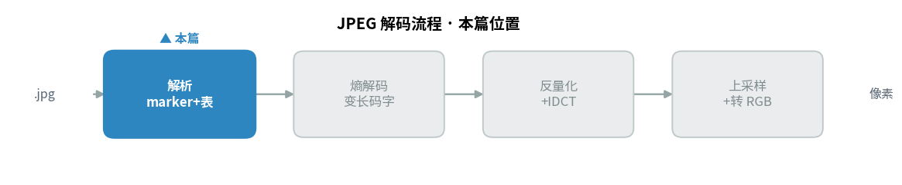
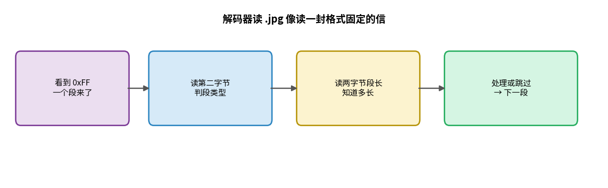
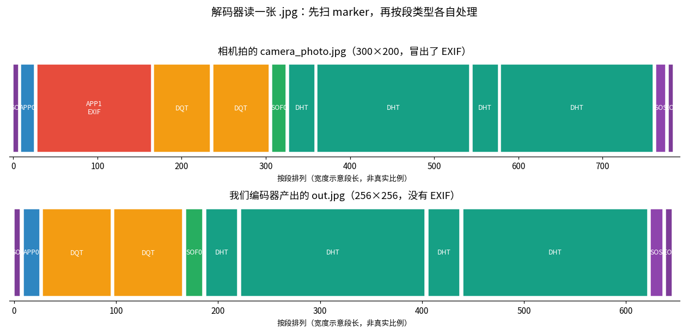
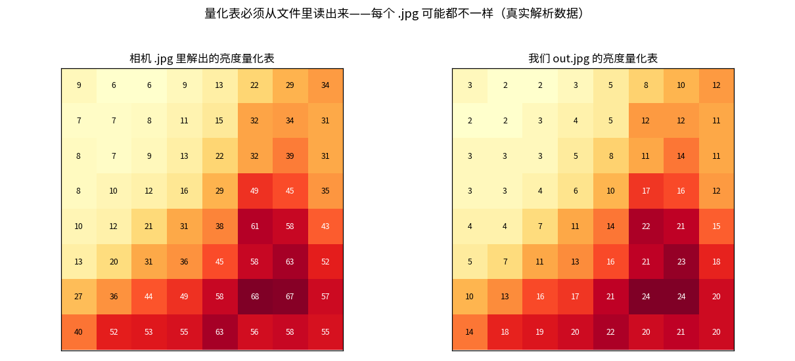
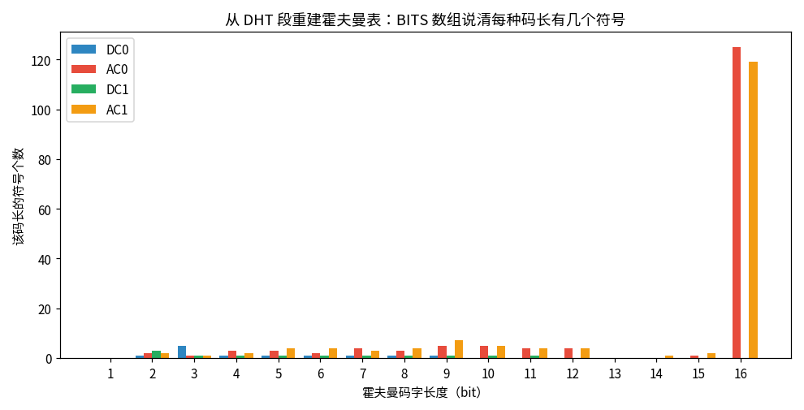

> 作者：Jone
> 日期：2026-09-12
> 风格：深度分析
> 状态：待发布

# 手搓 JPEG 解码器 #01：解析一张相机拍的真实 .jpg，标记段里藏了什么

编码器那几篇，我们从一张原始图片一路写到了一个能被系统打开的 `.jpg`。方向是往里写。

从这一篇起，方向反过来：往外读。

你可能觉得，解码不就是编码倒着来吗？编码器怎么写的，解码器照着拆回去就行。道理没错，但有个前提被忽略了——**编码器只需要应付自己，解码器要应付全世界**。

我们自己的编码器，固定用 4:2:0、固定标准霍夫曼表、图像尺寸恰好凑成 16 的倍数、绝不写 EXIF（可交换图像文件格式，Exchangeable Image File Format）。可你从相机导出的、从微信下载的、用 Photoshop 存的那些 `.jpg`，各有各的花样。解码器得把它们全读明白。

这一篇先不碰像素，只干一件事：把一张真实相机拍的 `.jpg` 拆开，看清它的骨架。代码在 [codec-from-scratch/jpeg/decoder](https://github.com/Joneyao/codec-from-scratch/tree/main/jpeg/decoder)，本文所有偏移量、量化表、霍夫曼表数据，都是它真解出来的。

解析 marker 是解码流程的第一站，方向和前面的编码正好相反——先看它在整条解码流水线里的位置：



## 解码器读文件，靠的不是像素，是标记段

先把结论摆出来：一个 `.jpg` 文件，解码器读它的方式，是先扫一遍标记段（marker），搞清楚"这张图多大、用哪张量化表、哪张霍夫曼表、色度怎么抽样"，然后才敢去碰后面那段熵编码数据。

上一篇写编码器时我们已经见过这套 marker——SOI 图像开始、APP0 应用标记、DQT 量化表、DHT 霍夫曼表、SOF0 帧头、SOS 扫描头、EOI 图像结束。解码就是反过来认它们。

规则很固定：每个 marker 两字节，第一个字节永远是 `0xFF`，第二个字节标明段类型。除了 SOI 和 EOI 这两个光杆 marker，其余每段紧跟一个两字节的段长，解码器读到长度就知道该跳多远去读下一段。

```cpp
// jfif_parser.cpp —— 扫描 marker，按段长跳转（T.81 B.1.1.4，大端）
while (pos + 1 < data.size()) {
    if (data[pos] != 0xFF) { ++pos; continue; }
    uint8_t code = data[pos + 1];
    pos += 2;
    if (code == 0xD8 || code == 0xD9) continue;       // SOI/EOI 无长度
    uint16_t seg_len = (data[pos] << 8) | data[pos + 1];  // 大端段长
    ParseSegment(code, &data[pos + 2], seg_len - 2);
    pos += seg_len;                                    // 跳到下一段
}
```

说白了，解码器读 `.jpg` 就像读一封格式固定的信：看到 `0xFF` 知道"一个段来了"，看第二个字节知道"这是量化表还是帧头"，读段长知道"这段多长、下一段在哪"。



## 真实相机的 .jpg，比我们编的多了一段

光说不够，拆一张真的。

我用一张 300×200 的图（带 EXIF、4:2:0），和上一篇我们自己编码器产出的 `out.jpg`（256×256）并排,让解码器把两者的 marker 序列都打出来：



上面那条是相机的 `.jpg`。它在 APP0 之后，紧跟着一个红色的大段 **APP1**——这就是 EXIF，装着拍摄时间、相机型号、曝光参数、GPS 之类的元数据。它在偏移 20 字节、足足 136 字节长。

下面那条是我们自己编的 `out.jpg`。APP0 之后直接就是 DQT，没有 EXIF。因为我们的编码器压根不写这些。

这就是揭示性时刻——**解自己编的文件容易，解相机拍的才见真章**。真实世界的 `.jpg` 里会冒出你自己编码器根本不会产生的东西：EXIF、可能的重启标记、非 16 倍数的尺寸、五花八门的量化表。解码器不能假设"文件就该长我编的那样"，它得老老实实按标准处理每一种情况。

对付 EXIF 这类应用段，解码器的策略很干脆：不认识、也不需要，读出段长直接跳过。

```cpp
// jfif_parser.cpp —— APPn 段（含 EXIF）解码时可整段跳过
case 0xE1:  // APP1，通常是 EXIF
    // 解码图像不需要它，读长度跳过即可
    break;
```

## 量化表：必须从文件里读，因为每张图都可能不一样

拆到 DQT 段，是解码绕不开的一步。

上一篇讲过，编码时用一张量化表把系数除下去，解码时必须用**同一张表**乘回来。可解码器怎么知道用的哪张？只能从文件里读。这也是为什么 DQT 段必须把整张 64 个数的表原样带上。

我把两张 `.jpg` 里的亮度量化表都解出来看：



两张表不一样。相机那张是它自己按某个质量设定生成的，我们那张是标准 Q90 表缩放来的。这正说明——量化表不是写死在解码器里的常量，是每个文件自带、必须现读的数据。

这里有个必须记住的坑：DQT 段里那 64 个步长，不是按行主序存的，而是按 **Zig-Zag 顺序**（T.81 B.2.4.1）。解码时得按同一条之字形路径把它还原回 8×8。

```cpp
// jfif_parser.cpp —— DQT：64 字节按 zig-zag 顺序还原回 8x8
for (int k = 0; k < 64; ++k) {
    int idx = kZigZagOrder[k];       // 与编码端同一张 zig-zag 表
    table[idx / 8][idx % 8] = seg[1 + k];
}
```

还原错了顺序，反量化时步长全套错位置，整张图的颜色和亮度就崩了。

## 霍夫曼表：文件里给的不是表，是"重建表的说明书"

DHT 段更有意思。它没有直接把霍夫曼码表列出来，而是给了一份**重建说明书**。

这份说明书分两部分（T.81 Annex C）。第一部分叫 BITS，16 个数字，第 i 个数说"码长为 i 位的符号有几个"。第二部分叫 HUFFVAL，按码长从短到长，依次列出所有符号的值。解码器拿这两段，就能推算出每个符号对应的码字。

先看真实数据里 BITS 长什么样：



这张图画的是相机 `.jpg` 里四张霍夫曼表（DC/AC × 亮度/色度）的 BITS 分布。横轴是码长 1 到 16，纵轴是该码长有几个符号。看 AC 表那两根：码长 16 的位置有一百多个符号——那些是最罕见的系数组合，故意用最长的码字，把短码留给高频出现的符号。这正是霍夫曼"常客发短码、稀客发长码"的直接体现。

从 BITS + HUFFVAL 重建码表的算法也很短，就是按码长递增，逐个分配码字：

```cpp
// huffman_decode.cpp —— 从 BITS/HUFFVAL 重建码表（T.81 Annex C）
int code = 0, k = 0;
for (int len = 1; len <= 16; ++len) {
    for (int i = 0; i < bits[len - 1]; ++i) {
        uint8_t symbol = huffval[k++];
        table.AddCode(code, len, symbol);  // 码字 code、长度 len → 符号
        ++code;
    }
    code <<= 1;   // 进入下一个码长，左移一位
}
```

有意思的是，解出来的这四张 BITS 数组，和 JPEG 标准 Annex K 附录里的推荐表一字不差——因为绝大多数编码器（包括生成这张测试图的库）都直接用标准表，不自己训练。但解码器不能假设这一点，它必须老老实实从 DHT 段重建，万一遇上一个用了自定义表的文件，才不会解错。

## 帧头：一张图的"身份证"

最后是 SOF0，baseline JPEG 的帧头。它是解码前必须读到的"身份证"，回答三个基本问题：图多大、几个分量、每个分量怎么抽样。

```cpp
// jfif_parser.cpp —— SOF0 帧头（T.81 B.2.2）
header.precision = seg[0];                    // 精度，通常 8
header.height = (seg[1] << 8) | seg[2];       // 大端高
header.width  = (seg[3] << 8) | seg[4];       // 大端宽
int nf = seg[5];                              // 分量数
for (int i = 0; i < nf; ++i) {
    Component c;
    c.id = seg[6 + i * 3];
    c.h_sample = seg[7 + i * 3] >> 4;         // 水平抽样因子
    c.v_sample = seg[7 + i * 3] & 0x0F;       // 垂直抽样因子
    c.quant_id = seg[8 + i * 3];              // 用哪张量化表
    header.components.push_back(c);
}
```

从相机那张图的 SOF0 里，解码器读出：300×200、3 个分量、Y 的抽样因子是 2×2、Cb 和 Cr 都是 1×1。2×2 对 1×1，就是 4:2:0 的签名。

这里藏着一个我们自己编码器回避掉的麻烦：300 和 200 都不是 16 的倍数。而 4:2:0 的最小编码单元（MCU，Minimum Coded Unit）是 16×16。这意味着图像右边和下边会有不足一个 MCU 的残缺块，编码时得补齐、解码时得裁掉。我们自己编码时永远用 16 倍数的尺寸绕开了这个问题，但解真实文件就躲不掉了——这是下一篇真正解像素时要处理的第一个边界情况。

## 小结

到这里，解码器还没解出一个像素，但它已经把这张 `.jpg` 的骨架摸清楚了：图像 300×200、4:2:0 抽样、两张量化表、四张霍夫曼表、EXIF 在哪、熵数据从哪开始。

这一篇最想说清的一件事是：解码比编码难，难不在算法，而在**你要应对的是别人写的文件**。编码器只需自洽，解码器必须兼容。EXIF、自定义量化表、非 16 倍数尺寸、重启标记——这些自己编码器不会产生的情况，解码器一个都不能假设它不存在。所以第一步永远是老老实实扫 marker、按标准解析每一段，把该读的元数据全读齐，再动手碰数据。

下一篇我们真正开始解像素：拿着这一篇解出的霍夫曼表和量化表，去啃 SOS 后面那段熵编码数据。霍夫曼解码把比特流变回 (run, value)，反量化乘回步长，反 Zig-Zag 拉回二维，最后 IDCT（逆离散余弦变换，Inverse DCT）把频率系数变回一个 8×8 的像素块。到那时，图像才会一块一块地重新长出来。

代码、测试、真实解析数据都在仓库里。想看你自己相机的 `.jpg` 里藏了什么，把它丢给 `parser_demo` 跑一下就行。

[ITU-T T.81 官方标准（JPEG，文件结构 Annex B、霍夫曼表重建 Annex C）](https://www.itu.int/rec/T-REC-T.81)
[JFIF / EXIF 应用段的定义（ITU-T T.871）](https://www.itu.int/rec/T-REC-T.871)
[libjpeg-turbo 源码（jdmarker.c 是工业级 marker 解析）](https://github.com/libjpeg-turbo/libjpeg-turbo)
[Wikipedia：JPEG（Syntax and structure 一节）](https://en.wikipedia.org/wiki/JPEG)
[知乎：JPEG 文件结构与标记段解析](https://zhuanlan.zhihu.com/p/85578282)
[CSDN：手写 JPEG 解码器之文件头与霍夫曼表解析](https://blog.csdn.net/newchenxf/article/details/51719597)
