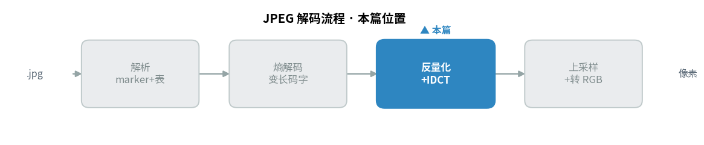
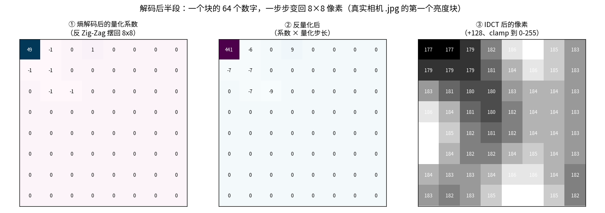
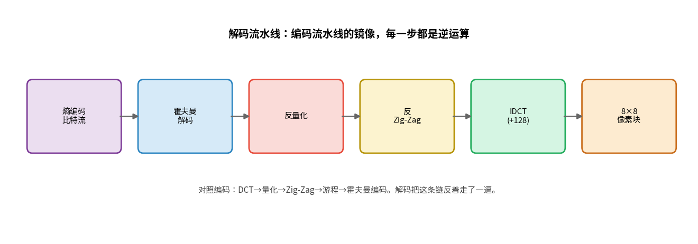
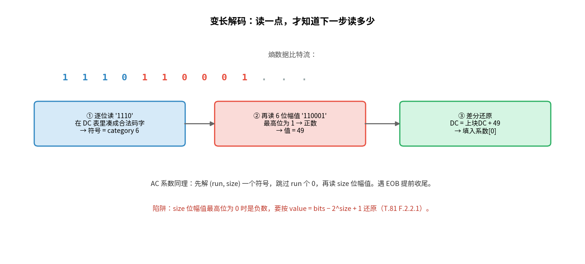
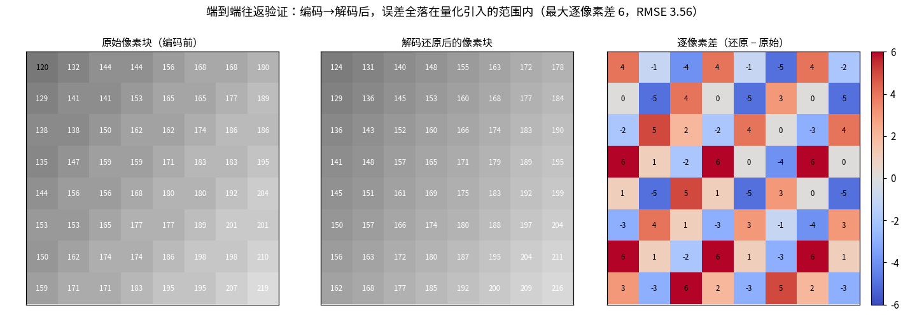

> 作者：Jone
> 日期：2026-09-12
> 风格：深度分析
> 状态：待发布

# 手搓 JPEG 解码器 #02：从熵编码数据一路还原到 8×8 像素块

上一篇，解码器把一张真实相机 `.jpg` 的骨架摸清楚了：尺寸、抽样方式、量化表、霍夫曼表，全解出来了。但它还没碰到一个像素。

这一篇，像素要长出来了。

我们拿着上一篇解出的那几张表，去啃 SOS 后面那段熵编码数据。目标很明确：把一串比特，还原成一个 8×8 的像素块。这条路，正好是前面 DCT（离散余弦变换，Discrete Cosine Transform）、量化、熵编码几步的逆——霍夫曼解码、反量化、反 Zig-Zag、IDCT（逆离散余弦变换，Inverse DCT），一步步倒着走回去。

这一篇处在解码流程的中段，衔接熵解码与 IDCT——先看它在整条解码流水线里的位置：



先看真实数据里这条路长什么样：



这是从相机 `.jpg` 解出的第一个亮度块。左边是熵解码后的量化系数——就一个大数 49，其余全是 0 或 ±1。中间乘上量化步长变成 441 那一堆。右边 IDCT 之后，变成一片亮度在 180 左右、平滑过渡的像素。三张图连起来看，你会有个直观感受：**几个数字，真的能变回一小片图像**。

## 解码是编码的镜像，但有一处天生更难

先把整条链摆出来。编码那五步是 DCT、量化、Zig-Zag、游程、霍夫曼编码。解码就是反着走：



方向反过来，每一步都能找到对应的逆运算。看着很对称，对吧？

但有一处不对称，而且正是这一篇最硬的骨头——**霍夫曼解码是变长的**。

编码的时候，长度是已知的。要编一个系数，先算它的 category 需要几位、查表拿到几位的码字，长度心里有数，写进去就完事。可解码端拿到的是一长串没有分隔符的比特，你事先根本不知道下一个码字有几位。

只能一位一位地读，边读边在表里试探：手里这几位，是不是恰好凑成了某个合法码字？不是就再读一位，接着试。直到凑出一个合法码字，才知道它对应哪个符号、这个码字到此为止。

这就是编码和解码最本质的难度差。编码是"我知道要写多长，直接写"；解码是"我不知道要读多长，只能试探着读"。所有变长编码的解码端，都逃不过这一关。

## 一个码字怎么在比特流里"试"出来

把这个"试探"过程拆开看。

假设解码器现在停在 DC（直流分量，代表整块平均值）系数的位置，前面几位是 `1110`。它这样走（用的是标准亮度 DC 表，T.81 Annex K）：读进第 1 位 `1`，问：有没有长度为 1 的合法码字等于 `1`？没有。读进第 2 位，凑成 `11`，问：有长度为 2 的码字等于 `11` 吗？没有。继续，`111`，还是没有。读到第 4 位 `1110`，命中了——这是 category 6 的码字。



命中之后，解码器才知道下一步要读几位。category 6 意味着后面紧跟 6 位幅值。它读进 `110001`，这 6 位就是这个 DC 系数的值。

这个"逐位比对"在代码里靠三个数组高效完成（上一篇建好的 mincode/maxcode/valptr），不用真的遍历整张表：

```cpp
// huffman_decode.cpp —— DECODE 过程（T.81 F.2.2.3）
int32_t code = 0;
for (int len = 1; len <= 16; ++len) {
    code = (code << 1) | br.ReadBit();     // 每读一位，拼进 code
    if (t.maxcode[len] >= 0 && code <= t.maxcode[len]) {
        int idx = t.valptr[len] + (code - t.mincode[len]);
        return t.huffval[idx];             // 命中：反查出符号
    }
}
```

读一位、比一次，命中就返回。这短短几行，就是变长解码的心脏。

## 幅值解码的陷阱：最高位为 0，是负数

解出符号、知道要读几位幅值之后，还有一个坑，专门坑第一次写解码器的人。

假设 size 是 3，你从比特流读出 3 位 `010`。它是几？如果直接当无符号数读，是 2。但 JPEG 里，这个值其实是 **−5**。

原因在编码端（T.81 F.1.2.1）。JPEG 用一种紧凑方式存有符号数：正数直接存二进制；负数存的是"它减 1 之后的补码低位"。这么做是为了让相同位数能表示对称的正负范围，不浪费编码空间。

代价就是解码端不能傻读。规则是看最高位：size 位里最高位是 1，是正数，值就是它本身；最高位是 0，是负数，得按公式还原回去。

```cpp
// entropy_decode.cpp —— 幅值还原 EXTEND（T.81 F.2.2.1）
int DecodeMagnitude(uint32_t bits, int size) {
    if (size == 0) return 0;
    int32_t threshold = 1 << (size - 1);   // 2^(size-1)
    int32_t v = static_cast<int32_t>(bits);
    if (v >= threshold) return v;          // 最高位为 1：正数
    return v - (1 << size) + 1;            // 最高位为 0：负数还原
}
```

拿 `010`（值 2）、size 3 代进去：threshold 是 4，2 小于 4，走负数分支，`2 - 8 + 1 = -5`。对上了。

这个坑最阴险的地方是，你不写这段，程序照样跑、照样出一张图——只是所有本该是负数的系数全变成了一个奇怪的正数，解出来的图像颜色扭曲、块状错乱。它不崩，只是错。所以我专门写了个测试，把编码端的 `MagnitudeBits` 和解码端的 `DecodeMagnitude` 在 −1023 到 1023 全跑一遍，确认它俩严丝合缝互为逆运算。

## 一个块的完整解码顺序

把上面几件事串起来，解一个块的顺序是这样（T.81 F.2.2）：

先解 DC。解一个符号得到 category，读 category 位幅值得到一个差分值。注意是差分——编码时 DC 存的是"当前块减前一块"（DPCM，差分脉冲编码调制，Differential Pulse-Code Modulation），所以这里要加上前一块的 DC 预测值，才还原出本块真实的 DC。

再解 63 个 AC（交流分量，代表块内变化）。每次解一个符号，它的高 4 位是 run（前面有几个连续的 0），低 4 位是 size（幅值几位）。跳过 run 个 0，读 size 位填一个非零系数。这里有两个特殊符号：遇到 EOB（0x00），说明本块剩下全是 0，直接收尾；遇到 ZRL（0xF0），填 16 个 0 再继续。

```cpp
// entropy_decode.cpp —— AC 循环（T.81 F.2.2.2）
int run = (sym >> 4) & 0x0F;      // 前导 0 个数
int size = sym & 0x0F;            // 幅值位数
if (size == 0) {
    if (run == 15) { k += 16; continue; }  // ZRL：填 16 个 0
    break;                                 // EOB：剩余全 0，收尾
}
k += run;                                  // 跳过 run 个 0
out[k++] = DecodeMagnitude(br.ReadBits(size), size);
```

解完这 64 个数，它们是 Zig-Zag 一维顺序的量化系数。接下来的三步就轻松了，全是纯粹的数学变换，没有变长那种试探：反 Zig-Zag 按之字形摆回 8×8，反量化每个系数乘回步长，IDCT 把频率系数变回像素、加 128、截断到 0 到 255。这三步直接复用了前面编码篇写好的代码，一行逻辑都没重写。

## 怎么证明它真的对：让编码和解码首尾相接

解码器写完，最怕的是"看起来出图了，其实哪里错了"。前面说的负数陷阱就是典型——不验证根本发现不了。

我用的验证方法是端到端往返：拿一个已知的 8×8 像素块，用编码器正向压成比特流（DCT、量化、Zig-Zag、游程、霍夫曼编码），再用解码器反向解回像素。如果这条链哪一步有 bug，还原出来的块一定对不上原块。



左边是原块，中间是往返一圈后还原的块，肉眼几乎看不出差别。右边是逐像素差的热力图，最大差只有 6，整块的 RMSE 是 3.56。

关键在于，这点误差不是 bug，而是量化——JPEG 唯一有损的那一步——本该丢掉的精度。往返之后误差恰好卡在量化引入的范围内，反而证明了熵解码这段是完全无损的。测试里我还单独验了一条：解码解出的量化系数，和编码前的量化系数逐个完全相等。这说明比特流的编解码一位不差，误差全部来自量化，而非我的解码逻辑。

```cpp
// test_entropy_decode.cpp —— 熵编码无损，误差只该来自量化
Check(zz_same, "round-trip: entropy coding is lossless (zigzag matches)");
Check(max_err <= 20, "round-trip: max per-pixel error within quant bound");
```

有了这条往返测试兜底，我才敢说这个解码器的中段是对的。它不依赖肉眼看图，而是拿数字说话。

## 小结

这一篇，解码器终于从比特流里还原出了第一个像素块。整条后半段的逻辑，就是把编码的五步反着走一遍：变长的霍夫曼解码最难，因为你得一位一位试探着读；幅值解码藏着负数陷阱；剩下反量化、反 Zig-Zag、IDCT 三步是纯数学，直接复用编码器的逆运算。往返测试证明了这条链除量化外无损。

但现在解出的，只是一个 8×8 的亮度块。距离一张完整图像，还差最后一步整合。

下一篇我们把碎片拼成整图：Y、Cb、Cr 三个分量各自解出的块要按 4:2:0 的抽样关系对齐，色度分量要做上采样补回被丢掉的分辨率，YCbCr（亮度-蓝色度-红色度色彩空间）要转回 RGB（红绿蓝三原色，Red-Green-Blue），非 16 倍数的边缘块要正确裁掉。最后，拿我们解出的图和 libjpeg 的输出做逐像素 PSNR（峰值信噪比，Peak Signal-to-Noise Ratio）校对——只有数字对得上，才算真的手搓出了一个能用的 JPEG 解码器。

代码、测试、往返验证数据都在仓库里。想看一个块从比特流变回像素的全过程，把任意 `.jpg` 丢给 `decode_block_demo` 跑一下就行。

[ITU-T T.81 官方标准（熵解码 F.2、幅值还原 F.2.2.1、IDCT A.3.3）](https://www.itu.int/rec/T-REC-T.81)
[ITU-T T.871：JFIF 规范](https://www.itu.int/rec/T-REC-T.871)
[libjpeg-turbo 源码（jdhuff.c 是工业级熵解码实现）](https://github.com/libjpeg-turbo/libjpeg-turbo)
[Wikipedia：JPEG（Decoding 一节）](https://en.wikipedia.org/wiki/JPEG)
[知乎：JPEG 熵编码与 Category 幅值编码详解](https://zhuanlan.zhihu.com/p/85578282)
[CSDN：手写 JPEG 解码器之熵解码与反量化](https://blog.csdn.net/newchenxf/article/details/51719597)
