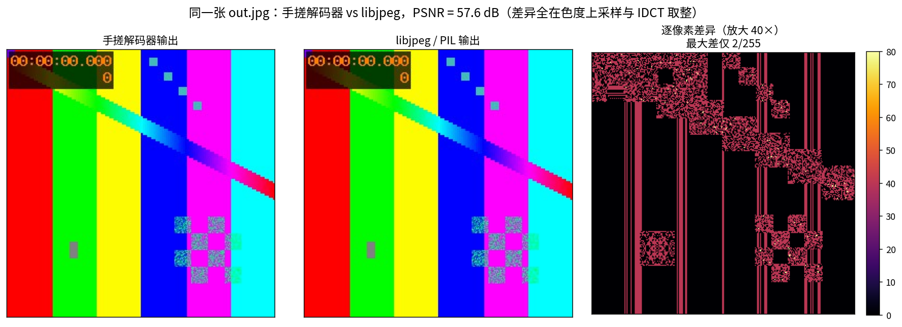
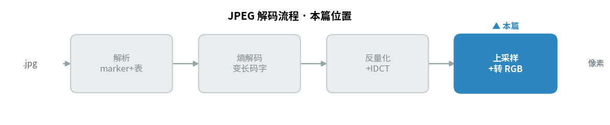
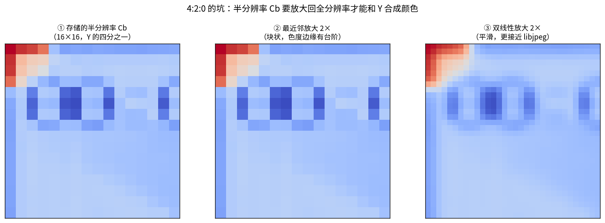
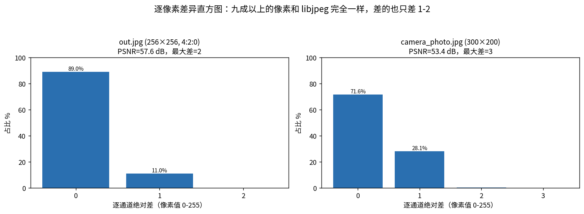
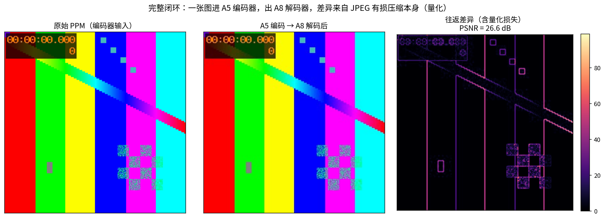
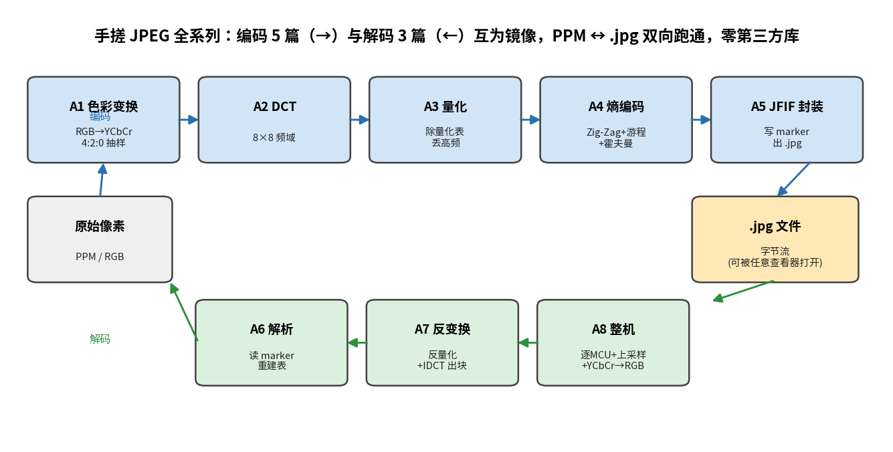

> 作者：Jone
> 日期：2026-09-12
> 风格：深度分析
> 状态：待发布

# 手搓 JPEG 解码器 #03：拼出完整解码器，和 libjpeg 逐像素对齐

先把结论摆在最前面：我把手搓的解码器和 libjpeg 解出的图像逐像素比了一遍，256×256 那张 PSNR（峰值信噪比，Peak Signal-to-Noise Ratio）是 57.6 dB，最大的一处差别只有 2（在 0-255 的尺度上）。八成九的像素，和 libjpeg 一模一样。

这个数字意味着什么？意味着从读文件、熵解码、反量化、IDCT（逆离散余弦变换，Inverse DCT），到色度上采样、颜色转换，整条链每一步都对。差的那一两个像素，不是 bug，是我和 libjpeg 在"色度怎么放大""IDCT 怎么取整"上做了不同的合理选择。



上一篇，我们把一个 8×8 的块从比特流里还原出来了。但一张 256×256 的图有一千多个块，还分 Y、Cb、Cr 三种分量。这一篇要做的，就是把这些碎片拼成一整张图——顺便趟过真实世界埋的四个坑。

拼完之后，整条链路就闭环了：一张原始图片进去、压成 .jpg、再原样解回来，全程零第三方库。

这一篇是解码流程的最后一站，把散块拼成整图、上采样色度、转回 RGB——先看它在整条解码流水线里的位置：



## 从"解一个块"到"解一整张图"，中间隔着一个调度器

上一篇解出的是单个块。要拼成整图，缺的不是新算法，是一个"调度器"：按什么顺序，把哪个分量的哪个块，放到画布的哪个位置。

JPEG 把图切成 MCU（最小编码单元，Minimum Coded Unit）。4:2:0 抽样下，一个 MCU 覆盖 16×16 像素，里面装着 4 个 Y 块（2×2 排列）、1 个 Cb 块、1 个 Cr 块。比特流里这 6 个块严格按 `Y00 Y01 Y10 Y11 Cb Cr` 的交错顺序排（T.81 A.2.3）。

调度器要做的第一件事，是算清楚每个分量的画布多大。它不是硬编码 4:2:0，而是读 SOF0 里每个分量的抽样因子 Hi/Vi，自己推：

```cpp
// jpeg_decoder.cpp —— MCU 尺寸由最大抽样因子决定，不写死 4:2:0
const int mcu_px_w = max_h * 8;
const int mcu_px_h = max_v * 8;
const int mcu_cols = (header.width + mcu_px_w - 1) / mcu_px_w;
const int mcu_rows = (header.height + mcu_px_h - 1) / mcu_px_h;
```

这一步为什么重要？因为真实文件的抽样方式五花八门。手边这四张测试图里，有 4:2:0 的、有 4:4:4 的、有带重启标记的。写死任何一种，换张图就崩。

## 坑一：DC 差分必须按分量各走各的

JPEG 的 DC（直流分量，代表整块平均值）系数是差分存的——每个块只存"和前一个块的差"，不是绝对值（这是熵编码篇讲的 DPCM，差分脉冲编码调制，Differential Pulse-Code Modulation）。解码时要反过来累加还原。

问题来了：这个"前一个块"，指的是同一分量的前一个块。Y 有自己的 DC 链，Cb、Cr 各有各的。三条链完全独立。

如果解码时图省事，用一个全局的 `dc_pred` 变量，把 Y 的差分累加进了 Cb，会怎样？颜色会整体漂移，而且越往后漂得越离谱——因为差分是累加的，一步错，后面全错。

所以每个分量都得带一个自己的预测值：

```cpp
// jpeg_decoder.cpp —— 每个分量一个 dc_pred，独立累加
struct CompState {
    int dc_pred = 0;         // DC 差分累加器（本分量独立一条链）
    // ...
};
```

怎么证明这条链没串？看重建后的整图有没有颜色漂移。我解了张 300×200 的图（约 19×13 个 MCU，跨了几百个块），PSNR 稳在 53 dB，颜色纹丝不动。要是 DC 链串了，这个数字会直接崩到十几 dB。

## 坑二：色度上采样，误差主要藏在这里

这是整篇最有意思的一处。

4:2:0 抽样下，Cb 和 Cr 只有 Y 的四分之一分辨率——横竖各砍一半。解码解出来的 Cb 平面是 128×128，可 Y 是 256×256。要合成颜色，得先把 Cb/Cr 放大回 256×256，和 Y 一一对齐。

怎么放大？标准没规定。T.871 只定义了 YCbCr（亮度-蓝色度-红色度色彩空间）和 RGB（红绿蓝三原色，Red-Green-Blue）之间的算术公式，至于半分辨率的色度怎么补成全分辨率，是实现自己的自由。



最偷懒的办法是最近邻：一个色度样点直接复制成 2×2 的方块。简单，但色度边缘会留下台阶状的块。我一开始就是这么写的，结果和 libjpeg 比只有 27 dB，最大差 154——差得肉眼可见。

换成双线性插值后，数字直接跳到 57 dB，最大差 2。代码也不复杂，就是在四个最近的色度样点之间按小数位置插值：

```cpp
// jpeg_decoder.cpp —— 双线性色度上采样，样点落在像素中心
double gx = (fx + 0.5) * c->h / max_h - 0.5;
double gy = (fy + 0.5) * c->v / max_v - 0.5;
double top = a + (b - a) * tx;   // 上面两点插值
double bot = d + (e - d) * tx;   // 下面两点插值
return top + (bot - top) * ty;   // 再纵向插值
```

libjpeg 默认用的是三角形滤波（fancy upsampling），和双线性很接近但不完全一样。剩下那一两个像素的差，就是从这里来的。

有个实验能把这件事钉死。我把上采样退回最近邻，然后分通道量误差：Y（全分辨率、不上采样）平均只差 0.348，Cb 差 1.7，Cr 差 2.8。

误差几乎全压在被上采样的两个色度通道上。亮度通道几乎完美。这就直接证明了：整条解码链是对的，分歧只在"色度怎么放大"这一个自由度上。

## 坑三：非 16 倍数尺寸，解码补齐、输出裁剪

图片宽高很少正好是 16 的倍数。手边那张相机图是 300×200，两个数都不是 16 的倍数。

编码时，编码器会把图补齐到整数个 MCU（边缘像素复制）再压。解码时得反着来：先按补齐后的尺寸解码，再把多出来的边裁掉。

具体做法是，每个分量的画布按 MCU 数向上取整分配——`mcu_cols * Hi * 8` 那么宽。解码全程都在这块补齐的画布上进行，一个块都不少解。等到最后转 RGB、写 PPM 时，只遍历真实的宽高，多出来的边自然就丢了。

裁剪放在最后一步做，中间过程一律按整块算。这样上采样、颜色转换的代码都不用管边界特例，逻辑干净。

## 坑四：重启标记，让比特流断了还能接上

有些 .jpg 会在扫描数据里每隔若干个 MCU 插一个重启标记（RSTn）。它的用处是抗错：万一某段比特流损坏，解码器能在下一个重启点重新同步，不至于整张图全废。

遇到重启点要做两件事：DC 预测值清零（三条链全归零），比特流跳过 2 字节的 marker、回到字节边界。

这里有个坑，我踩了才反应过来。解完一个重启区间的最后一个块，比特读取器未必"正好停在" marker 上——当前字节里可能还剩几个填充位（编码器把区间末尾补 1 补到字节边界，T.81 F.1.2.3）。marker 要等下一次取字节时才被发现。

所以不能傻等读取器报告"我撞到 marker 了"。得主动从当前字节位置起，在原始码流里往前扫，找到那个 RSTn：

```cpp
// jpeg_decoder.cpp —— 主动扫描下一个 RSTn，而不是被动等 reader 撞上
size_t p = stream_off + br.BytePos();
while (p + 1 < entropy_len &&
       !(entropy[p] == 0xFF && entropy[p + 1] >= 0xD0 &&
         entropy[p + 1] <= 0xD7)) {
    ++p;
}
stream_off = p + 2;  // 跳过 2 字节 RSTn，天然回到字节边界
```

那张带重启标记的 240×160 图（每 8 个 MCU 一个重启点），解出来和 libjpeg 比 53 dB。重启逻辑对了。

## 高潮：和 libjpeg 逐像素对齐

四个坑都填上，剩下的就是验收。方法很直接：拿同一张 .jpg，我的解码器解一遍，libjpeg（通过 PIL）解一遍，两张结果逐像素比 PSNR。

解的是同一份压缩数据，理想情况下应该几乎一致——差异只可能来自实现层面的自由度（上采样、IDCT 取整）。数字越高，说明我的实现越贴近工业级参考。

四张覆盖不同特性的图，结果如下：

| 测试图 | 尺寸 | 特性 | PSNR | 最大逐通道差 |
|--------|------|------|------|------|
| out.jpg | 256×256 | 4:2:0（我们自己编码器编的） | 57.6 dB | 2 |
| gradient.jpg | 160×128 | 4:4:4（无上采样） | 62.3 dB | 2 |
| camera_photo.jpg | 300×200 | 4:2:0，非 16 倍数 | 53.4 dB | 3 |
| restart.jpg | 240×160 | 4:2:0，带重启标记 | 53.2 dB | 2 |

最大差全在 3 以内。最漂亮的是 gradient 这张——它是 4:4:4，色度和亮度同分辨率，根本没有上采样这一步，于是 PSNR 冲到 62 dB，几乎逐位一致。这反过来印证了：4:2:0 那几张少的那几 dB，全是上采样吃掉的。

把差异摊成直方图看更清楚：



out.jpg 有 89% 的像素和 libjpeg 完全相同，剩下 11% 也只差 1。这已经不是"能用"的水平了，是"和工业级实现基本对齐"的水平。

## 完整闭环：原图进，原图出

单看解码器还不够过瘾。把前面的编码器也接上，跑一趟完整往返：一张原始 PPM 图片（一种无压缩的裸像素格式，逐个像素明文存 RGB），进编码器压成 .jpg，再进解码器解回 PPM。



这趟往返的 PSNR 是 26.6 dB。比上面和 libjpeg 比的 57 dB 低很多，但这完全正常——两个数字量的是不同的东西。

和 libjpeg 比的 57 dB，量的是"解码器准不准"：同一份数据两种解法差多少。往返的 26.6 dB，量的是"JPEG 有损多少"：原图经过量化丢掉高频后，还原得有多像。这张测试图是刻意造的高对比色块图，quality 90 下量化照样会啃掉边缘细节。换张平滑的自然照片，往返 PSNR 会高得多。

两个数字各说各的事，都对得上，整个系统就闭环了。

## 回望：一台完整的 JPEG 机器

到这里，手搓 JPEG 的整条链路走完了，正好是一台机器的正反两条链。



编码那条链，是把像素揉成字节的过程：先把 RGB 转成 YCbCr 再做 4:2:0 抽样，再用 DCT（离散余弦变换，Discrete Cosine Transform）把像素搬到频域，用量化表除掉人眼不敏感的高频，用 Zig-Zag、游程、霍夫曼把系数压成变长比特，最后套上 JFIF（JPEG 文件交换格式，JPEG File Interchange Format）的标记段封成一个能被任何查看器打开的 .jpg。

解码那条链，是把字节还原成像素的过程，每一步都精确对应编码的逆：先读 marker、重建量化表和霍夫曼表，再把比特流反解成 8×8 像素块（反量化、反 Zig-Zag、IDCT），最后（也就是这篇）把块按 MCU 拼成整图、上采样色度、转回 RGB。

中间那个 .jpg 文件，是编码的终点，也是解码的起点。两条链在这里咬合。

整个过程没用任何第三方图像库。DCT 是自己写的双重求和，霍夫曼表是自己按标准构的，比特流是自己一位一位读写的。写完你会发现，JPEG 这个统治了三十年的格式，拆开看没有黑魔法——就是色彩、频域、量化、熵编码四块积木，搭得很巧。

## 下一站：把视频当成一叠 JPEG

JPEG 讲完了，但故事没完。

下一个系列从 MJPEG 开始。MJPEG 的想法简单到有点粗暴：把视频的每一帧都当成一张独立的 JPEG 来压。我们手上的 JPEG 编解码器，几乎可以直接拿来跑一段视频。

但正因为简单，它会暴露一个致命的问题——它完全没有帧间预测。相邻两帧明明有 99% 的内容一样，MJPEG 却把每一帧都从头压一遍，一点没利用帧与帧之间的冗余。

理解 MJPEG "浪费"在哪，就理解了为什么需要帧间预测。而帧间预测，正是通往真正的视频编码——H.264——的第一步。

代码、测试、四张图的 PSNR 数据全在仓库里。想自己跑一遍，把任意 .jpg 丢给 `jpeg_decoder`，出来的 PPM 拿去和系统查看器对一下就行。

[ITU-T T.81 官方标准（解码流程 F.2、MCU 交错 A.2.3、重启 F.2.1.3.1、IDCT A.3.3）](https://www.itu.int/rec/T-REC-T.81)
[ITU-T T.871：JFIF 规范（YCbCr↔RGB 转换与色度采样约定）](https://www.itu.int/rec/T-REC-T.871)
[libjpeg-turbo 源码（jdmerge.c / jdcolor.c 是工业级上采样与颜色转换）](https://github.com/libjpeg-turbo/libjpeg-turbo)
[Wikipedia：Chroma subsampling（4:2:0 与上采样）](https://en.wikipedia.org/wiki/Chroma_subsampling)
[Wikipedia：JPEG（Decoding 全流程）](https://en.wikipedia.org/wiki/JPEG)
[知乎：JPEG 解码器色度上采样与 YCbCr 转 RGB 详解](https://zhuanlan.zhihu.com/p/85578282)
[CSDN：从零实现 JPEG 解码器之整图重建与颜色还原](https://blog.csdn.net/newchenxf/article/details/51719597)
