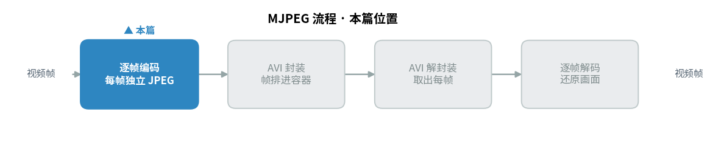
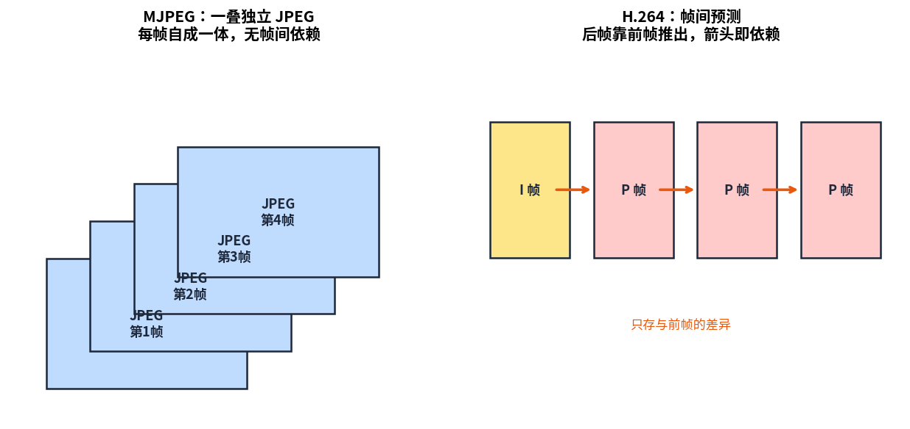
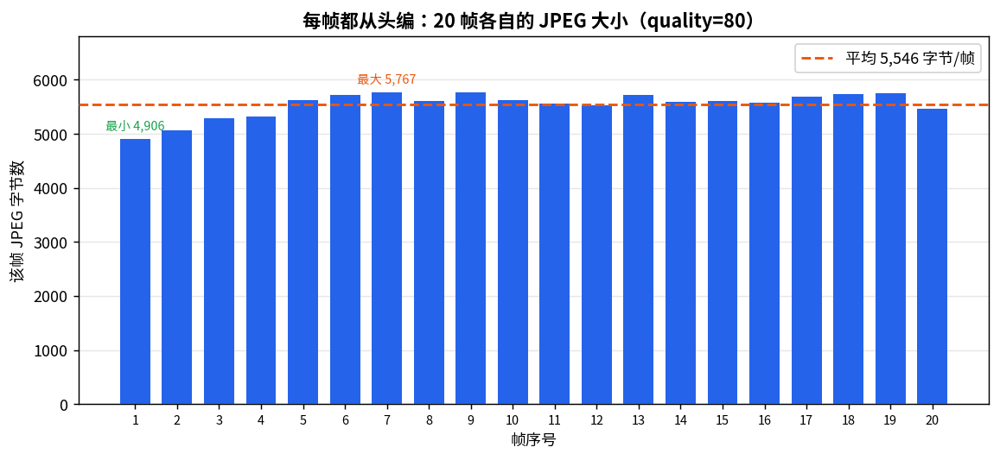
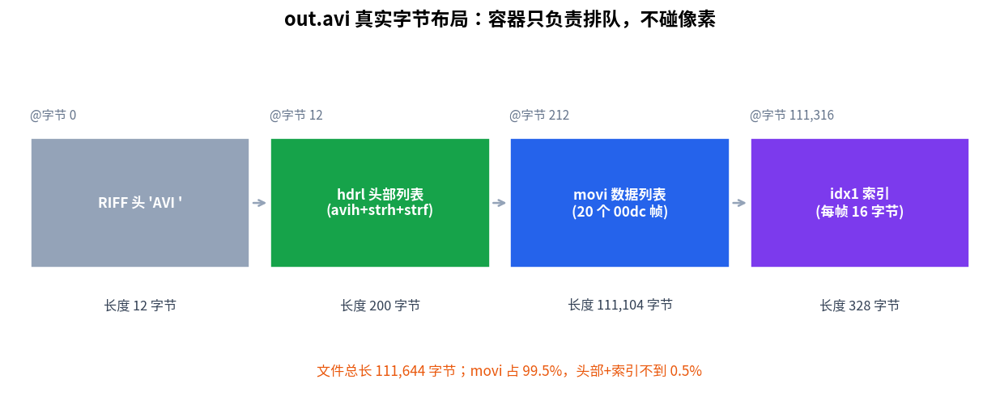

> 作者：Jone
> 日期：2026-09-12
> 风格：深度分析
> 状态：待发布

# 手搓 MJPEG 编码器 #01：把视频当成一叠 JPEG，能有多简单

在此之前，我们从零手搓了一个 JPEG 编码器和解码器。一张图进去，一个能被系统查看器打开的 `.jpg` 出来，再原样解回来。

现在换个问题：视频呢？

你可能以为视频编码是另一座大山——运动估计、帧间预测、B 帧、率失真优化，一堆听起来就头大的名词。但有一种视频格式，简单到近乎"逃课"：它不猜任何时间上的冗余，把视频里的每一帧都当成一张孤立的图片，从头编一遍 JPEG，然后按顺序码进一个容器里。

这就是 MJPEG（Motion JPEG，运动 JPEG）。

它的实现，说穿了就是"我们已经写好的 JPEG 编码器 + 一个循环 + 一个容器"。这一篇，我们复用前面 JPEG 编解码器的全部成果，给它套上循环和容器，真跑出一个能被 ffmpeg 和 VLC 正确识别的 `.avi` 文件。

先看本篇在整个 MJPEG 流程里的位置。



## MJPEG 就是给 JPEG 套了个循环

先把最反直觉的一点摆出来：MJPEG 里没有任何"视频算法"。

名字里带着 "Motion"，可它恰恰不处理运动。它不看前一帧、不看后一帧，每一帧都独立地走一遍完整的 JPEG 编码：RGB 转 YCbCr、DCT、量化、熵编码、拼成一段 JPEG 数据。编完这一帧，状态清零，下一帧从头再来。

所以我们要做的第一件事，是把前面 JPEG 编码器那条写在 `main` 里的编码流水线，抽成一个能反复调用的函数。原来的 `encoder_main.cpp` 读一张 PPM（无压缩的裸像素图片格式）、编码、写盘，全挤在一个 `main` 里。现在把"编码一帧"单独拎出来：

```cpp
// jpeg/encoder/jpeg_encode_api.h
namespace cfs {
// 把一张 RGB 图编码成完整 JPEG 字节流（4:2:0 + 标准霍夫曼表）。
std::vector<uint8_t> EncodeFrameToJpeg(const RgbImage& rgb, int quality);
}
```

函数体就是原来 `main` 里那段流水线，一行没改。抽出来之后，A5 的 `encoder_main` 调它，MJPEG 逐帧编码也调它，逻辑只有一份。

有了这个函数，MJPEG 的"核心"就短得可笑：

```cpp
// mjpeg/encoder/frame_sequencer.cpp
std::vector<JpegFrame> EncodeFrameSequence(
    const std::vector<RgbImage>& frames, int quality) {
    std::vector<JpegFrame> out;
    for (const auto& frame : frames) {
        // 关键：每帧都从头编码，完全不参考相邻帧。
        out.push_back(EncodeFrameToJpeg(frame, quality));
    }
    return out;
}
```

就一个循环。没有跨帧状态，没有前后依赖。这个循环体，就是 MJPEG 与"一叠 JPEG"之间的全部距离。

## 一叠 JPEG，和一段"猜出来"的视频

这里就有意思了。

把每帧独立编码，意味着什么？意味着相邻两帧哪怕只差了一个像素，MJPEG 也会把第二帧完完整整重编一遍。它完全不知道"这两帧几乎一样"。

现代视频编码器（H.264、H.265 这些）干的正是相反的事：它们盯着帧与帧之间的相似性做文章。第一帧老老实实编（叫 I 帧），后面的帧只存"和前一帧的差异"（叫 P 帧）。镜头不动的时候，一个 P 帧可能只有几十字节——因为几乎没有差异要存。

这就是"帧间预测"。后帧靠前帧推出来，帧之间连着一条依赖链。



左边是 MJPEG：一叠各自完整的 JPEG，谁也不依赖谁。右边是 H.264：一条箭头连着一条箭头，后帧的存在依赖前帧。

MJPEG 主动放弃了右边这条路。代价很直接——文件更大。好处也很直接：每一帧都是独立的关键帧，随便从中间哪一帧开始解码都行，剪辑时切哪一刀都干净利落，编码延迟也极低。监控摄像头、老式数码相机的视频模式、一些医疗和工业采集设备，至今还在用 MJPEG，图的就是这份简单和可随机访问。

说白了，MJPEG 是一面镜子。正因为它什么都不猜，它反而清清楚楚地照出了：视频编码真正的难点和价值，全在"猜时间冗余"这件事上。后面的 H.264 系列要啃的硬骨头，就是 MJPEG 逃掉的那部分。

## 每帧都不小：看一眼真实数据

光说不练没意思。我们拿 ffmpeg 生成一段 20 帧、192×144、10 fps（frames per second，帧率）的运动测试图，喂给编码器（quality=80），看看每帧到底编出来多大。

```bash
ffmpeg -y -f lavfi -i "testsrc2=size=192x144:rate=10:duration=2" \
    -pix_fmt rgb24 frames/frame_%03d.ppm
./mjpeg_encoder frames out.avi --quality 80 --fps 10
```

下面这张图，是 20 帧各自真实的 JPEG 字节数。



每帧在 4906 到 5767 字节之间，平均 5546 字节。注意看：没有哪一帧特别小。

这正是"帧间无预测"的直接证据。如果是 H.264，测试图里静止不动的部分会让 P 帧瘪下去一大截，柱子高低会非常悬殊。而 MJPEG 这 20 根柱子高度差不多——因为每一帧都是"从头编一张完整的图"，不管它和上一帧多像。帧之间那点相似性，被白白扔掉了。

20 帧加起来，JPEG 数据总共 110923 字节。这些字节，就是接下来要塞进容器的"货"。

## 容器和编码，是两回事

有了一叠 JPEG 数据，直接首尾相接存成文件行不行？

不行。播放器打开它，一脸茫然：这里面有几帧？每帧多大、从哪开始？画面多大？多少 fps？这些信息，光靠 JPEG 数据本身答不上来。

这就轮到容器登场了。请记住一句话：**容器和编码是两回事。**

编码（前面那条流水线）负责"把一帧像素压成 JPEG 字节流"。容器负责"把 N 段字节流排好队、贴上说明书，让播放器看懂这是一段多大、多少帧、多少 fps 的视频"。容器根本不碰像素，它只管排队和记账。

MJPEG 最常用的容器是 AVI（Audio Video Interleave，音视频交错格式）。AVI 是微软 RIFF（Resource Interchange File Format，资源交换文件格式）家族的一员。RIFF 的世界观很简单：一切都是嵌套的"块"（chunk）。每个块 = 4 字节的类型标识（FOURCC）+ 4 字节的长度 + 具体数据。块里还能套块，像俄罗斯套娃。

一个能播的 MJPEG AVI，骨架长这样：

```text
RIFF('AVI ')
  LIST('hdrl')          头部：描述整个文件
    avih                主头：宽高、帧率、总帧数
    LIST('strl')        流列表（这里只有一条视频流）
      strh              流头：fccHandler = 'MJPG'
      strf              流格式：biCompression = 'MJPG'
  LIST('movi')          数据：真正的帧
    '00dc' + JPEG 字节   每帧一个块（00=流号, dc=压缩视频）
    ...
  idx1                  索引：每帧在文件里的偏移和大小
```

两个 `'MJPG'` 标记是关键。`strh` 里的 `fccHandler` 和 `strf` 里的 `biCompression` 都写上 `'MJPG'`，播放器才知道"这条流里每个块是一张 JPEG"，从而调用 MJPEG 解码器。这两个字段填错，文件就成了一堆播放器不认识的字节。

写 AVI 的代码没有魔法，就是按上面这个骨架，一个字节一个字节往缓冲区里码。有个小技巧：LIST 的长度要等里面的内容都写完才知道，所以先占位写 4 个字节的 0，写完再回填。RIFF 的字节序是小端（低字节在前），和 JPEG 内部的大端正好相反，这点得留神。

还有一条 RIFF 硬规矩：每个块的数据长度必须是偶数，奇数就补一个 0 填充字节。我们的测试帧里就有 5 字节、7 字节的奇数 JPEG，muxer（封装器）自动补齐，否则后续块的偏移会全部错位。

来看真实的 `out.avi` 是怎么排布的。



数字全是解析真文件得到的。整个文件 111644 字节，其中 `movi`（真正的帧数据）占了 111104 字节，也就是 99.5%。头部（`hdrl`）只有 200 字节，索引（`idx1`）328 字节，加起来不到 0.5%。

这个比例很说明问题：容器的"说明书"和"账本"极轻，绝大部分空间都留给了真正的画面数据。容器做的是组织工作，不是压缩工作——压缩早在编码那一步就做完了。

顺带说一句 `idx1`：它给每帧记一条索引（帧的偏移 + 大小 + 是否关键帧）。因为 MJPEG 每帧都独立完整，所以每一帧都被标成关键帧。播放器想跳到第 15 帧，查一下索引就能直接定位，不用从头解到那儿。

## 它真的能播吗

自己说能播不算数，得让通用工具认。我们把 `out.avi` 交给三道检验。

第一道，`file` 命令看文件类型：

```text
out.avi: RIFF (little-endian) data, AVI, 192 x 144, 10.00 fps, video: Motion JPEG
```

它认出来了——RIFF/AVI 容器，192×144，10 fps，视频编码是 Motion JPEG。宽高帧率一个不差。

第二道，`ffprobe` 看流信息：

```text
codec_name=mjpeg   codec_tag_string=MJPG
width=192  height=144  nb_frames=20
r_frame_rate=10/1  duration=2.000000
probe_score=100
```

`probe_score=100` 是 ffmpeg 对"我有多确定这是个合法文件"的打分，满分 100。20 帧、2 秒、编码是 mjpeg，全对上了。

第三道，让 ffmpeg 真解一遍，看有没有报错：

```bash
ffmpeg -i out.avi -f null -
# frame=20  没有任何错误
```

20 帧全部解码成功，零报错。

最后再较个真：把 AVI 解出来的画面和原始 PPM 逐像素比 PSNR（峰值信噪比，衡量失真的常用指标，越高越接近原图），平均 30.7 dB。这个数字符合 quality=80、4:2:0 抽样下的预期——有损，但画面完好。这条链路是通的：像素进得去，也出得来。

至此，一个从零手搓、能被主流播放器正确识别和播放的 MJPEG 视频，真的躺在硬盘上了。

## 下一篇：把这叠 JPEG 解回来

编码这条路走通了，反过来的路自然是下一站。

下一篇会做解码：打开一个 AVI 文件，解开 RIFF 容器，从 `movi` 里把一个个 `'00dc'` 块取出来，认出每块是一张独立 JPEG，再逐帧丢给我们前面写好的 JPEG 解码器还原成画面。你会看到，解封装（demux）和解码同样是两件独立的事——一个拆容器，一个还原像素。

到那时，编码器写的字节和解码器读的字节严丝合缝对上，这个手搓 MJPEG 的闭环就合上了。

本文所有代码、字节数、PSNR，都出自可复现的真实运行，代码在 [codec-from-scratch/mjpeg/encoder](https://github.com/Joneyao/codec-from-scratch/tree/main/mjpeg/encoder)。

[AVI RIFF File Reference (Microsoft Learn)](https://learn.microsoft.com/en-us/windows/win32/directshow/avi-riff-file-reference)

[OpenDML AVI File Format Extensions (1.02)](https://www.the-labs.com/Video/odmlff2-avidef.pdf)

[FFmpeg 官方文档](https://ffmpeg.org/documentation.html)

[ITU-T T.81 JPEG 标准](https://www.w3.org/Graphics/JPEG/itu-t81.pdf)

[Motion JPEG 格式说明（维基百科）](https://en.wikipedia.org/wiki/Motion_JPEG)

[AVI 文件格式详解（cnblogs 中文技术博客）](https://www.cnblogs.com/itbird/p/3958154.html)

[RIFF 和 WAVE 文件格式（cnblogs 中文技术博客）](https://www.cnblogs.com/wangguchangqing/p/5957531.html)
