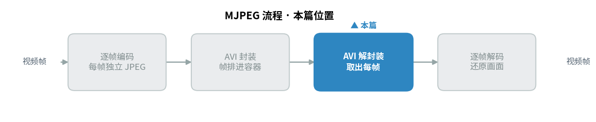
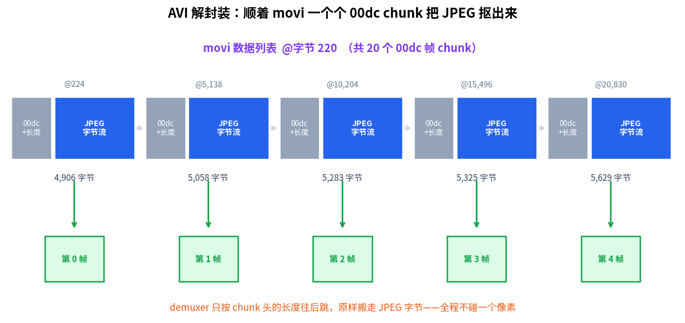
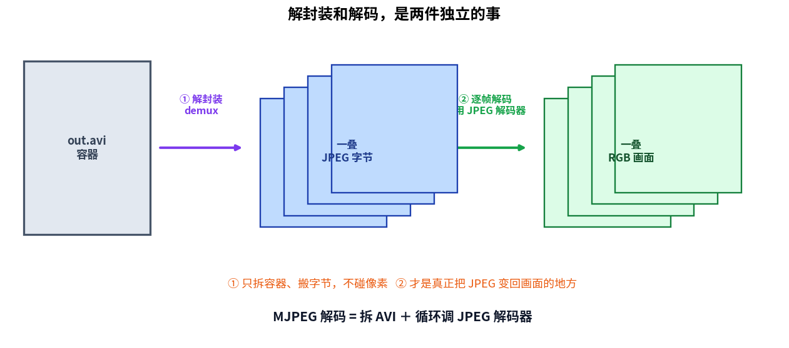
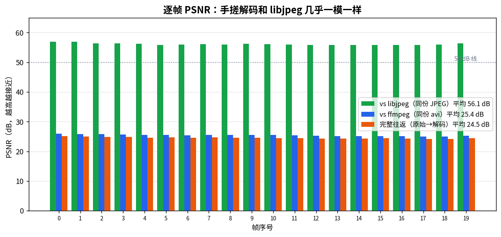
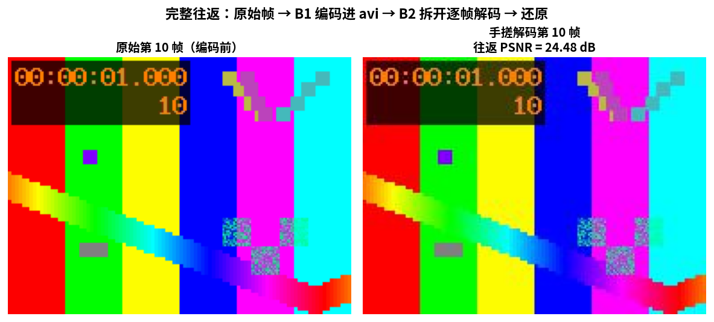

> 作者：Jone
> 日期：2026-09-12
> 风格：深度分析
> 状态：待发布

# 手搓 MJPEG 解码器 #01：解开 AVI 容器，逐帧还原成画面

上一篇，我们把一叠 JPEG 塞进 AVI 容器，跑出了一个能被 ffmpeg 和 VLC 正确识别的视频文件。编码这条路走通了。

这一篇走反过来的路：打开这个 AVI，把画面还原出来。

你可能觉得解码总该比编码难一点吧？毕竟要"看懂"别人写的文件。但 MJPEG 的解码，简单得同样让人意外。它甚至不需要写一行新的图像解码代码——前面手搓的那个 JPEG 解码器，原样拿来用就行。

先说结论，也是这一篇最想讲清楚的一件事：解封装（demux）和解码（decode），是两件完全独立的事。

拆开 AVI 容器的那段代码，只负责搬字节，压根不碰像素。真正把 JPEG 变回画面的，是我们复用的 JPEG 解码器。一句话概括整个 MJPEG 解码：**拆 AVI 容器 ＋ 循环调 JPEG 解码器。**

先看本篇在整个 MJPEG 流程里的位置。



## 编码往里写，解码反过来读

上一篇写 AVI 时，我们是"往里塞"：按 RIFF（Resource Interchange File Format，资源交换文件格式）的骨架，一个字节一个字节把头部、帧数据、索引码进缓冲区。

解码就是这套动作的镜像：**反过来读。**

AVI（Audio Video Interleave，音视频交错格式）的世界观是嵌套的"块"（chunk）。每个块 = 4 字节类型标识（FOURCC，Four Character Code，四字符码）+ 4 字节长度 + 数据。块里能套块。解封装要做的，就是顺着这棵嵌套的块树往下走，认识的段读出来，不认识的段按长度跳过。

回顾一下上一篇建好的骨架：

```text
RIFF('AVI ')
  LIST('hdrl')          头部：宽高、帧率、总帧数
    avih / strh / strf
  LIST('movi')          数据：每帧一个 '00dc' 块
    '00dc' + JPEG 字节
  idx1                  索引：每帧的偏移和大小
```

编码器从上往下把它写出来，解码器就从上往下把它读回去。同一张骨架图，两个方向。

## demuxer 只搬字节，不碰像素

先解决"拆容器"。这部分代码，从头到尾没有一个和图像有关的操作。

核心是一个循环：顺着 `movi` 列表，一个个块往后走，遇到 `'00dc'`（00 是流号，dc 是压缩视频数据），就把它后面那段 JPEG 字节原样收下来。

```cpp
// mjpeg/decoder/avi_demuxer.cpp（节选）
size_t q = body + 4;   // 跳过 'movi' 这 4 字节
while (q + 8 <= body_end) {
    const size_t ce = q;
    const uint32_t ce_size = GetU32(b, q + 4);  // 块长度
    const size_t ce_body = q + 8;
    if (FourCCEq(b, ce, "00dc")) {
        // 原样搬走这段 JPEG 字节，不解释、不还原。
        JpegFrameBytes frame(b.begin() + ce_body,
                             b.begin() + ce_body + ce_size);
        r.frames.push_back(std::move(frame));
    }
    // 按块长度往后跳，奇数长度要跳过那个填充字节。
    q += 8 + ce_size + (ce_size & 1u);
}
```

看这段代码里最关键的一行：`push_back(std::move(frame))`。它把一段字节整体搬进结果里，中间没有任何解码、缩放、颜色转换。demuxer 眼里没有像素，只有"从哪个偏移开始、有多长"的一段字节。

宽高、帧率、帧数这些信息，藏在 `hdrl` 头部里。解码器要顺着 `avih` 和 `strh` 把它们抠出来。这里踩过一个坑值得一提：`strh`（流头）里的帧率，是由 `dwRate / dwScale` 两个字段算出来的，它们的偏移我一开始数错了，单元测试里 `fps == 10` 这条直接挂掉。翻回上一篇的 muxer 代码逐字段对齐，才定位到 `dwScale` 在流头数据的第 20 字节、`dwRate` 在第 24 字节。

这也说明写测试的价值——偏移错一个字节，读出来的就是垃圾数，而测试能当场揪出来。

来看解封装真跑一遍是什么样。



图里的偏移全是解析真实 `out.avi` 得到的：第 0 帧的 `'00dc'` 块在文件第 224 字节，长 4906 字节；第 1 帧在第 5138 字节，长 5058 字节……demuxer 就是靠"读长度、往后跳"这一个动作，把 20 段 JPEG 一段段挑出来。

这里有个可以偷懒的地方：文件末尾的 `idx1` 索引，本来就记着每帧的偏移和大小。想快速跳到第 15 帧，查一下索引直接定位就行，不必从头遍历。我们的实现选了更朴素的顺序遍历——播放整段视频时，从头走一遍最直接；索引在随机跳帧时才真正派上用场。两条路都能到达同一批帧，实现里把 `idx1` 是否存在记下来，作为交叉校验的旁证。

## 真正还原画面的，是复用的解码器

字节搬出来了，怎么变成画面？

这里是全篇的转折点，也是那个"原来如此"的时刻：**不用写任何新代码。**

从 `'00dc'` 块里抠出来的每一段字节，本身就是一张完完整整的 JPEG——FFD8 开头，FFD9 结尾，和你从相机里导出的 `.jpg` 没有任何区别。既然是标准 JPEG，那前面手搓的那个解码器当然能解。

于是 MJPEG 解码的"循环体"，短得和编码那边一样可笑：

```cpp
// mjpeg/decoder/mjpeg_decoder_main.cpp（节选）
for (size_t i = 0; i < dm.frames.size(); ++i) {
    const std::vector<uint8_t>& jpeg = dm.frames[i];
    // 和解一张独立 .jpg 完全一样：先解析头，再整图解码。
    cfs::ParseResult pr = cfs::ParseJpeg(jpeg);
    cfs::DecodeResult dr = cfs::DecodeJpeg(pr.header, jpeg);
    cfs::SavePpm(out_dir + frame_name(i), dr.image);  // 写出一帧 PPM
}
```

`ParseJpeg` 和 `DecodeJpeg` 是前面 JPEG 解码篇一路写下来的原班人马，一行没改。循环体里没有"视频"的影子——它不看前一帧、不看后一帧，把每段字节当成一张孤立的图，解完就写盘。

这就是解封装和解码的分工：demuxer 拆容器、交出一叠 JPEG 字节；解码器逐帧把字节还原成像素。两件事，两段代码，谁也不掺和谁。



把这张图记住，你就抓住了 MJPEG 解码的全部。左边拆容器，中间是一叠独立 JPEG，右边逐帧解成画面。中间那叠字节，正是编码器写进去、解码器读出来的同一批数据。

## 解得对不对，拿 libjpeg 和 ffmpeg 较真

自己说解对了不算数，得和成熟解码器逐像素比。衡量指标用 PSNR（Peak Signal-to-Noise Ratio，峰值信噪比，越高越接近）。

第一组对比，最能说明问题：把 demuxer 抠出的同一段 JPEG 字节，一份喂给手搓解码器，一份喂给 libjpeg，两张 RGB 图逐像素比。

结果 20 帧平均 56.1 dB，最低 55.8 dB。

50 dB 以上意味着两张图几乎逐像素一致，肉眼绝无差别。这个数字延续了前面 JPEG 解码器和 libjpeg 对齐的结论——手搓解码器还原得对。剩下那一点点差异，只来自 IDCT（逆离散余弦变换）取整这类实现细节，无伤大雅。

第二组对比，藏了个坑。同一个 `out.avi` 让 ffmpeg 解一遍，和手搓结果逐帧比，PSNR 却只有 25.4 dB。

差这么多，是解错了吗？不是。把亮度（Y）单独拎出来比，PSNR 立刻回到 43.9 dB——问题全出在色度上。原因是色度上采样：4:2:0 抽样下，Cb/Cr 分辨率只有亮度的四分之一，要放大回全分辨率。ffmpeg 默认用了带平滑的插值，我们和 libjpeg 一样用简单的最近邻。差的不是"对不对"，是"上采样风格不同"。



三组柱子并排，结论一目了然：和 libjpeg 比（绿）稳稳站在 50 dB 线之上，和 ffmpeg 比（蓝）因为上采样风格差异掉到 25 dB，这不是错误，是选择。

## 完整往返：闭环终于合上

最后一步，把整条链路走通：一段原始帧序列，经上一篇的编码器压进 AVI，再经这一篇的解码器拆开、逐帧解回来，和最开始的原始帧比。

这是对"编码器写的字节，解码器能读回来"最硬的检验。

20 帧往返 PSNR 平均 24.5 dB，最低 24.1 dB。这个数字比前面两组低，是意料之中——它叠加了 JPEG 有损压缩本身的损失（quality=80、4:2:0 抽样），而不只是解码误差。有损压缩下，24 dB 量级的往返完全正常，画面主体完好。



左边原始，右边解码，肉眼几乎分不出差别。色块、渐变、时间戳、移动的小方块，全都原样还原。

值得留意的是，这 24.5 dB 里，解码器自己贡献的误差极小——前面和 libjpeg 比出的 56 dB 已经证明，解码这一环几乎无损。往返掉到 24 dB，绝大部分损失是编码那一步的量化丢掉的高频细节。换句话说，链路里"有损"的是编码，"忠实"的是解码。这也回答了一个常见的疑问：解码器会不会二次损伤画面？基本不会，它只是尽力把编码器压缩后的结果如实还原。

再用 ffprobe 交叉核对一遍解封装的结果，确认不是自说自话：

```text
codec_name=mjpeg   width=192  height=144
nb_read_frames=20  avg_frame_rate=10/1
```

ffmpeg 数出来 20 帧、192×144、10 fps，和我们 demuxer 解出的 `192x144, fps=10, 实际取出=20 帧` 一个不差。编码器写进去的字节，解码器读回来了，通用工具也认。这个手搓 MJPEG 的闭环，到此合上。

## 下一篇：这么简单，代价是什么

写到这里，MJPEG 的编解码两头都通了，而且简单得不像话——编码是"JPEG 加循环"，解码是"拆容器加循环"。

但简单从来不是白来的。

MJPEG 把每一帧都当成孤立的图，意味着它彻底放弃了帧与帧之间的相似性。镜头一秒钟不动，它照样把几乎一样的画面重编、重存 10 遍。这份浪费，换来的是随机访问和低延迟。

下一篇，我们把 MJPEG 和 H.264 摆到一起，用真实数据算三笔账：同样的画面，两者的体积差多少？编码延迟差多少？随机跳帧时又各自付出什么代价？你会看到"帧间预测"这四个字，到底值多少钱。

本文所有代码、偏移、PSNR，都出自可复现的真实运行，代码在 [codec-from-scratch/mjpeg/decoder](https://github.com/Joneyao/codec-from-scratch/tree/main/mjpeg/decoder)。

[AVI RIFF File Reference (Microsoft Learn)](https://learn.microsoft.com/en-us/windows/win32/directshow/avi-riff-file-reference)

[OpenDML AVI File Format Extensions (1.02)](https://www.the-labs.com/Video/odmlff2-avidef.pdf)

[FFmpeg 官方文档](https://ffmpeg.org/documentation.html)

[ITU-T T.81 JPEG 标准](https://www.w3.org/Graphics/JPEG/itu-t81.pdf)

[AVI 文件格式详解（cnblogs 中文技术博客）](https://www.cnblogs.com/itbird/p/3958154.html)

[RIFF 与 AVI 容器解析（cnblogs 中文技术博客）](https://www.cnblogs.com/wangguchangqing/p/5957531.html)
