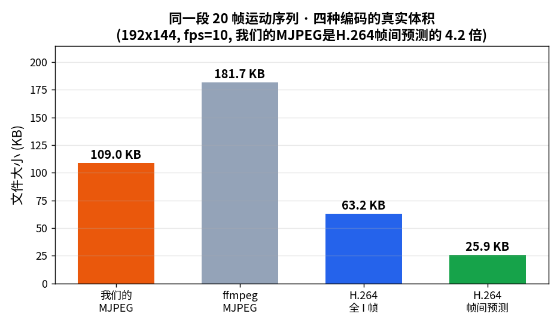
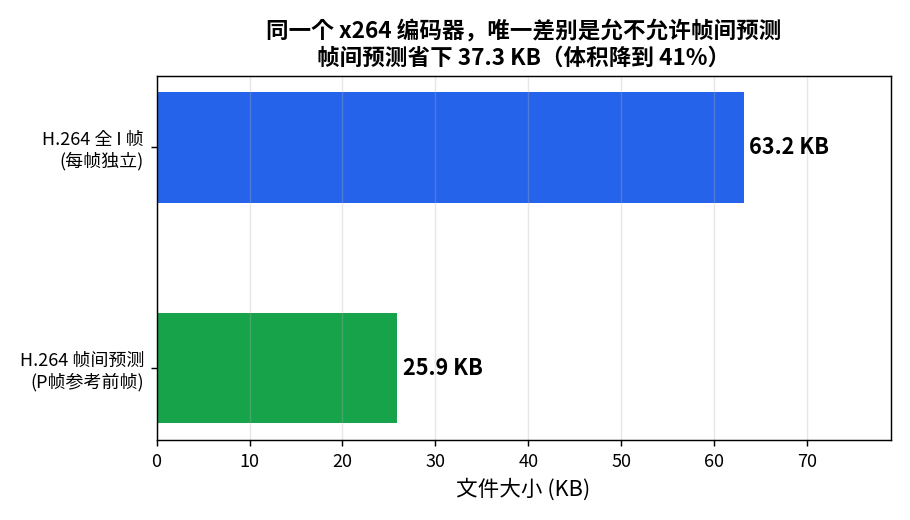
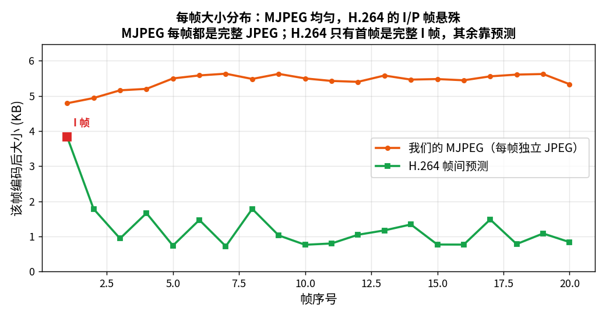
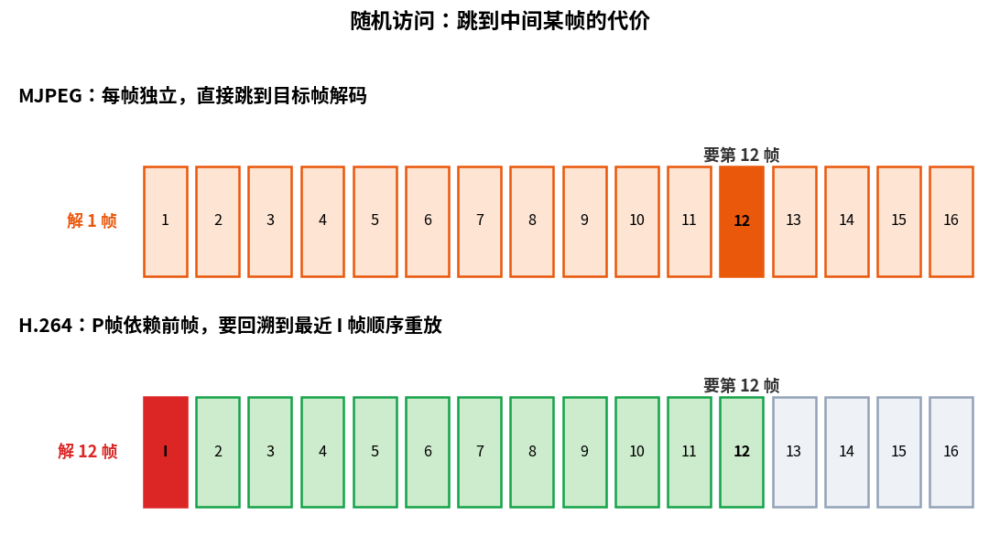
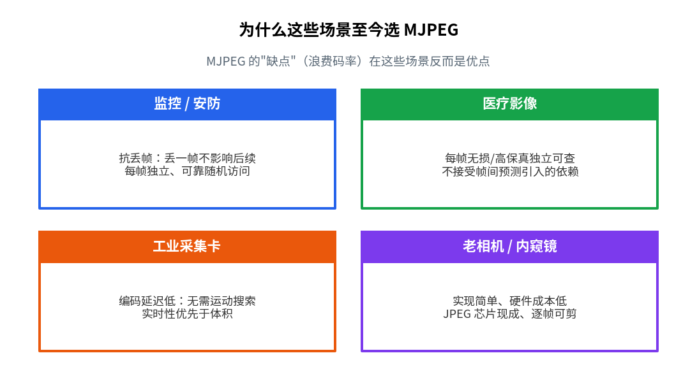

> 作者：Jone
> 日期：2026-09-12
> 风格：深度分析
> 状态：待发布

# 手搓 MJPEG #03：比 H.264 大 5-10 倍，代价买来了什么

在此之前，我们手搓的 MJPEG（Motion JPEG，运动 JPEG）跑通了：把视频每一帧当成独立 JPEG 编进 AVI，再逐帧解回来。整条链能被 VLC 正确播放。

但一个尖锐的问题一直没回答：同样一段视频，MJPEG 编出来比 H.264（也叫 AVC，Advanced Video Coding，高级视频编码）大好几倍。这不是浪费吗？

这一篇不写新代码。我们用同一批运动测试帧，跑一组真实对比实验，把"到底大几倍""大出去的码率换来了什么"用字节数量化清楚。

先看 MJPEG 从编码到解码走过的完整流程。


## 到底大几倍？先把真实数字摆出来

实验很简单：20 帧 192x144 的运动测试序列（ffmpeg 的 testsrc2 生成，画面一直在动，对帧间预测公平），fps=10。四种编码方式跑一遍，量真实文件字节数。

H.264 用的是 ffmpeg 自带的 libx264 编码器，CRF（恒定质量因子，Constant Rate Factor）设为 23，这是画质和体积平衡的常用档。

对比脚本干的事很直白，核心就这几条命令：

```bash
# 我们手搓的 MJPEG 编码器
mjpeg_encoder samples/mjpeg_frames out.avi --quality 80 --fps 10

# H.264 帧间预测（默认 medium + CRF 23）
ffmpeg -framerate 10 -i frame_%03d.ppm -c:v libx264 \
       -preset medium -crf 23 -pix_fmt yuv420p h264_inter.mp4

# H.264 全 I 帧：keyint=1 强制每帧都是关键帧
ffmpeg -framerate 10 -i frame_%03d.ppm -c:v libx264 \
       -preset medium -crf 23 -x264-params keyint=1:scenecut=0 \
       -pix_fmt yuv420p h264_allintra.mp4
```

编完各取文件字节数，写进一份 JSON，配图脚本直接读。全程没有一个手编的数字。



结果一目了然：

| 编码方式 | 文件大小 | 相对 H.264 帧间预测 |
|---|---|---|
| 我们的 MJPEG | 109.0 KB | 4.2 倍 |
| ffmpeg MJPEG | 181.7 KB | 7.0 倍 |
| H.264 全 I 帧 | 63.2 KB | 2.4 倍 |
| H.264 帧间预测 | 25.9 KB | 1 倍（基准） |

我们手搓的 MJPEG 是 H.264 帧间预测的 4.2 倍。ffmpeg 自家画质更高的 MJPEG 更是 7 倍。倍数会随画质档和内容波动，但"大好几倍"是结构性的，逃不掉。

这里要诚实说一句：这个倍数不是固定的。我们特意选了画面一直在动的测试序列，对帧间预测算是公平。如果换成监控摄像头对着空走廊那种几乎静止的画面，前后帧几乎一模一样，H.264 能把 P 帧压到几乎为零，倍数轻松冲到 10 倍甚至更高。反过来，画面剧烈晃动、每帧都天翻地覆时，帧间预测无从下手，倍数才会缩小。

换句话说，MJPEG 和 H.264 的体积差，本质上取决于"视频里有多少时间冗余可挖"。静止场景冗余大，差距就大；剧烈运动冗余小，差距就小。

说白了，MJPEG 每一帧都从头编一张完整 JPEG，谁也不参考谁。视频里前后帧明明高度相似，这份相似度它一点没利用。而这份"没利用",正是它和 H.264 拉开数量级差距的全部原因。

## 揭示性时刻：省下的码率，就是"帧间预测"一个技术的价值

上面那张表里，藏着这篇文章最值得记住的一组对比——H.264 的两行。

同样是 libx264，同样是 CRF 23，唯一的差别是：一个允许帧间预测，一个强制每帧都编成 I 帧（帧内编码帧，Intra-coded frame，只靠自己、不参考别人）。



全 I 帧 63.2 KB，帧间预测 25.9 KB。体积直接降到 41%，省下 37.3 KB。

这 37.3 KB，不是压缩算法整体的功劳，就是"帧间预测"这一个技术省下来的。因为其它条件全都一样。

而 H.264 全 I 帧（63.2 KB）和我们的 MJPEG（109 KB）其实是同一类东西——都是"每帧独立编码",区别只在 H.264 的帧内压缩比我们手搓的 JPEG 更精细。真正拉开数量级差距的分水岭，是"要不要参考前一帧"。

这就引出了一个关键认知：MJPEG 不是技术落后，它是主动放弃了时间维度上的压缩。放弃的代价是体积，换来的东西，下面三节一个个看。

## 换来的第一样东西：每帧大小均匀，掉一帧不连累别人

先看每帧编码后有多大。



我们的 MJPEG 每帧稳定在 4.9 到 5.8 KB 之间，几乎一条平线。因为每帧都是一张完整 JPEG，工作量一样。

H.264 完全不同：第一帧是 I 帧，3.9 KB；之后全是 P 帧（前向预测帧，Predicted frame，只记录相对前帧的变化），普遍不到 2 KB，最小的只有 738 字节。悬殊得厉害。

这条平线，是 MJPEG 的第一个隐藏优点。传输中丢了一帧，只是那一帧花屏，下一帧照常独立解码。

而 H.264 里，P 帧依赖前帧。丢了一帧，后面一串靠它预测的帧全跟着错，直到下一个 I 帧才能"重新对齐"。监控、直播这类不可靠网络场景，这个差别很致命。

## 换来的第二样东西：想跳到哪帧就跳到哪帧

随机访问，是 MJPEG 另一个被低估的优点。

假设你要跳到第 12 帧。



MJPEG 里，每帧独立，直接定位到第 12 帧那段 JPEG，解一帧就出画面。代价是解 1 帧。

H.264 里，第 12 帧是 P 帧，它参考第 11 帧，第 11 帧又参考第 10 帧……一路依赖到最近的那个 I 帧。想看第 12 帧，得先找到最近 I 帧，然后把中间的帧顺序全解一遍。代价是解 12 帧。

换个角度想：视频剪辑软件为什么剪 MJPEG 素材那么"跟手"？因为每帧都是关键帧，拖动进度条到任意位置都能立刻出画面，切一刀不需要重编周围一堆帧。这也是很多专业采集设备、老式相机坚持用 MJPEG 的原因之一。

## 换来的第三样东西：编码延迟低，实现简单

再看编码这一侧。

H.264 之所以能把 P 帧压那么小，靠的是运动估计——在前一帧里到处搜索"这块像素移动到哪去了"。搜索很费算力，也带来延迟。

MJPEG 完全没有这一步。它不看前后帧，编码路径就是一条直线走到底：变换、量化、熵编码。没有运动搜索，没有多帧缓冲，延迟天然就低。

这里有个容易被误读的点，得说清楚。我们这次的测量里，20 帧编码耗时都在几十毫秒量级，H.264 甚至比我们手搓的 MJPEG 还快——那是因为 libx264 是被反复优化过的成熟工程实现，而我们的 MJPEG 是教学代码，没做任何加速。

真正的差别不在这组小样本的绝对耗时，而在算法的复杂度天花板：MJPEG 编码是"每帧固定工作量"，不随内容和分辨率剧烈波动；H.264 的运动搜索会随着画面运动剧烈程度、搜索范围设置急剧变重。这就是为什么工业采集卡、内窥镜、医疗成像这类设备偏爱 MJPEG——它们要的是"拍到即出帧"的确定性延迟，宁可多占存储，也不接受帧间预测带来的编码延迟波动和帧间依赖。

## 所以 MJPEG 不是落后，是场景选型

把三样东西合起来看，就明白为什么这些场景至今用 MJPEG。



监控要抗丢帧、医疗要每帧独立可查、工业采集要低延迟、老设备要实现简单成本低。这些场景里，MJPEG"浪费码率"的缺点根本不重要，而它"每帧独立"的特性恰恰是刚需。

技术选型从来不是"谁压得小谁就赢"。存储便宜、但网络不可靠或实时性要命的地方，MJPEG 的缺点反而是优点。

## MJPEG 系列收官：它替我们问出了下一个问题

一路下来，我们从零手搓了一个能播放的 MJPEG：先给 JPEG 编码器套上循环和 AVI 容器，再把它逐帧解回来，最后用真实数字看清了它的代价和价值。

MJPEG 最大的意义，或许不在于它本身有多好，而在于它把一个问题赤裸裸地暴露出来了：视频里前后帧那么像，可 MJPEG 一点没利用。前面那组对比也算清了——光是"参考前一帧"这一个动作，就能把体积砍掉一大半。

这正是 H.264 要解决的问题。它不再把每帧当孤岛，而是去猜时间上的冗余：这一帧和上一帧比,哪块没动、哪块动了、动到哪去了。运动估计、P 帧、B 帧，全都是围着这个念头展开的。

MJPEG 系列到此完结。接下来的 H.264 系列，我们从头搓真正的视频编码——从"猜时间冗余"这第一刀开始。

---

本文所有文件大小、逐帧字节数、编码耗时，均来自本机可复现的真实测量，对比脚本在 [codec-from-scratch/mjpeg/tools](https://github.com/Joneyao/codec-from-scratch/tree/main/mjpeg/tools)。

[H.264/AVC 标准介绍（维基百科）](https://en.wikipedia.org/wiki/Advanced_Video_Coding)
[Motion JPEG 格式说明（维基百科）](https://en.wikipedia.org/wiki/Motion_JPEG)
[FFmpeg 官方文档](https://ffmpeg.org/documentation.html)
[x264 编码器与 CRF 说明（FFmpeg H.264 指南）](https://trac.ffmpeg.org/wiki/Encode/H.264)
[H.264 帧类型与 GOP 结构详解（cnblogs 中文技术博客）](https://www.cnblogs.com/wainiwann/p/7477794.html)
[MJPEG 在监控与工业相机中的应用（CSDN 中文技术博客）](https://blog.csdn.net/weixin_44770467/article/details/108377479)
