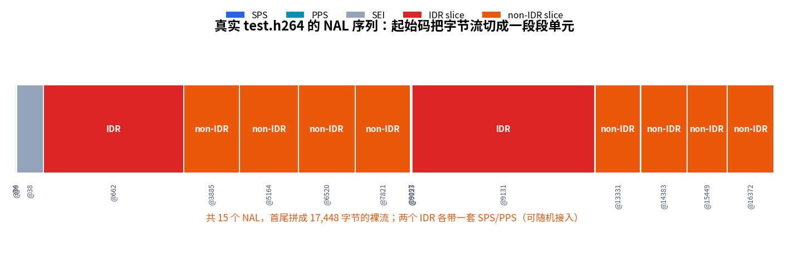
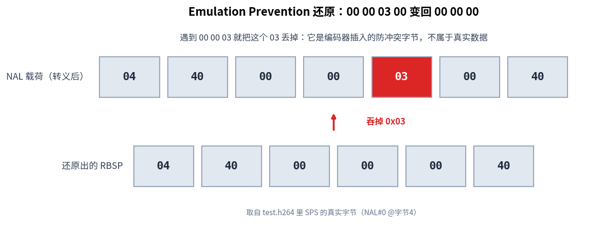
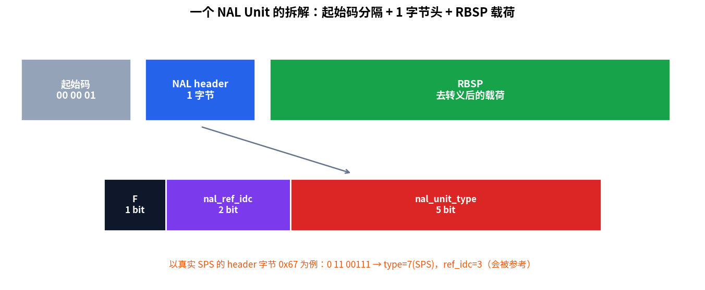
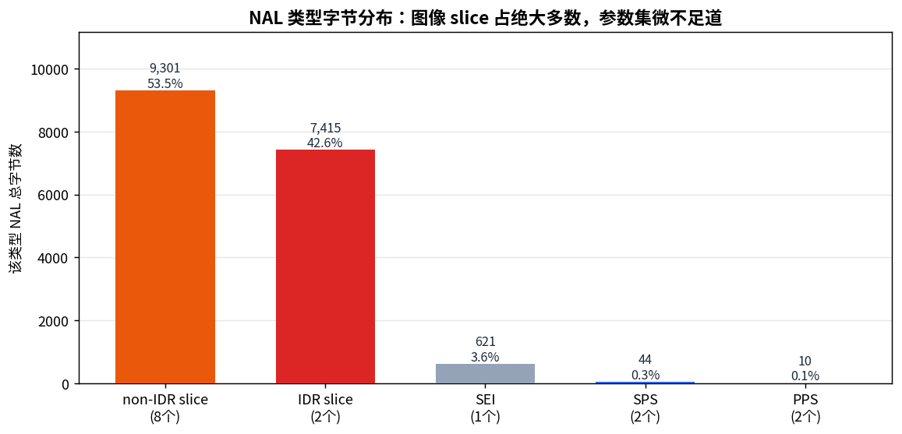

> 作者：Jone
> 日期：2026-09-12
> 风格：深度分析
> 状态：待发布

# 手搓 H.264 解码器 #01：从字节流里切出第一个 NAL Unit

前面十几篇，我们从零手搓了 JPEG，又把它扩展成逐帧独立的 MJPEG（Motion JPEG，运动 JPEG）。JPEG 解决"一张图怎么压"，MJPEG 解决"一段视频怎么当成一叠图来压"。但 MJPEG 有个结构性的浪费：前后帧再像，它也当成毫不相干的两张图各编一遍。

从这一篇起，我们进入真正的视频编码——H.264（也叫 AVC，Advanced Video Coding，高级视频编码）。它会利用帧与帧之间的相似，把体积压到 MJPEG 的几分之一。

但动手之前，得先回答一个问题：**为什么这个系列先讲解码，后讲编码？**

答案藏在标准本身。ITU-T 的 H.264 标准，通篇只规定了一件事：给定一段合规的码流，解码器该如何一步步解出像素。它几乎不管编码器怎么产生这段码流。运动怎么搜、模式怎么选、码率怎么控，标准全部放开，各家自由发挥。x264、硬件编码器、你自己写的编码器，只要吐出的码流能被标准解码器解对，就都算合规。

这就带来一个反直觉的结论：**解码才是那个有唯一正确答案、能对着标准逐条实现的部分。** 编码没有标准答案，甚至编码器内部还必须内嵌一条完整的解码路径——因为它要重建出"解码端将看到的那一帧"，才能拿来做后续帧的预测参考。解码是地基，编码是盖在地基上的自由发挥。

所以我们从解码开始。而解码的第一步，甚至还没到像素，是把一坨字节切成一个个有意义的单元。

先看本篇在整个 H.264 解码流程里的位置。


## 位流不是文件格式，是一串拼接的比特

打开一个 `.h264` 文件，你看到的是一坨连续的字节。它不像 JPEG 那样有清晰的段标记（marker），也不像 AVI 那样有嵌套的 chunk 头。它就是一串比特流（bitstream）。

H.264 把这串比特切成一个个 NAL Unit（网络抽象层单元，Network Abstraction Layer unit）。每个 NAL Unit 是一个自包含的语法结构：可能是一组序列参数，可能是一帧图像的编码数据，也可能是一段辅助信息。

问题来了——一坨连续的字节，解码器怎么知道一个 NAL 到哪结束、下一个从哪开始？

H.264 的存储格式（标准里叫 Annex B 字节流）给的答案很朴素：**在每个 NAL 前面塞一个固定的分隔符**，叫起始码前缀（start code prefix），值是 3 个字节 `0x000001`。有时前面还会多垫一个 `0x00`，凑成 4 字节的 `0x00000001`（标准 B.1 把这个额外的零叫 zero_byte）。

解码器扫描字节流，每遇到一次 `0x000001`，就知道："上一个 NAL 到此为止，新的一个开始了。"



上面这张图是我们的切分器解析真实 `test.h264` 的结果，后面会详细讲怎么跑出来的。先记住这个直觉：起始码就是分隔符，像逗号断句一样把字节流切成 NAL。

## 但数据里凑巧出现 00 00 01 怎么办

这里就是本篇最关键的一处坑，也是整个 Annex B 设计里最精巧的一环。

起始码 `0x000001` 是分隔符。可 NAL 里装的是压缩后的图像数据，本质是随机的比特。谁能保证这堆随机字节里，不会凑巧出现 `00 00 01` 这三个字节？

保证不了。而一旦出现，解码器就会把数据中间当成一个新 NAL 的起点，整个切分全乱。

H.264 的解法叫 emulation prevention（防竞争，或译防伪起始码）。编码器在把数据写进 NAL 之前，做一次转义：只要发现数据里出现 `00 00 00`、`00 00 01`、`00 00 02`、`00 00 03` 这几种三字节序列，就在第二个 `00` 后面插入一个字节 `0x03`（标准里叫 emulation_prevention_three_byte，防竞争三字节）。

于是数据里真实的 `00 00 01` 被写成 `00 00 03 01`——中间多了个 `03`，就再也不会被误判成起始码了。

解码这端做反向操作：扫描 NAL 载荷，每遇到 `00 00 03`，就把这个 `03` 吞掉，还原出真正的数据。标准 7.4.1 说得很直白：这个 `03` 存在时，解码过程必须丢弃它。

吞掉 `03` 之后得到的东西，才是我们真正要的载荷，标准给它起了个名字：RBSP（原始字节序列载荷，Raw Byte Sequence Payload）。

下面这张图，用的是我们测试码流里 SPS 参数集里真实出现的一段字节。



看到没，`04 40 00 00 03 00 40` 这段里，那个 `03` 被吞掉，还原成 `04 40 00 00 00 40`。这不是我编的例子，是 `ffmpeg` 生成的真实 SPS 里就带着的转义字节。

说白了，**H.264 的位流不是一个静态的文件格式，而是靠"防冲突转义"拼出来的一串比特。** 你以为在读数据，其实要先脱掉编码器套上的这层转义外衣。这一层，正是新手写 H.264 解析器最容易漏掉、然后 debug 到怀疑人生的地方。

## NAL Unit 的第一个字节：一个字节讲清身份

切出一个 NAL、脱掉转义外衣之后，RBSP 的第一个字节是 NAL header（NAL 头），只有 1 个字节，却把这个单元的身份讲得明明白白。

标准 7.3.1 规定，这 8 个比特是这么分的：

- 第 1 位：forbidden_zero_bit（禁止位），必须是 0。如果是 1，说明码流在传输中损坏了。
- 第 2、3 位：nal_ref_idc（参考级别），取值 0 到 3。非 0 表示这个 NAL 会被后续帧当参考，不能随便丢。
- 第 4 到 8 位：nal_unit_type（单元类型），5 个比特，决定这个 NAL 到底装的是什么。



拿真实 SPS 的头字节 `0x67` 举例。二进制是 `0110 0111`，拆开就是：第 1 位 `0`（合规），第 2、3 位 `11`（参考级别 3，最高，会被参考），后 5 位 `00111`（十进制 7）。

类型 7 是什么？这就引出解码器最先要认识的几个 NAL 类型：

| type | 名称 | 装的是什么 |
|---|---|---|
| 7 | SPS（序列参数集，Sequence Parameter Set） | 整段视频的全局参数：分辨率、帧率相关信息 |
| 8 | PPS（图像参数集，Picture Parameter Set） | 一批图像共享的参数：熵编码方式等 |
| 6 | SEI（补充增强信息，Supplemental Enhancement Information） | 时间戳、色彩等辅助信息，解码可选 |
| 5 | IDR slice（即时解码刷新帧，Instantaneous Decoding Refresh） | 关键帧的图像数据，可独立解码 |
| 1 | 非 IDR slice | 普通帧（含 P 帧）的图像数据，依赖前面的帧 |

解码器拿到一个 NAL，先看这个字节，就知道该把它交给哪条处理路径。参数集去建全局配置，slice 去还原像素。

## 把它跑起来：解析一段真实的 H.264

光说不练没意思。我们用 `ffmpeg` 生成一段最小的真实码流：

```bash
ffmpeg -y -f lavfi -i "testsrc2=size=176x144:rate=10:duration=1" \
       -c:v libx264 -profile:v baseline \
       -x264-params keyint=5 -f h264 samples/test.h264
```

176x144 是 QCIF 标准尺寸，baseline profile（基线档）保证后面几篇手写的解码器能解，`keyint=5` 让码流里既有 IDR 关键帧、又有普通帧，混在一起才有代表性。

切分器的核心逻辑就两步：扫起始码定边界，再对每段去转义、读头字节。去转义这段是全篇的心脏，直接贴仓库里的实现（对应标准 7.4.1）：

```cpp
// 每当出现 00 00 03，且 03 后面跟的是 00/01/02/03 之一，
// 这个 03 是转义字节，丢弃它。zero_run 记录连续 00 的个数。
for (size_t i = 0; i < len; ++i) {
    uint8_t c = nal[i];
    if (zero_run >= 2 && c == 0x03 && i + 1 < len && nal[i + 1] <= 0x03) {
        ++drop;          // 吞掉这个 emulation_prevention_three_byte
        zero_run = 0;
        continue;        // 不写入 rbsp
    }
    rbsp.push_back(c);
    zero_run = (c == 0x00) ? (zero_run + 1) : 0;
}
```

编译跑通后，让 demo 解析这段 `test.h264`，它 dump 出来的逐 NAL 表是这样的（节选）：

```
idx  type           sc   offset    nalSize  rbspSize  ep3b
0    SPS            4B   4         22       21        1
1    PPS            4B   30        5        5         0
2    SEI            3B   38        621      621       0
3    IDR slice      3B   662       3219     3219      0
4    non-IDR slice  4B   3885      1275     1275      0
...
total NAL units: 15
total emulation_prevention_three_byte removed: 3
type histogram: SPS=2 PPS=2 SEI=1 IDR=2 nonIDR=8
```

一段 1 秒的视频，切出 15 个 NAL：2 个 SPS、2 个 PPS、1 个 SEI、2 个 IDR 关键帧、8 个普通帧。第一个果然是 SPS。整段码流里被吞掉了 3 个转义字节——其中一个就在开头的 SPS 里，正是前面那张还原图用的例子。

注意到 SPS 那行 `rbspSize` 比 `nalSize` 少 1 了吗？那就是吞掉的那个 `03`。

各类型 NAL 的字节占比也很说明问题：



图像 slice 吃掉了几乎全部字节，SPS/PPS 加起来才几十字节。这符合直觉：参数集只是几行配置，真正占空间的是像素编码数据。

怎么确认我们切对了？用 `ffmpeg` 交叉验证。`ffmpeg -v trace` 会打印它自己解析出的每个 NAL 类型，也可以写几行脚本独立数一遍起始码。两条路数出来都是 15 个 NAL、类型分布完全一致，切分器就站得住脚了。

## 小结

这一篇我们做完了 H.264 解码的第一步：把一坨字节切成一个个 NAL Unit。

三个要点值得再敲一遍。起始码 `0x000001` 是 NAL 之间的分隔符。数据里凑巧出现的假起始码，靠 emulation prevention 转义避开，解码端要把插入的 `0x03` 吞掉还原成 RBSP。每个 NAL 的第一个字节，用 1+2+5 的比特划分讲清了自己的类型和参考级别。

但切出来的 NAL，里面还是一堆二进制。比如那个 21 字节的 SPS，到底写着这段视频多大、多少帧？现在我们还读不出来——因为 H.264 的语法元素不是按字节对齐的，很多字段用一种叫指数哥伦布编码（Exp-Golomb）的变长方式塞在比特流里。

下一篇我们就来手写指数哥伦布解码器，逐比特啃开 SPS 和 PPS，最终从那 21 个字节里，解出这段视频真正的分辨率。

[ITU-T H.264 官方标准文本](https://www.itu.int/rec/T-REC-H.264)

[H.264/AVC 视频编码标准 NAL 单元结构解析](https://www.cnblogs.com/CoderTian/p/6647448.html)

[H.264 码流结构与起始码、防竞争字节详解](https://blog.csdn.net/leixiaohua1020/article/details/11800877)

[FFmpeg 官方文档：H.264 裸流处理](https://ffmpeg.org/ffmpeg-formats.html)

[H.264 Annex B 与 AVCC 字节流格式对比](https://membrane.stream/learn/h264)
