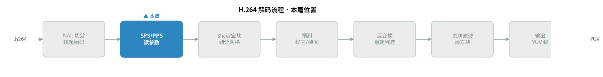
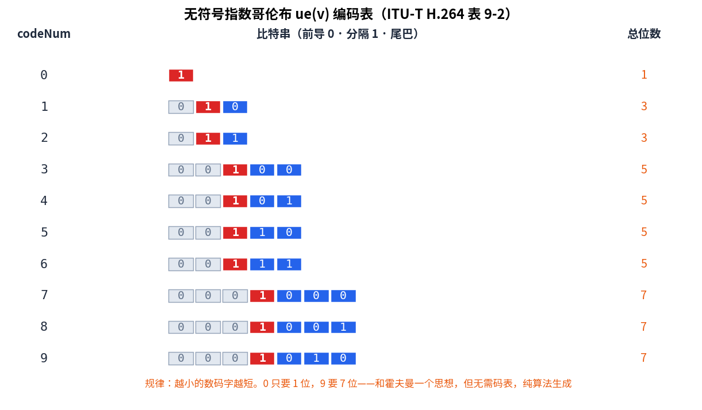
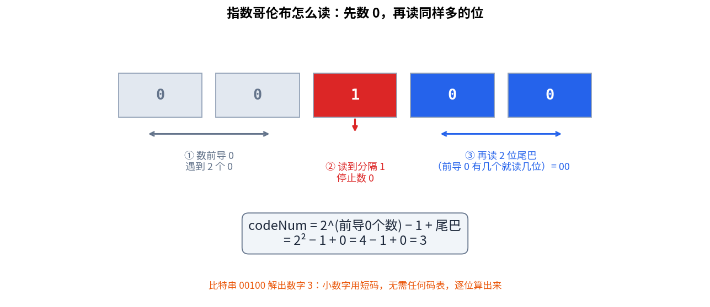
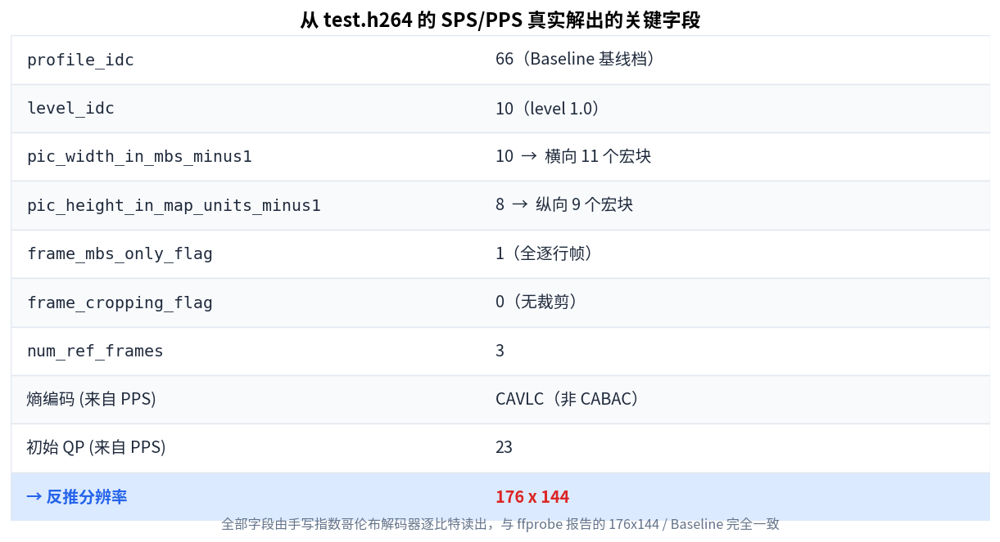
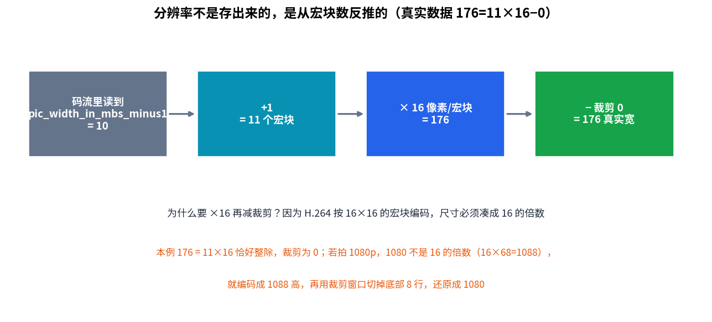

> 作者：Jone
> 作者：Jone
> 日期：2026-09-12
> 风格：深度分析
> 状态：待发布

# 手搓 H.264 解码器 #02：指数哥伦布解码，读出视频的真实分辨率

先说一个大多数人没意识到的事实：视频的分辨率，并没有一个整数直接躺在文件里。

你用 `ffprobe` 查一个 `.h264`，它报 176x144。但码流里根本找不到 176 这个数。真正存着的是"横向 11 个宏块"。解码器要拿 11 乘以 16，再减去一个裁剪窗口，才反推出 176。

这就是本篇要抵达的地方。上一篇我们把一坨字节切成了一个个 NAL Unit（网络抽象层单元，Network Abstraction Layer unit），但切出来的东西还是二进制——那个 21 字节的 SPS（序列参数集，Sequence Parameter Set），到底写着视频多大、什么档次，我们还读不出来。

读不出来的原因是：H.264 的字段不按字节对齐。很多参数用一种叫指数哥伦布（Exp-Golomb）的变长编码，一个挨一个塞在比特流里。想读出分辨率，得先手写一个能逐比特啃的解码器。

先看本篇在整个 H.264 解码流程里的位置。



## 为什么不能一个字段占一个整数

最直白的存法，是给每个参数固定几个字节。分辨率给两个 16 位整数，参考帧个数给一个字节，清清楚楚。

H.264 偏不。因为参数集里的字段，取值范围天差地别。

参考帧个数通常是 1 到 3，seq_parameter_set_id 一般就是 0。这些小数字如果都固定占 16 位，绝大多数位都是 0，纯属浪费。而理论上某些字段又可能取到很大的值，固定字节又不够用。

指数哥伦布的思路很简单：**小数字用短码，大数字用长码，按需伸缩。** 这和霍夫曼编码是同一个念头——高频的东西给短码。区别在于，霍夫曼要先统计频率、建一张码表，编解码两端都得带着这张表；指数哥伦布不用，它的码字完全由一个固定算法生成，读的时候现算就行。

省掉码表这件事，对参数集特别重要。SPS、PPS 是整段视频最先解析的东西，越轻量越好。

## 指数哥伦布：数几个 0，再读几位

无符号指数哥伦布，标准里记作 ue(v)，解码规则就一句话（ITU-T H.264 第 9.1 节）：

先数前导 0 的个数，记作 leadingZeroBits。数到第一个 1 停下。然后再读 leadingZeroBits 位，当成一个二进制数。最终值按这个公式算：

```
codeNum = 2^leadingZeroBits − 1 + read(leadingZeroBits)
```

举个最小的例子。比特串 `1`：前面 0 个 0，直接是 1，读 0 位尾巴，codeNum = 2^0 − 1 + 0 = 0。比特串 `010`：1 个前导 0，读到 1，再读 1 位尾巴是 0，codeNum = 2^1 − 1 + 0 = 1。

把 0 到 9 全列出来，规律一眼就看清了。



红色是那个分隔用的 1，灰色是前导 0，蓝色是尾巴。数字越大，前导 0 越多，码字越长。0 只要 1 位，9 要 7 位。整张表没有任何"查表"动作，全是算出来的。

用一段真实的比特来走一遍解码，感受一下"数 0 再读"这个动作。



有符号的字段（比如量化参数偏移）用 se(v)，它在 ue(v) 上再套一层映射（9.1.1）：先按 ue 解出 codeNum，记作 k，再折叠成正负交替的序列。k=0 映射到 0，k=1 到 +1，k=2 到 −1，k=3 到 +2，k=4 到 −2。写成代码就是一行：

```cpp
int32_t RbspBitReader::ReadSE() {
    uint32_t k = ReadUE();
    int32_t magnitude = static_cast<int32_t>((k + 1) >> 1);  // ceil(k/2)
    return (k & 1) ? magnitude : -magnitude;                 // 奇正偶负
}
```

奇数 codeNum 映射成正数，偶数映射成负数，绝对值就是 (k+1)/2 取整。为什么这么折叠？因为负数如果直接编码，得先想办法表示符号位，麻烦。正负交替排列之后，所有整数就被重新编号成 0、1、2、3……又能套回无符号指数哥伦布那套短码优先的规则。小的偏移量对应小的 codeNum，码字就短。这是个很典型的"把新问题化归成已解决问题"的技巧。

## 逐比特读取器：MSB 在前，越界报警

有了算法，还得有个能逐比特读的工具。这里我没有复用之前 JPEG 系列的 BitReader——那个要处理 JPEG 熵段里 `0xFF` 的字节填充和 marker 边界，是 JPEG 特有的麻烦。

H.264 这边干净得多。上一篇的切分器已经把 emulation prevention（防竞争）的转义字节去掉了，得到的 RBSP（原始字节序列载荷）是纯净字节。我们只需要 MSB-first（高位在前）逐位读，外加指数哥伦布。所以给 H.264 单独写一个轻量读取器，核心就是读 1 位：

```cpp
uint32_t RbspBitReader::ReadBit() {
    size_t byte_idx = bit_pos_ >> 3;          // 落在第几个字节
    if (byte_idx >= len_) { overrun_ = true; return 0; }  // 越界报警
    int shift = 7 - static_cast<int>(bit_pos_ & 7);  // MSB first
    uint32_t bit = (data_[byte_idx] >> shift) & 1u;
    ++bit_pos_;
    return bit;
}
```

`shift = 7 - (bit_pos & 7)` 保证每个字节从最高位开始吐。越界时置 `overrun_` 标志而不是崩溃——解析参数集时一旦读穿，说明码流有问题，上层能据此报错，而不是拿着一堆垃圾值继续跑。

这里有个容易踩的坑：读取器工作在去转义后的 RBSP 上，绝不能拿原始 NAL 字节来读。如果跳过上一篇的去转义步骤，那些编码器插进来的 `0x03` 会被当成真实数据，比特位置全部错位，后面每个字段都跟着读歪。这也是为什么解码必须一层一层来，上一篇的地基没打好，这一篇就悬空。

ue(v) 就建在 ReadBit 之上：一直读 0 数个数，读到 1 停，再读同样多的位。整个过程没有任何缓冲区回退，读到哪算到哪，天然适合顺序解析码流。

## 把 SPS 逐字段啃开

工具齐了，正式解析 SPS。它的语法在标准 7.3.2.1，字段一个接一个，顺序不能错。我们的解析器严格照着来：

```cpp
s.profile_idc = ReadBits(8);            // u(8)  档次
ReadBit(); ReadBit(); ReadBit();        // 三个 constraint flag
ReadBits(5);                            // reserved_zero_5bits
s.level_idc = ReadBits(8);              // u(8)  级别
s.seq_parameter_set_id = ReadUE();      // ue(v)
// ... 中间若干字段 ...
s.pic_width_in_mbs_minus1 = ReadUE();          // 横向宏块数 − 1
s.pic_height_in_map_units_minus1 = ReadUE();   // 纵向
s.frame_mbs_only_flag = ReadBit();             // 是否全逐行帧
```

前面几个字段是固定位宽的 u(n)，从 seq_parameter_set_id 起就切换成 ue(v) 变长。这种混合正是 H.264 语法的日常：该定长定长，该变长变长，读取器得两种都会。

关键的两个字段是 `pic_width_in_mbs_minus1` 和 `pic_height_in_map_units_minus1`。注意名字里的 minus1——存的是"宏块个数减一"。为什么减一？因为宽度至少 1 个宏块，不可能是 0，减一后能省掉一个码字长度，又是那个"能省一位是一位"的执念。

让解析器跑真实的 `test.h264`，打印所有字段：



profile_idc 是 66，也就是 Baseline（基线档）；熵编码方式是 CAVLC 而非 CABAC（这两种熵编码是后面篇章的主角，这里先记住 baseline 用的是较简单的 CAVLC）。这些值和 `ffprobe` 报告的完全对得上。

## 高潮：176 是怎么算出来的

现在把分辨率反推出来。解出的 `pic_width_in_mbs_minus1` 是 10，加一，得到横向 11 个宏块。

H.264 按 16x16 的宏块（MB，Macroblock）编码，每个宏块 16 像素宽。所以编码宽度 = 11 × 16 = 176。

高度同理。`pic_height_in_map_units_minus1` 是 8，加一是 9 个宏块，乘 16 得 144。因为 frame_mbs_only_flag 是 1（全逐行帧），高度不用再乘 2。

```
width  = (pic_width_in_mbs_minus1 + 1) * 16 = 11 * 16 = 176
height = (pic_height_in_map_units_minus1 + 1) * 16 = 9 * 16 = 144
```



这个例子里 176 和 144 都恰好是 16 的整数倍，所以裁剪窗口是 0。但换个尺寸就不一样了。

想想拍 1080p。1080 不是 16 的倍数——16 × 67 = 1072 不够，16 × 68 = 1088 超了。H.264 只能按 68 个宏块编码，得到 1088 的高度，然后在 SPS 里写一个裁剪窗口，告诉解码器：底部 8 行是凑数的，切掉。于是显示出来还是 1080。

所以完整的公式要带上裁剪（frame_crop 各偏移，见 7.4.2.1 语义）：

```
真实宽 = 编码宽 − CropUnitX * (左偏移 + 右偏移)
真实高 = 编码高 − CropUnitY * (上偏移 + 下偏移)
```

4:2:0 色度加逐行帧时，CropUnitX 和 CropUnitY 都是 2。这就是揭示性时刻：**分辨率不是一个存出来的数字，是从宏块个数算出来、再被裁剪窗口修正的结果。** 因为编码单位是 16x16，尺寸被迫凑整，真实尺寸只能靠裁剪信息还原。

## 顺手把 PPS 也解了

PPS（图像参数集，Picture Parameter Set）的语法在 7.3.2.2，比 SPS 简单，本篇只取后续会用到的几个字段：

```cpp
p.pic_parameter_set_id = ReadUE();       // 本 PPS 的编号
p.seq_parameter_set_id = ReadUE();       // 指向哪个 SPS
p.entropy_coding_mode_flag = ReadBit();  // 0=CAVLC 1=CABAC
```

最关键的是 `entropy_coding_mode_flag`。它决定后面 slice 里的语法元素用哪种熵编码：0 是 CAVLC（基于上下文的变长编码），1 是 CABAC（基于上下文的二进制算术编码）。我们的测试流是 baseline，这个 flag 为 0，用 CAVLC。解码器读到它，才知道后面该走哪条解码路径。

怎么确认整套解析没读错位？两条线交叉验证。一是拿结果和 `ffprobe -show_streams` 比：它报 width=176、height=144、profile 是 Constrained Baseline，和我们逐比特解出来的一致。二是写单元测试，用标准表 9-2 的已知比特串喂给 ue/se，比如 `1` 必须解出 0、`00100` 必须解出 3，再用真实 SPS 断言解出 176x144。两条线都绿，解析器才站得住。

```
test_sps_pps: 全部通过
真实 SPS：profile=Baseline level=1.0 分辨率=176x144 (11个宏块宽 x 9个宏块高)
真实 PPS：熵编码=CAVLC 初始QP=23
```

## 小结

这一篇，我们手写了指数哥伦布解码器，把上一篇切出来的那个二进制 SPS 逐比特啃开了。

三个要点。指数哥伦布用"数几个 0 再读几位"的算法生成变长码，小数字短、大数字长，和霍夫曼一个思想却不需要码表。SPS 里混着定长 u(n) 和变长 ue(v)/se(v)，读取器两种都得会。最要紧的是那个反直觉的结论：分辨率是从宏块个数反推、再减裁剪算出来的，176 = 11 个宏块 × 16 − 0 裁剪。

现在我们手里有了整段视频的全局参数：多大、什么档次、用哪种熵编码。下一篇进入 Slice 和宏块——一帧画面到底怎么被切成一张 16x16 的网格，每个格子又是怎么排进码流的。参数读完了，真正的像素解码要开始了。

[ITU-T H.264 官方标准文本](https://www.itu.int/rec/T-REC-H.264)

[H.264 SPS 解析与分辨率计算详解](https://www.cnblogs.com/CoderTian/p/6647448.html)

[指数哥伦布编码原理与 H.264 应用](https://blog.csdn.net/leixiaohua1020/article/details/11800877)

[H.264 码流参数集 SPS/PPS 字段解读](https://zhuanlan.zhihu.com/p/27896239)

[FFmpeg 官方文档：H.264 裸流处理](https://ffmpeg.org/ffmpeg-formats.html)
