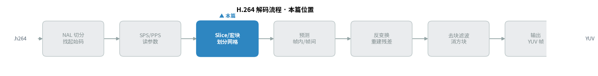
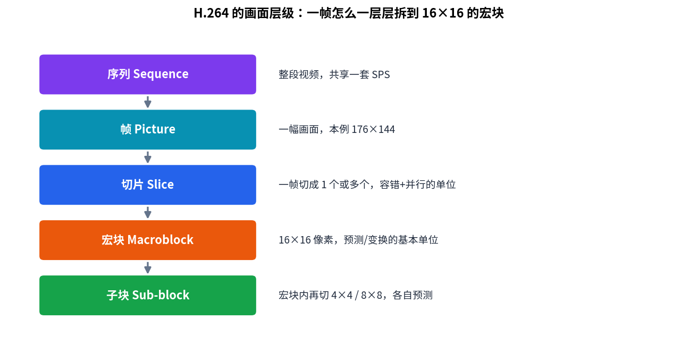
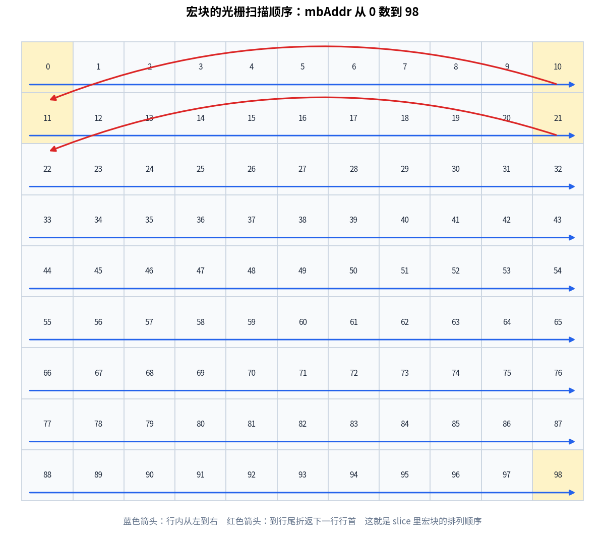
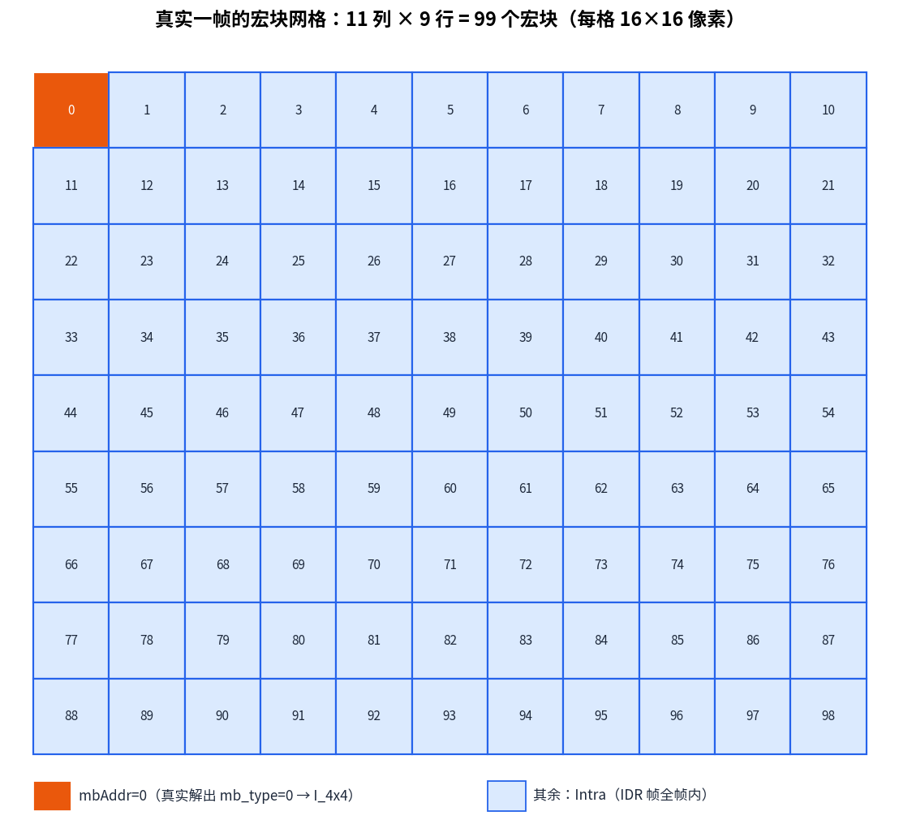
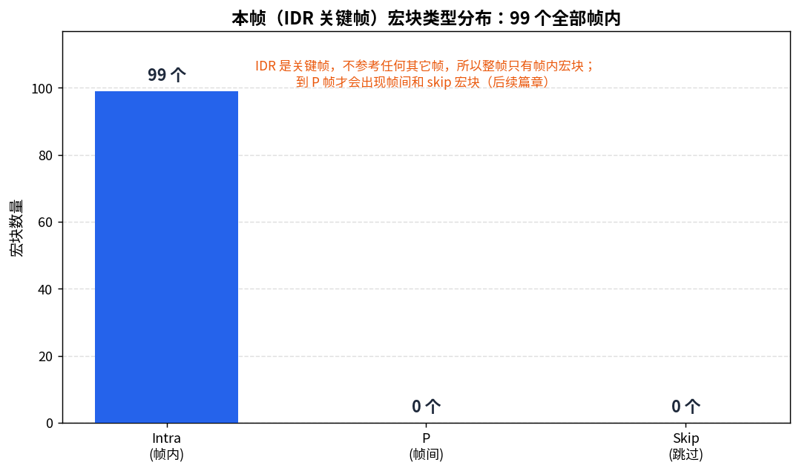

> 作者：Jone
> 日期：2026-09-12
> 风格：深度分析
> 状态：待发布

# 手搓 H.264 解码器 #03：一帧画面怎么被切成 16×16 的宏块网格

上一篇结束时，我们从 SPS 里解出了这段视频的真实尺寸：176×144。

但 176×144 这个数字，解码器其实是从"横向 11 个宏块、纵向 9 个宏块"反推出来的。这一篇就来看这 99 个宏块——它们是怎么组织成一张网格，又是怎么被 Slice 打包起来的。

这是理解 H.264 帧内部结构的关键一步。在此之前，我们眼里的一帧还是个抽象的"176×144 的图像"；这一篇之后，它会变成一张 11×9 的网格，每个格子是一个 16×16 的宏块——这才是 H.264 真正动手编码的基本单位。

先看本篇在整个 H.264 解码流程里的位置。



## 一帧的四层身份：序列、图像、切片、宏块

先把 H.264 里一帧画面的组织层级理清楚，后面才不会绕晕。

从大到小是四层：

- **序列（Sequence）**：整段视频，由 SPS（序列参数集，Sequence Parameter Set）描述全局参数。
- **图像（Picture）**：一帧画面。
- **切片（Slice）**：一帧可以切成一个或多个切片，每个切片是一批连续宏块的集合。
- **宏块（MB，Macroblock）**：16×16 像素的方块，是预测、变换、编码的基本单位。宏块内部还能再分成更小的子块。



这里最容易被误解的是切片这一层。很多人以为一帧天然就该是一个切片，其实不是。

## Slice 不是画面的自然属性，是工程选择

一帧画面，可以整个装进一个切片，也可以切成好几个切片。这个选择权在编码器手里，而且它跟画面内容毫无关系。

为什么要切成多个切片？两个非常实际的工程理由。

第一是**容错**。切片是可以独立解码的最小单元——一个切片的宏块，不依赖其它切片。网络传输丢了一个包，只影响那一个切片对应的局部画面，其它切片照常解出来。如果一帧只有一个切片，那丢一个包整帧就废了。

第二是**并行**。切片之间互不依赖，就可以分给多个线程、多个核同时解。一帧切成四个切片，四核并行，解码速度接近翻四倍。

所以切片是一个**工程产物**，不是画面的自然属性。它是编码器在容错性、并行度和压缩率之间做的权衡——切片越多，抗丢包和并行越好，但每个切片都要带一份切片头开销，压缩率略降。

说白了，同一帧画面，你可以合法地编成一个切片，也可以合法地编成十个切片，解出来的像素一模一样。这跟画面里有什么内容，一点关系都没有。

我们的测试码流很简单，一帧就是一个切片，覆盖全部 99 个宏块。

## 读懂切片头：这一帧是什么类型

每个切片以一个切片头（Slice header）开场，紧跟在 NAL（网络抽象层，Network Abstraction Layer）头之后。切片头用的还是上一篇那套指数哥伦布编码，逐比特解。

切片头里最要紧的一个字段是 slice_type（切片类型），它决定了这一整片宏块用什么方式预测（ITU-T H.264 第 7.4.3 节）：

- **I slice（帧内切片，Intra）**：只用当前帧已解码的相邻像素预测，不参考别的帧。可以独立解出。
- **P slice（预测切片，Predicted）**：可以参考前面已解码的帧。
- **B slice（双向预测切片，Bi-predictive）**：可以同时参考前面和后面的帧。

slice_type 的取值有个小细节：0 到 4 和 5 到 9 是两套，后一套只是表示"整帧所有切片都是同一类型"的约束标志，映射回去还是 P/B/I/SP/SI 那几种。我们的解析器把它统一归到基础类型：

```cpp
// slice_header.cpp —— slice_type 归类（spec 7.4.3）
// 0/5=P, 1/6=B, 2/7=I, 3/8=SP, 4/9=SI
SliceCategory Classify(int slice_type) {
    switch (slice_type % 5) {
        case 0: return SliceCategory::P;
        case 1: return SliceCategory::B;
        case 2: return SliceCategory::I;
        case 3: return SliceCategory::SP;
        default: return SliceCategory::SI;
    }
}
```

解析切片头有个坑要注意：字段的存在与否，依赖 SPS/PPS 里的其它标志。比如 frame_num 的位数不是固定的，是 SPS 里 log2_max_frame_num_minus4 加 4 位；再比如 idr_pic_id 只有当这个 NAL 是 IDR（即时解码刷新帧，Instantaneous Decoding Refresh）时才存在；图像顺序计数（POC）相关字段则取决于 pic_order_cnt_type。这些条件分支，是照着标准 7.3.3 的语法一条条抠出来的，错一个后面全乱。

拿测试码流的第一个切片跑一遍：slice_type 解出来是 7，归类为 I 切片。这一帧是 IDR 关键帧，所有宏块都用帧内预测，不参考任何其它帧——所以它能被独立解码，是随机访问的入口。切片头里还带了 slice_qp_delta，加上 PPS 里的初始 QP，算出这一片的量化参数 SliceQP = 26。这个 QP 后面反量化时要用。

## 宏块网格：从宏块地址到坐标

切片头之后，就是一个个宏块的数据。

宏块在一帧里的排列顺序，是**光栅扫描（raster scan）**：从左到右、从上到下，像打字机一样一行行走。每个宏块有一个地址 mbAddr，从 0 开始编号。



地址和坐标的换算很直接，用每行的宏块数（PicWidthInMbs）一除一模就行：

```cpp
// macroblock_layout.cpp —— 宏块地址 ↔ 网格坐标
int MbX(int mbAddr) const { return mbAddr % width_in_mbs_; }
int MbY(int mbAddr) const { return mbAddr / width_in_mbs_; }
```

拿我们的 11×9 网格验证：mbAddr = 11，除以 11 得 1、模 11 得 0，也就是第 1 行第 0 列——正好是第二行的开头。对上了。

整张网格铺开来是这样：



11 列 9 行，99 个格子，每个格子对应画面里一块 16×16 的像素。这张网格的尺寸，完全由上一篇 SPS 解出的宏块数决定，不需要去碰任何像素数据。

## 宏块类型：这个块用什么方式编码

每个宏块开头有一个 mb_type（宏块类型）字段，说明它用哪种方式编码。类型跟切片类型强相关：

- 在 I 切片里，mb_type 指向帧内预测的具体方式：Intra_4x4（分成 16 个 4×4 子块各自预测）、Intra_16x16（整块一种模式）、I_PCM（不压缩直接存原始像素，极少用）。
- 在 P 切片里，mb_type 还可能是各种帧间预测的分块方式（P_L0_16x16 等），或者 P_Skip（这块和参考帧完全一样，一个比特都不用存残差）。

我们测试帧的第一个宏块，mb_type 解出来是 0，在 I 切片里对应 Intra_4x4——它被拆成 16 个 4×4 的小块，每块单独做帧内预测。这正是下一篇要展开的内容。

这里要诚实交代一个边界：**要逐个解出全部 99 个宏块的 mb_type，其实需要连带解码每个宏块的 CAVLC 残差系数**——因为宏块数据是紧挨着串在一起的，不解完前一个就找不到后一个的起点。残差解码是后面几篇的内容，这一篇还没到。

好在这一帧是 IDR 关键帧，有个确定的事实兜底：**IDR 帧里的宏块全部是帧内（Intra）宏块**，不可能有帧间预测。所以网格里 99 个宏块的分类是确定的——全是 I 宏块。这个结论我们用 ffprobe 交叉验证过：它报告第一帧 key_frame=1、pict_type=I，和我们解出的完全一致。



到 P 帧时，这张分布图才会出现帧间宏块和 skip 宏块——那是运动补偿篇要讲的。IDR 帧里，它就是一根到顶的柱子。

```text
# macroblock_demo 输出（节选）
slice_type=7  category=I  is_idr=1
grid: 11 x 9 = 99 macroblocks
first mb_type=0 -> I_4x4
intra=99  inter=0  skip=0
```

## 小结

这一篇，我们把一帧抽象的画面，拆成了一张看得见的 11×9 宏块网格。

三件事值得记住。一帧的组织是四层嵌套：序列、图像、切片、宏块，宏块是 16×16 的基本编码单位。切片不是画面的自然属性，是编码器为了容错和并行做的工程切分——同一帧切成几片，解出来的像素一样。宏块按光栅扫描从左到右、从上到下编号，地址和坐标靠一次除法和取模互换。

但网格只是骨架。每个 16×16 的格子里，真正的像素还没解出来。那个 mb_type=0 的宏块，被拆成了 16 个 4×4 子块，每块要用一种帧内预测模式，靠周围已经解好的邻居像素把自己"猜"出来。

下一篇，我们就来解这件事：H.264 的 9 种帧内预测方向，是怎么用左边和上面的邻居像素，推算出一个 4×4 块的。你会看到，最土的那个"取平均"模式，反而是用得最多的。

[ITU-T H.264 官方标准文本](https://www.itu.int/rec/T-REC-H.264)

[H.264 Slice 与宏块结构详解（cnblogs 中文技术博客）](https://www.cnblogs.com/CoderTian/p/6647448.html)

[H.264 宏块类型与 slice_type 语义解析（CSDN）](https://blog.csdn.net/leixiaohua1020/article/details/11800877)

[H.264 切片划分与并行解码（知乎专栏）](https://zhuanlan.zhihu.com/p/265997656)

[FFmpeg 官方文档](https://ffmpeg.org/documentation.html)
