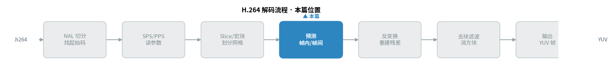
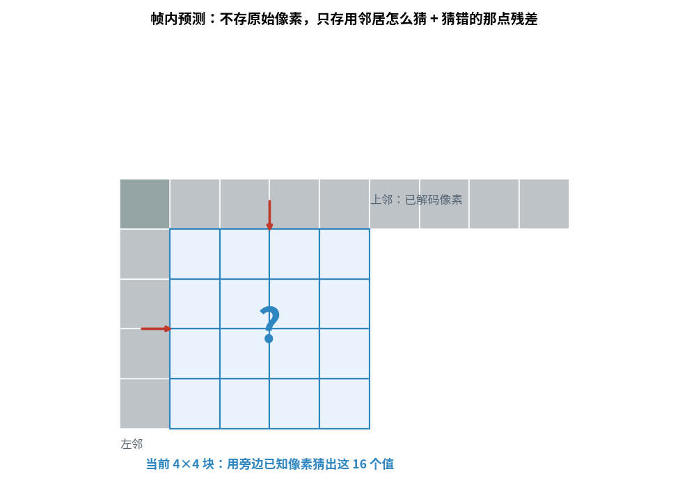
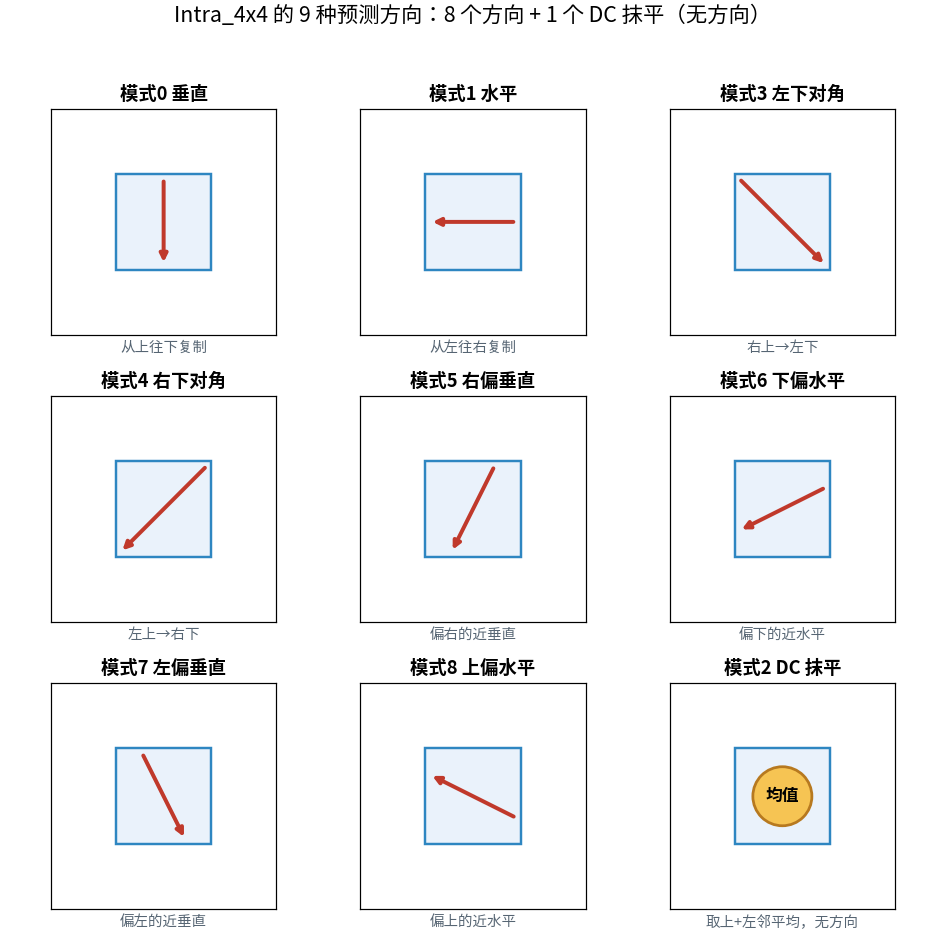
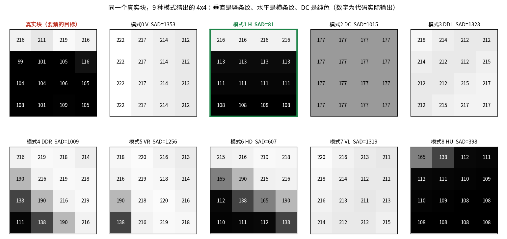
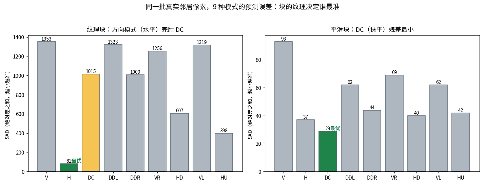
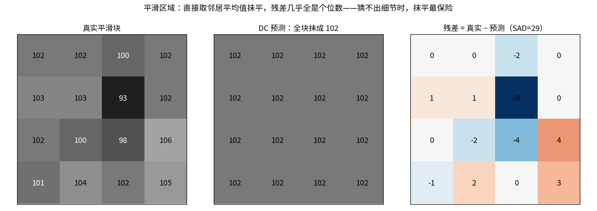

> 作者：Jone
> 日期：2026-09-12
> 风格：深度分析
> 状态：待发布

# 手搓 H.264 解码器 #04：9 种帧内预测模式，猜不出细节就抹平

先抛一个反直觉的结论：H.264 里 9 种帧内预测模式，最"土"的那个用得最多。

它叫 DC 模式，做法简单到不像个算法——把当前块上边和左边的邻居像素取个平均，然后整块填成这一个值。没有方向，没有纹理，就是一块纯色。

可偏偏是它，在真实图像里被挑中的次数最多。为什么？这一篇就从这个问题讲起。

上一篇我们把一帧切成了 16×16 的宏块网格，还读出了第一个宏块的类型：`mb_type=0`，也就是 I_4x4。这意味着这个宏块要被拆成 16 个 4×4 的子块，每个子块各自做一次帧内预测(Intra Prediction，用同一帧内已知像素猜出未知像素)。这一篇，我们就亲手实现这个"猜"的过程。

先看它在整个解码流程里的位置。



## 帧内预测到底在猜什么

解码是有顺序的。宏块按光栅扫描一个个来，块内的 4×4 子块也有固定顺序。轮到某个 4×4 块时，它上边那一行、左边那一列的像素，都已经解码好、重建出来了。

帧内预测干的事，就是拿这些已知的邻居像素，猜出当前这 4×4 = 16 个还没解码的像素。



为什么能猜？因为它吃的是"空间冗余"——同一帧图像里，挨着的像素往往长得很像。一片天空、一面墙、一块皮肤，相邻像素的值都差不多。既然旁边的像素已知，拿它们外推当前块，八九不离十。

这里要说清楚一件关键的事：解码器最终并不是靠预测块还原画面。预测只是第一步。编码器早就算过"预测块和真实块的差"，这个差叫残差(residual)，被压缩后一起塞进了码流。解码时，我们先用同样的方法猜出预测块，再把残差加回去，才得到最终像素。

所以预测的意义不在于"猜得完全对"，而在于"猜得够近"。猜得越近，残差越小，需要编码的数据就越少。预测这一步不产生画面，它只负责把"要编码的信息量"压下去。

那残差本身怎么变换、怎么量化？那是下一篇的事。这一篇只聚焦一件事：怎么把预测块猜出来。

## 8 个方向 + 1 个抹平：9 种模式各管一种纹理

H.264 给 4×4 块准备了 9 种预测模式(规范 8.3.1.2)。8 种是有方向的，1 种是没方向的 DC。



方向模式的思路都一样：假设当前块的纹理是沿某个方向延伸的，就把邻居像素顺着那个方向"拉"进块里。

- 模式 0 垂直(Vertical)：假设纹理是竖的，把上邻那一行像素，一列列往下复制。
- 模式 1 水平(Horizontal)：假设纹理是横的，把左邻那一列像素，一行行往右复制。
- 模式 3 到模式 8：各种斜向。左下对角、右下对角、偏左偏右的近垂直、偏上偏下的近水平，覆盖不同角度的斜纹理。

而模式 2 DC(直流，这里指取平均的模式)不假设任何方向。它把上邻 4 个 + 左邻 4 个像素加起来求平均，整块填成这一个值。规范里的公式长这样(8-47)：

```cpp
// intra_predict.cpp：DC 模式，上邻左邻都可用时取 8 个像素均值
int s = 0;
for (int i = 0; i < 4; ++i) s += p(i, -1) + p(-1, i);
val = (s + 4) >> 3;   // +4 是四舍五入，>>3 相当于除以 8
```

`p(i, -1)` 是上邻第 i 个像素，`p(-1, i)` 是左邻第 i 个像素。加 4 再右移 3 位，就是"8 个数求平均并四舍五入"。整块每个像素都填 `val`。

一个块该用哪种模式，不是解码器猜的，是编码器早就决定好、写在码流里的。编码器会把 9 种都试一遍，挑残差最小的那个，把模式编号存进去。解码器只管照着编号执行对应公式。

所以真正有意思的问题是：编码器凭什么挑？下一节用真实数据看。
## 同一个块，9 种模式猜出 9 个样子

光看公式没感觉。我写了个 demo，从一张真实照片里抠出一个 4×4 块，连同它的上邻、左邻像素，把 9 种模式全跑一遍，看看各自猜成什么样。

这个块取自照片里一处有横向纹理的位置：上面一行偏亮(216 左右)，下面几行偏暗(100 左右)，是一条清晰的横向边缘。



一眼就能看出每种模式的"性格"：

- 垂直模式(V)：清一色的竖条纹。它把上邻那一行(222, 217, 214, 212)往下复制了 4 遍，结果整块都是这一行的样子，跟真实块的横向边缘完全对不上。
- 水平模式(H)：横条纹。它把左邻那一列(216, 113, 111, 108)往右复制，第一行亮、下面暗，正好贴合真实块的横向边缘。
- DC 模式：一整块纯灰(177)。它把亮的暗的全平均了，结果既不亮也不暗，哪一行都不像。

这就是模式的可视化——每种模式把邻居像素按自己假设的方向铺满整块。块的真实纹理是横的，那水平模式自然贴得最准。

怎么量化"贴得准不准"？用 SAD(绝对差之和，Sum of Absolute Differences)：预测块和真实块逐像素求差的绝对值，再全部加起来。SAD 越小，说明预测越贴近真实，残差越小。

```cpp
// intra_predict.cpp：SAD = 逐像素 |预测 - 真实| 累加
int sad = 0;
for (int y = 0; y < 4; ++y)
    for (int x = 0; x < 4; ++x)
        sad += std::abs(pred[y][x] - orig[y][x]);
```

## 揭示性时刻：谁最准，取决于块长什么样

把这个纹理块 9 种模式的 SAD 都算出来，再拿另一个平滑块做对照，差别一下就出来了。



先看左边的纹理块。水平模式 SAD 只有 81，是 9 种里最小的。而 DC 模式高达 1015，差了 12 倍还多。垂直模式更惨，1353。

道理不复杂：这个块有明确的横向边缘，水平模式顺着这个方向铺，几乎完美复刻。DC 一平均，把边缘信息全抹没了，自然差得远。

方向性强的块，就该用对应方向的模式。这时候 DC 是最差的选择之一。

可再看右边那个平滑块，结论完全反过来了。

这个块取自照片里一处平缓区域，16 个像素都在 100 上下晃，没有明显的边缘和方向。这时候：

- DC 模式 SAD = 29，9 种里最小。
- 水平 37，下偏水平 40，上偏水平 42，各方向模式反而都比 DC 差一点。

为什么？因为块本身没方向。你非要顺着某个方向去铺，反而会把邻居里那点微小的起伏也铺进来，引入多余误差。而 DC 直接取个平均、抹成一片，恰好最接近这个"到处都差不多"的块。

看得更细一点，DC 在平滑块上到底贴得多好。



真实块的像素在 93 到 106 之间，DC 把它们全抹成了 102。右边的残差矩阵里，绝大多数是个位数：0、1、-2、4……只有一个 -9 稍微大点。这么小的残差，压缩起来几乎不费比特。

这就是这篇最想讲清楚的一句话：猜不出细节时，抹平是最保险的选择。

而关键在于——自然图像里，这种平滑区域占了大多数。天空、墙面、皮肤、虚化的背景，大片大片都是缓变的。真正有强烈方向性纹理的地方(头发丝、栅栏、文字边缘)反而是少数。

所以当编码器把海量的块跑一遍模式选择，最终被挑中次数最多的，往往就是这个最"土"的 DC。不是因为它聪明，而是因为它匹配的场景最普遍。方向模式很精巧，但它们各自只擅长一种角度的纹理，加起来的出场次数，也拼不过一个"哪里平就抹哪里"的 DC。
## 方向模式的公式：把邻居顺着角度插值

垂直和水平模式简单到只是复制。斜向模式要复杂些，因为块内像素落不到整数的邻居位置上，得对相邻几个邻居做加权平均(插值)。

拿右下对角(Diagonal_Down_Right)模式举例，它假设纹理沿左上到右下的方向延伸。规范 8.3.1.2.5 把块内每个位置分了三种情况：

```cpp
// intra_predict.cpp：右下对角模式，x/y 的大小关系决定用哪条公式
if (x > y)   // 偏右上，取上邻做三抽头插值
    pred[y][x] = (p(x-y-2, -1) + 2*p(x-y-1, -1) + p(x-y, -1) + 2) >> 2;
else if (x < y)  // 偏左下，取左邻插值
    pred[y][x] = (p(-1, y-x-2) + 2*p(-1, y-x-1) + p(-1, y-x) + 2) >> 2;
else  // 对角线上，跨到左上角像素
    pred[y][x] = (p(0, -1) + 2*p(-1, -1) + p(-1, 0) + 2) >> 2;
```

这里的 `(a + 2*b + c + 2) >> 2` 是一个三抽头滤波：中间的邻居权重 2，两边权重 1，加 2 是四舍五入，右移 2 位是除以 4。这样插出来的斜线比生硬复制更平滑。

8 个方向模式各有各的公式和分支，但骨架都是这套"按位置选邻居、做加权平均"。我把 9 种模式全按规范 8.3.1.2.1 到 8.3.1.2.9 逐条实现，并写了单元测试逐个核对：垂直模式每列等于上邻、水平模式每行等于左邻、DC 上下邻全 100 时结果正好是 100。测试全部通过。

## 大块也能一次猜完：Intra_16x16 的 4 种模式

除了把 16×16 拆成 16 个 4×4 子块，H.264 还允许整个 16×16 宏块用一种模式一次猜完，这叫 Intra_16x16(规范 8.3.2)。它只有 4 种模式：垂直、水平、DC，外加一个 4×4 没有的平面模式(Plane)。

平面模式很特别。它不是复制，也不是取平均，而是拿上邻和左邻像素拟合出一个倾斜的平面，让预测值沿水平和垂直方向都线性渐变。规范 8.3.2.4 用两个斜率参数 b、c 来控制：

```cpp
// intra_predict.cpp：Plane 模式，b/c 是水平/垂直方向的斜率
int a = 16 * (p(-1, 15) + p(15, -1));   // 中心亮度
int b = (5 * H + 32) >> 6;              // 水平斜率
int c = (5 * V + 32) >> 6;              // 垂直斜率
pred[y][x] = Clip1((a + b*(x-7) + c*(y-7) + 16) >> 5);
```

这套模式专治大面积的缓变渐变——比如一整片从亮到暗过渡的天空。DC 只能抹成一个值，平面模式却能顺着渐变的趋势外推，对这类区域预测得更准。为什么大块要单独准备一个"渐变"模式而小块不用？因为 16×16 覆盖的面积大，跨越渐变的可能性更高，值得多花一种模式去贴合。

Intra_16x16 的 4 种模式我也照规范实现并测过：垂直每列复制上邻、DC 取 32 个邻居均值、平面模式在渐变输入下确实产生线性变化的预测块。

## 小结

这一篇，我们给上一篇切好的宏块网格填上了第一步内容：帧内预测。

核心就一件事——用当前块上边和左边已经解码好的邻居像素，猜出这个块的内容。9 种 4×4 模式，8 个管方向、1 个 DC 管抹平；Intra_16x16 再补一个平面模式管大面积渐变。每种模式的公式我都照 ITU-T H.264 规范 8.3 逐条实现，并用真实照片的像素块验证了 SAD。

最值得记住的是那个反直觉的事实：最"土"的 DC 模式反而最常用。不是它算得聪明，而是自然图像里平滑区域占大多数，猜不出细节时，把邻居一平均、整块抹平，往往就是残差最小的选择。方向模式精巧，但每种只擅长一个角度；DC 笨，却匹配了最普遍的场景。

不过预测再准，也只是"猜得近"，猜出来的块和真实块之间总会有差。上面那些残差矩阵里的数字，就是这个差。这个差不能丢，得编码进码流，解码时加回来才能还原画面。

那残差怎么压？下一篇我们讲 H.264 的 4×4 整数变换。有意思的是，H.264 没有沿用 JPEG 那套标准的离散余弦变换(DCT)，而是自己发明了一套整数变换。为什么放着成熟的 DCT 不用，非要另起炉灶？下一篇见分晓。

---

本文所有预测块、SAD 数值，均来自本机可复现的真实运行：C++ 帧内预测代码对照片像素块跑 9 种模式的实际输出，代码在 [codec-from-scratch/h264/decoder](https://github.com/Joneyao/codec-from-scratch/tree/main/h264/decoder)。

[ITU-T H.264 官方标准文本（帧内预测见 8.3 节）](https://www.itu.int/rec/T-REC-H.264)
[H.264/AVC 标准介绍（维基百科）](https://en.wikipedia.org/wiki/Advanced_Video_Coding)
[Intra Prediction 帧内预测原理详解（VideoLAN x264 文档）](https://www.videolan.org/developers/x264.html)
[H.264 帧内预测 9 种模式图解（cnblogs 中文技术博客）](https://www.cnblogs.com/TaigaCon/p/6416039.html)
[H.264 Intra Prediction 模式与残差编码（CSDN 中文技术博客）](https://blog.csdn.net/leixiaohua1020/article/details/45870269)
