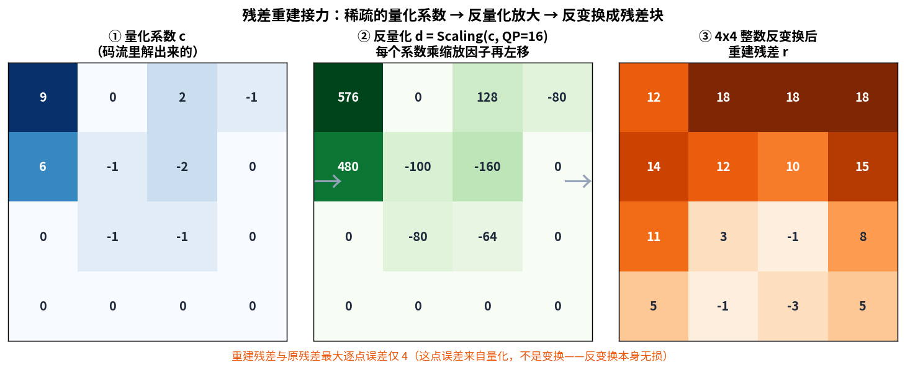
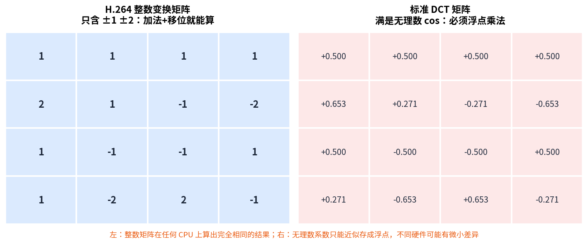
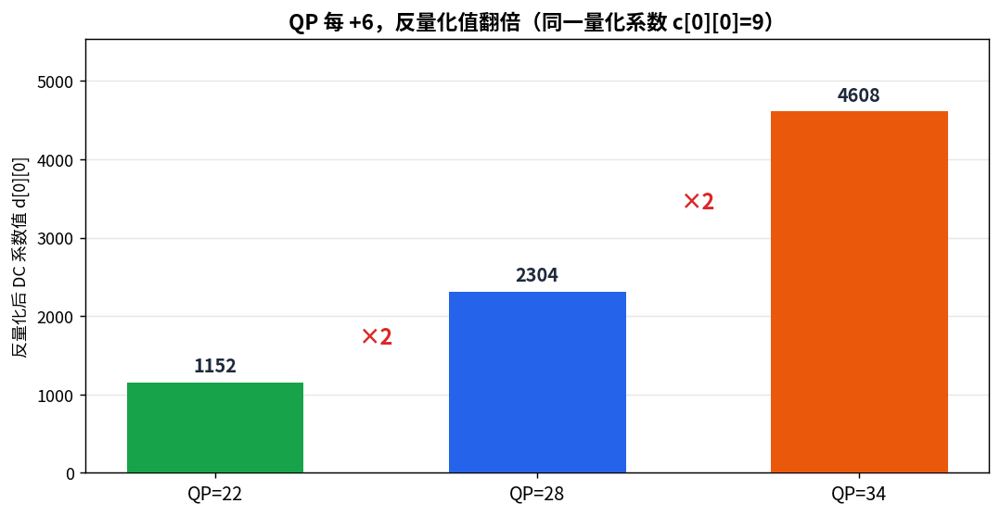
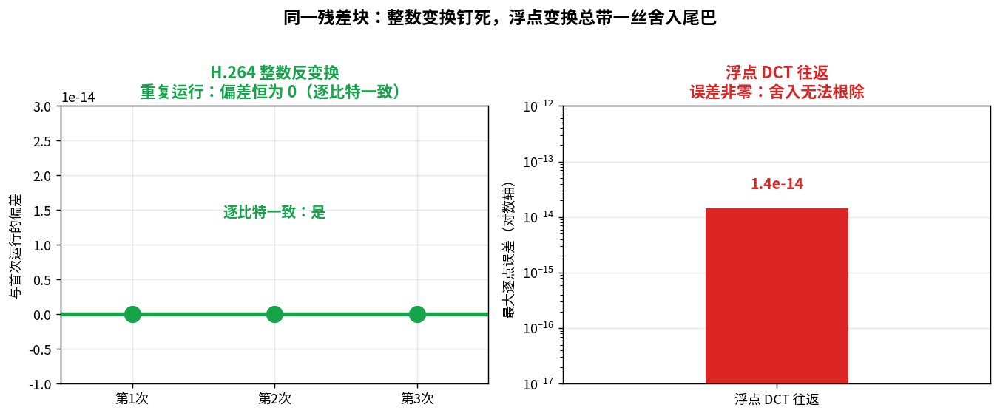
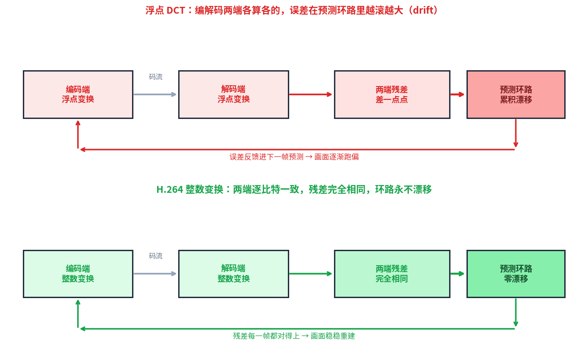

> 作者：Jone
> 日期：2026-09-12
> 风格：深度分析
> 状态：待发布

# 手搓 H.264 解码器 #05：H.264 为什么不用标准 DCT，自己发明整数变换

先说一个大多数人没意识到的事实：浮点 DCT（离散余弦变换，Discrete Cosine Transform）在不同 CPU、不同编译器、不同优化级别上，算出来的结果**不完全一样**。

差多少？可能就是小数点后第 15 位的一丝抖动。

放在 JPEG 里，这点抖动无所谓——一张图独立解码，差一点点肉眼根本看不出来。可放进 H.264 就要命了。H.264 是带预测环路的：后一帧靠前一帧推出来，解码端和编码端必须对同一个残差（residual，预测块与真实块之差）算出**完全一样**的值。只要两端差一丁点，误差就会顺着预测链一帧帧累积、放大，画面越跑越偏。这个现象有个专门的名字，叫漂移（drift，逐帧累积的偏差）。

H.264 的解法很硬核：干脆不用浮点。它自己设计了一套整数变换，全程只用整数加法和移位，一次浮点乘法都没有。牺牲一点点压缩率，换来"编解码两端逐比特一致"的确定性。这一篇，我们就来手搓这套整数变换和它的反量化。

先看这一篇在整条解码流水线里的位置：


## 上一篇留下的残差，这一篇来收拾

接着上一篇说。上一篇我们用帧内预测，拿当前块上边和左边已解码的邻居像素，猜出了这个块的内容。但猜得再准也只是"接近"，猜出来的预测块和真实块之间总有差——这个差就是残差。

残差不能丢，得想办法编进码流，解码时加回预测块才能还原画面。

问题是残差怎么压。直接存原始残差太占空间。编码端的做法是：先对残差做变换（把空间上的像素差变成频率系数，能量往少数几个低频系数集中），再量化（QP 控制精度，砍掉不重要的高频）。进码流的，是量化后一堆稀疏的系数。

那解码端就得反着走：把量化系数反量化（scaling，恢复出变换系数），再做反变换（inverse transform），重建出残差块。这一篇干的就是这两步。

先看真实数据里这条路长什么样：



这是我用真实残差块跑出来的。左边是量化系数，稀稀拉拉几个非零数——一个大的 9 在左上角（低频），其余大多是 0 或 ±1。中间乘上缩放因子、左移放大，变成 576、480 那一堆。右边反变换之后，变回一个和原残差几乎一样的块。最大逐点误差只有 4，而这点误差全部来自量化那一步，反变换本身是无损的。

## 整数变换，说白了就是"把 DCT 的无理数系数凑成整数"

DCT 前面 JPEG 系列讲透了，这里不重复。只需要记住一点：标准 DCT 的变换矩阵里全是 cos 值，是一堆无理数。计算机存不下无理数，只能用浮点近似——而浮点近似，就是漂移的源头。

H.264 的思路很直接：既然无理数惹麻烦，那就用整数去逼近它。

把标准 DCT 矩阵里的无理数系数，按比例缩放、四舍五入，凑成一组小整数。凑出来的矩阵不再是精确的 DCT，但足够接近，压缩效果差不了多少。关键是——它现在全是整数了。



左右一对比就明白了。左边是 H.264 的变换矩阵，翻来覆去就是 ±1、±2 这几个数。乘以 2？左移一位就行。整个变换用加减和移位就能算完。右边是标准 DCT 矩阵，`0.653`、`0.271` 这种无理数，只能老老实实做浮点乘法。

这就是"整数变换"这个名字的由来。它不神秘，就是 DCT 的一个整数近似版，代价是精度略降，收益是全程整数运算。

## 反变换的核心：两趟一维蝶形运算

反变换怎么实现？规范（ITU-T H.264 8.5.8）把它拆成了两趟一维变换：先把每一行做一遍一维反变换，再把每一列做同样的一遍。

每一趟一维变换的核心是"蝶形运算"（butterfly）——先把几个数两两加减凑出中间量，再把中间量加减凑出结果。听着抽象，看代码最清楚：

```cpp
// transform_quant.cpp —— 行方向一维反变换（spec 式 8-266..8-273）
const int e0 = d[i][0] + d[i][2];         // 8-266
const int e1 = d[i][0] - d[i][2];         // 8-267
const int e2 = (d[i][1] >> 1) - d[i][3];  // 8-268
const int e3 = d[i][1] + (d[i][3] >> 1);  // 8-269
f[i][0] = e0 + e3;                        // 8-270
f[i][1] = e1 + e2;                        // 8-271
f[i][2] = e1 - e2;                        // 8-272
f[i][3] = e0 - e3;                        // 8-273
```

注意那个 `>> 1`——右移一位就是除以 2，对应矩阵里的 `1/2` 系数。全是加减和移位，没有一次乘法，更没有浮点。列方向的变换和这段一模一样，只是把下标从行换成列。

两趟做完，最后统一归一化一下：

```cpp
// transform_quant.cpp —— 归一化（spec 式 8-282）
r[i][j] = (h[i][j] + 32) >> 6;  // +32 是四舍五入，>>6 相当于 /64
```

加 32 再右移 6 位，等价于除以 64 并四舍五入。整个反变换到此结束，输出就是重建好的残差块。

## 反量化：QP 每加 6，缩放翻一倍

反变换之前还有一步——反量化。它把码流里稀疏的量化系数放大回变换系数的量级。

规范里的公式（8.5.8 式 8-265）是这样：每个系数乘一个缩放因子 `LevelScale`，再按 QP 左移。

```cpp
// transform_quant.cpp —— 反量化 Scaling（spec 式 8-265）
d[i][j] = (c[i][j] * LevelScale(m, i, j)) << shift;
// m = qP % 6，shift = qP / 6
```

这里藏着 H.264 一个精巧的设计。QP（量化参数，Quantization Parameter）取值 0 到 51，但缩放因子表只存了 6 行——对应 `QP % 6` 的 6 种余数。剩下的 `QP / 6` 部分，直接用左移处理。

为什么能这么省？因为 H.264 特意让量化步长按 QP 呈指数增长：**QP 每增加 6，量化步长正好翻一倍**。翻倍在二进制里就是左移一位。所以只要存好一个周期（6 个 QP）的缩放因子，其余全靠移位推出来。

这个规律用真实数据一测就现形：



同一个量化系数，QP=22 反量化出 1152，QP=28 出 2304，QP=34 出 4608。22 到 28 差 6，值翻倍；28 到 34 又差 6，又翻倍。干净利落的 2 倍关系。这解释了一个实用现象：调 H.264 码率时，QP 加 6 大致等于把量化粗糙度翻一倍，码率也随之明显下降。

## 怎么证明它真的"钉死"了

写到这，最该验证的就是那句核心承诺——整数变换到底是不是逐比特确定的。

我用两条路对照：同一个残差块，一边走 H.264 整数变换，一边走浮点 DCT，各自往返一圈，看结果。



左边整数路径，反变换重复跑三次，偏差恒为 0，逐比特一致。右边浮点路径，往返一圈后最大误差是 `1.4e-14`——一个极小但**不为零**的数。这个非零的尾巴就是浮点舍入的痕迹，它无法根除。

`1.4e-14` 在单张图里可以忽略，但在 H.264 的预测环路里不行。它会被一帧帧地喂进下一帧的预测，累积、放大，最终变成肉眼可见的漂移。这也是我这篇开头说的那个揭示性时刻——为什么 H.264 宁可牺牲一点压缩率，也要把变换钉死成整数。



上下一对比就懂了。浮点方案里，编码端和解码端各算各的，残差差一点点，这点差反馈进预测环路，越滚越大，画面逐渐跑偏。整数方案里，两端算出完全相同的残差，环路里零漂移，画面稳稳重建。

这条确定性，我也写进了测试（`test_transform.cpp`）：反变换的确定性、DC-only 输入产出常量块、反量化 QP+6 翻倍、`LevelScale` 取值，全部照规范核对。全部通过。

## 小结

这一篇，解码器把上一篇留下的残差收拾干净了：量化系数经反量化放大、再经 4x4 整数反变换，重建出残差块，加回预测块就是画面。

最值得记住的是那个工程取舍。H.264 放着成熟的浮点 DCT 不用，自己发明整数变换，不是为了算得更快或压得更狠，而是为了**确定性**。浮点 DCT 在不同硬件上有微小漂移，编解码两端只要差一丝，误差就会在预测环路里累积成可见的画面偏移。整数变换用纯加法和移位把结果钉死成逐比特一致，两端永远算出相同的残差。牺牲一点点压缩率，换来这条确定性——这是 H.264 里极其重要的一个决定。

不过这一篇有个前提我一直没交代：那些稀疏的量化系数，是怎么从码流里解出来的？它们在比特流里可不是一个个整整齐齐排好的数字。

下一篇我们讲 CAVLC（上下文自适应变长编码，Context-Adaptive Variable-Length Coding）——H.264 baseline profile 用的熵解码方案，也是后来更强的 CABAC 的前身。它怎么用"上下文自适应"把残差系数压得更紧、又怎么从比特流里一位一位解回来，下一篇见分晓。

---

本文所有变换矩阵、反量化数值、整数确定性证据，均来自本机可复现的真实运行：C++ 整数变换代码对真实残差块跑出的实际输出，代码在 [codec-from-scratch/h264/decoder](https://github.com/Joneyao/codec-from-scratch/tree/main/h264/decoder)。

[ITU-T H.264 官方标准文本（残差 4x4 变换与反量化见 8.5.8 节）](https://www.itu.int/rec/T-REC-H.264)
[H.264/AVC 标准介绍（维基百科）](https://en.wikipedia.org/wiki/Advanced_Video_Coding)
[H.264 整数变换与量化原理详解（雷霄骅 CSDN 技术博客）](https://blog.csdn.net/leixiaohua1020/article/details/28114037)
[H.264 4x4 整数 DCT 变换与反变换推导（cnblogs 中文技术博客）](https://www.cnblogs.com/TaigaCon/p/6402580.html)
[Malvar 等：H.264/AVC 中的低复杂度变换与量化（原始论文）](https://ieeexplore.ieee.org/document/1218370)
