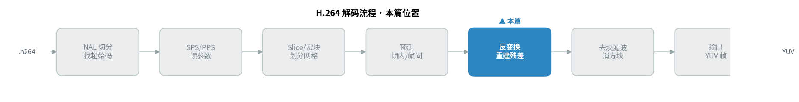
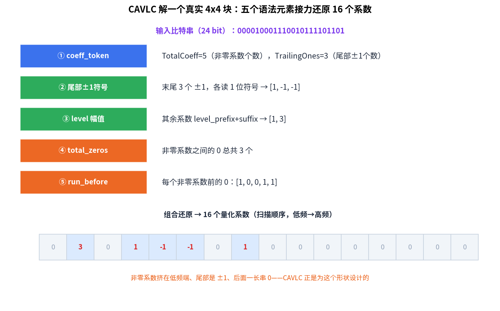
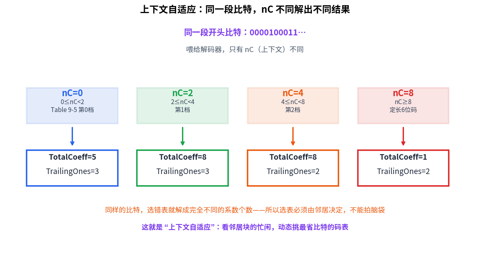
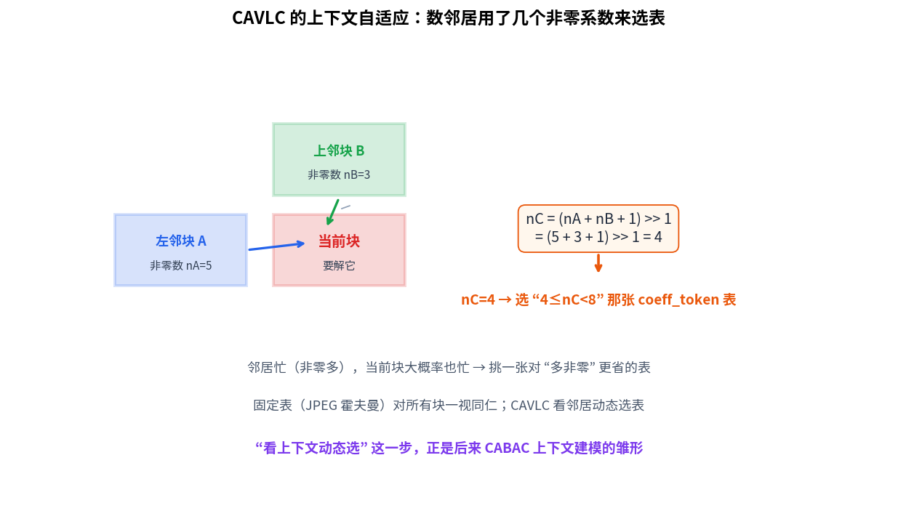
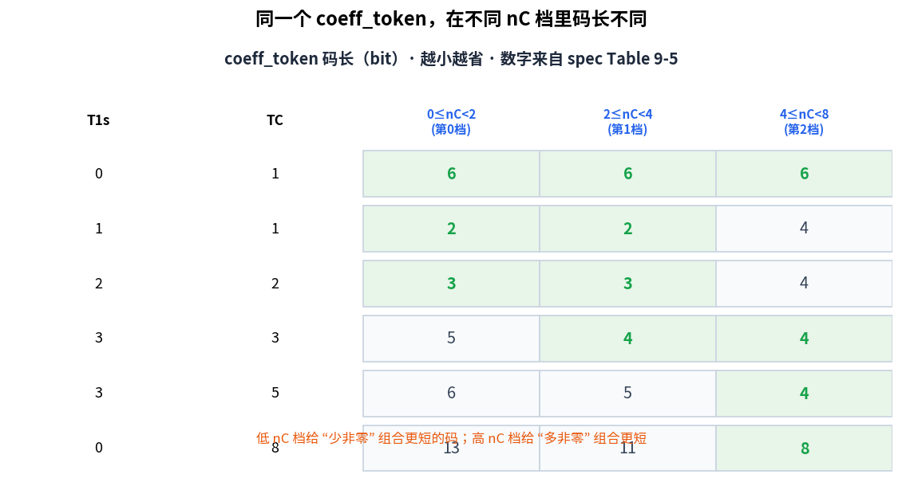
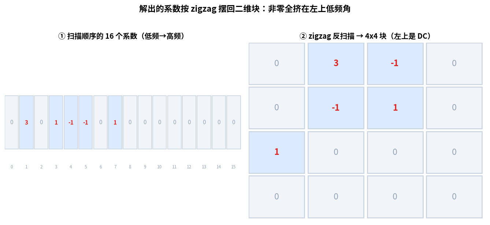

> 作者：Jone
> 日期：2026-09-12
> 风格：深度分析
> 状态：待发布

# 手搓 H.264 解码器 #06：CAVLC 怎么用几个比特说完一堆零

先抛一个大多数人不会注意的细节：H.264 解一个 4x4 块的残差系数时，它会先偷看一眼**左边和上面两个邻居块**，数一数它们各用了几个非零系数，然后才决定用哪张码表来解自己。

这一步很反直觉。解当前块，为什么要看邻居？

因为图像有个规律：一块地方忙（细节多、非零系数多），它旁边大概率也忙；一块地方平（比如一面白墙），周围通常也平。CAVLC（基于上下文的自适应变长编码，Context-Adaptive Variable-Length Coding）抓住了这个规律——邻居忙，就挑一张对"多非零系数"更省比特的表；邻居平，就挑一张对"少非零"更省的表。

这个"看上下文动态选表"的动作，就是名字里"上下文自适应"的由来。它也是后来 CABAC（基于上下文的自适应二进制算术编码，Context-Adaptive Binary Arithmetic Coding）上下文建模的雏形。JPEG 的霍夫曼用一张固定表对付所有块，CAVLC 往前迈了一步——表不再是死的。

先看这一篇在整条解码流水线里的位置：



## 上一篇要的量化系数，这一篇负责从码流里解出来

接着上一篇说。上一篇做反量化和反变换，输入是一堆"量化系数"，我们当时是直接拿现成的系数来跑的。可这些系数本身是从哪来的？就是这一篇的活儿：从压缩后的比特流里，把它们解出来。

顺序是这样的：码流比特 →（CAVLC 解出量化系数）→ 反量化 → 反变换 → 残差。这一篇站在最左边那一环，把一串看不出结构的比特，还原成 16 个整整齐齐的量化系数。

那为什么不直接把 16 个系数逐个写进码流，非要搞一套复杂的编码？因为变换量化之后，一个 4x4 块的系数有很强的统计规律，白白按原样存太浪费。

这个规律有三条，都来自变换量化的本性：

第一，非零系数很少。量化把高频砍得差不多了，一个块常常只剩两三个非零数，其余全是 0。

第二，非零系数挤在左上角（低频端）。能量集中，越往右下（高频）越接近 0。

第三，把系数按扫描顺序拉成一条线后，末尾那几个非零系数常常就是 ±1，前面还拖着一长串 0。

CAVLC 就是为这个形状量身定做的。它不逐个记系数，而是拆成五个语法元素，各自用变长码去编，把"稀疏、尾部多 ±1、多 0"这三点榨到极致（spec 9.2）。

## 五个语法元素，各管一件事

解一个块，CAVLC 按顺序解五样东西。我用一个真实的块跑了一遍，先看全貌：



这个块的数据不是我编的，是 H.264 教科书里的标准样例（Iain Richardson《H.264 and MPEG-4 Video Compression》里的 CAVLC 示例）。目标是把 24 个比特还原成 16 个系数。五个语法元素分别是：

**coeff_token**：一次同时给出两个数——TotalCoeff（非零系数总个数）和 TrailingOnes（尾部 ±1 的个数，最多 3 个）。这里解出 TotalCoeff=5、TrailingOnes=3。选哪张表来解它，由邻居决定，后面细说。

**尾部 ±1 的符号**：既然知道末尾有 3 个 ±1，那每个只差一个正负号，读 1 位就够。0 是正、1 是负。

**level**：其余非零系数的幅值。用 level_prefix 加 level_suffix 编，而且前缀长度会随着已经解出的幅值自适应变大——前面的系数越大，后面越可能也大，就多给几位。

**total_zeros**：所有非零系数之前、之间的 0 一共多少个。这里是 3。

**run_before**：把那 3 个 0 分配到各个非零系数"前面"。哪个非零系数前面塞几个 0，一个个记清楚。

五步接力下来，16 个系数的位置和数值就全定了。解出来的结果是 `[0, 3, 0, 1, -1, -1, 0, 1, 0, ...]`，和目标逐个一致。

## coeff_token 靠什么选表：数邻居的非零系数

现在回到开头那个问题——解 coeff_token，为什么要看邻居？

关键在于 coeff_token 是变长码。同样的开头几个比特，用不同的表去解，会解出完全不同的 TotalCoeff 和 TrailingOnes。表选错了，从第一步就全错。

我把同一段比特喂进解码器，只改一个东西——上下文 nC（邻居非零系数推出的值），看它解出什么：



同样的比特，nC=0 时解出 TotalCoeff=5，nC=8 时解出 TotalCoeff=1。天差地别。这说明选表这件事没有半点含糊余地，必须有一个确定的规则，而不是随便挑。

这个规则就是数邻居。nC 由左邻块和上邻块的非零系数个数算出来（spec 9.2.1 式 9-4）：两个邻居都在，nC 取它们非零数的平均（`(nA + nB + 1) >> 1`）；只有一个可用，就取那一个；都不可用（块在画面角落），nC 记 0。

nC 落在不同区间，选不同的表：0 到 2 一张、2 到 4 一张、4 到 8 一张，8 以上干脆用定长的 6 位码。分档的道理很简单——nC 大说明邻居非零多，当前块大概率也多，就选一张给"多非零"更短码字的表。

这就是上下文自适应的全部秘密：



左邻块用了 5 个非零系数，上邻块用了 3 个，算出 nC=4，于是当前块选"4 到 8"那一档的表。整个过程不需要额外传任何信息——邻居的非零数解码端自己就有，是天然共享的上下文。

## 同一个码字，在不同表里码长不一样

为什么分档能省比特？看一眼 coeff_token 码表的片段就明白了：



表里的数字是各个 (TrailingOnes, TotalCoeff) 组合在三个 nC 档下的码字长度（比特数），全部来自标准的 Table 9-5。

看规律：在低 nC 档（邻居平，非零少），"1 个非零系数"这类组合只要 2 位；可到了高 nC 档，同样的组合要 4 位。反过来，"8 个非零系数"这种，低档要 13 位，高档只要 8 位。

说白了，每张表都把最短的码留给"这个上下文里最可能出现的情况"。邻居平的时候赌你也没几个非零，邻居忙的时候赌你也忙。赌对了，就省比特。这正是熵编码的核心思想——常见的给短码，稀有的给长码——CAVLC 只是把"常见"这件事做成了随上下文变化的。

## 把系数摆回二维块

五个语法元素解完，得到的是一条 16 个数的扫描顺序序列。可残差是个二维的 4x4 块，还得把这条线按 zigzag 反扫描摆回去：



左边是扫描顺序的一维序列，右边是摆回二维后的样子。zigzag 的走位从左上角出发，沿对角线来回折——目的就是让低频（左上）先出、高频（右下）后出。摆完你会发现，所有非零系数都挤在左上那一小块，右下角全是 0。这正好印证了前面说的"能量集中在低频"。

## 解码的核心循环

把五个语法元素串起来的，就是残差解码的主循环。这是仓库里的真实代码（`h264/decoder/cavlc_decode.cpp`，对应 spec 9.2）：

```cpp
// 1) coeff_token：一次拿到 TotalCoeff 与 TrailingOnes。
r.token = DecodeCoeffToken(br, nc);
const int total_coeff = r.token.total_coeff;
const int t1s = r.token.trailing_ones;
if (total_coeff == 0) return r;  // 整块全 0

// 2) 解各非零系数的 level（从高频往低频）。
for (int i = 0; i < total_coeff; ++i) {
    if (i < t1s) {                       // 尾部 ±1：读 1 位符号
        int sign = static_cast<int>(br.ReadBit());
        r.levels[i] = sign ? -1 : 1;
        continue;
    }
    int level_prefix = ReadLevelPrefix(br);   // 其余：前缀+后缀
    // ……合成带符号 level，并按幅值自适应增大后缀位数
}

// 3) total_zeros；4) run_before 把 0 分配到各处；5) 组合还原 16 个系数
```

选表那一步很短，但它是整篇的题眼（同文件 `DecodeCoeffToken`）：

```cpp
CoeffToken DecodeCoeffToken(RbspBitReader& br, int nc) {
    if (nc >= 8) return DecodeCoeffTokenFixed(br);       // 定长 6 位
    if (nc >= 4) return MatchCoeffToken(br, kCoeffToken2);
    if (nc >= 2) return MatchCoeffToken(br, kCoeffToken1);
    return MatchCoeffToken(br, kCoeffToken0);            // 0 ≤ nC < 2
}
```

一个 nc 参数，决定走哪张表。nc 从哪来？由 `DeriveNc` 数邻居算出，对应 spec 式 9-4：

```cpp
int DeriveNc(int nnz_left, bool available_a, int nnz_top, bool available_b) {
    if (available_a && available_b) return (nnz_left + nnz_top + 1) >> 1;
    if (available_a) return nnz_left;
    if (available_b) return nnz_top;
    return 0;
}
```

配套的测试把标准样例、各档选表、nC 推导、整块还原都验了一遍，六个测试全过，编译无警告。所有配图数字，都是这套代码真实跑出来的，不是手写的。

## 小结

这一篇，我们把一串 24 位的比特，还原成了 16 个量化系数——正好接上一篇反量化反变换要的输入。

值得记住的是 CAVLC 的那个巧思：它不孤立地看当前块，而是数一数左邻和上邻用了几个非零系数，用这个上下文动态选码表。邻居忙就赌你也忙，邻居平就赌你也平，赌对了就省比特。JPEG 的霍夫曼用一张固定表走天下，CAVLC 让表随上下文变——这一步之后，就是 CABAC 把"上下文建模"做到极致。

到这里，帧内预测、整数反变换、残差熵解码都凑齐了，一个 I 帧（完全靠自己、不依赖其它帧的关键帧）已经能完整解出来。

但视频里 I 帧是少数，大部分是 P 帧——它们不从零画起，而是"搬"上一帧的像素过来再改。下一篇就讲这件事：运动补偿。一个运动矢量怎么把上一帧的一块像素搬到当前位置，为什么还要做亚像素插值（在整数像素之间插出半个、四分之一个像素的位置）。这才是视频比图片省空间的真正原因。

[ITU-T H.264 官方标准（Advanced video coding，含第 9.2 节 CAVLC 与 Table 9-5..9-10）](https://www.itu.int/rec/T-REC-H.264)

[Advanced Video Coding — Wikipedia](https://en.wikipedia.org/wiki/Advanced_Video_Coding)

[H.264 熵编码与残差解析详解（雷霄骅博客）](https://blog.csdn.net/leixiaohua1020/article/details/45870269)

[H.264 CAVLC 残差语法与码表解析（TaigaCon）](https://www.cnblogs.com/TaigaCon/p/6416039.html)

[x264 开源实现（可对照 CAVLC 编码侧）](https://www.videolan.org/developers/x264.html)

