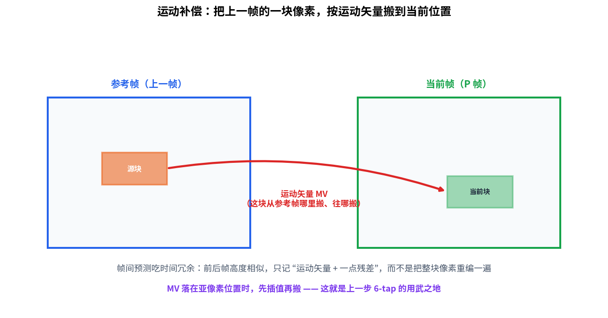
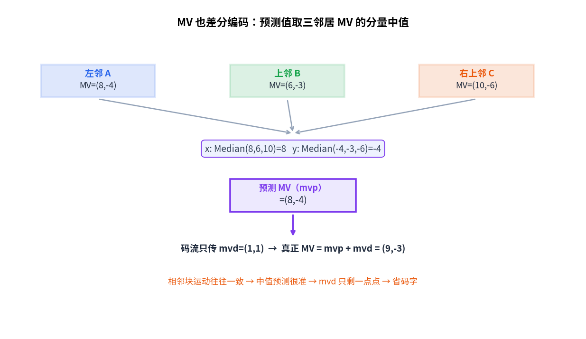
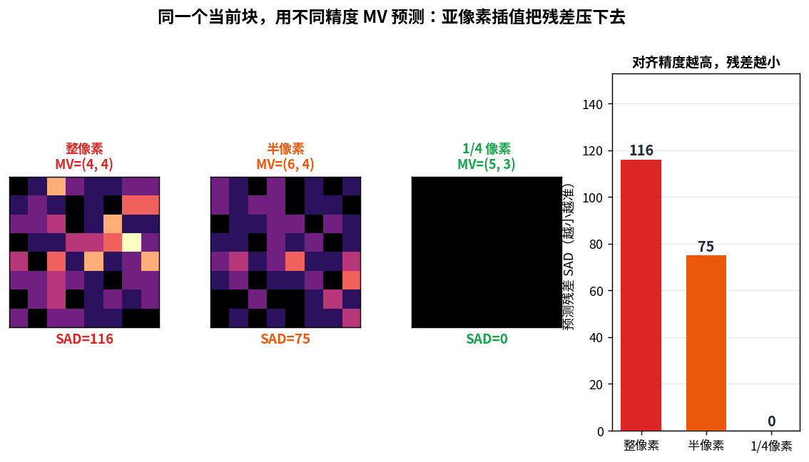
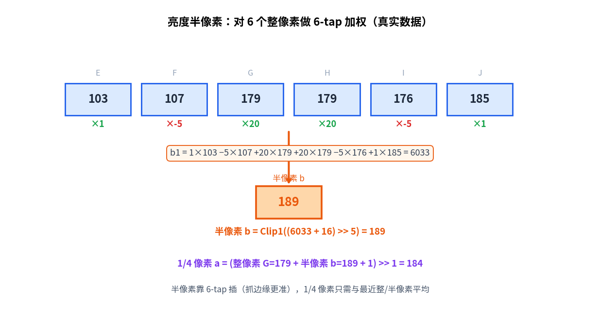
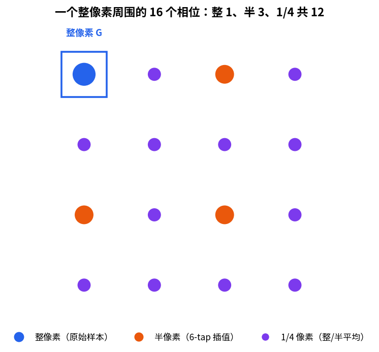

> 作者：Jone
> 日期：2026-09-12
> 风格：深度分析
> 状态：待发布

# 手搓 H.264 解码器 #07：一个运动矢量，怎么把上一帧的像素"偷"过来

先说结论：H.264 之所以比图片格式省得多，靠的不是把每一帧压得更狠，而是**根本不重新画大部分画面**。它指着上一帧说，我这块跟你那块几乎一样，把像素搬过来就行，我只补一点差异。

这个"搬"的动作，就是运动补偿（Motion Compensation）。搬多远、往哪搬，由一个运动矢量（MV，Motion Vector）说了算。

但这里藏着一个魔鬼细节：物体的移动从来不是整整齐齐挪一个像素。它可能挪了半个像素，或者四分之三个像素。如果 MV 只能对齐到整像素，预测就永远差那么一点，残差怎么都压不下去。H.264 的解法是——在整数像素之间，硬生生插出半个、四分之一个像素的位置。这一篇就讲这件事。

先看这一篇在整条解码流水线里的位置：


## 上一篇解完了 I 帧，这一篇进入 P 帧

上一篇把一个 I 帧（完全靠自己、不依赖别帧的关键帧）解完了：帧内预测猜出内容，CAVLC 解出残差，反变换重建像素。整个过程不看任何其它帧。

可视频里 I 帧是少数。大多数帧是 P 帧（前向预测帧，Predicted frame），它们不从零画起。

道理很简单。你拍一段视频，前后两帧之间往往只隔三十分之一秒。这么短的时间里，画面能变多少？无非是人动了动、镜头晃了晃。绝大部分像素，跟上一帧几乎一模一样。

既然一样，何必重编？

于是 P 帧换了个思路：当前这块像素，我不自己画，我去上一帧（叫它参考帧）里找一块最像的，把它搬过来当预测，再补上一点残差。这就是帧间预测，它吃的是"时间冗余"——相邻帧之间的高度相似。



搬这个动作，需要两个信息：从参考帧的哪个位置搬、搬到当前的哪个位置。这两点之间的方向和距离，就是运动矢量 MV。有了它，解码端就知道该去参考帧的哪里取那块像素。

## 运动矢量本身也要省：数邻居的中值

现在有个新问题。一帧画面切成成百上千个块，每个块都带一个 MV。这些 MV 直接写进码流，也是一笔不小的开销。

H.264 舍不得。它发现 MV 也有规律可循：**相邻的块，运动往往是一致的**。想想一个平移的镜头，或者一辆匀速开过的车——车身上相邻的块，MV 几乎完全相同。

既然相邻块 MV 相近，那就别每个都存完整值。存一个"预测值"加上"差分"就够了。这跟 MV 差分编码（mvd，运动矢量差，Motion Vector Difference）是一个套路。

预测值怎么算？H.264 用了一个很朴素的办法——取三个邻居的中值（spec 8.4.1.3.1）：



看这组真实数据。左邻块 A 的 MV=(8,-4)，上邻块 B=(6,-3)，右上邻块 C=(10,-6)。当前块的预测 MV，是三者的分量中值：x 取 Median(8,6,10)=8，y 取 Median(-4,-3,-6)=-4，合起来 mvp=(8,-4)。

为什么用中值，不用平均？因为中值抗异常。万一某个邻居块运动方向完全不同（比如画面里有个独立运动的物体），平均会被它带偏，中值却能稳稳落在多数派那边。

有了预测值，码流里就只需要传差分 mvd=(1,1)。解码端把它加回去：真正的 MV = mvp + mvd = (9,-3)。相邻块运动越一致，预测越准，mvd 就越小，越省码字。这就是 MV 差分编码的全部逻辑。

## 揭示性时刻：物体挪了半个像素，整像素 MV 就对不准

到这里，运动补偿的框架已经清楚：找块、搬块、补残差。可最关键的一环还没登场。

问题出在"搬"的精度上。

假设物体在两帧之间向右移动了 1.25 个像素。如果 MV 只能是整数，你最多说"右移 1 个"或"右移 2 个"，无论选哪个，都跟真实位置差了零点几个像素。搬过来的块，就是错位了零点几像素的块。错位不大，但逐像素一减，残差就上来了。

我用真实图像跑了一组对比。取一个纹理丰富的 8×8 块，让它按 MV=(5,3)（单位是 1/4 像素，也就是右移 1.25、下移 0.75 像素）真实地移动，然后分别用三种精度的 MV 去预测它：



数据很说明问题。只能整像素对齐时（MV 四舍五入到 (4,4)），预测残差 SAD（绝对差之和，Sum of Absolute Differences）是 116。精度提到半像素（MV=(6,4)），SAD 降到 75。用完整的 1/4 像素（MV=(5,3)，正好对上真实运动），SAD 直接归零。

看左边三张残差热图，越亮代表差得越多。整像素那张斑斑点点，半像素暗了一截，1/4 像素几乎全黑。

这就是揭示性时刻：**没有亚像素插值，运动补偿只能对齐整像素，物体挪半个像素时预测就对不准、残差大**。精度每提一档，残差就掉一截。这是帧间预测精度的命门。

（多说一句这里的 SAD=0：因为当前块本身就是用 (5,3) 这个运动生成的，用同样精度的 MV 自然能完美还原。真实视频里达不到这么干净，但"精度越高、残差越小"这个方向，是实打实的。）

## 半个像素并不存在，怎么办？插出来

物体可以移动半个像素，但图像的采样点只在整数位置。半个像素处根本没有数据。H.264 的办法是：用周围的整像素，插值算出半像素处"应该是"什么值。

亮度插值分两步走（spec 8.4.2.2.1）。

第一步，半像素位置用一个 6-tap（6 抽头滤波器）算。抽头值是固定的 (1, -5, 20, 20, -5, 1)：



看这组真实像素。参考帧某一行连续 6 个整像素是 103、107、179、179、176、185。6-tap 就是拿这 6 个值，按 (1,-5,20,20,-5,1) 加权求和：

b1 = 1×103 − 5×107 + 20×179 + 20×179 − 5×176 + 1×185 = 6033

然后归一化：半像素 b = Clip1((6033 + 16) >> 5) = 189（Clip1 是把结果钳到 0~255）。

为什么权重长这样？中间两个 +20 说明半像素主要由最近的两个整像素决定，这符合直觉；两侧的 −5 和 +1 是修正项，让插值曲线更贴合真实边缘，而不是简单取平均。简单平均会把边缘抹糊，6-tap 能把锐利的边缘保住。这是它比双线性插值更值钱的地方。

第二步，1/4 像素位置就省事多了——不用再滤波，直接拿最近的整像素和半像素做平均（向上取整）：

1/4 像素 a = (整像素 179 + 半像素 189 + 1) >> 1 = 184

一句话概括这套精度体系：半像素靠 6-tap 精插，1/4 像素靠平均快取。

## 一个整像素周围，藏着 16 个位置

把这套规则铺开，一个整像素和它右下的邻居之间，其实密布着 16 个可取样的相位：



其中只有 1 个是真实存在的整像素（图里的蓝点 G）。3 个是半像素位置（橙点，走 6-tap），剩下 12 个全是 1/4 像素位置（紫点，走整/半平均）。MV 的分数部分落在哪个相位，就用对应的方式取样。

这也解释了 MV 的单位。MV 的分量以 1/4 像素为单位：值为 4 表示整整移动 1 个像素，值为 2 是半个，值为 1 是四分之一个。前面那个 MV=(5,3)，拆开看就是水平移动 1 又 1/4 像素、垂直移动 3/4 像素——每个分量都落在某个亚像素相位上。

色度分量更细，精度到 1/8 像素，但方式反而更简单：直接用四个角的整像素做双线性插值（spec 8.4.2.2.2），一个加权公式搞定，不需要 6-tap。因为色度对锐度不敏感，人眼看不出那点差别，省点算力。

## 落到代码：整像素直接搬，分数像素先插值

把上面几步串起来，就是亮度运动补偿的主循环。这是仓库里的真实代码（`h264/decoder/motion_compensate.cpp`，对应 spec 8.4.2.2.1）：

```cpp
// MV 单位是 1/4 像素：整数位移 = mv >> 2，分数相位 = mv & 3。
const int int_dx = mv.x >> 2;
const int int_dy = mv.y >> 2;
const int frac_x = mv.x & 3;   // 0/1/2/3 四个相位
const int frac_y = mv.y & 3;

for (int y = 0; y < h; ++y)
    for (int x = 0; x < w; ++x) {
        int sx = bx + x + int_dx;  // 参考帧取样位置
        int sy = by + y + int_dy;
        out.pix[y * w + x] = SampleLumaQpel(ref, sx, sy, frac_x, frac_y);
    }
```

一个 MV，拆成整数位移和分数相位两部分。整数位移决定去参考帧的哪个整像素取；分数相位决定要不要插值、怎么插。相位全为 0 时直接搬整像素，否则走亚像素路径。

亚像素取样的分派逻辑是这样（同文件 `SampleLumaQpel`）：

```cpp
if (frac_x == 0 && frac_y == 0) return G;      // 整像素，直接取
if (frac_x == 2 && frac_y == 0) return b();    // 半像素(水平)：6-tap
if (frac_x == 0 && frac_y == 2) return h();    // 半像素(竖直)：6-tap
if (frac_x == 2 && frac_y == 2) return j();    // 半像素(中心)：双向 6-tap
// 其余 1/4 位置：与最近的整/半像素做向上取整平均
if (frac_y == 0 && frac_x == 1) return avg(G, b());   // (G + 半 + 1) >> 1
```

而 6-tap 半像素那一步，就是前面那个加权公式的直译（同文件 `SixTapHalf`，对应 spec 式 8-185/8-187）：

```cpp
int SixTapHalf(int p0, int p1, int p2, int p3, int p4, int p5) {
    int b1 = p0 - 5 * p1 + 20 * p2 + 20 * p3 - 5 * p4 + p5;
    return Clip1((b1 + 16) >> 5);   // 归一化 + 钳到 0..255
}
```

MV 中值预测也就三行（同文件 `PredictMvMedian`，对应 spec 式 8-165/8-166）：

```cpp
MotionVector PredictMvMedian(const MotionVector& a, const MotionVector& b,
                             const MotionVector& c) {
    return { Median3(a.x, b.x, c.x), Median3(a.y, b.y, c.y) };
}
```

配套测试把 6-tap 加权、1/4 像素平均、MV 中值、整像素搬块、色度双线性都验了一遍，可以逐个手算核对；接上前面几篇，七个测试全过，编译无警告。这一篇所有配图里的数字，都是这套代码在真实图像上跑出来的，不是编的。

## 小结

这一篇，我们让解码器学会了"偷"上一帧的像素。给一个运动矢量，它就能从参考帧的对应位置搬一块像素过来当预测——哪怕那个位置落在半个、四分之一个像素上，也能用 6-tap 滤波和平均插出来。

两个巧思值得记住。一是 MV 本身也差分编码：数左、上、右上三个邻居的中值当预测，相邻块运动一致时 mvd 只剩一点点。二是亚像素插值：物体移动从不对齐整像素，6-tap 插出半像素、再平均出 1/4 像素，让运动补偿精度追到 1/4，物体怎么挪都能贴合。整像素对不准的残差 116，到 1/4 像素能压到接近零——这就是视频比图片省空间的真正引擎。

到这里，一个宏块的预测（帧内或帧间）、残差重建都齐了，理论上能拼出完整画面。但还差最后一道工序。

H.264 是按 4×4、16×16 这样的块为单位处理的，块与块的边界上，容易留下肉眼可见的"方块感"——尤其在低码率下。下一篇讲去块滤波：为什么每个宏块解完还要沿边界再"缝一遍"，以及一个关键问题——这道滤波为什么必须放在解码环路内做，而不能等最后输出时再补。

[ITU-T H.264 官方标准（Advanced video coding，含第 8.4 节帧间预测、8.4.1.3 运动矢量预测、8.4.2.2 亚像素插值）](https://www.itu.int/rec/T-REC-H.264)

[Inter frame — Wikipedia（帧间预测与运动补偿概览）](https://en.wikipedia.org/wiki/Inter_frame)

[Motion compensation — Wikipedia](https://en.wikipedia.org/wiki/Motion_compensation)

[H.264 帧间预测与运动补偿详解（雷霄骅博客）](https://blog.csdn.net/leixiaohua1020/article/details/45870269)

[H.264 亚像素插值与运动矢量预测（TaigaCon）](https://www.cnblogs.com/TaigaCon/p/6376194.html)

[x264 开源实现（可对照运动补偿与插值滤波器）](https://www.videolan.org/developers/x264.html)

