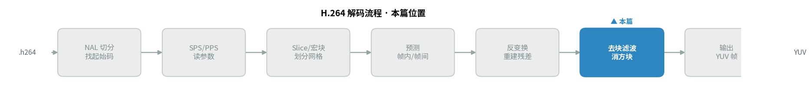
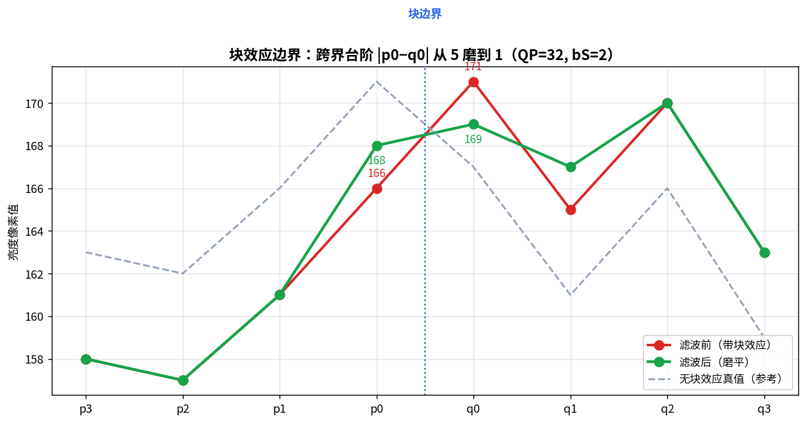
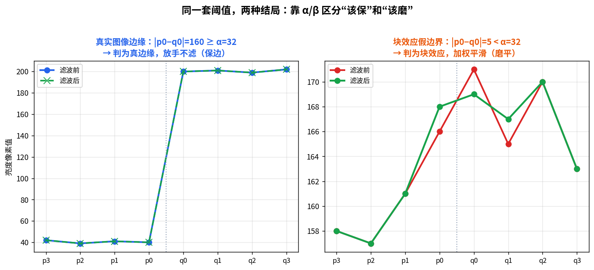
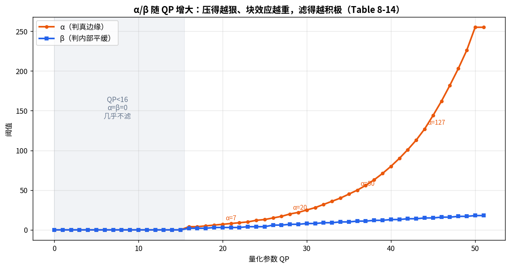
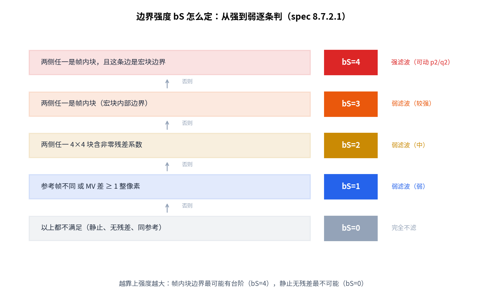
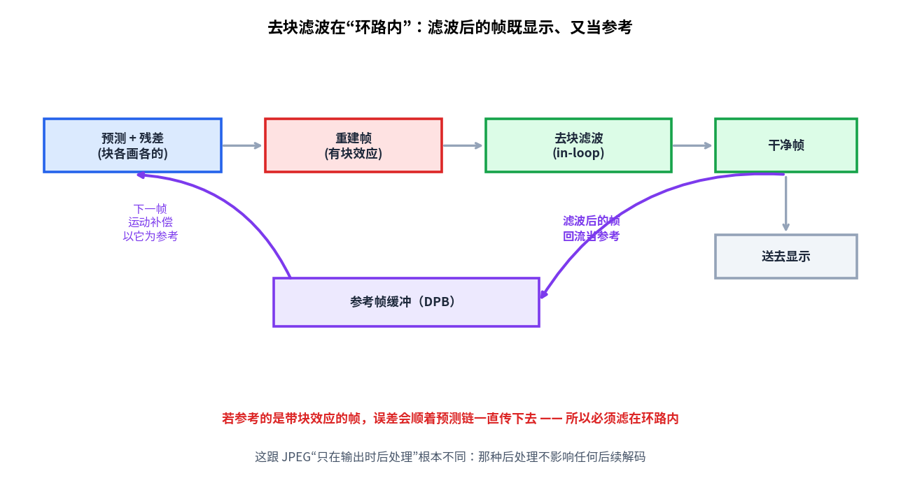

> 作者：Jone
> 日期：2026-09-12
> 风格：深度分析
> 状态：待发布

# 手搓 H.264 解码器 #08：解完一个宏块，为什么还要再"缝一遍"

先说结论：H.264 把每个宏块解完、拼成一整帧之后，还要沿着块与块的边界再"缝一遍"，把台阶状的方块痕迹磨平。这道工序叫去块滤波（Deblocking Filter）。

它看起来像个收尾的美颜滤镜，其实不是。它必须做在解码"环路内"（in-loop filter，环内滤波），因为磨干净的帧不只是拿去显示，还要当作后续帧的参考。这一篇就讲清楚：方块痕迹从哪来，怎么区分该磨的假边界和该留的真边缘，以及那个最关键的问题——为什么这道滤波非得放在环路里。

先看这一篇在整条解码流水线里的位置：



## 上一篇每个块各画各的，边界就对不齐了

上一篇把帧间预测和运动补偿解完了。到这一步，一帧里的所有宏块其实都各自重建好了：I 块靠帧内预测猜、P 块从参考帧搬像素，再各自补上反变换出来的残差。

问题恰恰出在"各自"这两个字。

H.264 是按 4×4、16×16 这样的小块为单位处理的。每个块内部,预测和变换都算得很平滑。可块与块之间是独立编码的——各自量化、各自取整。相邻两个块,哪怕原本是同一片连续的墙面,量化后的直流分量也可能差那么一两级。

差一两级是什么后果？块内部一片均匀,块和块的交界处却凭空多出一道台阶。整帧看下去,画面像贴了一层瓷砖,一格一格的。这就是块效应（blocking artifact，方块效应）。码率压得越狠、量化越粗,台阶越明显。

低码率视频里那种"马赛克感",大半就是它。

## 去块滤波干的事：沿边界磨平台阶

解法很直接:既然台阶出在块边界上,那就沿着每一条边界,对跨过边界的一小排像素做加权平滑,把那道台阶磨掉。

拿一条真实的竖直块边界来看。我用测试图的一行亮度像素当"重建帧",人为给相邻块加了不同的直流台阶,模拟量化偏差。边界两侧各取 4 个像素,记作 p3 p2 p1 p0 | q0 q1 q2 q3,紧贴边界的是 p0 和 q0。



滤波前(红线),p0=166、q0=171,跨界差 5,还带着一路的锯齿。跑一遍弱滤波之后(绿线),p0 抬到 168、q0 压到 169,跨界台阶从 5 缩到 1。再对比灰色虚线那条"无块效应的真值",绿线明显更贴合它。台阶被磨掉了,原本该连续的地方又连续了。

这就是去块滤波最朴素的效果:让本该平滑过渡的地方,重新平滑起来。

## 关键难点:怎么区分"假边界"和"真边界"

但这里藏着一个陷阱。

如果见到边界就磨,那就坏事了。真实图像里到处是物体的轮廓——黑板和墙的分界、人脸和背景的交界。这些地方的相邻像素本来就该差很多,那是该保住的细节。你要是把它们也当台阶磨平,画面就糊了。

所以去块滤波真正的难点,不是怎么磨,而是**怎么判断这道边界到底该不该磨**。H.264 用两把尺子来量。

第一把是阈值 α 和 β（由量化参数 QP 查表得到,spec Table 8-14）。逻辑是这样:块效应造成的台阶通常不大(量化偏差有限),而真实边缘的像素差往往很大。于是定个门槛——跨界差 |p0−q0| 得小于 α、边界两侧内部的差得小于 β,才判定为"这是块效应,该磨";差太大就认为"这是真边缘,放手"。

用同一套阈值,我喂了两条边界进去:



左边是一条真实图像边缘,一侧暗(约 40)、一侧亮(约 200),跨界差 160。这个差远大于 α=32,滤波器直接判定"真边缘",一个像素都不动——保边成功。右边是前面那条块效应边界,跨界差 5,远小于 α,顺利被磨平。同样的阈值,两种结局,全靠这道差值判断。

α 和 β 还跟着 QP 走。QP 越大,意味着压得越狠、块效应越重,阈值也就调得越大,滤波越积极:



注意 QP 小于 16 那一段,α 和 β 都是 0——码率高、画质好、几乎没有块效应,那就基本不滤,免得反倒把好画面磨糊。QP 一大,阈值陡升,滤波才认真干活。这条曲线,本质是在"该磨多狠"上做的自适应。

## 第二把尺子:边界强度 bS

光有阈值还不够。同样是块边界,有的天生更容易出台阶,有的几乎不会。H.264 给每条 4×4 边界算一个边界强度 bS（Boundary Strength,取值 0 到 4),决定用多强的滤波。

判定规则从强到弱逐条过（spec 8.7.2.1）:



最强的 bS=4,留给帧内块的宏块边界——帧内预测是"猜"出来的,块之间最容易不连续,得用最强的滤波(甚至能动到 p2、q2 三层像素)。往下,帧内块的内部边界是 bS=3;两侧只要有非零残差系数就是 bS=2;参考帧不同、或者运动矢量差了 1 个整像素以上,是 bS=1;剩下那些静止、无残差、同参考的边界,bS=0,压根不滤——它们本来就连续,没必要碰。

bS 越大,允许改动的像素越多、幅度越大。这套分级的意思是:越可能有台阶的地方,磨得越用力;越不可能的地方,越轻手轻脚,甚至不碰。

## 揭示性时刻:为什么必须滤在"环路内"

到这里,去块滤波怎么工作已经讲完了。可最要命的一点还没说:这道滤波到底该放在解码流程的哪一步?

直觉上,它像个后处理——解完整帧、要显示了,顺手磨一磨方块,不就完了?JPEG 的去块效应处理就是这么干的:只在输出那一刻美化一下,磨不磨、磨多少,都不影响图片本身的解码。

H.264 偏偏不能这么做。

原因在上一篇:P 帧的运动补偿,要以前面已解码的帧当参考,从里面搬像素过来做预测。而参考的是哪一版?**是去块滤波之后的干净版**。



看这条链路。重建帧带着块效应,先过去块滤波磨干净,磨出来的干净帧兵分两路:一路送去显示,另一路回流进参考帧缓冲,给下一帧的运动补偿当底子。

关键就在这个回流。假设去块滤波只在输出时做,参考帧缓冲里存的还是那个带块效应的脏帧。下一帧从脏帧上搬像素,搬来的预测块自带方块痕迹,补完残差再滤,新的误差又叠上去……**误差会顺着预测链一帧帧传下去,越滚越大**。

所以去块滤波必须做在环路内:让编码端和解码端参考的是同一版干净帧,预测才对得齐,误差才不会累积。这就是"in-loop"三个字的分量——它不是可选的美颜,而是保证整条预测链一致性的必要环节。这跟 JPEG 那种"输出时才后处理"根本是两回事。

## 落到代码:先判滤不滤,再决定磨多狠

把上面几步串起来,就是单条边界的去块滤波主逻辑。这是仓库里的真实代码(`h264/decoder/deblock_filter.cpp`,对应 spec 8.7.2)：

```cpp
bool DeblockEdge(EdgeSamples& s, int bS, int qp_av, bool chroma, ...) {
    if (bS == 0) return false;                    // bS=0：整条边界不滤
    const int alpha = kAlpha[Clip3(0, 51, qp_av + offsetA)];  // Table 8-14
    const int beta  = kBeta [Clip3(0, 51, qp_av + offsetB)];
    // 像真边缘就放手，像块效应才滤（spec 式 8-333）
    if (!FilterSamplesFlag(s, bS, alpha, beta)) return false;
    if (bS < 4) FilterWeak(s, bS, index_a, beta, chroma);   // 弱滤波
    else        FilterStrong(s, alpha, beta, chroma);       // 强滤波
    return true;
}
```

先看 bS——为 0 直接跳过。再查 α/β 阈值,判断这条边界像不像块效应;不像就放手保边。确认要滤了,才按 bS 分岔:小于 4 走弱滤波,等于 4 走强滤波。

那个"判滤不滤"的开关,就是前面两把尺子的合体（同文件 `FilterSamplesFlag`,对应 spec 式 8-333）：

```cpp
bool FilterSamplesFlag(const EdgeSamples& s, int bS, int alpha, int beta) {
    return bS != 0 && Abs(s.p[0] - s.q[0]) < alpha
        && Abs(s.p[1] - s.p[0]) < beta && Abs(s.q[1] - s.q[0]) < beta;
}
```

跨界差小于 α、两侧内部差小于 β,同时 bS 非零——三条全中,才判为块效应、动手去磨。这一行,就是"保真边缘、磨假边界"的全部判据。

配套测试把 bS 推导、α/β/tC0 查表、保边、平滑、强滤波、色度处理都验了一遍,可以逐个对照 spec 手算核对;接上前面几篇,八个测试全过,编译无警告。这一篇所有配图里的数字,都是这套代码在真实图像上跑出来的。

## 小结

这一篇,我们给解码器补上了最后一道工序:沿块边界把方块痕迹缝平。

三件事值得记住。一是块效应的来源——每个块各自量化取整,交界处凭空多出台阶。二是"保边 vs 平滑"的判断:靠 α/β 阈值和 bS 边界强度两把尺子,跨界差小的当块效应磨掉,差大的当真边缘保住;滤过头会糊,不滤有方块,分寸全在这两把尺子上。三是那个最关键的揭示:去块滤波必须做在环路内,因为磨干净的帧要回流当参考帧,不然误差会顺着预测链一直传——这跟 JPEG 那种输出时的后处理,是完全不同的两码事。

到这里,H.264 解码的所有模块都齐了:从 NAL 切分、SPS/PPS 解析、宏块划分,到帧内预测、反变换、CAVLC 残差解码、运动补偿,再到这一篇的去块滤波。零件全部到位。

下一篇,我们把这些零件拼成一个完整的解码器:端到端解一段真实的 .h264 码流,吐出 YUV 帧,再跟 ffmpeg 的解码结果做逐像素的 PSNR 校对——看看我们手搓的这套东西,到底能不能跟工业级解码器对上。

[ITU-T H.264 官方标准（Advanced video coding，含第 8.7 节去块滤波、8.7.2.1 边界强度、8.7.2.3/8.7.2.4 滤波过程、Table 8-14 阈值）](https://www.itu.int/rec/T-REC-H.264)

[Deblocking filter — Wikipedia（去块滤波概述）](https://en.wikipedia.org/wiki/Deblocking_filter)

[H.264/AVC in-loop deblocking filter（IEEE 官方论文，滤波器设计原理）](https://ieeexplore.ieee.org/document/1218190)

[H.264 去块滤波详解（雷霄骅博客）](https://blog.csdn.net/leixiaohua1020/article/details/45870269)

[H.264 Deblocking Filter 原理与实现（TaigaCon）](https://www.cnblogs.com/TaigaCon/p/6376194.html)

[x264 开源实现（可对照去块滤波与边界强度计算）](https://www.videolan.org/developers/x264.html)
