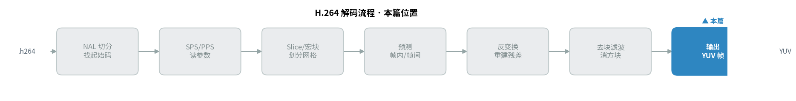
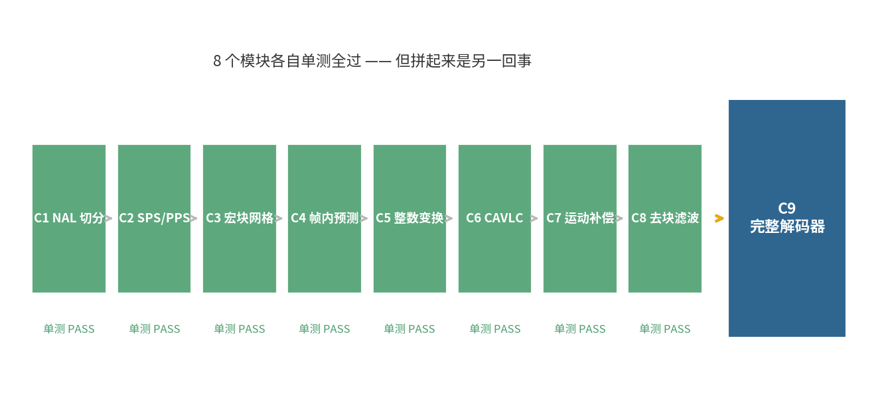
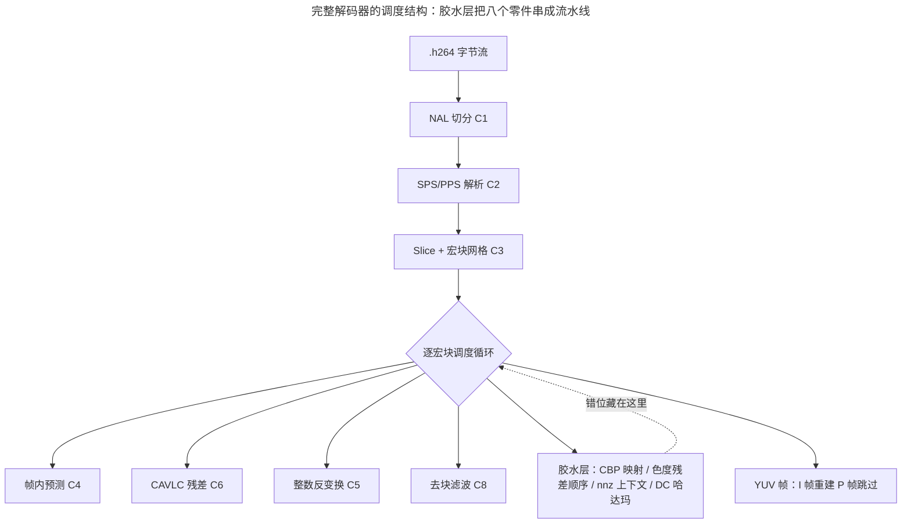
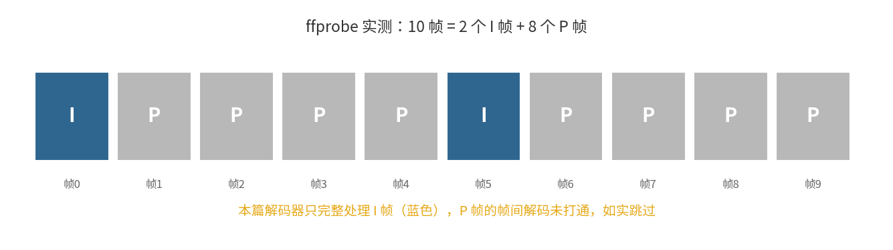
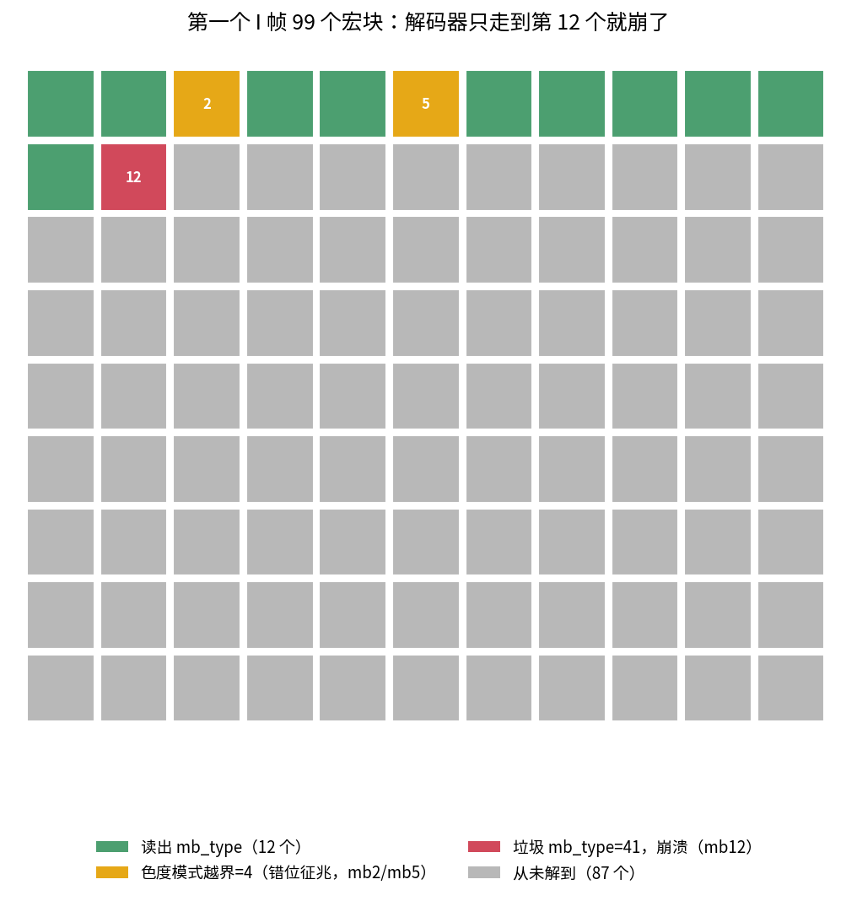
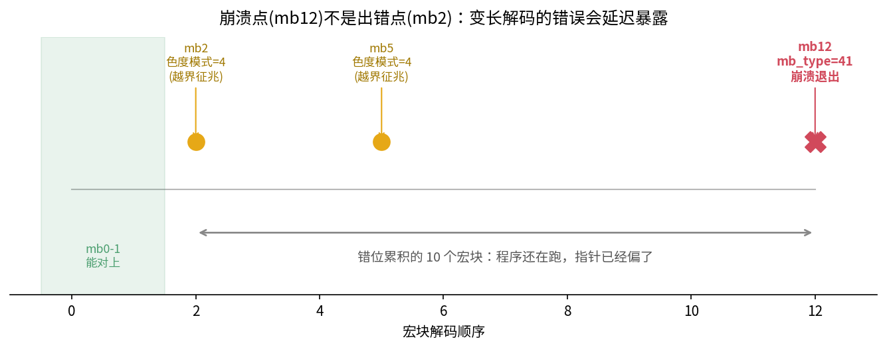
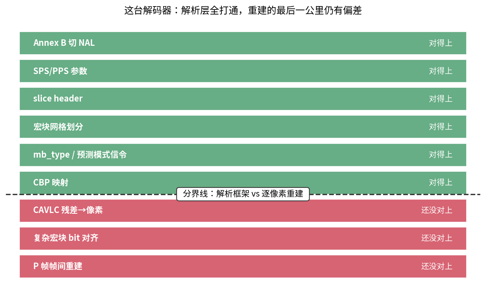
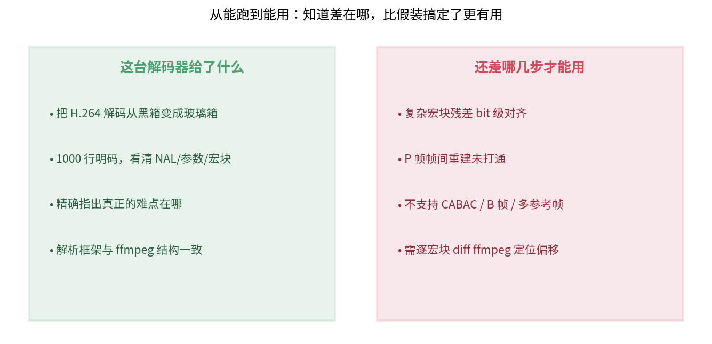

> 作者：Jone
> 日期：2026-09-12
> 风格：深度分析
> 状态：待发布

# 手搓 H.264 解码器 #09：拼出最小解码器，然后撞上"从能跑到能用"那堵墙

前面八篇，我们一块砖一块砖地砌完了 H.264 解码器的全部零件：NAL 切分、SPS/PPS 解析、宏块网格、帧内预测、整数反变换、CAVLC 残差解码、运动补偿、去块滤波。每一块都写了单元测试，八个测试全过。

这一篇本该是收官的高光时刻——把八个零件拼成一台完整的解码器，喂进一段真实的 .h264，吐出 YUV，再跟 ffmpeg 逐像素对齐，画个漂亮的 PSNR 曲线收尾。

但真拼起来之后，我撞上了一堵墙。这堵墙，恰恰是这个系列最该讲清楚的一件事：**单元测试全过，不等于系统能跑通**。这一篇就诚实地讲讲这堵墙长什么样，为什么会有它，以及它到底卡在哪。

先看这一篇在整条解码流水线里的位置——它是收尾的"输出"环节，负责把前面所有零件调度起来：



## 八个零件都对，拼起来却不一定对

先说这台机器的组装方式。

前八篇的每个模块，都是一个能独立测试的函数：给帧内预测喂一组邻居像素，它吐出预测块，我拿手算的结果核对；给 CAVLC 解码器喂教科书里的标准码字，它解出系数，我逐个比对。这些测试全绿。



问题是，把它们拼成一台真解码器，中间还差一大堆"胶水"——这些胶水没有独立的单元测试，因为它们的正确性只有在完整码流上才显现：

- **CBP 的 me(v) 映射**：coded_block_pattern 不是直接写在码流里的数字，而是一个码号，要查一张 48 项的映射表（spec Table 9-4）才能还原成"哪几个 8×8 块有残差"。
- **色度残差的码流顺序**：不是"每个分量各自 DC+AC"，而是先两个分量的 DC，再两个分量的全部 AC（spec 7.3.5.3.2）。顺序读错一位，后面全崩。
- **nnz 上下文**：CAVLC 选码表靠"数邻居块的非零系数个数"，这个 nC 值要跨宏块、跨 4×4 块地维护一张网格。
- **Intra_16x16 的亮度 DC 哈达玛变换**、**色度 DC 变换**、**Intra_4x4 预测模式的差分信令**……

每一样单独看逻辑都不复杂。可它们必须严丝合缝地咬在一起：前一个语法元素多读或少读一个比特，比特流的"读取指针"就偏了，后面所有语法元素跟着错位。这就是**变长编码的连锁反应**——它没有"每个字段固定占几个字节"的对齐点让你纠错，错一位，全盘皆错。

把这台机器的组装方式画出来，就是一个调度循环，把八个零件按顺序串起来，中间靠那些没有独立单测的胶水粘合：



绿色的四个零件（预测、残差、变换、滤波）都有单测护着，靠得住。真正没人守的是那个"胶水层"——CBP 映射、色度残差的码流顺序、nnz 上下文维护，它们只有在完整码流上才现原形。错位，就藏在这里。

## 先看这段码流本来长什么样

在讲我们卡在哪之前，先用 ffmpeg 摸清这段测试码流的真实底细，作为对照的标尺。

样本是 `samples/test.h264`，`ffprobe` 报告它是 176×144 的 Constrained Baseline 码流，一共 10 帧。我们自己的 SPS 解析器也读出了同样的分辨率：11×9 = 99 个宏块每帧，QP=23，用 CAVLC 熵编码。这一步，我们和 ffmpeg 完全一致——解析层是靠得住的。

再看帧的类型结构：



`ffprobe -show_frames` 告诉我们，这 10 帧是 `I P P P P I P P P P`——两个 I 帧打头和居中，中间夹着 8 个 P 帧。

这里先立个诚实的边界：**本篇的解码器只完整处理 I 帧**。P 帧需要帧间预测——从前一帧搬像素、补运动矢量，虽然第七篇的运动补偿模块已经写好，但把它接进完整的帧间解码链路还没打通。与其产出"看起来解了、其实是错的"P 帧误导读者，不如如实跳过。所以下面所有的对齐较量，都发生在第一个 I 帧上。

## 高潮：解码器只走到第 12 个宏块就崩了

现在把完整解码器跑起来，喂进 test.h264。结果是它没能解完第一个 I 帧——在第 99 个宏块里，它只走到第 12 个就报错退出了：

```
decode failed: unsupported mb_type in I slice
```

把每个宏块的解析轨迹打出来看，崩溃的位置画成一张宏块地图，一目了然：



绿色是读出了合法 mb_type 的 12 个宏块，灰色是根本没解到的 87 个。红色那个 mb12，读出了一个荒唐的 `mb_type=41`——I 条带里的 mb_type 合法范围是 0 到 25，41 显然是垃圾。解码器一看这个值没法处理，只好放弃。

但真正有意思的是那两个黄色的块。

## 崩溃点不是出错点：错位早就悄悄发生了

盯着 `mb_type=41` 去查为什么第 12 个宏块出错，是抓错了凶手。

回头看解析轨迹里的一个细节：第 2 个宏块和第 5 个宏块，解出的色度预测模式是 **4**。可 H.264 里色度帧内预测模式的合法值只有 0、1、2、3 四种（DC、水平、垂直、Plane），根本不存在 4。

这说明什么？**早在第 2 个宏块，比特流的读取指针就已经偏了。** 只是那时候偏得还不多，读出来的数字虽然荒唐，却还没荒唐到让程序崩溃的地步——它带着这个错误的指针位置，磕磕绊绊又往前读了十个宏块，错误一路累积，直到第 12 个宏块，指针偏到读出了一个彻底非法的 mb_type，程序才真正崩掉。



崩溃点（mb12）和出错点（mb2）差了十个宏块。这是调试变长编码解码器最反直觉、也最折磨人的地方：**程序崩在哪里，和 bug 在哪里，往往是两回事。** 你看到的异常，是错误累积到"再也演不下去"的那一刻，而根因早就埋在前面某个不起眼的比特里——多半是某个 CAVLC 残差块多读或少读了一位。

顺带一提，前面 mb0、mb1 是能对上的——这也印证了解析框架本身没问题，问题出在残差解码这条最深的链路上，某个复杂宏块的某个语法元素的边界条件没抠对。

## 这堵墙的名字：解析层 vs 重建层

把上面的现象归纳一下，就能看清这台解码器真实的能力边界在哪：



分界线上半部分——切 NAL、读 SPS/PPS、划分宏块网格、解 mb_type 和预测模式信令、CBP 映射——全部对得上，宏块网格结构和 ffmpeg 报告的一致。这一层是"照着语法规则做确定的动作"，规则清楚，没有歧义。

分界线下半部分——把 CAVLC 残差一路解到像素、复杂宏块上的比特级对齐、P 帧的帧间重建——还没对上。这一层要求**每一个语法元素的每一个条件分支、每一处舍入、每一个上下文推导都分毫不差**，任何一个 4×4 残差块多读一位，整条链就断了。

这正是这个系列想让你记住的那句话：**从"能跑"到"能用"，隔着的不是原理，是成千上万个边界情况。** 原理我们前八篇都讲对了，每个模块也都单测通过了。但一个工业级解码器和一个教学解码器之间的鸿沟，不在于你懂不懂 DCT、懂不懂运动补偿，而在于你有没有耐心把每一个 mb_type、每一种 CBP 组合、每一处 nnz 上下文的边界都抠到位。ffmpeg 的 `libavcodec/h264*` 有几万行代码，绝大部分不是在实现原理，而是在处理这些边界。

说白了，我们造了一台发动机的所有零件，每个零件在台架上都转得好好的。可把它们装进车里一拧钥匙，发动机在第 12 秒熄火了——不是哪个零件坏了，是它们之间的配合差了几丝。

## 那这台"半成品"还有价值吗

有，而且价值不小。



它把 H.264 解码从"黑箱"变成了"玻璃箱"。你现在能亲眼看到：一段 .h264 是怎么被切成 NAL、怎么读出分辨率、怎么划成宏块网格、每个宏块声明自己用哪种预测、残差怎么组织。这些在 ffmpeg 里被几万行代码和层层抽象裹得严严实实的东西，在这里是 1000 行能读完的明码。

它也精确地告诉了你，真正的难点在哪。不是那些教科书爱讲的 DCT 和运动补偿公式——那些我们都实现对了。真正难的是残差解码这条最长的比特链上的对齐，是那些没人爱写、却决定成败的边界处理。知道难在哪，比假装"我全都搞定了"要诚实得多，也有用得多。

如果你想把它推到真能对齐 ffmpeg，方向也清楚了：拿 ffmpeg 的 `-debug` 输出当参照，逐宏块比对比特位置，定位到第一个偏移的语法元素——大概率是某个 CAVLC 残差块的 level 或 run 解码差了一位。这是一场需要耐心的比特级 diff，不是原理问题。

## H.264 解码系列的收尾

到这里，H.264 解码的九篇走完了。回头看这张完整的地图：


从第一篇在字节流里切出第一个 NAL Unit，到指数哥伦布读出分辨率、宏块网格划分、九种帧内预测、整数变换、CAVLC 残差、运动补偿、去块滤波，再到这一篇的整合——每个环节我们都从 spec 条款出发，亲手写了能跑、能测的 C++。

这一篇没有画出那条漂亮的 PSNR 对齐曲线，我觉得这样反而更好。它让这个系列没有停在"原理我都懂了"的自我感觉良好里，而是诚实地把读者领到了那堵真正的墙面前：原理和可用之间，隔着大量枯燥、琐碎、却决定成败的工程。这堵墙，才是"手搓一个编解码器"最该被看见的部分。

下一个子系列，我们调转方向——不再"读"码流，而是"写"码流。H.264 编码是全系列最难的部分，因为解码是照着规则做规定动作，而编码要在无穷多种合法码流里挑一个最优的。标准只规定了怎么解码，怎么编码全靠编码器自己权衡。这个区别，就是下一篇的起点。

[ITU-T H.264 官方标准（Advanced video coding，含第 7.3.5 节宏块语法、Table 9-4 CBP 映射、第 9.2 节 CAVLC 解析）](https://www.itu.int/rec/T-REC-H.264)

[FFmpeg 官方文档（libavcodec H.264 解码器，正确性对照的最终标尺）](https://ffmpeg.org/documentation.html)

[H.264/AVC 官方参考软件 JM（逐宏块比特级调试的黄金参考）](https://iphome.hhi.de/suehring/tml/)

[H.264 码流结构与解码流程详解（雷霄骅博客）](https://blog.csdn.net/leixiaohua1020/article/details/45870269)

[H.264 CAVLC 熵解码与宏块语法（TaigaCon 博客）](https://www.cnblogs.com/TaigaCon/p/6416039.html)

[x264 开源实现（可对照残差编码与宏块处理）](https://www.videolan.org/developers/x264.html)
