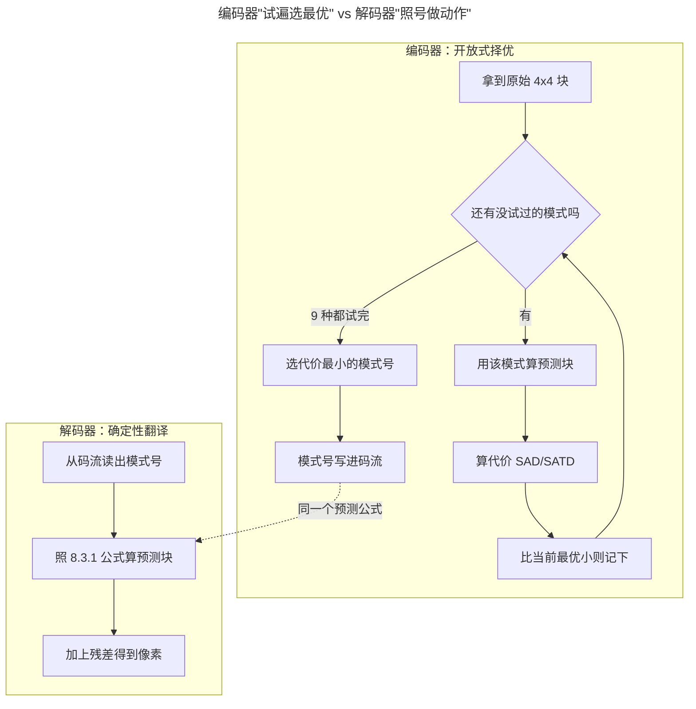
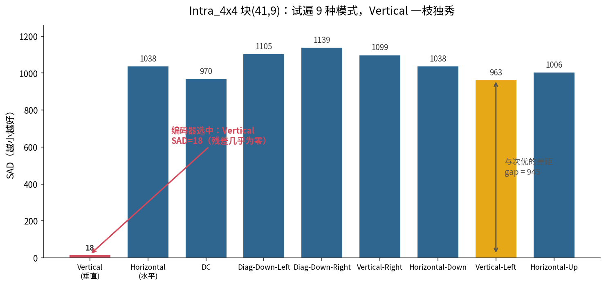
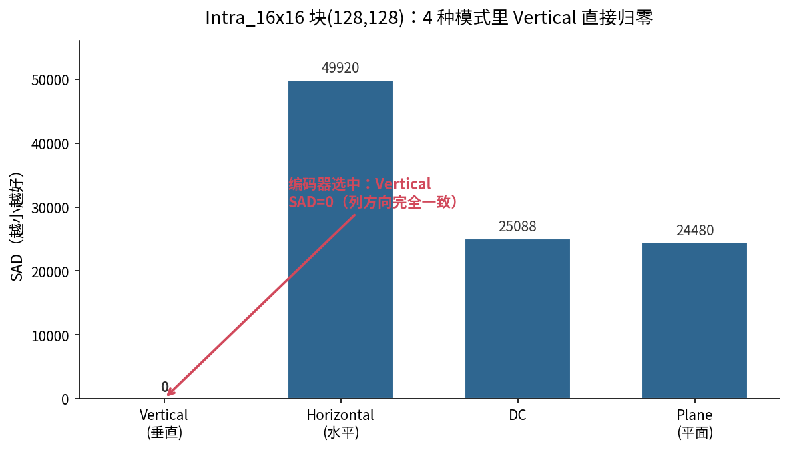

> 作者：Jone
> 日期：2026-09-12
> 风格：深度分析
> 状态：待发布

# 手搓 H.264 编码器 #01：标准只规定怎么解码，编码器凭什么做选择

前面九篇，我们把 H.264 解码器一块砖一块砖砌完了。收官那篇撞上一堵墙，也留下一个更根本的问题：解码是照着规则做规定动作，那编码呢？

这一篇是"手搓编解码器"编码子系列的开篇。它不写一行运动补偿，只想讲清楚一件事：**解码和编码，根本不是同一类问题。**

先看这一篇在整条编码流水线里的位置——它是最前面的"预测决策"环节，一切压缩效率的起点：


## 解码没有选择，编码全是选择

先把两件事摆到一起对比。

解码器拿到一段码流，里面每个字段都写死了。宏块类型是几号、用哪种预测模式、残差系数是多少——全都明明白白写在比特里。解码器要做的，是照着 spec 的公式把这些数字还原成像素。给定同样的输入，任何一个正确的解码器都必须吐出**完全一样**的输出。差一个像素，就是解码错了。

编码器反过来。它拿到一帧原始像素，要产出一段码流。可问题是：**同一帧画面，能编成的合法码流有无穷多种。**

同一个宏块，你可以用垂直预测，也可以用 DC 预测；残差可以量化得粗一点省比特，也可以细一点保画质。每一种组合都是"合法"的——解出来都能还原成一帧能看的画面，只是清晰度和码率各不相同。标准从头到尾只回答了一个问题："给定这些参数，该解出什么。"至于**编码器该挑哪一组参数，spec 一个字都没写。**

这就是分水岭。解码是确定性的翻译，编码是开放式的择优。同样是"手搓一个编解码器"，写解码器是把规则翻译成代码，写编码器是在无穷解空间里造一把尺子，然后拿它挑最优解。

说白了，H.264 规范是一本"阅读理解答案"，它只告诉你每道题的标准答案怎么对，却没教你怎么答题。编码器就是那个答题的人。

把两端的控制流画在一起，这个区别就再清楚不过了：



左边编码器是个循环：试、算、比，反复九次，最后挑最小。它在做**选择**。右边解码器是一条直线：读号、套公式、加残差。它在做**翻译**，没有任何分叉。两边共用中间那个预测公式——这是必须的，否则残差对不上。编码器的全部智能，就浓缩在左边那个多出来的循环里。

## 帧内模式决策：这个区别的最小样本

这个抽象的区别，落到最小的一个具体动作上，就是**帧内预测的模式决策**。

H.264 的帧内预测，是拿一个块周围已经重建好的邻居像素，去猜这个块长什么样。猜得越准，残差越小，编码后越省比特。对一个 4×4 亮度块，标准定义了 9 种猜法（spec 8.3.1，表 8-2）：垂直、水平、DC、四个斜方向，等等。对 16×16 块，定义了 4 种（spec 8.3.3）。

关键在这里：**这 9 种模式，标准只定义了"每种模式该怎么算预测块"，没说"该选哪一种"。**

解码器不用选——码流里写着模式号，它照着号算就行。编码器必须选，而且没有公式告诉它怎么选。怎么办？最朴素的办法：**9 种全试一遍，哪种猜得准用哪种。**

我们的编码器就是这么干的。核心函数只有二十来行：

```cpp
int ChooseIntra4x4Mode(const Neighbors4x4& nb, const Block4x4& original,
                       CostMetric metric, int* out_cost) {
    int best_mode = 0;
    int best_cost = -1;
    // 9 种模式 0..8 逐个试（枚举定义见 8.3.1 表 8-2）。
    for (int m = 0; m < 9; ++m) {
        Block4x4 pred = PredictIntra4x4(nb, static_cast<Intra4x4Mode>(m));
        int cost = Cost4x4(original, pred, metric);
        // 严格小于才更新 -> 平手时保留较小模式号。
        if (best_cost < 0 || cost < best_cost) {
            best_cost = cost;
            best_mode = m;
        }
    }
    if (out_cost) *out_cost = best_cost;
    return best_mode;
}
```

注意那个 `PredictIntra4x4`——它直接复用了解码器里已经按 spec 写好的预测函数。这不是偷懒，是本质：**预测怎么算，编解码两端必须完全一致**，否则编码器算的残差解码端还原不出来。编码器只是在解码器的预测能力之上，多加了一层"挨个试、比大小"的择优逻辑。

循环体里那个 `Cost4x4` 就是尺子。它衡量"预测块和原始块差多少"——差得越少，说明这种模式猜得越准。9 次循环各得一个代价，取最小的那个模式号写进码流。规定动作变成了择优搜索，这一层就是编码器和解码器的全部区别。

拿真实图片跑一次，这个"试遍再挑"的过程立刻具象。测试图是 `samples/test_pattern.ppm`，256×256。取其中一个 4×4 块，坐标 (41,9)，把 9 种模式的代价全打出来：



九根柱子，就是九次循环的结果。编码器不预设哪种模式好，它老老实实每种都算一遍，最后指向最矮的那根。至于这把尺子怎么算出这些数字，下一节拆开看。

## 那把尺子叫 SAD：真实数据说话

尺子怎么造？最简单的一把叫 **SAD**（Sum of Absolute Differences，绝对差之和）：把预测块和原始块逐像素相减，取绝对值，全加起来。

```cpp
template <int N>
int SadN(const std::array<std::array<int, N>, N>& orig,
         const std::array<std::array<int, N>, N>& pred) {
    int sad = 0;
    for (int y = 0; y < N; ++y)
        for (int x = 0; x < N; ++x)
            sad += std::abs(orig[y][x] - pred[y][x]);
    return sad;
}
```

就这么朴素。SAD 越小，残差越小，越省比特。x264 的快速档也用它。

回头看上一节那张柱状图，数字就有了意义。垂直模式（Vertical）的 SAD 是 **18**，次优的 Vertical-Left 是 **963**。差距 **945**。这不是"略好一点"，是碾压式的领先——说明这个 4×4 块的纹理，就是沿着列方向延伸的，用上一行的像素往下"拉"，几乎完美命中。

这就是揭示时刻：**方向选对了，残差可以接近于零。** 编码器试遍 9 种模式的意义，全在这个 gap 里。如果它偷懒随便选一个，残差可能大 50 倍，编码后要多花好几倍的比特。这个"多花的比特"，累积到整帧、整段视频，就是不同编码器画质和码率拉开差距的根源之一。

16×16 块更极端。同一张图取块 (128,128)，4 种模式的 SAD：



垂直模式 SAD 直接是 **0**——这个 16×16 区域在列方向上完全一致，垂直预测一分不差地猜中了整块。其余三种：Horizontal 是 49920，DC 是 25088，Plane 是 24480。选哪个，不用犹豫。

有意思的是，换一把更精细的尺子 SATD（对残差做 Hadamard 变换再求和，更贴近真实编码后的比特数），这个 4×4 块选出来的还是 Vertical（SATD=72）。两把尺子指向同一个答案，说明这个块的方向性太强了，怎么量都是垂直赢。但换一个纹理复杂的块，SAD 和 SATD 就可能选出不同的模式——那时候，尺子的精细程度就直接决定了压缩效率。

这也解释了一个常被问到的问题：为什么同一段视频，用不同编码器（x264、x265、硬件编码器）压出来画质差那么多，但都能被同一个播放器正常解码？因为解码端照规则翻译，结果唯一；而回到本文开头那张对比图里编码端的"决策循环"，各家实现天差地别——有的只用 SAD 快速判断，有的上完整 RDO（率失真优化）连码率一起算进代价。尺子越准、搜索越充分，选出的模式越优，同样码率下画质越好。这就是 spec 干脆不管"怎么选"的深意：把选择权留给编码器，才有了各家同台竞技的空间。差距，全在这个标准管不着的循环里。

## 结语：从"选模式"到"编码整帧"

这一篇我们只做了一件小事：讲清楚编码器凭什么做选择，并用帧内模式决策这个最小样本，把"解码是规定动作、编码是开放择优"这句话落到了真实的 SAD 数据上。

但模式决策只是开始。选好了预测模式，得到了残差，接下来才是编码真正的重头戏：怎么把残差做变换、怎么量化、量化到多粗才能既省比特又不糊——那个控制码率和画质权衡的旋钮叫 QP，它比模式决策更能左右最终的压缩效果。

下一篇（D2），我们就动手做变换和量化，看看那把"丢掉多少信息"的尺子是怎么校准的。真正的率失真权衡，从那里才刚刚开始。

[ITU-T H.264 官方标准（Advanced video coding，帧内预测见第 8.3 节，Intra_4x4 表 8-2、Intra_16x16 表 8-3）](https://www.itu.int/rec/T-REC-H.264)

[x264 开源实现（可对照 SAD/SATD 模式决策与快速搜索档位）](https://www.videolan.org/developers/x264.html)

[H.264 帧内预测原理与模式详解（雷霄骅博客）](https://blog.csdn.net/leixiaohua1020/article/details/45870269)

[H.264 帧内预测 9 种模式与代价函数（TaigaCon 博客园）](https://www.cnblogs.com/TaigaCon/p/6416039.html)

[如何理解视频编码中的率失真优化 RDO（知乎）](https://www.zhihu.com/question/28776656)

[FFmpeg 官方文档（libavcodec，编解码器实现参考）](https://ffmpeg.org/documentation.html)
