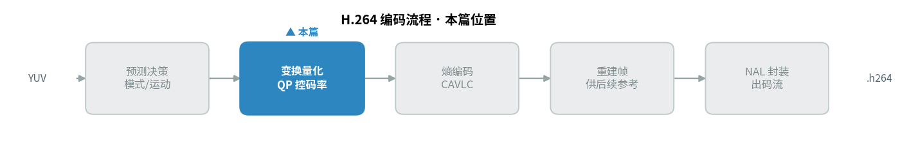
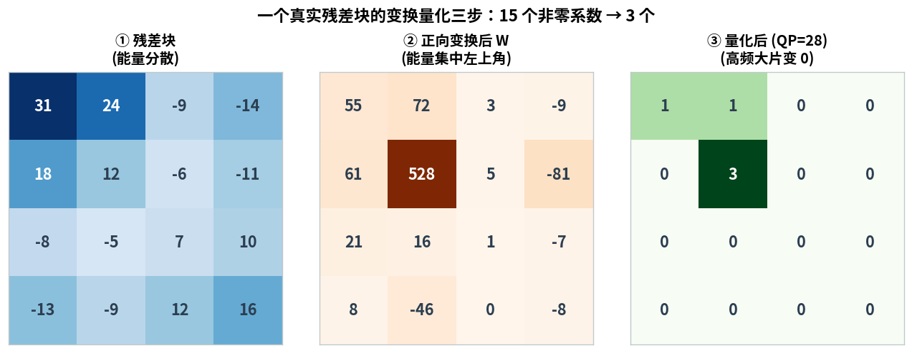
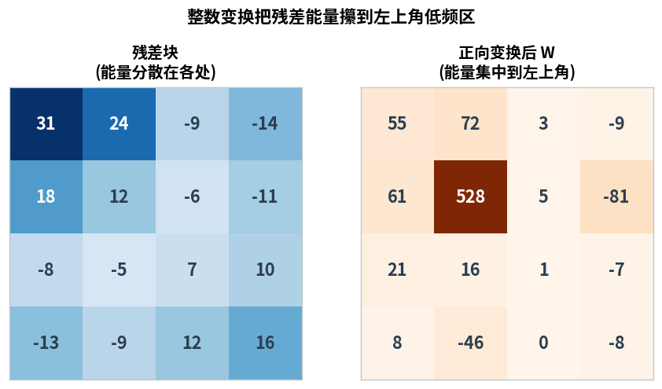
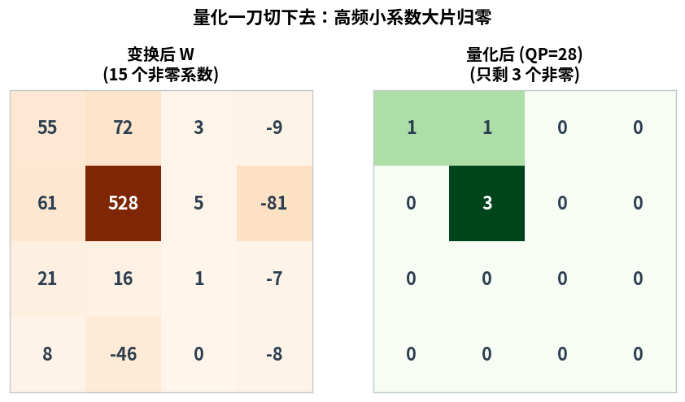
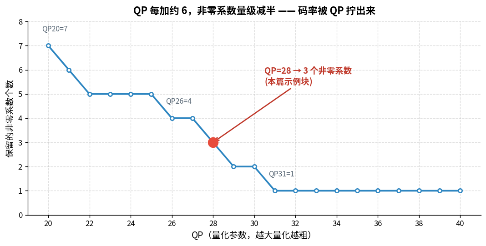
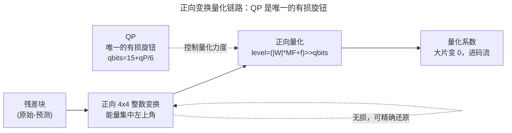

> 作者：Jone
> 日期：2026-09-12
> 风格：深度分析
> 状态：待发布

# 手搓 H.264 编码器 #02：正向变换量化，码率是怎么被 QP 拧出来的

先说结论：H.264 里控制码率的旋钮只有一个，叫 QP。它拧大一点，视频就更小、更糊；拧小一点，视频就更大、更清晰。而它起作用的地方，就是这一篇要拆的两步——正向变换和量化。

更精确一点：QP 每加 6，量化步长翻倍，保留下来的系数大致减半，码率也就大致减半。这不是工程师拍脑袋定的经验值，是量化公式里 `qbits = 15 + qP/6` 那个除以 6 直接决定的。这一篇就把这条链路走一遍：残差怎么被变换把能量攥到一角，量化又怎么把大片系数抹成 0，以及那个最关键的问题——码率到底是从哪一步被 QP 拧出来的。

先看这一篇在整条编码流水线里的位置：



## 上一篇给了残差，这一篇要把它变小

上一篇做完了预测决策：对每个宏块挑一个最省比特的帧内模式（或者帧间运动矢量），拿预测块去减原始块，得到一块残差。残差就是"猜得不准的那部分误差"。

问题是，残差还是一堆实打实的整数，直接编码进码流一点都不省。你得想办法让它变小。

怎么变小？关键的观察是：残差虽然到处都有值，但它在空间上是有规律的——相邻像素的误差往往是缓慢变化的，很少突然从大跳到小。这种"缓慢变化为主"的信号，用频域表示会特别划算：低频分量（整体趋势）拿走绝大部分能量，高频分量（细节抖动）值都很小。

于是就有了变换这一步。把残差从"每个像素一个数"换成"每个频率一个系数"，能量会自动往低频挤。挤到一起之后，量化再动手：低频的大系数留着，高频那些本来就接近 0 的小系数，直接抹成 0。

这两步连起来看，就是下面这张真实数据图。



左边是一块真实残差（QP=28 的测试块），16 个格子基本都有值，能量散得到处都是。中间是变换后的系数 W，一眼就能看出变化：能量全往左上角的低频区挤过去了，最大的那个系数冲到 528，而右下角的高频区都是个位数甚至 0。右边是量化之后，只剩左上角 3 个非零系数，其余全部归零。

15 个非零系数，变成了 3 个。这就是变换量化干的事。

## 正向变换：整数蝶形，把能量攥到左上角

先看变换。H.264 用的是 4×4 整数核变换，核矩阵长这样：

```cpp
// 核矩阵 Cf：
//   [ 1  1  1  1 ]
//   [ 2  1 -1 -2 ]
//   [ 1 -1 -1  1 ]
//   [ 1 -2  2 -1 ]
```

注意看这些系数：全是 1、2 这样的小整数。这是 H.264 相比老 JPEG 的一个大改进——JPEG 的 DCT 要算一堆浮点余弦，不同硬件上算出来还可能差那么一点点。H.264 干脆把变换换成纯整数的加减和乘 2，结果在任何平台上都逐比特一致，不会有反变换对不上的问题。

实现上是标准的"先行后列"两趟蝶形。每一趟先算和与差，再组合出四个频率分量：

```cpp
// 第一步：对每一行做一维正向蝶形（水平方向）
for (int i = 0; i < 4; ++i) {
    const int a0 = residual[i][0] + residual[i][3];
    const int a1 = residual[i][1] + residual[i][2];
    const int a2 = residual[i][1] - residual[i][2];
    const int a3 = residual[i][0] - residual[i][3];
    t[i][0] = a0 + a1;         // 行 [1  1  1  1]
    t[i][1] = 2 * a3 + a2;     // 行 [2  1 -1 -2]
    t[i][2] = a0 - a1;         // 行 [1 -1 -1  1]
    t[i][3] = a3 - 2 * a2;     // 行 [1 -2  2 -1]
}
```

`a0` 是首尾相加、`a1` 是中间两个相加——这两个和抓的是"整体水平"，落到低频；`a2`、`a3` 是相减，抓的是"左右差异"，落到高频。对行做完，再对列做一模一样的一趟，就得到了二维变换系数 W。

单独把残差和变换后的 W 放一起看，能量搬家看得更清楚：



左边残差 16 个格子到处是值，右边变换后 `[0][0]` 附近全是几十上百的大数，右下角清一色个位数。`[1][1]` 那个 528 就是整块能量最集中的地方。能量被攥到了左上角，为下一步量化埋好了伏笔——高频那些小值，随手一量化就没了。

这里有个细节值得点一句：代码里的变换只做了核矩阵 `Cf·X·Cf^T`，spec 8.5 里本来还有一步后置缩放，被工程上并进了量化的 MF 表里。所以严格说，这个 W 是"未做后置缩放的变换系数"，缩放的账留给下一步一起算。

## 量化：唯一的有损旋钮，QP 就在这里发力

变换是无损的——你能从 W 精确还原回残差。真正把信息扔掉的，是量化。

量化的公式很短，一行就能写完：

```cpp
Coeff4x4 Quantize4x4(const Coeff4x4& coeff, int qP, bool intra) {
    const int m = qP % 6;
    const int qbits = 15 + qP / 6;
    const long long f = intra ? ((1LL << qbits) / 3) : ((1LL << qbits) / 6);
    // ... 逐系数：level = (|W|*MF + f) >> qbits，符号单独保留
}
```

`level = (|W| * MF + f) >> qbits`。乘一个量化因子 MF，加个取整偏移 f，然后右移 qbits 位。右移就是除以 2 的幂——移得越多，系数被压得越狠，越容易变成 0。

关键就在 `qbits = 15 + qP / 6` 这一行。

QP 从 0 变到 51，`qP/6` 从 0 变到 8，qbits 就从 15 变到 23。QP 每加 6，qbits 多 1，右移就多移 1 位，相当于量化步长翻了一倍。步长翻倍，能扛过阈值活下来的系数就少一半。

这就是"QP 每加 6，码率大致减半"的物理来源。不是玄学，就是这行整数除法。

那 MF 表和 `m = qP % 6` 又是干嘛的？QP 除以 6 的整数部分决定"翻了几倍"（移位），余数部分决定"这一档内部的微调"（查 MF 表）。两者一配合，QP 就能以 1 为步进平滑地调节量化力度，而不是每 6 一跳。

把变换后的 W 和量化结果并排，一刀切下去的效果一目了然：



拿本篇那个块验证一下。QP=28，那么 `m=4`、`qbits=19`。变换后 `[1][1]=528`，查表 MF=3355，帧内偏移 f=174762：`level = (528*3355 + 174762) >> 19 = 3`。跟图里量化后 `[1][1]=3` 严丝合缝。而 `[0][3]` 的 -9 这种小系数，乘完加完再右移 19 位，直接归零。留强汰弱，一步到位。

## 高潮：把 QP 从 20 拧到 40，看系数怎么塌下去

前面都是单点。真正让人"哦——原来如此"的，是把同一个残差块的 QP 从 20 一路拧到 40，看非零系数个数怎么变。



这条曲线是这一篇的核心。QP=20 时，块里还留着 7 个非零系数，细节保得比较全；一路拧上去，系数不断被抹平；到 QP=31 就只剩 1 个了，整块基本只保住一个直流趋势，细节全丢。

盯着那三个锚点看：QP20=7 → QP26=4 → QP31=1。每往上约 6 档，非零数量级就掉一半——7 到 4，4 到 1。跟量化公式推出来的"每 +6 步长翻倍"完全对得上。系数少一半，要编进码流的东西就少一半，码率自然跟着降。

红点是 QP=28，也就是本篇示例块用的档位，3 个非零系数。你可以把这条曲线理解成码率控制器的"手感表"：编码器想压码率，就顺着这条线往右拧 QP；想保画质，就往左拧。整个 H.264 的码率控制，说到底就是在实时地、逐宏块地在这条曲线上选点。

有意思的是曲线右半段——QP 过了 32 之后就一直贴着 1 不动了。这说明这个块的能量已经压无可压，只剩最后一个直流系数死扛着。再往上拧 QP，省不下多少比特，画质却会继续崩。这也解释了为什么实际编码器很少用超高 QP：边际收益早就没了，纯亏画质。

## 小结：残差进去，量化系数出来，QP 说了算

把这一篇连起来：残差先过整数变换，能量被攥到左上角；再过量化，`(|W|*MF+f)>>qbits` 一刀切下去，高频大片归零。而 qbits 里的 `qP/6`，就是那个决定"切多狠"的唯一旋钮。

下面这张流程图把这条链和"唯一有损旋钮"标清楚：



变换那一步是无损的，随时能还原；量化那一步是有损的，QP 一大就再也回不去了。整条链上，QP 是唯一决定"丢多少"的开关——这就是码率控制能工作的全部根基。

出来的这堆量化系数，大部分是 0，非零的也就那么几个。这种"一大堆 0 里夹着几个非零"的结构，正好是下一步熵编码最爱吃的形状。下一篇就讲 CAVLC 怎么利用这个结构，把量化系数编成最终的比特流——尤其是它怎么专门针对"末尾一长串 0"和"高频全是 ±1"这两个特征做文章。

[ITU-T H.264 标准 8.5 节 Transform and quantization process](https://www.itu.int/rec/T-REC-H.264)
[H.264/AVC 4x4 整数变换的推导与实现（Richardson, vcodex）](https://www.vcodex.com/h264avc-4x4-transform-and-quantization/)
[Introduction to Data Compression, Sayood（变换编码与量化章节）](https://www.sciencedirect.com/book/9780128094747/introduction-to-data-compression)
[H.264 整数变换与量化原理详解（中文技术博客）](https://blog.csdn.net/leixiaohua1020/article/details/28114177)
[H.264 码率控制与 QP 的关系（中文技术解析）](https://zhuanlan.zhihu.com/p/45201494)
[x264 编码器源码中的量化实现参考](https://code.videolan.org/videolan/x264)
