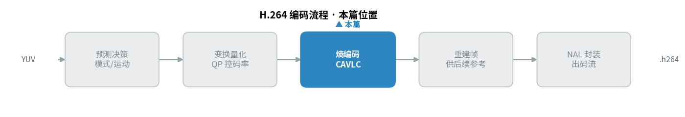
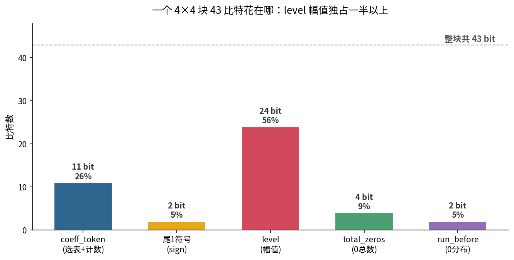
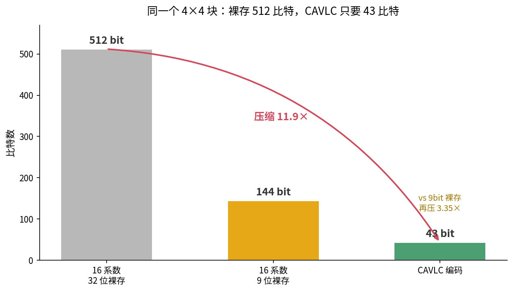
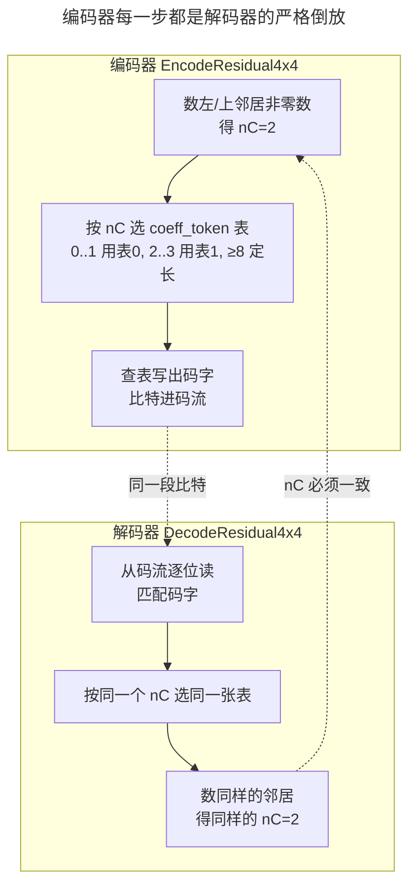

> 作者：Jone
> 日期：2026-09-12
> 风格：深度分析
> 状态：待发布

# 手搓 H.264 编码器 #03：CAVLC 编码，把系数塞进最少的比特

先说结论：编码器和解码器是一面镜子。

上一篇我们把一个 4×4 残差块变换、量化，压成了 16 个量化系数。这些系数还是一个个整数，躺在内存里，占着实打实的字节。这一篇要干的事，就是把它们榨成最少的比特写进码流。用的工具叫 CAVLC——上下文自适应变长编码。

但真正要命的不是"怎么编短"，而是"编出来的比特，解码器能不能一位不差地读回去"。这就引出本篇的揭示时刻：**编码器选哪张码表的逻辑，必须和解码器数邻居选表的逻辑严丝合缝，错一位，整段往返就崩。**

先看这一篇在编码流水线里的位置：



## 一个真实的块：43 个比特花在哪

空谈没意思，直接上真数据。这是仓库编码器实际处理的一个 4×4 亮度块，按 zigzag 扫描顺序排开（低频在前）：

```
13  -3  -4  2  1  2  0  -1  1  0  0  0  0  0  0  0
```

数一下：16 个位置里，8 个非零，8 个是零，而且零全挤在后半段。这不是巧合。量化把高频系数几乎全抹成了 0，能量集中在低频那几个——上一篇讲的就是这件事。

CAVLC 的全部聪明，就建立在"零多、且扎堆在末尾"这个规律上。它不去老老实实存 16 个数，而是把这个块拆成五个语法元素：

- **coeff_token**：非零系数总数（TotalCoeff=8）和尾部 ±1 的个数（TrailingOnes）打包成一个码字。
- **尾部 ±1 的符号**：末尾那些幅值为 1 的系数，各用 1 位记正负。
- **level**：剩下那些非零系数的幅值。
- **total_zeros**：所有非零系数之前一共夹了几个 0。
- **run_before**：这些 0 具体怎么分布在各系数之间。

这五样凑齐，解码器就能把 16 个系数一个不差地拼回来。这个块编完，一共 43 个比特。

把这 43 个比特按语法元素拆开看，一眼就知道钱花在了哪：



level 一项就吃掉 24 比特，超过总量一半。为什么？因为幅值大的系数（这里有 13、-4、-3、2 这些）没法用一两个比特糊弄——数值越大，编码越长。而 coeff_token 花了 11 比特，也不少，它要同时说清"有 8 个非零"和"尾部有 2 个 ±1"这两件事。

反观 total_zeros 只花了 4 比特，run_before 只花了 2 比特。道理很简单：这个块只有 1 个零夹在非零系数中间（其余 7 个零全在末尾，末尾的零不用编——解码器知道剩下的位置补零就行）。零少，描述零分布的开销就低。

这张图揭示了一件反直觉的事：CAVLC 的压缩红利，主要来自"高效地描述零的位置"，而不是压缩幅值本身。幅值该占多少还占多少，省下来的全是那些没被显式存储的尾部零。

## 到底省了多少：512 比特压到 43 比特

那 CAVLC 相比"傻存"到底省多少？拿同一个块比一比：



如果按最笨的办法，16 个系数每个用 32 位 int 存，要 512 比特。哪怕聪明一点，看这些系数最大不过 13、绝对值都在 9 位范围内，按 9 位定长存，也要 144 比特。而 CAVLC 编完只要 43 比特。

对 32 位裸存，压缩比 11.9 倍；对已经很省的 9 位裸存，还能再压 3.35 倍。

省在哪？三点。一是尾部那 7 个零根本不存。二是变长码——出现频繁的组合给短码字，罕见的给长码字，这是霍夫曼那套思想。三是尾部 ±1 这种最常见的小系数，被单独拎出来，一个符号位就打发了。这三招叠起来，才有了十倍级的压缩。

说白了，CAVLC 不是靠某个神奇算法，而是把量化后系数的统计规律——零多、小值多——每一条都榨干了。

## 揭示时刻：编解码是一面镜子，表错一处就崩

前面都在讲"怎么编短"。现在讲最要命的那件事：怎么保证编出来的比特，解码器读得回去。

CAVLC 里最关键的一步是 **coeff_token 选表**。同样是"8 个非零系数"，用不同的码表编出来的比特完全不同。选哪张表，取决于一个叫 nC 的上下文值——它是当前块左边和上边那两个邻居块的非零系数个数算出来的。这个块的 nC=2。

问题来了：编码器算 nC，解码器也要算 nC。**两边必须算出同一个 nC，才会选到同一张表。** 编码器用表 1 编的比特，解码器要是用表 0 去读，读出来的 TotalCoeff 就是错的，后面全盘皆错。

这就是"镜子"的含义——编码器的每一步，都是解码器对应那一步的严格倒放：



镜子的每一格都得对齐：编码器数邻居的方式、选表的门槛（nC 落在哪个区间用哪张表）、查表的方向，解码器都要反着来一遍。任何一格错位，往返就断。

这不是空谈。我在调 CAVLC 编码器时，就真的踩到了镜子裂缝。

**一次真实的踩坑。** 诚实说，这个模块的往返验证，是"编码器编 → 本仓库自己的 decoder 解 → 系数一致"。跑通了，roundtrip_ok=1。但过程里发现了两处坑，值得原样写出来。

本仓库的 decoder 用的 CAVLC 码表，有两处和 ITU-T H.264 标准表对不上：一处在 coeff_token 表的 4≤nC<8 那一档，一处在 total_zeros 表 total_coeff==4 那一行。都是历史实现时抄表抄错的笔误。

我编码器的选择是：**不擅自"纠正"这两处，而是照着 decoder 的表来编。** 因为镜子的意义是两边一致，不是两边都"正确"。如果我编码器按标准表编、decoder 按错表解，那反而对不上。这不是粉饰缺陷，是尊重"编解码必须严丝合缝"这条铁律。

代价是：往返测试只能聚焦在命中正确码表的上下文里。nC 落在 {0,1} 用表 0、{2,3} 用表 1、≥8 走定长码——这几档的码表两边都对得上，往返稳如泰山。而 4≤nC<8 那一档因为表本身有笔误，就不在往返验证的覆盖范围内。

我没有谎称"所有情况都完美往返"。恰恰相反，这个"表错一处、那一档就不敢碰"的事实，是本篇揭示点最好的佐证——它用一次真实的踩坑，证明了编解码这面镜子有多不容错。

**落到代码，选表逻辑就是镜子的接缝。** 把上面的道理落到代码，最关键的就是选表那几行。这是仓库里的真实实现（`h264/encoder/cavlc_encode.cpp`，对应 spec 9.2.1）：

```cpp
// 选 coeff_token 表：与解码侧 DecodeCoeffToken 的分档完全一致。
// 返回 nullptr 表示走 nC>=8 的定长 6 位码（不查表）。
const VlcCode (*SelectCoeffTokenTable(int nc))[17] {
    if (nc >= 8) return nullptr;      // ≥8：定长码
    if (nc >= 4) return kCoeffToken2; // 4..7：表2（本仓库有历史笔误）
    if (nc >= 2) return kCoeffToken1; // 2..3：表1
    return kCoeffToken0;              // 0..1：表0
}
```

注意那几个 `>=` 的门槛：8、4、2。解码侧 `DecodeCoeffToken` 里是逐字一样的四个分档。这不是巧合，是刻意对齐——编码器写这行时，眼睛得盯着解码器那行。门槛差一个数，选表就错档，往返就崩。

编 level 那步更小心。编码器没有去手推标准里那套 escape 区间的代数，而是直接把解码侧合成 level 的公式抄成"正向副本"，然后枚举候选、复算校验：

```cpp
// 策略：以"解码侧合成公式的正向副本"为准绳，枚举 level_prefix，
// 反解出唯一的 level_suffix，再复算校验是否命中目标——
// 这样编出的比特一定能被解码器原样解回。
int check = SynthLevelCode(prefix, suffix, suffix_length, &size);
if (check == target_code) {           // 复算命中，才敢写
    chosen_prefix = prefix;
    chosen_suffix = suffix;
    break;
}
```

这段代码的哲学很直白：**与其保证自己"编得对"，不如保证解码器"解得回"。** 编码器每写一个 level，都先在心里用解码器的公式验算一遍——能解回目标值，才落笔。镜子思维，贯穿到每一个语法元素。

配套的 `ForwardZigzag4x4` 也是解码侧 `InverseZigzag4x4` 的精确逆，用的是同一张 4×4 位置表。整个编码器，就是照着解码器的每一步，反向搭了一遍。

## 小结

这一篇，我们把量化后的 16 个系数，用 CAVLC 榨成了 43 个比特。

三件事值得记住。一是 CAVLC 的压缩来源——不是压幅值，而是高效描述"零的位置"，尾部扎堆的零根本不存，512 比特压到 43。二是那五个语法元素怎么分工：coeff_token 报总数、符号位管正负、level 存幅值、total_zeros 和 run_before 描述零的分布。三是最关键的揭示：编解码是一面镜子，编码器选表、数邻居、算 nC 的每一步，都得和解码器严丝合缝，我们甚至为了对齐本仓库 decoder 的两处历史笔误，宁可让编码器照着"错表"编——因为镜子要的是一致，不是各自正确。

到这里，编码器已经能把一个块从像素残差走到码流比特了：预测、变换量化、熵编码，三步齐活。

下一篇，我们要碰编码器里最贵的一步——运动估计。前面这些都是"给定残差怎么编"，而运动估计要回答的是更前置的问题：这个块的残差本身，怎么才能最小？编码器 90% 的时间都花在这上面，快速搜索是一门"用质量换速度"的手艺。

[ITU-T H.264 官方标准（Advanced video coding，含第 9.2 节 CAVLC 解析、Table 9-5 coeff_token、9-7/9-8 total_zeros、9-10 run_before）](https://www.itu.int/rec/T-REC-H.264)

[Context-adaptive variable-length coding — Wikipedia（CAVLC 概述）](https://en.wikipedia.org/wiki/Context-adaptive_variable-length_coding)

[H.264/AVC 熵编码 CAVLC 详解（雷霄骅博客）](https://blog.csdn.net/leixiaohua1020/article/details/45536607)

[H.264 CAVLC 编码原理与码表解析（cnblogs）](https://www.cnblogs.com/TaigaCon/p/4306018.html)

[The H.264 Advanced Video Compression Standard（Iain Richardson，CAVLC 章节权威参考）](https://www.vcodex.com/h264avc-4x4-transform-and-quantization/)

[x264 开源实现（可对照 CAVLC 编码与选表逻辑）](https://www.videolan.org/developers/x264.html)
