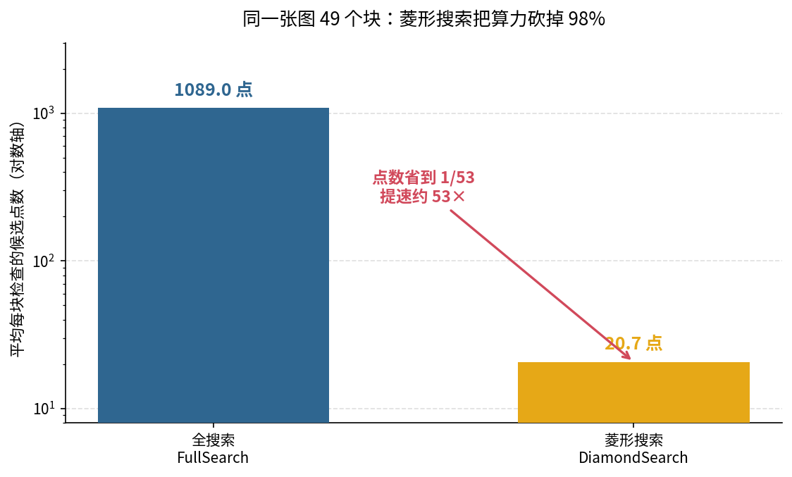
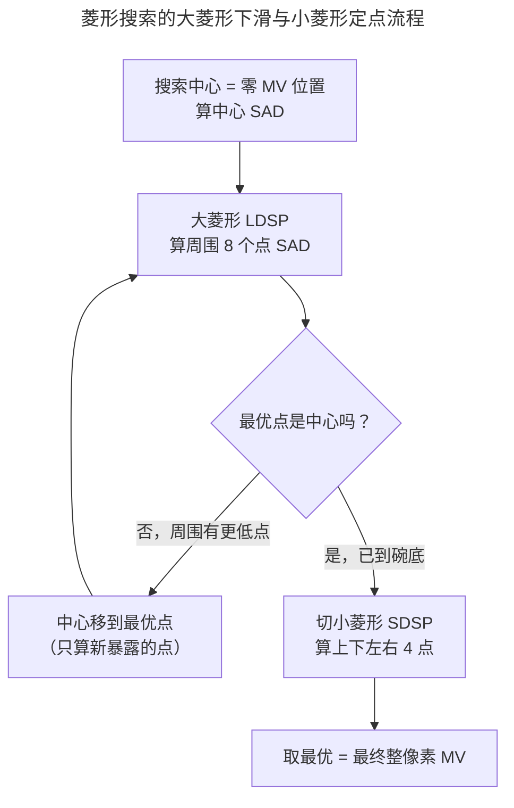
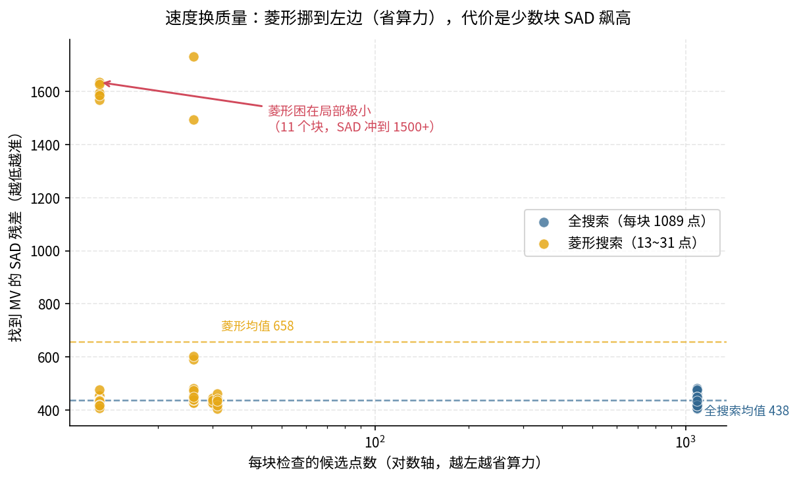
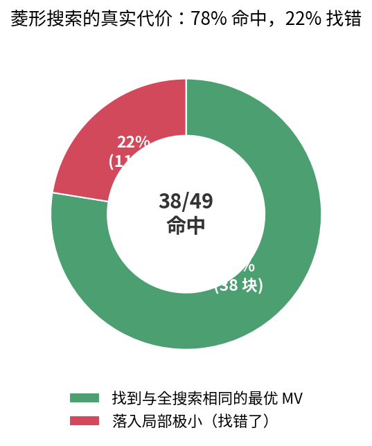

> 作者：Jone
> 日期：2026-09-12
> 风格：深度分析
> 状态：待发布

# 手搓 H.264 编码器 #04：运动估计，编码器 90% 的时间都花在这

先说结论：一台 H.264 编码器,绝大部分算力不花在变换、量化、熵编码上,而是花在一件更朴素的事情上——**给当前帧的每个块,去参考帧里找一个最像它的位置**。这一步叫运动估计。工程上,它常吃掉编码器 80% 到 90% 的时间。

前三篇一直在回答"给定残差,怎么把它编短"。这一篇往前挪一步,碰那个更前置的问题:**残差本身,怎么才能最小?** 答案就是运动估计——找得越准,残差越小,码率越低。

但这里有个矛盾。找得准和找得快,是对着干的。本篇的揭示时刻就在这:**快速搜索是一门"用质量换速度"的手艺**。我用仓库里的真实代码,在一张 256×256 的图上跑了两种搜索,数据摊开看——菱形搜索把算力砍掉 98%,代价是少数块会找错。

先看这一篇在编码流水线里的位置:


## 为什么帧间编码这么贵:编码器要"找",解码器只"搬"

要理解运动估计为什么贵,得先分清编码侧和解码侧的分工。

一部电影里,P 帧(参考前面帧的帧)占绝大多数。P 帧不存整幅画面,只存"我跟前一帧比,哪块动了、动到哪、差多少"。这个"动到哪",就是运动矢量 MV。

解码器拿到 MV,活儿很轻——码流里已经写死了 MV,照着把参考帧对应位置的块搬过来就行。它不做选择,只做搬运。

编码侧正好相反。MV 不是天上掉下来的,是编码器自己**搜**出来的。当前这个 16×16 块,它在参考帧的哪个位置最像?编码器得一个候选位置一个候选位置地试,算相似度,挑最像的那个。搜得准,残差小、码率低;搜得快,编码器才跑得动。这一对"质量 vs 速度"的矛盾,就是运动估计的全部戏码。

衡量"像不像"的尺子叫 SAD——两个块逐像素求差的绝对值,再累加。越小越像。仓库里就是这么算的(`h264/encoder/motion_search.cpp`):

```cpp
int Sad16x16(const GrayFrame& ref, int ref_x, int ref_y,
             const int* cur, int cur_stride) {
    int sad = 0;
    for (int y = 0; y < 16; ++y) {
        const int* row = cur + static_cast<size_t>(y) * cur_stride;
        for (int x = 0; x < 16; ++x) {
            int d = ref.at(ref_x + x, ref_y + y) - row[x];
            sad += (d < 0) ? -d : d;
        }
    }
    return sad;
}
```

一次 SAD 就是 256 个像素的减法加累加。而搜索要试成百上千个候选位置,每个位置都要算一次 SAD。贵,就贵在这个乘法上——候选点数 × 每点 256 次运算,再乘以一帧几百上千个块。运动估计的快慢,直接由"你试了多少个候选点"决定。

## 全搜索:质量的上限,也是速度的地板

最老实的搜法叫全搜索。逻辑简单到没有悬念:以当前块在参考帧的同位位置为中心,在一个 `[-range, +range]` 的方形窗口里,**逐点**算 SAD,取最小的那个。

```cpp
SearchResult FullSearch(const GrayFrame& ref, const int* cur, int cur_stride,
                        int block_x, int block_y, int range) {
    SearchResult best;
    best.sad = -1;
    for (int dy = -range; dy <= range; ++dy) {
        for (int dx = -range; dx <= range; ++dx) {
            int sad = Sad16x16(ref, block_x + dx, block_y + dy, cur, cur_stride);
            ++best.points_checked;
            if (best.sad < 0 || sad < best.sad) {
                best.sad = sad;
                best.mv = {dx, dy};
            }
        }
    }
    return best;
}
```

它好在哪?窗口里每个点都试过了,所以它找到的一定是这个窗口内的**全局最优**——SAD 最小的那个位置,一个都不会漏。质量到顶了。

它差在哪?点数是 `(2*range+1)²`。本篇 range=16,那就是 33×33 = **1089 个点**。每个块都得算 1089 次 SAD。这就是速度的地板——想更准也没有了,想更快它一步都退不了。

这 1089 点,后面会成为对照的基准线。先记住这个数量级:



全搜索是标尺。它告诉我们"最好能到什么程度",接下来所有快速算法,都拿它当参照物。

## 菱形搜索:赌一把"代价面是碗形的"

问题来了——那 1089 个点,真的每个都得试吗?

菱形搜索(Diamond Search,经典 DS 算法)赌的是:**不用**。它有一个大胆的假设——SAD 代价面大体上是个"单峰碗形"。也就是说,越靠近真正的最优点,SAD 越小;从任何地方朝 SAD 下降的方向走,最后都能滑到碗底。

如果这个假设成立,那就没必要遍历整个窗口。只要顺着下坡方向一路滑,滑到不能再低,就是碗底。

具体分两个阶段。第一阶段用一个大菱形(LDSP,9 个点:中心 + 8 个外圈点)一路下滑:算这 9 个点的 SAD,如果最优点还是中心,说明滑到底了、收敛;否则把中心挪到最优点,再来一轮。第二阶段收敛后,换一个小菱形(SDSP,上下左右 4 个邻点)精调一次,定下最终位置。

这个"大步下滑、小步定终点"的过程,画出来是这样:



关键的省算力细节藏在那句"只算新暴露的点"。大菱形每挪一步,和上一轮会重叠一部分点,那些点的 SAD 早算过了,缓存里直接取,不重复算。代码里用一张 `SadCache` 稠密表记住每个偏移的 SAD,查过就跳过。

于是点数被压得极低。同样 range=16 的窗口,全搜索雷打不动 1089 点,菱形搜索每块只要 13 到 31 点。

49 个块跑下来,全搜索平均 1089 点/块,菱形平均 **20.65 点/块**(回看上一节那张对比图,就是这五十倍的落差)。提速约 **52.7 倍**,算力砍掉 98%。一个数量级还多。这就是为什么真实编码器几乎没人用全搜索——差这五十倍,视频编码根本等不起。

## 揭示时刻:省下的算力,拿什么换的

省了 98% 的算力,天下没有白吃的午餐。换的是什么?

换的是质量。菱形那个"碗形"假设,不总是成立。真实图像的 SAD 代价面,常常是坑坑洼洼的——有很多局部的小凹坑。菱形一路下坡,可能滑进一个小坑就出不来了,而真正的碗底在另一个方向。这叫**困在局部极小**。

把 49 个块的两种搜索结果画在一张图上,一眼就看明白代价在哪:



横轴是点数(对数轴),纵轴是找到的 MV 对应的 SAD。全搜索那一列蓝点,全挤在右边(1089 点),SAD 稳稳压在 400 多的低位——又准又整齐,就是慢。菱形的黄点铺在左边(13~31 点),省算力省得明明白白;可看 SAD,大部分黄点和蓝点一样低,**但有那么十来个,SAD 直接冲到了 1500 以上**。

那些飙高的点,就是困在局部极小的块。数字上,全搜索平均 SAD 437.7,菱形平均 657.7,菱形高出约 50%。而这 50% 的差距,几乎全是那十来个"找错了"的块贡献的——大多数块菱形找得和全搜索一样好,少数块拖了后腿。

到底有多少块菱形找准了?我拿"菱形找到的 MV 和全搜索是否相同"来数:**38/49,78% 命中**。菱形在近八成的块上,找到了和全搜索完全相同的最优 MV。剩下 22%,也就是 11 个块,落进了局部极小,找了个次优解。

这就是"用质量换速度"最诚实的样子:不是菱形不好,是它在拿"少数块找错"的风险,换"整体快五十倍"的收益。

## 一个生动的对比:块 0 和块 5

抽象的平均值不如两个具体的块来得直观。

**块 0**,两种搜索都找到了 MV(-5, 3),SAD 都是 424,一模一样。区别只在:全搜索花了 1089 个点,菱形只花了 30 个点。同样的结果,菱形省了 97% 的力气。这是菱形最理想的情形——碗形假设成立,一路顺滑到底。

**块 5**,故事就不一样了。全搜索花 1089 点,找到 MV(-5, 0),SAD 445。菱形只花 13 点就"收敛"了,可它停在了 MV(0, 0),SAD 高达 **1635**。菱形从零 MV 出发,周围一圈看下去没有明显更低的方向,以为到了碗底,其实真正的碗底在 (-5, 0) 那边,隔着一道小坡,它没跨过去。

块 0 是菱形的高光,块 5 是菱形的代价。同一套算法,同一张图,两种结局。快速搜索的全部智慧和全部风险,都浓缩在这两个块里了。把 49 个块的命中情况汇总,高光和代价的比例一目了然:



真实编码器会想办法缓解块 5 这种情况——比如用邻居块的 MV 做更好的搜索起点,或者换六边形、UMH 等更鲁棒的模板。但"局部极小"这个根,只要不做全搜索就拔不掉。这是快速搜索与生俱来的代价。

## 这是模块实测,不是完整的 P 帧编码

有个边界得交代清楚。

本篇的 `motion_search` 是编码侧一个**独立模块**,加上一套原理演示。它实现了全搜索和菱形搜索,能在真实图像上跑出上面这些速度和质量数据。但它**还没接进 `encoder_main`**——本仓库的编码器目前只完整做 I 帧,P 帧的帧间编码链路(运动估计 → 运动补偿 → 残差编码 → 参考帧管理)还没打通。

所以这篇讲的,是运动估计这个模块本身的实现,和它在真实图上的速度-质量实测——把 P 帧编码里最贵的那一步单独拎出来看透,而不是已经集成进完整编码器、编出了 P 帧。

顺带提一句精度:本模块只做整像素搜索,MV 单位是整数像素。真实 H.264 还有 1/4 像素的亚像素细化,那是在整像素搜索之后再精修的一步,本篇讲到整像素为止。

## 小结

这一篇,我们碰了编码器里最贵的一步:运动估计。

三件事值得记住。一是它为什么贵——编码器要"找"MV(解码器只"搬"),每个块都要在参考帧里试成百上千个候选点算 SAD,吃掉编码器八九成的时间。二是全搜索 vs 菱形搜索的分野:全搜索逐点试、质量到顶但 1089 点极慢;菱形赌"代价面是碗形"、顺坡下滑,20 来个点搞定,提速五十多倍。三是那个最关键的揭示——省下的 98% 算力不是白来的,菱形会困在局部极小,78% 命中、22% 找错,这就是"用质量换速度"最真实的代价。

到这里,编码器的预测决策讲清楚了:帧内怎么选模式(第 21 篇),帧间怎么找运动(本篇)。前面几篇的变换、量化、熵编码,都是在处理找完之后的残差。

下一篇,我们碰另一个贯穿全局的问题——码率控制。前面每一步都绕不开一个旋钮:QP。QP 调大,压得狠、码率低、画质糊;调小,画质好、码率飙。可给定了带宽预算,每一帧、每个块的 QP 到底该给多少,才能既不超预算、又让画面尽量好看?这就是码率控制要回答的问题。

[ITU-T H.264 官方标准（Advanced video coding，含第 8.4 节帧间预测、运动矢量语义与运动补偿过程）](https://www.itu.int/rec/T-REC-H.264)

[Block-matching algorithm — Wikipedia（块匹配运动估计，含 Diamond Search / 三步法等快速搜索）](https://en.wikipedia.org/wiki/Block-matching_algorithm)

[A New Diamond Search Algorithm for Fast Block-Matching Motion Estimation（DS 算法原始论文，IEEE Trans. Image Processing 2000）](https://ieeexplore.ieee.org/document/826784)

[H.264/AVC 运动估计与运动补偿详解（雷霄骅博客）](https://blog.csdn.net/leixiaohua1020/article/details/45932847)

[H.264 帧间预测与运动搜索原理（cnblogs）](https://www.cnblogs.com/TaigaCon/p/6394014.html)

[x264 开源实现（可对照菱形/六边形/UMH 等运动搜索策略）](https://www.videolan.org/developers/x264.html)
