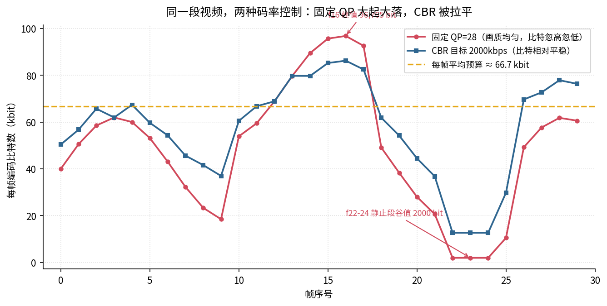
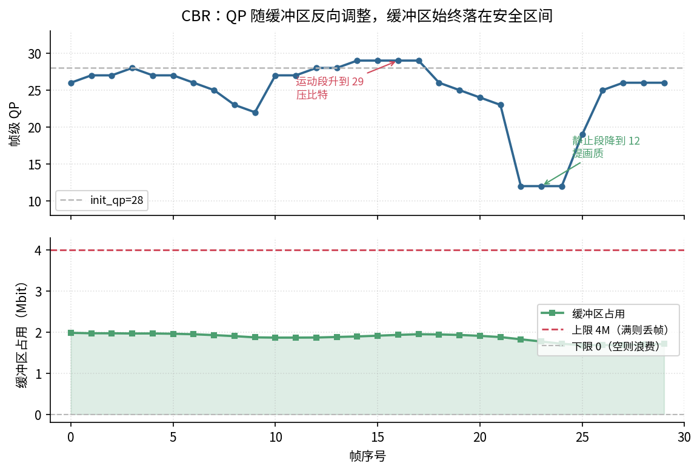
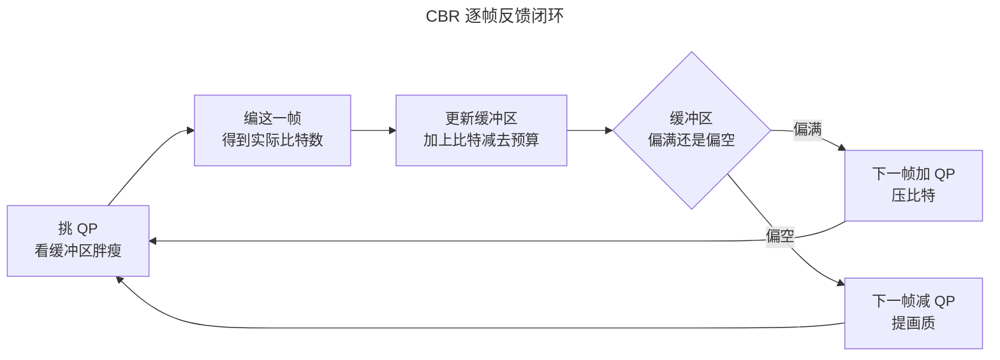

> 作者：Jone
> 日期：2026-09-12
> 风格：深度分析
> 状态：待发布

# 手搓 H.264 编码器 #05：码率控制，怎么让视频不超出带宽预算

先说结论：码率控制没有完美解。它是在"画质均匀"和"体积可控"之间走钢丝——想让每一帧都同样清晰，码率就会忽高忽低；想让码率稳稳压在带宽预算里，画质就得在帧间来回抖。你只能选一头，或者在两头之间找个折中。

这一篇就把这根钢丝拆开看：为什么固定 QP 会让码率飞起来，恒定码率 CBR 又是怎么用一个"漏桶"缓冲区把码率摁住的，代价是什么。所有对比都用真实跑出来的 30 帧数据说话。

先看这一篇在整条编码流水线里的位置：


码率控制不是流水线里一个独立的方块。它站在变换量化这一环的旁边，手里攥着 QP 这个旋钮——每编一帧之前，先决定这一帧的 QP 拧到多少。QP 一变，量化的狠劲就变，编出来的比特数跟着变。所以码率控制的全部工作，就是逐帧挑一个合适的 QP。

## 先看不控制会怎样：固定 QP 的码率会飞

最省事的策略，是每一帧都用同一个 QP。这叫固定 QP。

它的好处很实在：量化的狠劲从头到尾一样，画质在帧间是均匀的，不会这一帧清楚下一帧糊。做归档、做母带，固定 QP 是标准做法。

问题出在码率上。QP 定死了，但每一帧的画面复杂度是不一样的。静止的画面，残差小，编出来没几个比特；剧烈运动的画面，残差铺天盖地，同样的 QP 能编出几十倍的比特。

我拿一段复杂度有起伏的 30 帧序列跑了一遍固定 QP=28。中间 f10 到 f17 是一段剧烈运动，f22 到 f24 是一段几乎静止。结果比特数的范围是多少？从 2000 到 96765——最胖的一帧是最瘦的一帧的 48 倍。



看红线。运动段 f16 冲到 96765 比特的峰值，静止段 f22-f24 直接掉到 2000 比特的谷底。这条线像心电图一样上蹿下跳。

码率飘成这样，麻烦在哪？如果你要把视频塞进一条固定带宽的网络——比如实时直播、视频通话——网络管道的粗细是定死的。红线那些尖峰会瞬间超过管道容量，数据挤不过去，画面就卡、就花。谷底那些低谷又白白浪费了带宽。

固定 QP 画质是稳了，可它根本不管带宽死活。这就引出一个问题：能不能让码率也稳下来？

## CBR 的解法：用一个漏桶反向调 QP

恒定码率 CBR 的思路，说白了就是反着来——既然固定 QP 会让码率飘，那我就盯着码率，反过来动态调 QP。

先给一个每帧的平均预算。目标码率 2000 kbps，帧率 30，那每帧平均能花 `2000 * 1000 / 30 ≈ 66667` 比特。这是基准线。

但你不能要求每一帧都精确花 66667 比特——那不现实，复杂帧就是需要更多比特。CBR 的聪明之处，是允许单帧超支或省着花，只要长期平均能收敛到预算就行。为了记账，它引入一个缓冲区，也就是漏桶模型：

- 编完一帧，实际花了 `actual_bits`；
- 缓冲区占用累加 `actual_bits - 预算`：编超了缓冲涨，编少了缓冲落；
- 下一帧根据缓冲区的胖瘦反向调 QP——缓冲快满了就加 QP 压比特，缓冲空了就减 QP 提画质。

缓冲区就像一个蓄水池。复杂帧多花的比特先赊在池子里，等后面来了简单帧、少花比特，再把池子放掉。只要池子不溢出、不见底，码率就稳。

这套反馈，代码里就是挑 QP 那一段（`h264/encoder/rate_control.cpp`）：

```cpp
// CBR：以 init_qp 为中心，按缓冲区占用反向偏移。
double occupancy = buffer_fullness_ / buffer_size_;   // [0,1]，0.5=半满
occupancy = std::max(0.0, std::min(1.0, occupancy));

// 偏离半满越远，调整越猛。deviation ∈ [-0.5, +0.5]。
double deviation = occupancy - 0.5;
constexpr double kBufferGain = 18.0;
double qp_adjust = deviation * kBufferGain;   // 满时最多 +9，空时最多 -9
```

逻辑很直白。缓冲占用 occupancy 归一化到 0 到 1，半满是平衡点 0.5。偏满（deviation 为正）就加 QP，偏空（为负）就减 QP。系数 18 决定反馈力度：池子全满时最多加 9 个 QP，全空时最多减 9 个。

编完之后更新缓冲区，就是漏桶那一步：

```cpp
void RateController::UpdateAfterFrame(int actual_bits) {
    // 净增 = actual_bits - target：编超了缓冲涨，编少了缓冲落。
    buffer_fullness_ += static_cast<double>(actual_bits) - target_bits_per_frame_;
    // clamp：不能为负（欠载），不能超容量（过载会丢帧）。
    buffer_fullness_ = std::max(0.0, std::min(buffer_size_, buffer_fullness_));
    buffer_history_.push_back(buffer_fullness_);
}
```

回头看上面那张对比图的蓝线。同一段视频，CBR 把比特数的范围从 [2000, 96765] 收窄到了 [12699, 86208]。运动段的尖峰被削平了一截，静止段的谷底被抬了起来——原本 2000 比特的死寂帧，CBR 舍得多给点，画质不至于太差。心电图被熨得平了很多。

## 揭示性时刻：QP 和缓冲区，是一对反向咬合的齿轮

光看比特数被拉平，还不够过瘾。真正好看的，是 QP 和缓冲区这两条曲线怎么互相咬着走。

我把 CBR 这一跑里，每一帧挑的 QP 和当时的缓冲区占用画在一起：



上半张是 QP。它没有停在 28，而是在 [12, 29] 之间来回动。进入运动段（f10-f17），画面变复杂，编出来的比特多，缓冲区开始涨——反馈立刻把 QP 顶到 29，压住比特别让池子太满。到了静止段（f22-f24），画面几乎不动，比特少得可怜，缓冲区往下掉——反馈马上把 QP 砍到 12，趁机把省下的带宽换成画质。

下半张是缓冲区占用。注意它的范围：整段跑下来始终在 [1.68M, 1.98M] 之间起伏，稳稳落在安全区间 [0, 4M] 的中段。这个 4M 不是拍脑袋定的，是 2 秒的码率预算（`预算 * fps * 2`），HRD 里 CPB 缓冲区大小的教学化取值。池子既没有满到溢出（满了要丢帧），也没有空到见底（空了浪费带宽）。

把两张图叠起来看，就是这一篇最想让你看到的画面：**QP 曲线和缓冲区曲线，是一对反向咬合的齿轮**。缓冲一涨，QP 就顶上去把它摁回来；缓冲一落，QP 就降下来把它填回去。二者互为反馈，谁也不让谁跑偏。这就是 CBR 能把码率摁住的全部秘密——不是有什么神机妙算，就是一个缓冲区加一个反向调节。

但代价也在这张图里明明白白：看上半张 QP 那条线，它在抖。QP 从 12 跳到 29，意味着画质从很清晰跳到比较糊。固定 QP 那种"帧间画质均匀"的好处，CBR 是没有的。运动段被压糊、静止段被提清——你稳住了码率，就得接受画质在帧间来回波动。

钢丝的两头，就这么清清楚楚摆在两张图里。固定 QP：画质稳，码率飘。CBR：码率稳，画质飘。没有第三条路能两头都占。

## 反馈闭环长什么样

把 CBR 这套逻辑收成一张图，就是一个逐帧转的反馈闭环：



每一帧都走一圈：先看缓冲区的胖瘦挑 QP，编完拿到实际比特数，更新缓冲区，再根据缓冲区偏满还是偏空，决定下一帧 QP 往哪调。周而复始，码率就被这个环锁在目标附近。

工业级编码器（x264、x265）的码率控制比这复杂得多——有前瞻分析、有帧类型区别对待、有 ABR/CRF/两遍编码等一堆模式。但最内核那圈反馈，跟这张图是同构的：都是"实际比特 → 反馈信号 → 调下一帧的量化"。搞懂了这个漏桶，再去看那些高级模式，就知道它们是在这个骨架上加了多少层花活。

## 一句诚实的说明：这是原理演示，还没接进主编码循环

得把话说清楚，免得你误会。

这一篇的 `rate_control` 是一个**独立模块**，用一个简化的帧比特模型（`EstimateBitsForQp`）来"假装编码"——给定复杂度和 QP，用 `bits ≈ complexity * 2^(-(qp-28)/6)` 这条公式直接算出比特数，而不是真的跑一遍变换、量化、CAVLC。这条 QP 每加 6 比特减半的规律，和前面讲正向变换量化时那个"QP 每 +6 非零系数减半"是同源的，用来做原理演示足够真实。

所以上面所有曲线，是这个码率控制器在一段**模型序列**上跑出来的对比，不是把它接进整机去编一段真实视频的结果。目前这套编码器的主循环还只做单帧 I 帧，码率控制这个模块跑在自己的 demo 里，还没缝进 `encoder_main`。

为什么要单独拎出来讲？因为码率控制的策略本身——固定 QP vs CBR、漏桶反馈、QP 与缓冲区的反向咬合——是可以脱离具体编码细节独立成立的。把它先讲透，等后面主循环打通了，替换掉那个简化模型、换成真实编码的比特数，这套反馈骨架原样就能用。这种"先把策略讲清楚、再谈集成"的诚实，也是这个系列一贯的调子：能跑到哪说到哪，不假装搞定了全部。

顺带交代一个真实数字。这 30 帧跑下来，CBR 的长期平均码率是约 1711 kbps，比 2000 的目标低了 14%。原因是这段序列整体偏简单——大半帧在预算线以下，缓冲区一直没满，反馈没那么大动力去逼近上限。序列越长、复杂度越贴近满负荷，平均码率会越贴目标。这也说明一点：漏桶反馈保证的是"不超出预算、长期收敛"，不是"精确等于目标"。把码率死死钉在目标值上，那是更激进的策略要干的事。

## 小结

这一篇，我们给编码器补上了那个最关键的旋钮——码率控制。

三件事值得记住。一是固定 QP 的痛：画质均匀，但码率随复杂度大起大落，从 2000 到 96765 比特，走固定带宽的网络会爆。二是 CBR 的解法：给每帧一个平均预算，用漏桶缓冲区记账，缓冲偏满就加 QP、偏空就减 QP，把码率摁在目标附近。三是那个揭示——QP 曲线和缓冲区曲线是一对反向咬合的齿轮，你稳住码率的代价，就是画质在帧间来回抖。钢丝没有两头都占的走法。

到这里，H.264 编码的核心决策都拆过了：预测、变换量化、熵编码、运动搜索，再到这一篇的码率控制。零件基本齐了。

下一篇是这个系列的收官——封装码流。把编出来的这些 NAL 单元按 Annex B 拼成一条真正的 .h264，让它能被 ffmpeg 认出来、解得开。手写的这套东西，最后能不能吐出一条工业解码器认账的码流，下一篇见分晓。

[ITU-T H.264 官方标准（Advanced video coding，含 Annex C 假想参考解码器 HRD、CPB 缓冲区模型）](https://www.itu.int/rec/T-REC-H.264)

[Video bit rate control — Wikipedia（码率控制概述，CBR/VBR/CRF 对比）](https://en.wikipedia.org/wiki/Bit_rate#Video)

[Leaky bucket — Wikipedia（漏桶算法，缓冲区反馈的数学模型）](https://en.wikipedia.org/wiki/Leaky_bucket)

[x264 码率控制 ratecontrol.c（工业级实现，可对照 ABR/CRF/两遍编码）](https://code.videolan.org/videolan/x264/-/blob/master/encoder/ratecontrol.c)

[H.264 码率控制原理详解（雷霄骅博客，QP 与码率关系）](https://blog.csdn.net/leixiaohua1020/article/details/45871829)

[视频编码码率控制 CBR/VBR/CRF 详解（知乎专栏）](https://zhuanlan.zhihu.com/p/68584903)
