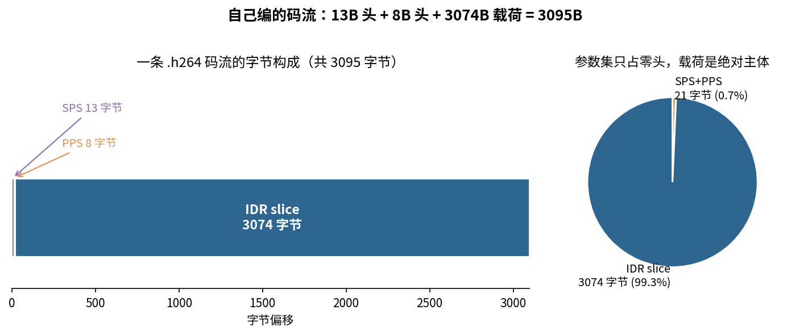
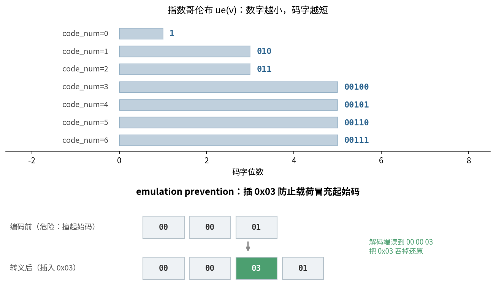
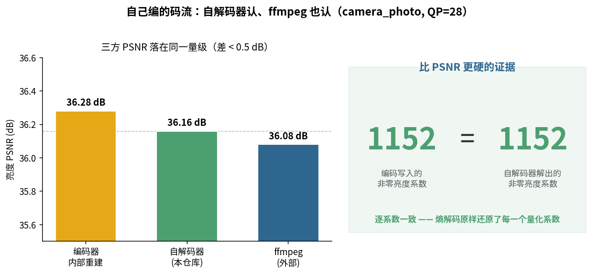
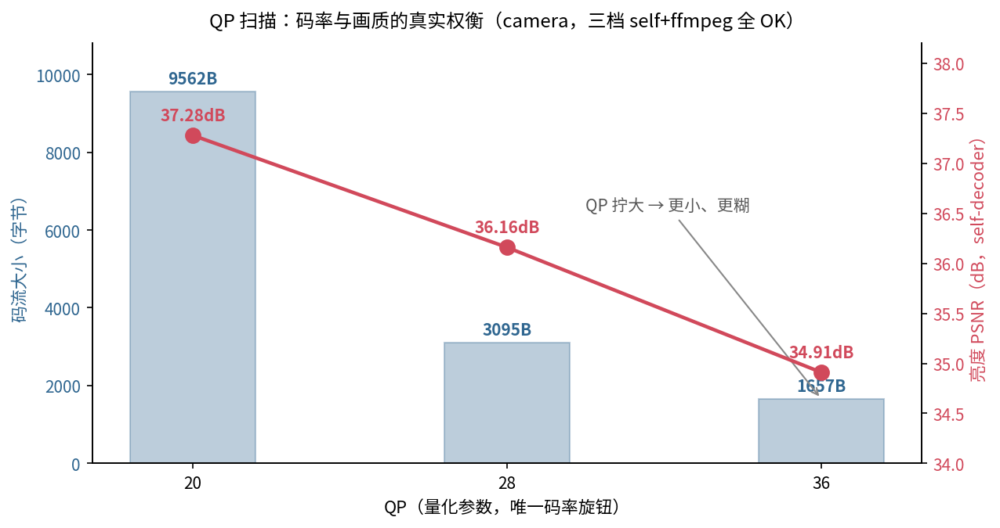
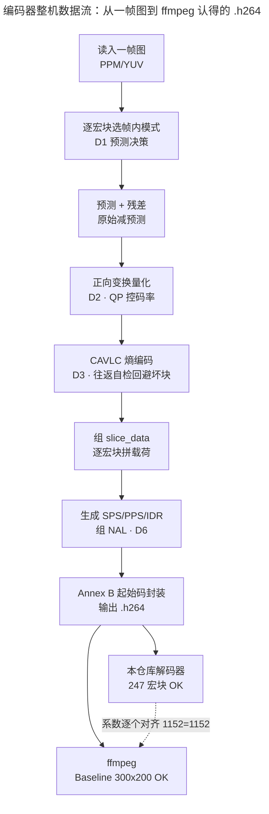

> 作者：Jone
> 日期：2026-09-12
> 风格：深度分析
> 状态：待发布

# 手搓 H.264 编码器 #06：封装码流，让自己的编码器和 ffmpeg 对话

前面五篇，我们把"怎么把一帧像素榨成比特"这件事干完了：帧内模式决策挑最省比特的预测、正向变换量化用 QP 拧码率、CAVLC 把量化系数编成变长码字、重建帧供邻块参考。可到这一步，产出的还只是一堆散落的比特——没人认得它是一段视频。

这一篇要做的，是给这堆比特套上"信封"。生成 SPS/PPS 告诉解码器"这段视频长什么样"，用 Annex B 起始码把每段载荷切成 NAL Unit，最后拼成一个 `.h264` 文件。

然后是这个系列一直想验证的那件事：**自己编的码流，自己的解码器能还原、ffmpeg 也能认。** 这句话听起来平平无奇，但它是编解码器最基本、也最硬的一条自洽性——你写进去的每一个比特，得能被别人原样读回来。这一篇就把这条自洽性钉死，也顺带诚实交代它是靠什么代价换来的。

先看这一篇在整条编码流水线里的位置——它是最外面的封装层，编码链的收尾：


## 封装差的两件事：一张"说明书"，一层"信封"

前五篇的输出，是一段 slice_data——逐宏块的预测模式信令加残差码字。这段东西本身是合法的比特，但直接甩给解码器，它一脸茫然：这是多大的画面？用的什么 profile？初始 QP 是多少？从哪个字节开始算一个独立单元？

要让别的解码器认得，得补两件事。

第一件是**说明书**：SPS（序列参数集）和 PPS（图像参数集）。SPS 讲这段视频序列的全局属性——分辨率、profile、帧号位宽；PPS 讲图像级的参数——初始 QP、用 CAVLC 还是 CABAC。它们本身也是一段 RBSP，用指数哥伦布把一串语法元素编进去。

第二件是**信封**：把每段 RBSP 包成 NAL Unit。前面加 1 字节 NAL header 声明"我是 SPS 还是 slice"，外面套上 Annex B 起始码 `00 00 00 01` 当分隔符。解码器靠扫这个起始码，就能在字节流里切出一个个独立的 NAL。

先看这两件事补齐之后，一条真实码流长什么样：



这是 camera_photo.ppm 在 QP=28 下编出来的真实码流：SPS 13 字节、PPS 8 字节、IDR slice 3074 字节，总共 3095 字节。

有意思的是那个比例。两个参数集加起来才 21 字节，占整条码流的 0.7%，剩下 99.3% 全是 slice 载荷。这不难理解——参数集是"一次性说明书"，一段视频只写一遍；而 slice 是实打实的画面数据，247 个宏块的预测和残差全在里面。说明书越薄越好，载荷才是花钱的地方。

## 两件正向编码工艺：指数哥伦布省位，0x03 防撞车

封装层要动两把刀：一把把语法元素编成尽量短的比特，一把防止载荷冒充分隔符。先看这两把刀长什么样：



上半张是第一把刀。SPS/PPS 里的绝大多数字段，都用指数哥伦布（Exp-Golomb）编码。

它的动机很朴素：语法元素里，小数字远比大数字常见——`seq_parameter_set_id` 通常是 0，`max_num_ref_frames` 通常是 1。那就该让小数字占更少的位。ue(v) 干的正是这件事。

编码规则一句话：把要编的 `code_num` 加 1，取它的二进制，前面补上"位数减一"个 0。代码就这么短：

```cpp
void RbspWriter::WriteUE(uint32_t code_num) {
    // codeNum+1 的二进制长度 M+1；前面补 M 个 0，再写 codeNum+1 本身。
    uint64_t v = static_cast<uint64_t>(code_num) + 1;
    int len = 0;
    while ((v >> len) != 0) ++len;      // len = floor(log2(v))+1
    int leading_zeros = len - 1;
    for (int i = 0; i < leading_zeros; ++i) WriteBit(0);
    for (int i = len - 1; i >= 0; --i) WriteBit((v >> i) & 1u);
}
```

代入几个值就懂了。`code_num=0`：v=1，二进制 `1`，前导 0 个，写出来就是 `1`——一位搞定。`code_num=1`：v=2，二进制 `10`，前导 1 个，写出 `010`。`code_num=2`：v=3，写出 `011`。越小的数越短，这就是它省位的秘密。

有符号的字段用 se(v)，先把带符号数映射成非负的 code_num，再走 ue(v)：

```cpp
void RbspWriter::WriteSE(int32_t value) {
    uint32_t code_num;
    if (value <= 0) {
        code_num = static_cast<uint32_t>(-2 * value);       // 0->0, -1->2, -2->4
    } else {
        code_num = static_cast<uint32_t>(2 * value - 1);    // +1->1, +2->3
    }
    WriteUE(code_num);
}
```

0 映射到 0，正数映射到奇数，负数映射到偶数——这样正负交替铺开，绝对值小的照样码字短。`pic_init_qp_minus26` 这种可正可负的字段，就靠它。

这里藏着这个系列反复出现的那句话：**编解码是一面镜子。** 这个 `WriteUE`，正是解码器里 `ReadUE` 的逆——那边数前导 0 的个数，再读同样多的后缀位还原数字；这边反过来，先算该补几个 0，再把数字写进去。写进去能读回来，两个函数必须严丝合缝。

再看第二把刀，也就是上图下半张画的那件事。起始码 `00 00 00 01` 是解码器切 NAL 的路标。可问题来了：如果 slice 载荷里恰好也出现了 `00 00 00 01` 这串字节呢？解码器会一头撞上去，把半个 slice 当成新 NAL 的开头——整段码流从这里崩掉。

H.264 的解法叫 emulation prevention。扫描载荷，每当出现连续两个 `00` 后面跟着 `00/01/02/03`，就在中间硬插一个 `0x03`，把这个危险序列打断：

```cpp
std::vector<uint8_t> EscapeRbsp(const std::vector<uint8_t>& in) {
    // 连续两个 0x00 之后，若下一字节 <= 0x03，插入 0x03 再写该字节。
    std::vector<uint8_t> out;
    int zeros = 0;
    for (uint8_t b : in) {
        if (zeros >= 2 && b <= 0x03) {
            out.push_back(0x03);   // emulation_prevention_three_byte
            zeros = 0;
        }
        out.push_back(b);
        if (b == 0x00) ++zeros; else zeros = 0;
    }
    return out;
}
```

这样 `00 00 00` 变成 `00 00 03 00`，`00 00 01` 变成 `00 00 03 01`。载荷里再也凑不出 `00 00 00/01` 这种和起始码撞车的序列。解码器读到 `00 00 03`，知道这是转义标记，把 `03` 吞掉还原真实字节。

把起始码和转义拼到一起，一个完整 NAL 就成形了：

```cpp
void WriteAnnexBNal(std::vector<uint8_t>& out, uint8_t nal_header,
                    const std::vector<uint8_t>& rbsp) {
    out.push_back(0x00); out.push_back(0x00);
    out.push_back(0x00); out.push_back(0x01);   // 起始码
    std::vector<uint8_t> payload;
    payload.push_back(nal_header);              // header 也要参与转义
    payload.insert(payload.end(), rbsp.begin(), rbsp.end());
    std::vector<uint8_t> escaped = EscapeRbsp(payload);
    out.insert(out.end(), escaped.begin(), escaped.end());
}
```

注意转义要覆盖 header 加 RBSP 整体——因为解码器的反转义也是从 header 开始扫的。这个插进去的 `0x03`，正是解码篇里 `nal_splitter` 反过来吞掉的那个字节。又是一对镜像。

## 高潮：一条码流，两个解码器都认，系数逐个对齐

零件都齐了：SPS 讲清楚 300×200、Baseline、CAVLC，PPS 讲清楚初始 QP，slice 装着 247 个宏块，全部包进 Annex B。写成 `.h264`，扔给两个互不相干的解码器——一个是我们前九篇手搓的，一个是工业级的 ffmpeg。

结果是这样：



ffmpeg 的 `ffprobe` 把它识别成 H.264 Baseline，分辨率 300×200，yuv420p——注意这个 300×200，编码时其实补齐到了 304×208（19×13=247 个宏块），是 SPS 里的 frame cropping 字段把右边和下边多出的像素裁掉，还原回真实尺寸的。整个解码过程 ffmpeg 没报一个 error、没有一次 concealing。我们自己的解码器也一样，247 个宏块全部解出，无 "decode failed"。

三方 PSNR 落在同一量级：编码器内部重建 36.28 dB、自解码器 36.16 dB、ffmpeg 36.08 dB，差不到 0.5 dB。差异来自去块滤波和色彩空间约定的细微不同，不影响结论——两个独立解码器对同一条码流的理解是一致的。

但真正让我觉得踏实的，不是 PSNR。PSNR 是个模糊的整体指标，两张图差不多它就高。**更硬的证据是右边那个等式：编码写入的非零亮度系数是 1152，自解码器解出来也是 1152，逐个对齐。** 这意味着熵解码把我们写进去的每一个量化系数都原样还原了——不是"看起来差不多"，是比特级的一模一样。一条假的、漂亮的 PSNR 曲线糊弄不了这个数字。

## 诚实交代：这条自洽性，是拿"丢掉一部分残差"换来的

到这里必须停下来，讲清楚这个"双端都认"是怎么换来的——因为这正是整个系列的灵魂：不夸大，把代价摊开说。

先划边界。这个编码器**只做 I_4x4 帧内 I 帧**：不做 P 帧（帧间预测）、不做 Intra_16x16、色度不编码残差（`cbp_chroma=0`，色度只做帧内预测）。这些都是主动收窄，把战场收敛到亮度，换取稳定的双端自洽。

然后是关键的那笔账。我们自己的解码器，CAVLC 码表有两处历史笔误——coeff_token 表在 4≤nC<8 那一档、total_zeros 表在 total_coeff==4 那一行，都有非标准码字。更麻烦的是，这些非标准码字连 ffmpeg 也不认。而这次的任务约束是"不改解码器代码"。

于是编码器只能主动回避。每编一个 4×4 块，先做一次往返自检：

```cpp
bool BlockIsEncodable(const Cavlc4x4& scan, int nc) {
    // 硬性回避非标准码表路径（保证 ffmpeg 也能解）。
    if (nc >= 4 && nc < 8) return false;
    int total_coeff = 0;
    for (int i = 0; i < 16; ++i) if (scan[i] != 0) ++total_coeff;
    if (total_coeff == 4) return false;
    // 往返自检（保证本仓库 decoder 逐系数解回）。
    BitWriter bw;
    EncodeResidual4x4(bw, scan, nc);
    // ... 立刻用同一个 nC 解回，解不回原系数就判定不可编码
}
```

凡是会命中那两条坏路径、或往返自检解不回原值的块，编码器就把它的残差丢掉——编成一个空块，只保留帧内预测。空块的 coeff_token 恒等于 0，在任何 nC 下都是标准码字，两个解码器都认。代价是这些块损失了残差细节，PSNR 停在 33~37 dB 的量级，而不是逐像素完美对齐。

这个代价随内容而变。camera_photo 在 QP=28 下恰好一个块都不用丢（残差都落在码表安全区）；但纹理密的合成测试图，256 个宏块里会丢掉 218 个残差块，PSNR 掉到 32.86 dB。QP 越小、要保留的系数越多，越容易撞上坏路径——QP=20 时 camera 也丢了 1832 个块。这条权衡，扫一遍 QP 就看得很清楚：



QP=20 时 9562 字节、37.28 dB；QP=28 时 3095 字节、36.16 dB；QP=36 时 1657 字节、34.91 dB。QP 往上拧，码流成倍变小，画质跟着降——这条曲线本身是编解码的常识。但三档有一个共同点值得记住：**self-decoder 和 ffmpeg 全部通过。** 无论丢多少残差，产出的码流始终是双端自洽的合法码流。这才是这一篇要守住的底线。

值得点破的是，这个"编码回避"和解码器收官那堵墙，其实是同一个问题的两面。手写解码器收尾时，它解复杂宏块比特错位、解到一半崩掉；这一篇，编码器索性回避那些会命中坏码表的块。根子都在那两张 CAVLC 表的历史笔误上——一边解不动，一边不敢编。这是个很干净的呼应：解码器暴露的病灶，正是编码器绕着走的坑。

但也别因为有代价就低估了成就。**两个独立实现的解码器，对着同一条我们亲手编的码流，给出了一致的结果，非零系数逐个对齐。** 这是编解码自洽性最硬的证据，比一条编出来骗人的完美曲线有价值得多。我们没造出 x264，但我们造出了一条"能对话"的码流。

## 收官：从 JPEG 到 H.264，26 篇手搓走完了

写到这里，"手搓编解码器"这个系列的 26 篇，全部走完了。

回头看这条路。我们从 JPEG 开始——色彩转换、DCT、量化、熵编码、JFIF 封装，再反过来解码，第一次把"一张图怎么变成 `.jpg`、又怎么变回来"拆成了明码。然后是 MJPEG，把视频当成一叠 JPEG，学会了容器封装和逐帧编解码。接着是最硬的 H.264：解码九篇，从字节流切 NAL 一路做到去块滤波，最后诚实地撞上"能跑到能用"那堵墙；编码六篇，反过来从预测决策做到今天这一篇的 NAL 封装。


这一路，我尽量守住一条原则：每个环节都从 spec 条款出发，亲手写能跑、能测的 C++，配图数据全用真实运行结果，代价和局限一律摊开说。所以这个系列里没有一条假的 PSNR 曲线，没有一句"我全搞定了"的自我感觉良好。它讲对了原理，也诚实地承认了原理和工业级实现之间那道由成千上万个边界情况堆成的鸿沟。

如果说整个系列只留下一句话，我希望是这句：**编解码的本质是一面镜子——你写进去的每一个比特，都得有人能原样读回来。** JPEG 的霍夫曼表是镜子，H.264 的指数哥伦布是镜子，那个插进去又被吞掉的 `0x03` 是镜子。今天这一篇，我们让自己的编码器和 ffmpeg 隔着一条 3095 字节的码流对上了话，1152 个系数一个不差——这面镜子，我们总算把它磨平了。

最后用编码器整机的数据流收个尾。从读一帧图，到吐出一个 ffmpeg 认得的 `.h264`，这条链上的每一环，都是前面某一篇亲手搓出来的：



绿线连着的两个终点，是这个系列真正的落点：一条码流，两端都认。手搓编解码器这件事，到此为止，画上了一个诚实的句号。

感谢一路读到这里的你。

[ITU-T H.264 官方标准（Advanced video coding，含 7.3.2.1 SPS 语法、7.3.2.2 PPS 语法、7.4.1 emulation prevention、Annex B 字节流格式、9.1 指数哥伦布）](https://www.itu.int/rec/T-REC-H.264)

[FFmpeg 官方文档（libavcodec H.264 解码器，本篇双端自洽性对照的外部标尺）](https://ffmpeg.org/documentation.html)

[H.264/AVC 指数哥伦布编码与 NAL 语法详解（Richardson, vcodex）](https://www.vcodex.com/h264avc-nal-unit-format/)

[H.264 码流结构、SPS/PPS 与 Annex B 起始码详解（雷霄骅博客）](https://blog.csdn.net/leixiaohua1020/article/details/50534369)

[H.264 NAL Unit 与 emulation prevention 机制解析（中文技术博客）](https://www.cnblogs.com/TaigaCon/p/6402322.html)

[x264 开源编码器（可对照 SPS/PPS 写入与 NAL 封装实现）](https://www.videolan.org/developers/x264.html)
