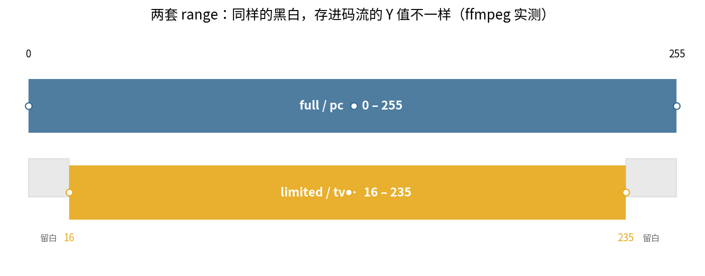
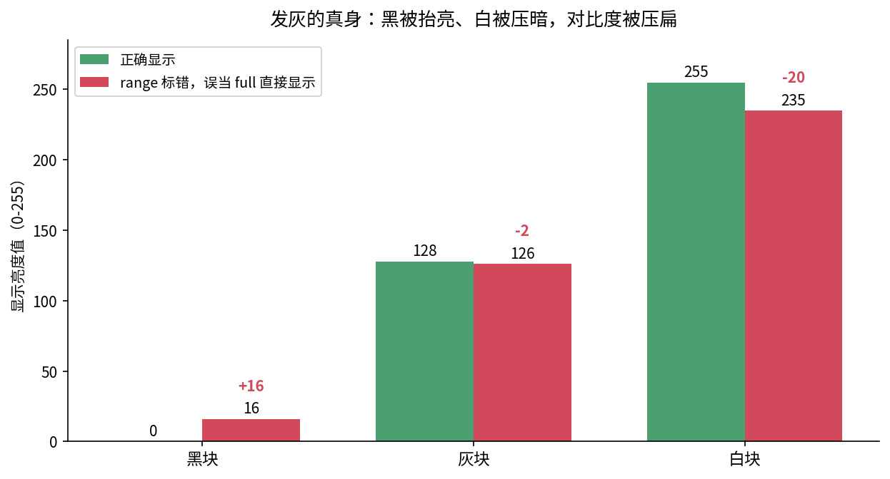
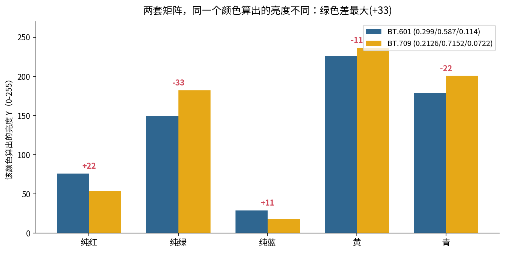
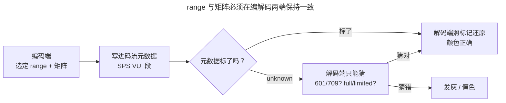

> 作者：Jone
> 日期：2026-09-12
> 风格：深度分析
> 状态：待发布

# 手搓编解码器·实战篇 #01：视频画面发灰，十有八九是这两个参数没对上

先说个真实的坑。你把一段视频交给转码流水线，出来的文件在自己电脑上看颜色正常，一放到网页播放器、或者投到电视上，整个画面就像蒙了一层灰——黑的不够黑，白的不够白，对比度像被谁按住了。

你回去查编码参数，码率、分辨率、profile 全对。可画面就是发灰。

这不是编码坏了。十有八九，是 **color range** 和 **色彩矩阵** 这两个参数，在编码端和解码端没对上。这一篇就把这两个天天见、又最容易被忽略的参数讲透，用 ffmpeg 实测的数字告诉你灰是怎么来的。

在手搓系列的 A1 里，我们把 RGB 转成了 YCbCr——当时用的是一套固定的转换公式。真实世界的麻烦在于：这套公式不止一套，而且"用了哪一套"这件事，必须两端说好。

## 同样的黑和白，存进码流的数字可以不一样

先讲 color range。它管的是一件很朴素的事：**一个 8 bit 的亮度值 Y，用 0-255 全部用满，还是只用 16-235 这一段？**

- **full range（也叫 pc range）**：0 是纯黑，255 是纯白，256 个刻度全用上。
- **limited range（也叫 tv range）**：16 才是纯黑，235 是纯白，两头各留一段"缓冲"。这是广播电视传下来的规矩，早年模拟信号怕过冲，给黑白两端留了余量。

同一张图，选哪套 range 编码，存进码流的数字是不同的。我拿一张只有黑(0)、灰(128)、白(255)三个色块的图，分别按两种 range 用 ffmpeg 编码，再把存进去的 Y 值读出来：



实测结果很干净：

```
range     black white gray
full      0     255   128
limited   16    235   126
```

full range 的黑就是 0、白就是 255；limited range 的黑变成了 16、白变成了 235。**同一个纯黑，一套存 0，一套存 16。** 这不是谁错了，两套都是合法的，只是约定不同。

关键在于：解码端拿到这串数字，必须知道它是按哪套 range 存的，才能正确还原成屏幕上的黑白。

## 发灰的真身：两端 range 没对上

现在坑来了。假设编码端按 limited range 存（黑=16，白=235），但下游播放器不知道，默认按 full range 处理——直接把 16 当成"16/255 的灰"、把 235 当成"235/255 的灰"显示出来。

会发生什么？我把这个错配的偏差算出来（数据就是上面实测的 Y 值）：



- 本该是纯黑的块（存储 Y=16），正确显示应该拉回 0，结果误当 full 直接显示成 16——**黑被抬亮了**。
- 本该是纯白的块（存储 Y=235），正确应该拉到 255，结果显示成 235——**白被压暗了**。
- 灰块几乎不动。

黑往上抬、白往下压，中间的灰不动——整个亮度范围被从两头挤扁了。对比度一垮，画面就"发灰"。这就是那层灰的全部来历：**不是丢了信息，是把 16-235 的数据当成 0-255 直接用了，少拉伸了那一下。**

反过来配错（full 数据被当 limited 拉伸）也一样出问题，只是方向相反——黑被压到负值截断成死黑、白被拉过头溢出，画面变成"高对比的硬邦邦"。

## 第二个坑：BT.601 还是 BT.709，绿色最先露馅

range 之外，还有一套参数：**色彩矩阵**，也就是 RGB 和 YUV 互转时用哪组系数。手搓 A1 里我们用了一组固定系数，但标准其实有好几套，最常见的是标清时代的 BT.601 和高清时代的 BT.709：

- **BT.601**：Y = 0.299·R + 0.587·G + 0.114·B
- **BT.709**：Y = 0.2126·R + 0.7152·G + 0.0722·B

系数不一样，同一个颜色算出来的亮度就不一样。我把几个典型纯色分别用两套系数算 Y：



差异最大的是绿色：BT.601 给绿的权重是 0.587，BT.709 是 0.7152，同一个纯绿算出来的 Y 差了整整 33。红色差 22，青色差 22。

后果是：如果编码端按 BT.709 把 RGB 转成 YUV，解码端却按 BT.601 转回 RGB，绿色和红色分量就会系统性偏移——画面**偏色**。通常表现为肤色发红或发绿，天空的蓝也不太对。分辨率越高越容易踩，因为高清素材默认 709，而很多老代码、老库默认还是 601。

说白了，range 管的是"黑白拉多开"，矩阵管的是"颜色怎么配"。一个配错发灰，一个配错偏色。

## 怎么排查：先看元数据标了没有

那实战里怎么定位？第一步永远是——**用 ffprobe 看这个文件到底标了什么**。

一个规范的文件，会把 range 和矩阵写进码流的元数据（H.264 里就是 SPS 的 VUI 段）。ffprobe 一读就知道：

```bash
ffprobe -v error -select_streams v \
  -show_entries stream=color_space,color_range,color_primaries,color_transfer file.mp4
```

标记齐全的文件长这样：

```
color_range=tv
color_space=bt709
```

但更多让你踩坑的文件，是这样的：

```
color_range=unknown
color_space=unknown
color_primaries=unknown
color_transfer=unknown
```

全是 `unknown`。这就是万恶之源——**编码时没标，下游只能猜**。而不同播放器猜的规则不一样：有的看分辨率猜（≥720p 猜 709，否则 601），有的一律默认 limited，有的默认 full。猜对了没事，猜错了就发灰或偏色。

把这条链画出来，问题一目了然：



排查口诀就三步：**一看源标了没（ffprobe），二看转码有没有把标记透传下去，三是编码时显式指定别让它猜。** 用 ffmpeg 编码时把参数钉死：

```bash
ffmpeg -i in.mov -c:v libx264 -pix_fmt yuv420p \
  -colorspace bt709 -color_primaries bt709 -color_trc bt709 \
  -color_range tv out.mp4
```

四个参数一个都别省。`-colorspace` 定矩阵，`-color_range` 定范围，另两个定原色和传递函数——它们会一起写进 VUI，下游就不用猜了。

## 小结

画面发灰、偏色，绝大多数不是"编码质量差"，是两个约定参数在编解码两端没对上：

一是 **color range**：full（0-255）还是 limited（16-235）。两端不一致，黑被抬亮、白被压暗，对比度压扁成灰。实测里同一个纯黑，一套存 0、一套存 16，差别就这么实在。

二是 **色彩矩阵**：BT.601 还是 BT.709。系数不同，同一个颜色算出的亮度能差几十，绿色最先露馅，配错就偏色。

而这一切的导火索，往往是编码时**没把这些参数标进元数据**，让下游去猜。排查先用 ffprobe 看标记，编码时用 `-colorspace`/`-color_range` 显式钉死。手搓 A1 里我们只转了一次 RGB↔YCbCr，真实工程里，这条转换链的每一环都得两端说好——这就是"参数"存在的意义：它是编码器写给解码器的一张便条，便条丢了或写错了，画面就出问题。

下一篇聊另一个天天配、又最容易配懵的参数：CBR、VBR、CRF，同样是"码率 2M"，为什么两个文件质量能差一大截。

[ITU-R BT.709 官方建议书（高清色彩矩阵与系数）](https://www.itu.int/rec/R-REC-BT.709)

[ITU-R BT.601 官方建议书（标清色彩矩阵与系数）](https://www.itu.int/rec/R-REC-BT.601)

[FFmpeg 色彩相关滤镜与参数文档（scale/colorspace/color_range）](https://ffmpeg.org/ffmpeg-filters.html)

[FFmpeg colorspace 转换指南（Trac Wiki）](https://trac.ffmpeg.org/wiki/colorspace)

[视频色彩空间与 range 详解（Kodi Wiki: Video color space）](https://kodi.wiki/view/Video_color_space)

[YUV 视频发灰/偏色问题分析（雷霄骅博客）](https://blog.csdn.net/leixiaohua1020/article/details/50534150)
