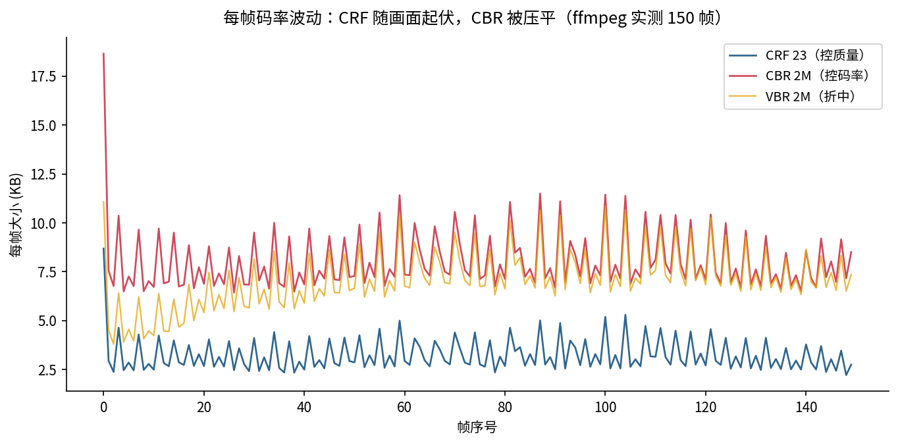
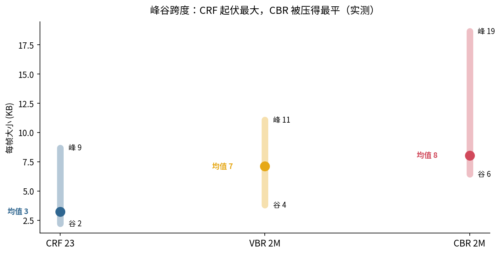
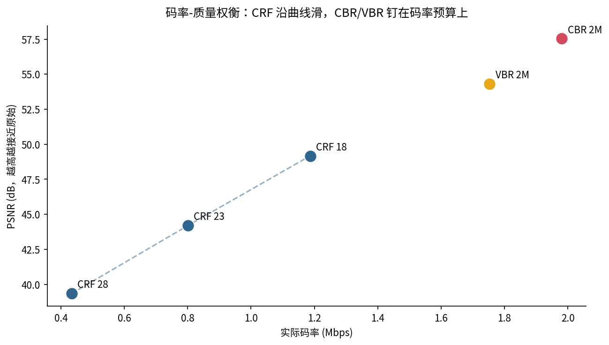
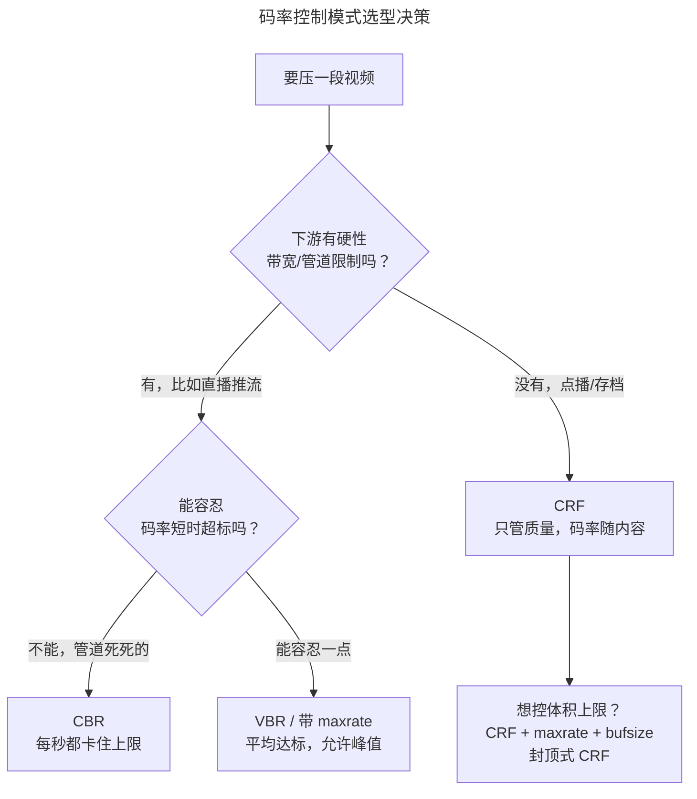

> 作者：Jone
> 日期：2026-09-12
> 风格：深度分析
> 状态：待发布

# 手搓编解码器·实战篇 #02：同样是"码率 2M"，为什么两个文件质量差一大截

又一个真实的坑。你交代同事"这批视频都压到 2Mbps"，结果拿回来一看：有的清晰锐利，有的糊成一片。参数明明都写了 `2M`，质量怎么会差这么多？

因为"2M"这三个字，在不同的码率控制模式下，意思根本不一样。有的模式把 2M 当成"雷打不动的管道宽度"，有的当成"长期平均、允许局部超标"，还有的压根不看码率、只看质量。搞不清 **CBR / VBR / CRF** 这三者的区别，就会一直踩这个坑。

之前手写 H.264 编码器时，我们亲手写过一个码率控制器——固定 QP 画质均匀但码率忽高忽低，CBR 用缓冲区反馈把码率压平。这一篇把这套逻辑放到 ffmpeg 的真实参数上，用实测数据看清三种模式到底在控什么。

## 三种模式，控的东西根本不是一回事

先把概念钉死。它们的根本区别是**"锁定"哪个变量**：

- **CRF（Constant Rate Factor，恒定质量因子）**：锁定**质量**。你给一个 0-51 的数（x264 默认 23，越小越清晰），编码器全程维持这个"视觉质量档位"，码率随画面复杂度自由浮动——简单画面自动少给比特，复杂画面自动多给。
- **CBR（Constant Bitrate，恒定码率）**：锁定**码率**。每一小段时间的码率都卡在目标值附近，画面再复杂也不让它超，代价是复杂段画质下降。
- **VBR（Variable Bitrate，可变码率 / ABR）**：锁定**长期平均码率**。允许局部忽高忽低，但整段平均下来贴近目标——CRF 和 CBR 的折中。

一句话：**CRF 控质量、CBR 控码率、VBR 控平均。** "2M"在 CBR 里是硬上限，在 VBR 里是平均值，在 CRF 里——压根没这个参数。

## 实测：每帧码率的波动，一眼就看出区别

概念讲完，看真东西。我用一段 640×360、150 帧的测试视频（含静止段和运动段），分别用 CRF 23、CBR 2M、VBR 2M 编码，然后用 ffprobe 把**每一帧的字节数**读出来画成曲线：



差别一目了然。CRF 那条线（蓝）随画面起伏最剧烈——画面简单的帧压得很小，复杂的帧允许涨上去，因为它只认"质量恒定"，不管码率怎么跳。CBR 那条线（红）被压得最平——不管画面怎么变，每帧大小都被摁在一个窄区间里。VBR（黄）介于两者之间。

把峰谷跨度量化出来，更直观：



CRF 的峰谷跨度最大——它放任码率随内容起伏。CBR 的跨度最小——它牺牲了"画质均匀"来换"码率均匀"。这正是手写码率控制器时那个揭示点在真实编码器上的复现：**你没法同时让画质和码率都均匀，摁住一个，另一个就得放开。**

## 那到底谁的质量更高？看这张权衡图

有意思的是，"质量"这件事，在这段素材上给出了一个反直觉的结果。我把三档 CRF 加上 CBR、VBR 的**实际码率和 PSNR** 画成散点：



先看 CRF 三档（蓝色虚线串起来）：CRF 18 码率 1.19M、PSNR 49.2，CRF 23 码率 0.80M、PSNR 44.2，CRF 28 码率 0.43M、PSNR 39.3。**这就是一条标准的码率-质量曲线**——想要更高质量，就得付更多码率，CRF 让你在这条曲线上自由选点。

再看 CBR 2M 和 VBR 2M：它们的实际码率被顶到了接近 2M（CBR 1.98M、VBR 1.75M），PSNR 反而更高（57.5 / 54.3）。

为什么 CBR 质量反而高？因为**这段素材不复杂，用 CRF 23 只需要 0.8M 就够了**，而我给 CBR 硬塞了 2M 的预算——多出来的一倍多码率，全砸在了这段本来不需要那么多比特的画面上，质量自然虚高。换句话说，CBR 在这里**浪费了码率**。这恰恰是 CBR 的典型代价：它不管内容需不需要，都按管道宽度灌满。

反过来，如果素材是一段高速运动的体育画面，2M 的 CBR 可能就不够用了，复杂段会糊——同一个"2M"，在不同内容上一个嫌多一个嫌少。这就是为什么"都压到 2M"会得到质量参差不齐的文件。

## 那实战里到底该选哪个

没有"最好"，只有"匹配场景"。选型看两个问题：**你的瓶颈是带宽管道，还是存储/质量？**



落到具体命令：

**点播 / 存档 / 转码**——用 CRF，最省心，质量恒定、体积自适应：

```bash
ffmpeg -i in.mp4 -c:v libx264 -preset medium -crf 23 out.mp4
```

**直播推流 / 固定带宽管道**——用 CBR，把码率钉死，宁可牺牲复杂段画质也不能超管道：

```bash
ffmpeg -i in.mp4 -c:v libx264 -b:v 2M -minrate 2M -maxrate 2M -bufsize 2M out.mp4
```

**既想要 CRF 的质量自适应、又怕体积失控**——用 CRF + 封顶（capped CRF），这是很多点播平台的实战选择：

```bash
ffmpeg -i in.mp4 -c:v libx264 -crf 23 -maxrate 4M -bufsize 8M out.mp4
```

`bufsize` 是关键——它就是手写码率控制器里那个缓冲区模型的大小，决定了码率允许在多长的时间窗里"借"和"还"。buffer 越大，瞬时码率越能起伏；越小，卡得越死。直播为了低延迟通常把 bufsize 设得和一秒码率相当，点播可以放宽。

## 小结

"码率 2M"是个模糊的说法，说清楚要先问：哪种模式的 2M？

- **CRF 控质量**：给一个质量档，码率随画面复杂度自由浮动。实测里它的每帧码率起伏最大，走的是一条标准的码率-质量曲线。点播、转码、存档首选。
- **CBR 控码率**：把每秒码率钉死在目标值，画面再复杂也不超。代价是画质随内容波动，且内容简单时会浪费码率（实测里 2M CBR 在简单素材上 PSNR 虚高）。直播和固定管道用。
- **VBR 控平均**：允许局部起伏、长期平均达标，两者的折中。

而那个把它们串起来的旋钮，就是我们手写码率控制器时那个**缓冲区**——`bufsize` 决定了码率能在多长的窗口里借还。理解了缓冲区，就理解了为什么 CBR 能压平码率、CRF 为什么能任性起伏。

下一篇聊 GOP 和关键帧间隔：为什么你拖动进度条要卡一下、直播首屏要等几秒才出画。

[FFmpeg H.264 编码指南（CRF / CBR / 两遍编码详解，官方 Trac Wiki）](https://trac.ffmpeg.org/wiki/Encode/H.264)

[x264 完整参数说明（rate control 相关：crf/bitrate/vbv）](http://www.chaneru.com/Roku/HLS/X264_Settings.htm)

[FFmpeg 码率控制文档（-b/-maxrate/-bufsize 语义）](https://ffmpeg.org/ffmpeg-codecs.html)

[VBV / bufsize 与码率控制原理（x264 开发文档）](https://www.videolan.org/developers/x264.html)

[码率控制模式 CBR/VBR/CRF 对比（雷霄骅博客）](https://blog.csdn.net/leixiaohua1020/article/details/45536607)

[H.264 码率控制与 CRF 原理详解（知乎专栏）](https://zhuanlan.zhihu.com/p/28372170)
