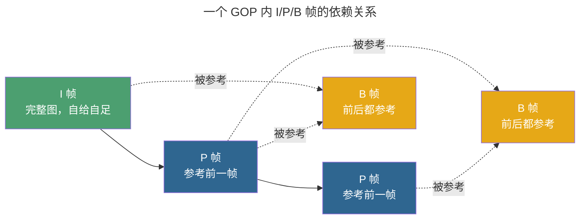
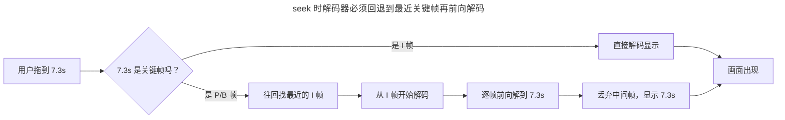
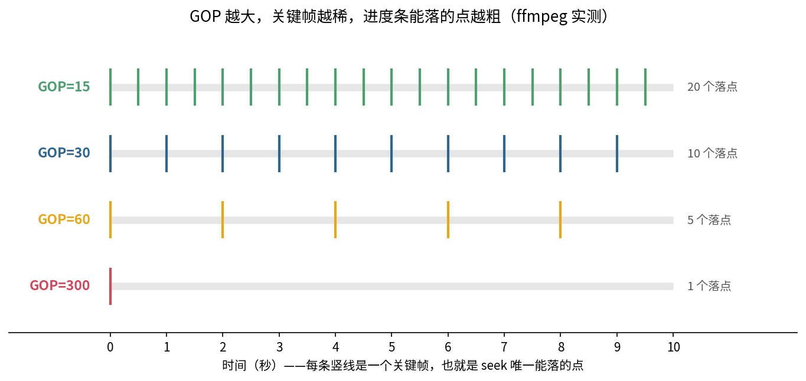
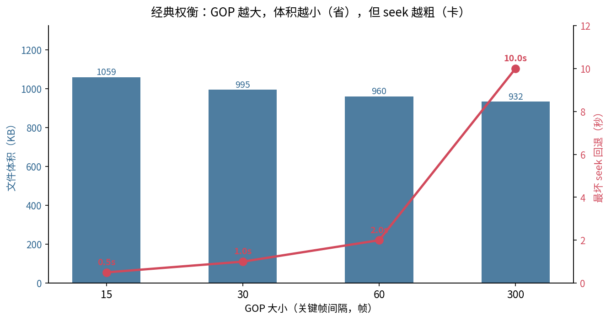
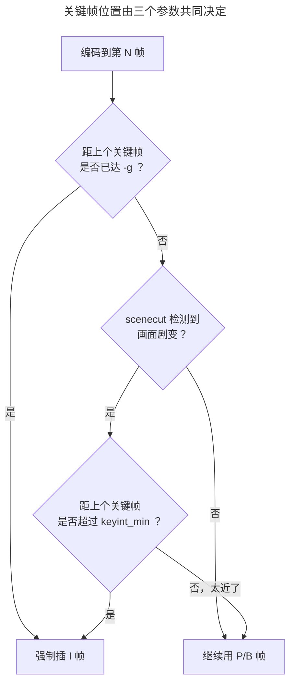
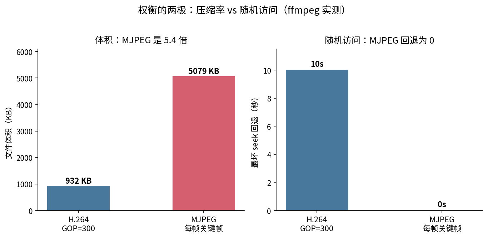

> 作者：Jone
> 日期：2026-09-12
> 风格：深度分析
> 状态：待发布

# 手搓编解码器·实战篇 #03：拖进度条为什么会卡？关键帧间隔在作怪

先说三个你八成遇到过的坑。

拖进度条，明明松手了，画面还要卡半秒才刷新。看直播，点进去黑屏，等两三秒才出第一帧画面。剪视频，想在某一帧精确切一刀，工具却把切点偷偷挪到了别处。

这三件事看起来八竿子打不着，其实是同一个东西在背后作祟：**关键帧间隔**，也就是 GOP。搞懂它，这三个坑一次填平。

## 先认清三种帧：不是每一帧都能单独解出来

视频编码为什么能把体积压这么小？靠的是"帧间不重复"。一段画面里，相邻两帧大部分内容是一样的，只有局部在动。既然大部分没变，那就别每帧都存全图，只存"变化的那点差异"就行。

这就分出了三种帧：

- **I 帧（Intra，帧内编码）**：一张完整的图，不依赖任何别的帧，自己就能解出来。它就是关键帧。其中带 IDR 标记的 I 帧还会清空参考缓冲，之后的帧不准再回头引用它之前的内容——这是"干净的切断点"。
- **P 帧（Predicted，前向预测）**：只存"相对前面某帧变了什么"。要解它，必须先有它依赖的那帧。
- **B 帧（Bi-directional，双向预测）**：更省，同时参考前面和后面的帧算差异，压得最狠，但依赖也最多。

一组"以 I 帧开头、后面跟着一串 P/B 帧"的画面，就叫一个 **GOP（Group of Pictures，画面组）**。我用 ffprobe 数了一下实测文件里的帧类型，一个 30 帧 GOP 的视频，300 帧里只有 10 个 I 帧，其余是 90 个 P 帧和 200 个 B 帧——真正"自给自足"的完整图，只占 3%。

一个 GOP 内部的依赖关系长这样——I 帧是根，P 帧顺着往后指，B 帧两头都要参考：



关键结论来了：**只有 I 帧能被单独解码，P/B 帧离开了它依赖的帧就是一堆废字节。** 记住这句，后面所有的坑都是它的推论。

## seek 为什么卡？因为它只能落在关键帧上

现在回到"拖进度条卡半秒"。

你把进度条拖到第 7.3 秒，播放器想直接从 7.3 秒那一帧开始放。可那一帧大概率是个 P 帧或 B 帧——它只存了"相对前面的差异"，单独解不出来。播放器怎么办？它只能**往回退，退到 7.3 秒之前最近的那个关键帧**，从那儿开始解码，一帧一帧往前解，一直解到 7.3 秒，才敢把画面显示出来。



这一段"回退 + 逐帧解码"就是卡顿的来源。你要显示 1 帧，实际上偷偷解了一整串帧。关键帧越稀，回退的距离越长，卡得越久。

我用 ffmpeg 实测了这件事。同一段 640×360、30fps、10 秒的素材，分别用不同的关键帧间隔编码，再用 ffprobe 把关键帧的位置全读出来，画在时间轴上：



一眼就懂。GOP=15 时，10 秒里有 20 个关键帧，进度条几乎想落哪就落哪；GOP=300 时，整段 10 秒只有 1 个关键帧（在最开头），你拖到任何位置，播放器都得从头解码到那儿。这就是**seek 粒度**——关键帧越密，落点越精细；越稀，落点越粗。

剪辑切不准帧也是同理。很多剪辑软件为了快，做的是"关键帧级 seek"，你以为切在了第 137 帧，它其实切在了最近的关键帧上。想帧级精确，要么用每帧都是关键帧的格式，要么让软件强制逐帧解码（慢）。

## 那把关键帧堆密一点不就好了？代价在体积上

你可能会想：那我把 GOP 设小一点、关键帧堆密一点，seek 不就快了、直播首屏不就秒开了？

对，但天下没有免费的午餐。**I 帧是完整图，不做帧间压缩，体积比 P/B 帧大得多。** 关键帧堆得越密，等于往码流里塞越多的"完整图"，文件就越大、码率越高。

这不是拍脑袋，是实测。同一段素材，我只改 `-g`（关键帧间隔），其余参数全锁死，用 ffprobe 读出每个文件的真实体积和最坏 seek 回退时间：



数字摆出来看得更清楚：

| GOP | 关键帧数 | 最坏 seek 回退 | 文件体积 | 相对 GOP=15 |
|-----|---------|---------------|---------|------------|
| 15  | 20      | 0.5s（15 帧） | 1059 KB | 基准 |
| 30  | 10      | 1.0s（30 帧） | 995 KB  | −6.0% |
| 60  | 5       | 2.0s（60 帧） | 960 KB  | −9.3% |
| 300 | 1       | 10.0s（300 帧）| 932 KB  | −11.9% |

规律一目了然：**GOP 从 15 拉到 300，文件小了近 12%，但最坏情况下 seek 要回退的距离从 0.5 秒暴涨到 10 秒。** 这就是那个经典权衡——

**压缩率 vs 随机访问，你没法同时要。** 关键帧越稀，压得越狠、越省空间，但随机访问（seek、首屏、切帧）的粒度越粗、代价越大。关键帧越密，随机访问越爽，但越占空间。摁住一头，另一头就翘起来。

这也顺带解释了"直播首屏黑屏几秒"。直播播放器接进流的时候，位置是随机的——它必须等到下一个关键帧到来，才能解出第一帧完整画面。关键帧间隔 2 秒，最坏就得等快 2 秒。这就是为什么直播的推流建议把 GOP 设小（常见 1～2 秒一个关键帧），宁可多花点码率，也要让观众点进来快点出画。

说白了就是：**GOP 这个旋钮，一端拧向"省"，一端拧向"快"。** 你得看自己的场景卡在哪头。

## ffmpeg 里到底怎么调这个旋钮

概念清楚了，落到命令上。核心就几个参数：

- **`-g`（keyint，最大关键帧间隔）**：多少帧至少插一个 I 帧。30fps 下 `-g 60` 就是"最多 2 秒一个关键帧"。这是最主要的旋钮。
- **`-keyint_min`（最小间隔）**：两个关键帧至少隔多远，防止场景切换时关键帧插得太频繁。
- **`-sc_threshold`（scenecut，场景切换检测）**：默认开启。编码器发现画面剧烈变化（比如镜头切换）时，会主动插一个 I 帧——因为这时候用 P 帧预测已经不划算了。设为 0 可以关掉，得到严格等距的关键帧（我上面的实测就关了它，为了让 GOP 结构干净可比）。

这几个参数怎么协同决定关键帧落在哪，可以这么理解：



还有一对容易被忽略但很关键的概念：**closed GOP vs open GOP**。

- **closed GOP（闭合）**：每个 GOP 自成一体，里面的帧绝不引用前一个 GOP 的内容。切换、拼接、seek 都干净利落，落到任何一个 GOP 开头都能独立解。代价是压缩率略低。
- **open GOP（开放）**：GOP 边界处的 B 帧允许"跨界"引用前一个 GOP 的帧，压缩率更高。但这会让 seek 和剪辑拼接变复杂——落点处可能还依赖着上一组的帧。

一句话记：**要拼接、要精确剪辑、要方便 seek，用 closed GOP；纯追压缩率，open GOP 更省。** 直播和 HLS/DASH 切片场景基本都用 closed GOP，因为每个切片必须能独立解码。

常见配方：

**直播推流**——GOP 小、closed、关场景检测（让关键帧严格等距，方便切片对齐）：

```bash
ffmpeg -i in -c:v libx264 -g 60 -keyint_min 60 -sc_threshold 0 \
  -flags +cgop -f flv rtmp://...
```

**点播 / 存档**——GOP 可以放大省体积，保留场景检测让画面切换处自动插关键帧：

```bash
ffmpeg -i in.mp4 -c:v libx264 -g 250 out.mp4
```

**HLS 切片**——关键帧间隔要和切片时长对齐，否则切片切不干净：

```bash
ffmpeg -i in.mp4 -c:v libx264 -g 48 -keyint_min 48 -sc_threshold 0 \
  -hls_time 2 -f hls out.m3u8
```

## 顺便说个极端：MJPEG 为什么 seek 巨快但巨占空间

还记得手搓系列 B3 里我们亲手写的 MJPEG 吗？它的每一帧都是一张独立的 JPEG——换句话说，**每一帧都是关键帧**。

我把同一段素材也编码成 MJPEG 量了一下：300 帧里有 300 个关键帧，seek 回退永远是 0（想落哪落哪，帧级精确），但文件体积是 H.264（GOP=300）的 **5.4 倍**。

这正是"压缩率 vs 随机访问"权衡的另一个极端。H.264 靠 P/B 帧疯狂压缩，代价是随机访问要回退解码；MJPEG 放弃一切帧间压缩，换来了随机访问的极致自由。C 系列里我们手搓的 I/P 帧机制，就是在这两极之间找平衡——用少量 I 帧当锚点，中间靠 P 帧省空间。GOP 这个参数，本质就是在决定"锚点插多密"。



理解了这一点，你就能反过来看那些工程选择：为什么监控录像常用较大 GOP（省存储，反正很少精确 seek）；为什么专业剪辑素材偏爱全 I 帧或小 GOP（切帧要准）；为什么直播 GOP 要小（首屏要快）。全是同一个旋钮，拧向了不同的场景需求。

## 小结

拖进度条卡、直播首屏慢、剪辑切不准——三个坑，一个根源：**seek 只能落在关键帧上，落点之间的帧都得靠回退解码补出来。**

- **三种帧**：I 帧是完整图（关键帧），P/B 帧只存差异、离开依赖帧就是废字节。一个以 I 帧开头的画面组就是 GOP。
- **seek 的代价**：拖到非关键帧，播放器必须回退到前一个关键帧再逐帧解上来。关键帧越稀，回退越远，越卡。实测 GOP=300 时最坏要回退整整 10 秒。
- **经典权衡**：GOP 越大，压缩率越高、越省体积（实测省近 12%），但 seek 粒度越粗、首屏越慢。压缩率和随机访问，摁住一头翘起另一头。
- **调参**：`-g` 是主旋钮，直播用小 GOP + closed GOP 求快，点播用大 GOP 求省，HLS 让关键帧对齐切片。MJPEG 是"每帧关键帧"的另一极端。

E 系列到这儿，我们已经把码率（E2）和关键帧结构（E3）这两个最影响体积和体验的旋钮拆开看了。下一篇聊 Profile 与 Level：为什么你的视频在电脑上好好的，一到某些老设备或电视盒子上就播不了、或者直接黑屏——那是解码器能力和码流特性没对上。

[FFmpeg H.264 编码指南（-g / keyint / GOP 结构，官方 Trac Wiki）](https://trac.ffmpeg.org/wiki/Encode/H.264)

[x264 完整参数说明（keyint / min-keyint / scenecut / open-gop 语义）](http://www.chaneru.com/Roku/HLS/X264_Settings.htm)

[FFmpeg 编码器文档（-g / -keyint_min / -sc_threshold / -flags cgop）](https://ffmpeg.org/ffmpeg-codecs.html)

[HLS 切片与关键帧对齐要求（Apple HLS 创作规范）](https://developer.apple.com/documentation/http-live-streaming)

[I/P/B 帧与 GOP 结构详解（雷霄骅 CSDN 博客）](https://blog.csdn.net/leixiaohua1020/article/details/28874041)

[视频关键帧、GOP 与 seek 原理（知乎专栏）](https://zhuanlan.zhihu.com/p/74593305)
