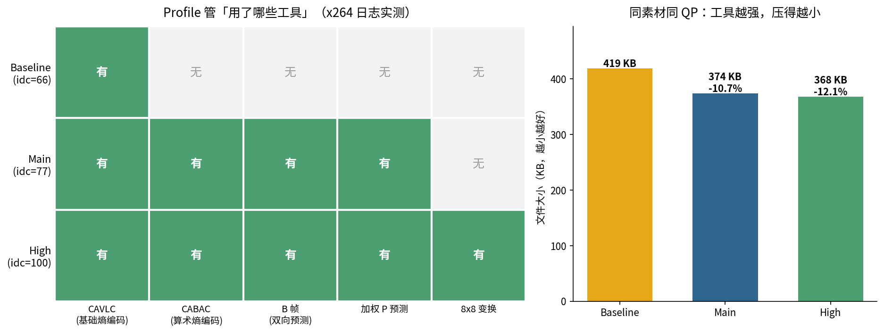
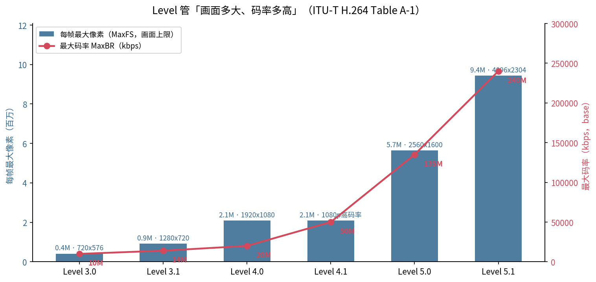
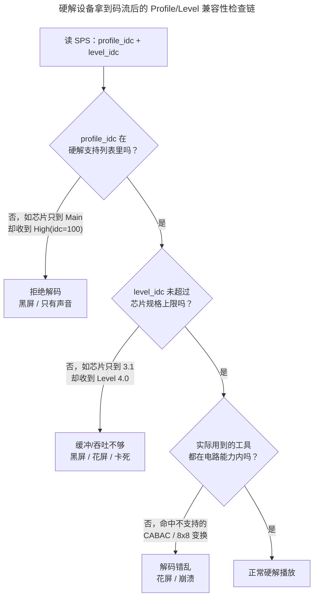

> 作者：Jone
> 日期：2026-09-12
> 风格：深度分析
> 状态：待发布

# 手搓编解码器·实战篇 #04：为什么老电视解不了你的普通 1080p

先说个真实的坑。同事导出一个 1080p 的 H.264 视频发到群里，大家在新手机上看得好好的，画质清晰、播放流畅。结果客户那台老电视、还有会议室那个老机顶盒，一放：黑屏，或者只有声音没画面。

文件没坏，分辨率也不高，1080p 现在连千元机都随手拍。为什么"普通 1080p"到了老设备上就解不动了？

答案藏在两个平时没人注意的参数里：**Profile** 和 **Level**。它们不改一个像素，却决定了这个码流"用了哪些编码工具"和"画面能有多大多快"。老设备的硬解芯片是块固定电路，只认特定的工具和规格——你的码流一旦用了它不认的东西，它就罢工。

手搓系列里我们碰过这俩的影子：C 系列写解码器时，明确只做 **Baseline Profile** 的 I/P 帧，把 CABAC、B 帧统统排除在外；D6 生成 SPS 时，亲手往码流里写了 `profile_idc` 和 `level_idc` 两个字节。这一篇把这两个字节掰开，用 ffmpeg 实测看清它们到底管什么。

## Profile 管「你用了哪些工具」

先把概念钉死：**Profile 规定这条码流允许用哪些编码工具。**

H.264 有一大堆压缩工具——熵编码、B 帧、变换尺寸、加权预测……Profile 就是把这些工具打包分档。常见三档：

- **Baseline**：最朴素的一档。只有 CAVLC 熵编码，没有 B 帧，没有 8x8 变换。工具少、解码简单，老设备、低端芯片都能扛。
- **Main**：打开 CABAC（算术熵编码，压缩率更高）和 B 帧（双向预测）。
- **High**：在 Main 基础上再加 8x8 变换等工具，压缩效率最高，是今天绝大多数 1080p 视频的默认档。

空口无凭，直接实测。我用同一段 720p 素材，同样的固定量化（`-qp 26`），只改 `-profile:v`，编成三个文件：

```bash
ffmpeg -i src.mp4 -c:v libx264 -qp 26 -profile:v baseline hd_baseline.mp4
ffmpeg -i src.mp4 -c:v libx264 -qp 26 -profile:v main     hd_main.mp4
ffmpeg -i src.mp4 -c:v libx264 -qp 26 -profile:v high     hd_high.mp4
```

然后从 x264 的编码日志里，把每个 profile 实际启用的工具逐项抠出来。结果非常干净：



日志原文一目了然。Baseline 那行是 `cabac=0 ... 8x8dct=0 ... bframes=0 weightp=0`——全关。Main 变成 `cabac=1 ... bframes=3 weightp=2`，但 `8x8dct=0` 还是关的。High 则是 `cabac=1 8x8dct=1 bframes=3`——全开。

这就是"工具集"三个字的实测证据：**Profile 越高，允许动用的工具越多。**

工具多了有什么好处？看右边的体积对比（同素材、同 QP，越小越好）：Baseline 419 KB，Main 374 KB，High 368 KB。High 比 Baseline 小了 12.1%。

有意思的是那个跳变的节奏。从 Baseline 到 Main 一下省了 10.7%——因为一次性打开了 CABAC 和 B 帧，这俩最能压。而 Main 到 High 只再省 1.6%——8x8 变换有用，但边际收益已经很小。**大头在 CABAC 和 B 帧，8x8 变换是锦上添花。** 这也解释了为什么老设备最容易卡在 CABAC 上：它是压缩收益最大、也最难用硬件解的工具。

回头看手搓的 C 系列。我们当初只做 Baseline，不是偷懒，是因为 Baseline 的工具最少、解码路径最短——手写解码器能在有限篇幅里跑通。你现在明白了：**我们其实是在实现「老设备硬解芯片认识的那一档」。**

## Level 管「画面能有多大多快」

Profile 管工具，那 Level 管什么？**Level 规定这条码流的画面规格上限：分辨率、帧率、码率、能缓存几帧参考帧。**

打个比方。Profile 像"你会用哪些招式"，Level 像"你的场地有多大、体力上限多高"。招式再花哨，场地不够大也施展不开。

Level 的具体数值写在 ITU-T H.264 标准的 Annex A、Table A-1 里，一张硬邦邦的表。我把关键档位画成阶梯：



表里几个关键字段：

- **MaxFS**：每帧最大宏块数（1 宏块 = 16x16 像素），决定画面能多大。
- **MaxMBPS**：每秒最大宏块数，决定"分辨率 × 帧率"的乘积上限。
- **MaxBR**：最大码率。
- **MaxDpbMbs**：解码缓冲区上限，决定能缓存几帧参考帧。

拿几个档位算笔账就通透了。Level 3.0 的 MaxFS 是 1620 宏块，恰好装下 720x576；MaxMBPS 40500 除以 1620，等于每秒 25 帧——所以 3.0 大致就是"标清 @25fps"。Level 3.1 的 MaxFS 提到 3600，正好是 1280x720，30fps。到了 Level 4.0，MaxFS 8192，才装得下 1920x1080（8160 宏块）。

**这就是"1080p 归 Level 4.0"的由来。** 你的普通 1080p 视频，编码器默认会给它标上 Level 4.0。

我用 ffmpeg 实测验证了这个自动升档——分辨率越高，libx264 写进 SPS 的 `level_idc` 越大：

```
640x480   -> level_idc = 30  (Level 3.0)
1280x720  -> level_idc = 31  (Level 3.1)
1920x1080 -> level_idc = 40  (Level 4.0)
```

那如果硬把 1080p 塞进一个装不下的低 Level 呢？我试着给 1080p 强制 `-level 3.0`，x264 直接甩出三行报错：

```
frame MB size (120x68) > level limit (1620)
MB rate (204000) > level limit (40500)
DPB size (8160 mbs) > level limit (8100 mbs)
```

翻译一下：1080p 是 120x68 = 8160 个宏块，远超 Level 3.0 的 1620；每秒宏块数 8160x25 = 204000，也远超 40500。画面太大、吞吐太快，两条硬上限全爆了。**一个只支持到 Level 3.0 的老机顶盒，拿到你的 Level 4.0 码流，缓冲区和吞吐能力根本不够，自然解不动。**

## 硬解设备到底怎么"挑"这两个参数

现在把两条线合起来，还原老电视黑屏的完整现场。

硬解和软解有个根本区别。软解是 CPU 跑代码，理论上什么工具都能实现，慢点而已。硬解是一块固定功能的电路（ASIC），出厂时电路里"焊死"了它支持的 Profile 工具集和 Level 规格上限——多一个工具的晶体管都没有。

所以硬解设备拿到一条码流，第一件事不是解码，是**查 SPS 里的 profile_idc 和 level_idc，做兼容性检查**：



黑屏或只有声音，往往就卡在第一道关：视频轨的 Profile 用了芯片不认的工具（最常见是 High profile 的 CABAC 或 8x8 变换），电路直接放弃视频、只把音频轨交给音频解码器——于是"有声无画"。

那怎么救？既然问题是 Profile 太高、Level 太大，**转码时把它们压到老设备认的档就行**：

```bash
ffmpeg -i in.mp4 -c:v libx264 -profile:v baseline -level 3.1 \
  -maxrate 14M -bufsize 14M out.mp4
```

`-profile:v baseline` 让编码器只用最朴素的工具集（关掉 CABAC、B 帧、8x8 变换），`-level 3.1` 把规格上限钉在老设备扛得住的档，`maxrate/bufsize` 配合 Level 的码率上限。代价是文件会变大、压缩效率变低——这正是我们前面实测的那 12%，是为"能在老设备上放出来"付的兼容税。

这也让 D6 那两个字节有了着落。当初编码器生成 SPS，往里写 `profile_idc` 和 `level_idc`，写的就是"我这条码流用了哪一档工具、需要多大规格的解码器"。**这两个字节不是装饰，是码流递给解码器的一张身份证——硬解设备就是靠它决定收不收货。**

## 小结

老设备解不了你的"普通 1080p"，八成不是分辨率的锅，是 Profile 和 Level 这两个参数没对齐硬解芯片的能力：

- **Profile 管工具集**：Baseline / Main / High 逐档打开 CABAC、B 帧、8x8 变换。实测里 High 比 Baseline 小 12%，但大头收益来自 CABAC + B 帧。老设备黑屏，多半是 Profile 用了它硬解不支持的工具。
- **Level 管画面规格上限**：分辨率、帧率、码率、缓冲帧数，数值写死在 Annex A Table A-1。1080p 默认落在 Level 4.0，老机顶盒只到 3.1 就顶不住。
- **硬解芯片是固定电路**，出厂焊死支持的档。它拿到码流先查 SPS 的 profile_idc / level_idc，任何一关不过就罢工。救法是转码降档，代价是牺牲压缩效率。

手搓 C 系列只做 Baseline，D6 往 SPS 写这两个字节——现在你知道那是在为"最朴素、最兼容的那一档"打地基。

前一篇我们聊了 GOP 和关键帧，为什么 seek 会卡。这里绕不开一个词：**B 帧**。它是 Main/High 才有的工具，压缩率高，却会让"解码顺序"和"显示顺序"对不上，进而引出下一篇的坑——转封装后时间戳跳变、播放器报 "non-monotonic DTS"。下一篇就来拆 B 帧和 PTS/DTS：为什么画面的解码顺序，跟你看到的顺序不是一回事。

[ITU-T Rec. H.264 (视频编码标准正文，Annex A Table A-1 规定各 Level 上限)](https://www.itu.int/rec/T-REC-H.264)

[FFmpeg libavcodec/h264_levels.c（源码逐行复刻 Table A-1，可核对 MaxMBPS/MaxFS/MaxBR）](https://github.com/FFmpeg/FFmpeg/blob/master/libavcodec/h264_levels.c)

[FFmpeg H.264 编码指南（-profile:v / -level 用法，官方 Trac Wiki）](https://trac.ffmpeg.org/wiki/Encode/H.264)

[H.264 Profiles 与 Levels 详解（维基百科，含 profile_idc 取值与各 Level 分辨率对照）](https://en.wikipedia.org/wiki/Advanced_Video_Coding)

[H.264 Profile 与 Level 通俗讲解（雷霄骅博客，中文）](https://blog.csdn.net/leixiaohua1020/article/details/42132601)

[一文看懂 H.264 的 Profile 和 Level（知乎专栏，中文）](https://zhuanlan.zhihu.com/p/338528509)
