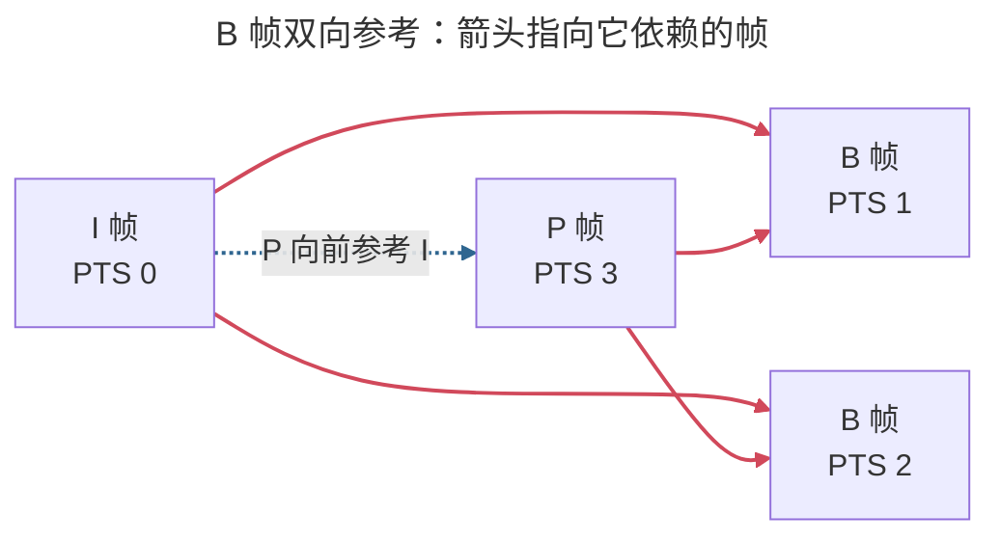
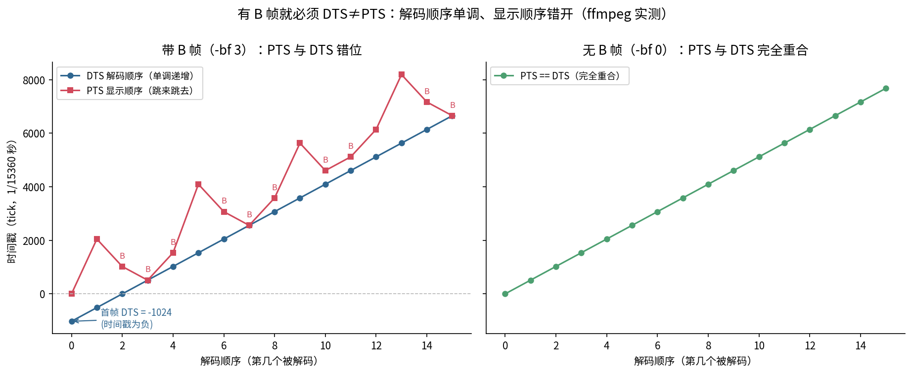
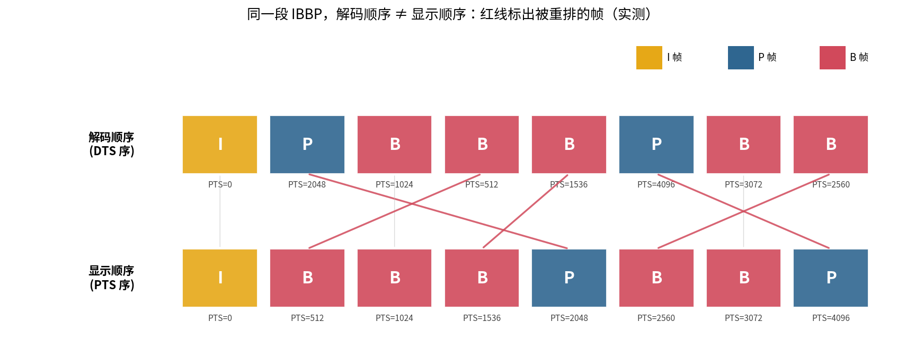
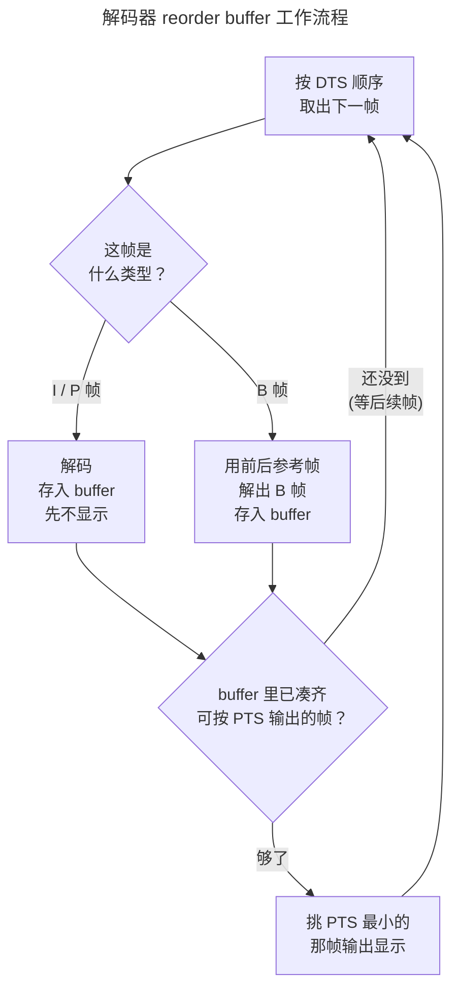
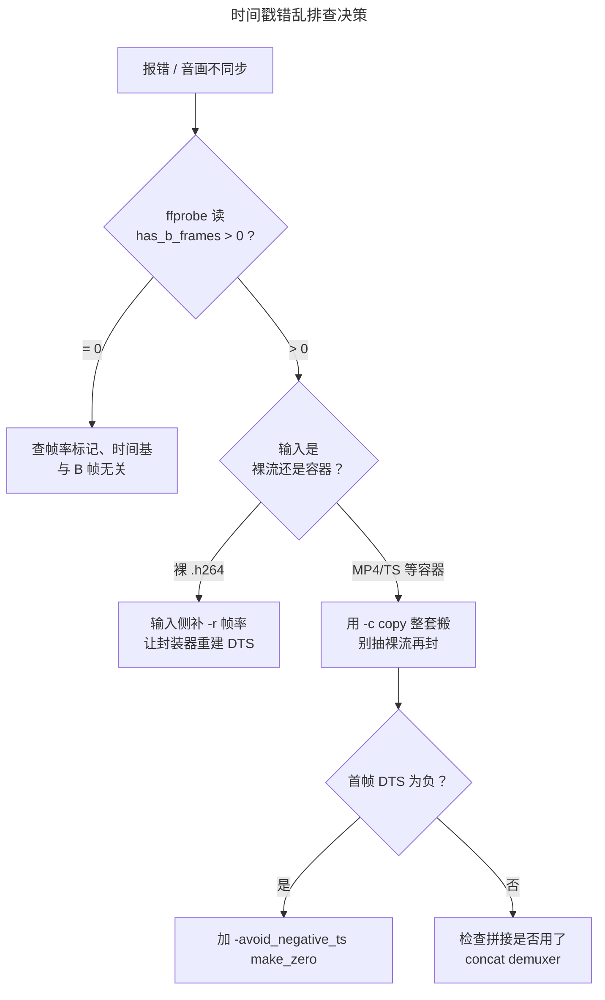

> 作者：Jone
> 日期：2026-09-12
> 风格：深度分析
> 状态：待发布

# 手搓编解码器·实战篇 #05：时间戳为什么会乱？B 帧让解码顺序不等于显示顺序

又一个让人抓狂的坑。

你把两段 H.264 拼在一起，或者从 MP4 转封装成 TS，命令跑完没报错。一播放，画面卡顿、音画对不上，控制台还刷出一行红字：

```
non-monotonic DTS in output stream; this may result in incorrect timestamps
```

再一查，首帧的时间戳居然是负数。你明明什么都没改，只是"换了个盒子装"，时间戳怎么就乱了？

根子在一个你可能一直忽略的东西：**B 帧**。有 B 帧的码流，解码顺序和显示顺序根本不是一回事。转封装时只要没把这套顺序原样搬过去，时间戳立刻错乱。

这一篇用 ffmpeg 实测，把这套"解码序 ≠ 显示序"的机制掰开看清楚。也顺便补上之前手写 H.264 解码器时欠的一笔——当时我们明确只做 I 帧和 P 帧，**故意不碰 B 帧**。为什么躲着它？因为 B 帧一进来，时间戳这摊事就复杂了。

## B 帧要参考后面的帧，所以必须先解后面的

先说清楚 B 帧是什么。

I 帧自己就能解，不依赖别人。P 帧（Predicted）向前参考——它拿前面已经解出来的帧做预测，只存差异。B 帧（Bi-directional，双向预测）更狠：它**同时参考前面和后面的帧**。

问题就出在"后面"这两个字。

假设显示顺序是 I B B P。B 帧要参考它后面那个 P 帧，可 P 帧这会儿还没解出来呢。怎么办？只能**先把后面的 P 解出来，再回头解中间的 B**。于是码流里帧的排列就变成了 I P B B——P 被提到了 B 前面。

这就是揭示点：**因为 B 帧要参考未来的帧，解码器必须先解未来那一帧，导致"解码顺序"和"显示顺序"对不上。** 解码器拿到的顺序（解码序），和你眼睛看到的顺序（显示序），是两套。

把参考方向画出来就很直观——B 帧的箭头同时指向前后两个方向，这正是它必须"先解后面"的根源：



红箭头是 B 帧的双向参考：它既要前面的 I、又要后面的 P。P 还没解出来，B 就无从下手——只能把 P 提前解。

那解码器怎么知道每帧"什么时候解、什么时候显示"？靠两个时间戳：

- **DTS（Decode Time Stamp，解码时间戳）**：告诉解码器"按这个顺序解"。
- **PTS（Presentation Time Stamp，显示时间戳）**：告诉播放器"按这个顺序显示"。

没有 B 帧时，两者一模一样，谁在意都行。**一旦有 B 帧，PTS 和 DTS 就必须错开**——因为解码顺序和显示顺序本来就不同，得用两个独立的时间轴分别记。

## 实测：有 B 帧，PTS 就跟 DTS 错位

概念说完，看真数据。我用 ffmpeg 造两个视频，同一段素材，唯一差别是 B 帧数量：

```bash
# 带 B 帧：-bf 3（最多 3 个连续 B 帧）
ffmpeg -i src.y4m -c:v libx264 -g 12 -bf 3 -b_strategy 0 bframe.mp4
# 无 B 帧：-bf 0
ffmpeg -i src.y4m -c:v libx264 -g 12 -bf 0 nobframe.mp4
```

`-bf` 就是控制 B 帧数量的参数。然后用 ffprobe 把每一帧的 PTS、DTS 按**解码顺序**读出来（读的是 packet 层，它保留解码序），画成曲线：



左边带 B 帧的图，一眼就看出问题。蓝线（DTS）是**笔直单调递增**的——解码器就按这个顺序一帧一帧解，从不回头。红线（PTS）却**上蹿下跳**：每碰到一个 B 帧（标了 B 的点），PTS 就往回缩一下，因为它的显示时刻比刚解出来的那帧要早。两条线只有在没被重排的帧上才碰头。

右边无 B 帧的图，就一条线——PTS 和 DTS 完全重合。60 帧里，带 B 帧的有 50 帧 PTS≠DTS，无 B 帧的一帧都不差。

还有个细节值得盯一眼：**带 B 帧那条 DTS 线，起点是负的**。实测首帧 DTS = -1024，换算成秒是 -0.0667。这不是 bug——因为解码器要提前缓冲几帧才能开始按 PTS 输出，为了让第一帧的 PTS 从 0 开始，DTS 只能往前挪到负数区。这正是很多人遇到的"首帧时间戳为负"的来源，它是 B 帧的正常副产品，不是错误。

ffprobe 读 `has_b_frames` 能直接确认这套机制：

```
bframe.mp4:   has_b_frames=2
nobframe.mp4: has_b_frames=0
```

`has_b_frames=2` 不是说有 2 个 B 帧，而是说**解码器需要缓冲 2 帧**才能正确重排输出——这个数就是"重排序延迟"。数越大，播放器为了理顺顺序要囤的帧越多，首帧延迟也越高。

## reorder buffer：解码器怎么把顺序理回来

那播放器拿到这堆错位的帧，是怎么还原成正常顺序播出去的？

靠一个**重排序缓冲区（reorder buffer）**。它的活儿说白了就一句：**按 DTS 收进来解码，攒够了再按 PTS 挑最早的吐出去。**

我把实测的前 8 帧拎出来，解码顺序和显示顺序两行摆一起看：



红线标出的就是被重排的帧。看第一个 P 帧（PTS=2048）：它在**解码序里排第 1**（紧跟 I 帧之后就被解），可在**显示序里排到第 4**。中间那三个 B 帧（PTS 512、1024、1536）解码时排在 P 后面，显示时却要插到 P 前面去。这条条交叉的红线，就是 reorder buffer 每天在干的事。

工作流程串起来是这样：



关键在于：收到 P 帧时，解码器**先解不显示**——因为按显示顺序，它前面还有几个 B 帧没解呢。等把这些 B 帧都解完，reorder buffer 里凑齐了一段连续的 PTS，才按 PTS 从小到大依次输出。`has_b_frames` 那个数，就是这个 buffer 至少要囤多少帧。

现在回头看那个 non-monotonic DTS 报错就通了。转封装（remux）本该把每帧的 PTS/DTS 原样搬到新容器里。可如果你走的是"抽出裸流再重新封装"这条路——实测把 `bframe.mp4` 抽成裸 H.264（Annex-B）后，ffprobe 读它的时间戳全是 `N/A`：

```
raw.h264 每帧: pts=N/A, dts=N/A
```

**裸码流根本不带 PTS/DTS，时间戳是容器（MP4/TS/MKV）存的。** 一旦裸流重新进容器，封装器得重新生成 DTS。它要是不懂这段流有 B 帧、按显示顺序硬生生编号，DTS 就不再单调，报错随之而来。音画不同步同理——音频轨按自己的时间走，视频这边 PTS 一乱，两条轨就对不齐了。

## 那实战里到底怎么躲开这些坑

拆成几条能直接用的：

**转封装优先让 ffmpeg 自己搬时间戳，别自己抽裸流。** 能一步 remux 就别两步：

```bash
ffmpeg -i in.mp4 -c copy out.ts
```

`-c copy` 不重新编码，ffmpeg 会把 PTS/DTS 成套搬过去。只有当你确实拿到的是裸 `.h264`/`.264` 文件时，才需要在输入侧补帧率让它重建时间戳：

```bash
ffmpeg -r 30 -i raw.h264 -c copy out.mp4
```

**遇到首帧负时间戳报错，用这个参数把整条时间轴平移到 0 起点：**

```bash
ffmpeg -i in.mp4 -c copy -avoid_negative_ts make_zero out.mp4
```

**拼接有 B 帧的片段，别用管道 `cat` 或 protocol concat，用 concat demuxer**，它懂得每段的时间戳该怎么接：

```bash
ffmpeg -f concat -safe 0 -i list.txt -c copy out.mp4
```

**排查时先 `ffprobe` 一眼 `has_b_frames`。** 是 0，那时间戳乱多半是别的原因（帧率标错、时间基没对齐）；大于 0，就重点查 PTS/DTS 有没有在转封装时被弄丢或重编号。整个排查思路可以顺着这条线走：




最省事的思路其实是：**如果你的场景根本不需要 B 帧的那点压缩收益，直接 `-bf 0` 关掉。** 没有 B 帧，PTS 恒等于 DTS，转封装、拼接、seek 全都简单，也不会有负时间戳。这正是之前手写解码器时的选择——我们只做 I/P，不做 B，解码器逻辑清爽得多，不用维护 reorder buffer，也不用操心两套时间戳。代价是压缩率略低。B 帧能省 10%~20% 码率，但换来的是这一整套顺序管理的复杂度。**要不要 B 帧，本质是拿工程复杂度换压缩率。**

## 小结

时间戳错乱这个坑，追到底就是一句话：**有 B 帧，解码顺序就不等于显示顺序，PTS 和 DTS 必须分开记。**

- **B 帧要参考后面的帧**，所以解码器得先解后面的、再解 B 帧，解码序因此和显示序错开。
- **DTS 管解码顺序（实测里单调递增），PTS 管显示顺序（跳来跳去）**。有 B 帧就必然 PTS≠DTS，首帧 DTS 还可能为负，这都是正常的。
- **reorder buffer** 负责收进来按 DTS、吐出去按 PTS，`has_b_frames` 就是它的缓冲深度。
- 时间戳乱、non-monotonic DTS、音画不同步，多半是转封装时没把这套顺序原样保留——裸码流不带时间戳，全靠容器。用 `-c copy` 整套搬、`-avoid_negative_ts` 校零、concat demuxer 拼接，能躲开大部分坑。

回望整个实战篇：E1 讲色彩标记、E2 讲码率控制、E3 讲 GOP 与 seek、E4 讲 Profile/Level 的兼容，到这篇的 B 帧与时间戳——它们其实是同一个元问题的不同侧面：**编码时做的某个决定（用哪套色彩、给多少码率、多久一个关键帧、开不开 B 帧），解码端和转封装环节必须原样知道，否则就出岔子。** 下一篇是收官，我们把码率、分辨率、帧率放到一起：带宽预算就那么多，这三者到底怎么分，"清晰度"的钱花在哪最值。

[FFmpeg 时间戳与 -avoid_negative_ts 文档（官方）](https://ffmpeg.org/ffmpeg-formats.html)

[FFmpeg concat demuxer 拼接指南（官方 Trac Wiki）](https://trac.ffmpeg.org/wiki/Concatenate)

[ITU-T H.264 标准（B 帧双向预测与图像重排序，Annex C 定义 DPB）](https://www.itu.int/rec/T-REC-H.264)

[H.264/AVC 中的 B 帧与参考帧管理（x264 开发文档）](https://www.videolan.org/developers/x264.html)

[PTS 与 DTS 到底是什么：视频时间戳详解（雷霄骅博客）](https://blog.csdn.net/leixiaohua1020/article/details/11955049)

[B 帧、解码顺序与显示顺序的关系（知乎专栏）](https://zhuanlan.zhihu.com/p/97621078)
