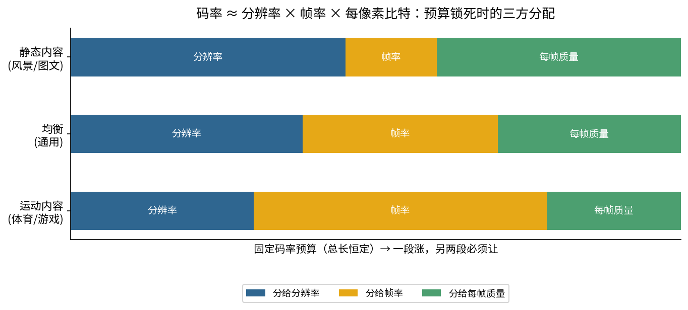
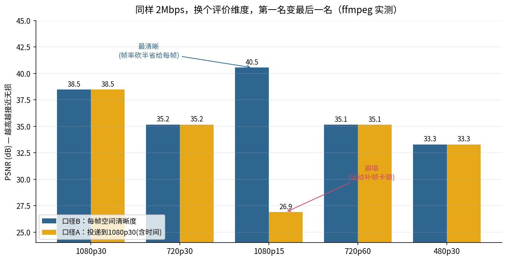
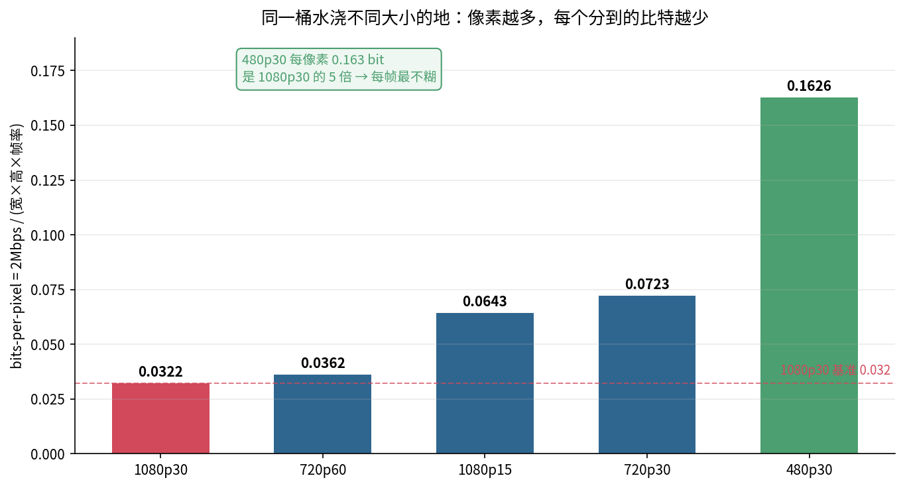
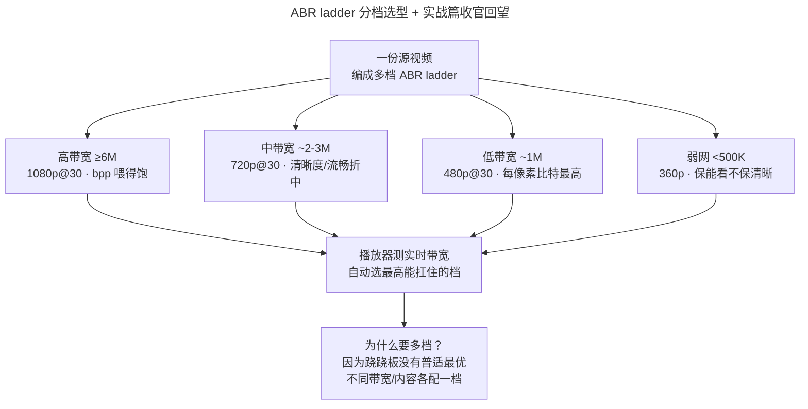
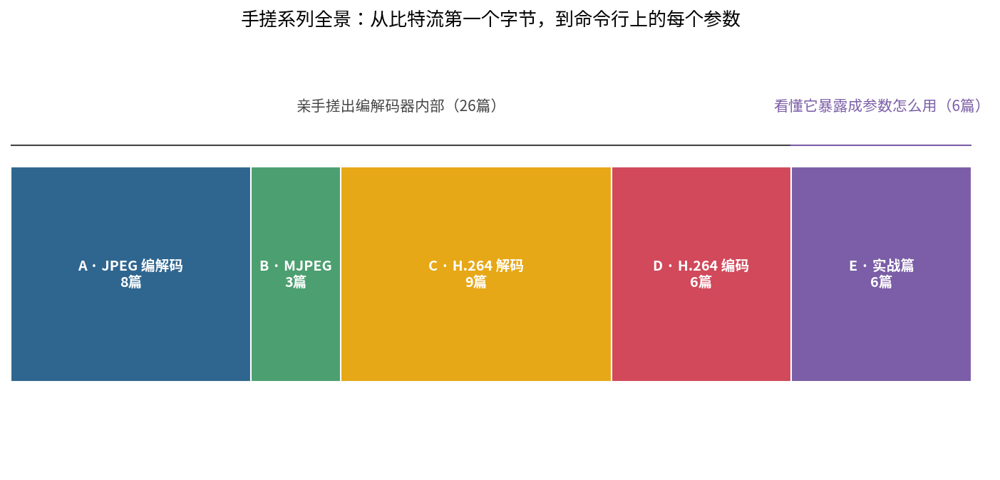

> 作者：Jone
> 日期：2026-09-12
> 风格：深度分析
> 状态：待发布

# 手搓编解码器·实战篇 #06：带宽只有 2M，清晰度的钱该花在哪

收官篇。先说一个真实的坑。

产品说："弱网用户多，视频码率就给 2Mbps 吧。"然后问题来了——这 2M，是压 1080p@30 好，还是 720p@30，还是 1080p@15？

有人拍脑袋："当然 1080p 啊，分辨率高清晰。"结果上线一看，1080p@30 那档糊成一片，边缘全是马赛克，反而 720p 那档干干净净。产品懵了：分辨率明明更高，怎么更糊？

因为码率是一桶固定的水，分辨率和帧率决定了你要浇多大一块地。地越大，每寸土分到的水越少。2M 的预算摊到 1080p@30 的六千万像素/秒上，每个像素只喝到一点点；同样 2M 摊到 480p@30，每个像素能喝饱。**清晰度的钱花在哪最值，不是分辨率越高越好这么简单。**

这也是整个实战篇要收的尾。前五篇我们把手搓阶段搓出来的那些内部机制，一个个放到 ffmpeg 的真实参数上验证：色彩范围（E1）、码率控制模式（E2）、GOP 与关键帧（E3）、Profile/Level（E4）、B 帧与 PTS/DTS（E5）。这一篇是最"产品经理"的一篇——不谈码流内部，只谈一个纯工程决策：**给定带宽预算，分辨率、帧率、质量三者怎么分配。** 全程用 ffmpeg 实测，数据都是真跑出来的。

## 三个参数是一根跷跷板，不是三个独立旋钮

先把关系钉死。视频的数据量，本质是这么个乘法：

**码率 ≈ 分辨率 × 帧率 × 每像素比特（bits-per-pixel）**

- **分辨率**：一帧有多少像素（1920×1080 vs 1280×720）。
- **帧率**：一秒有多少帧（30fps vs 15fps）。
- **每像素比特**：平均每个像素分到多少 bit——它直接决定单个像素编得有多"精细"，是清晰度的物理来源。

现在关键点来了：**当码率被带宽预算锁死，这个乘法的左边是个常数。** 左边固定，右边三个数就不能各自随便涨——一个涨，另外的必须降。这就是跷跷板。

想要 1080p 的高分辨率？像素总数暴涨，每像素比特就被摊薄，单个像素编得糙，画面就糊。想要 60fps 的流畅？帧数翻倍，每帧分到的码率减半。想要每帧都清晰锐利？那分辨率和帧率就得让路。

用 ffmpeg 的三个参数就能拧这三个旋钮：

```bash
# -s 或 -vf scale 控分辨率，-r 或 fps 滤镜控帧率，-b:v 控码率预算
ffmpeg -i in.mp4 -vf "scale=1280:720,fps=30" \
  -c:v libx264 -b:v 2M -maxrate 2M -bufsize 4M out.mp4
```

`-b:v 2M` 是预算天花板，`scale` 和 `fps` 决定你把这 2M 摊到多大的地上。说白了，你调的从来不是"清晰度"这一个旋钮，而是在三个互相拉扯的量之间做分配。



这张示意图画的就是这个分配逻辑：总长（码率预算）恒定，静态内容把更多份额分给分辨率和每帧质量，运动内容把份额挪给帧率。一段变长，另两段必须缩短——这就是跷跷板。

这里要接上前面聊过的几个老朋友。讲码率控制那篇提到过，`bufsize` 就是手写编码器里那个缓冲区模型的大小——它决定码率能在多长的窗口里借还。而 `-b:v` 背后拧的那颗螺丝，是手写 H.264 编码器时那个 **QP**：QP 每加 6，量化步长翻倍，码率大致减半。所谓"每像素比特被摊薄"，落到编码器内部，就是率控为了不超预算，把 QP 调大、把更多高频系数量化成零。手写阶段那颗看不见的螺丝，这里暴露成了 `-b:v` 和分辨率的博弈。

## 实测：同样 2M，换个评价维度，第一名变最后一名

概念讲完，看真东西。

我造了一段 1080p@30、10 秒的测试源（`testsrc2`，带滚动条和移动色块，有实实在在的运动），用 qp 0 编了个近无损版本当"地面真值"。然后把它压成五种组合，**全部锁定 2Mbps 预算**（`-b:v 2M -maxrate 2M -bufsize 4M`）：1080p30、720p30、1080p15、720p60、480p30。ffprobe 一读，五个文件的实际码率都在 1990～2079 kbps 之间——预算确实卡住了，横向可比。

难点在"怎么比质量"。不同分辨率、不同帧率的文件，像素数和帧数都不一样，**不能直接比 PSNR**。得先对齐到同一基准。我用了两套口径，各测一个维度，都如实标出来：

- **口径 A（投递到 1080p30 屏幕）**：把每个组合都上采样到 1920×1080、补到 30fps，再和近无损参考逐帧比。这测的是"最终显示在一块 1080p30 屏幕上，观众实际看到的质量"——分辨率不足会被惩罚，帧率不足也会被惩罚。
- **口径 B（隔离每帧空间清晰度）**：把参考也降到该组合的帧率，帧率对齐后再比。这去掉了时间维度的错配，纯看"每一帧本身有多清晰"。

两套口径一起看，才不会误导。结果很有意思：



看 **1080p15** 这一档，它是整张图的戏眼。

- 口径 B（只看每帧空间清晰度）：**40.55 dB，全场最高。** 因为帧率砍半，省下来的码率全砸到每一帧上，每帧自然最锐利。
- 口径 A（投递到 30fps 屏幕）：**26.89 dB，全场垫底。** 因为运动素材下 15fps 补到 30fps 会明显卡顿、重影，时间维度直接崩了。

**同一个文件，换个评价维度，从第一名变成最后一名。** 这就是跷跷板最狠的地方——它没有"绝对质量"，只有"你在乎哪个维度的质量"。你要拿它去做静态图文展示（几乎不动），1080p15 每帧最清晰，是好选择；你要拿它放体育直播，观众一眼就觉得卡。

再看 **720p30 和 720p60**：分辨率一样，只差帧率。两者的空间清晰度几乎相同（35.17 vs 35.14 dB），差别微乎其微。也就是说，从 720p30 升到 720p60，用一半的每帧预算换来一倍的流畅度，**每帧清晰度几乎没损失**。这类内容（游戏、体育）升帧率非常划算。

## bits-per-pixel：一桶水浇多大的地

为什么会这样？根子在每像素比特。

把 2Mbps 的码率除以每个组合的"每秒像素数"（宽×高×帧率），得到每个像素平均分到多少 bit：



数字很扎心：

- **1080p30**：每像素 0.032 bit（六千万像素/秒，最穷）。
- **720p60**：0.036 bit。
- **1080p15**：0.064 bit。
- **720p30**：0.072 bit。
- **480p30**：0.163 bit（是 1080p30 的 **5 倍**）。

同一桶水（2M），浇 1080p30 那么大一块地，每寸土只喝到 0.032 bit；浇 480p30 那一小块地，每寸土喝到 0.163 bit。**这就是为什么 480p 在 2M 下每帧最不糊，而 1080p30 在 2M 下反而糊——不是分辨率高不好，是码率喂不饱那么多像素。**

产品经理拍脑袋要 1080p，本质是没算这笔账：分辨率是要用码率喂的。1080p 想不糊，业界经验大概要 4～8Mbps 起步（bpp 才够）。你只给 2M 还要 1080p，等于让一个像素饿着肚子干活，编码器只能把高频细节大把量化成零——这正是手写 JPEG 量化和 H.264 正向变换量化时那个"量化把细节抹平"的过程，在码率预算不足时被放大到整个画面。

**每像素比特这个指标，比"分辨率"更接近清晰度的真相。** 下次有人说"上 1080p 更清晰"，你可以反问一句：码率跟得上吗？bpp 够不够？

## 那实战里到底怎么分配

没有普适最优，只有"匹配内容"。落到三类典型场景：

- **内容偏静态（风景、图文、PPT 录屏）**：画面几乎不动，帧率是浪费。保分辨率、降帧率——把码率省给每一帧的清晰度（1080p15 甚至更低帧率）。实测里它每帧最锐利。
- **内容高速运动（体育、游戏、动作）**：卡顿最招骂，流畅优先。保帧率、降分辨率——720p60 比 1080p30 观感更好，因为运动模糊本来就会掩盖分辨率损失。
- **带宽极度受限（弱网、2M 以下）**：别硬撑分辨率。降到 480p / 540p，把每像素比特喂饱，画面反而干净。糊的大分辨率不如清晰的小分辨率。

但真实世界里，你没法预先知道每个用户的带宽。用户从 4G 走进电梯，带宽可能从 10M 掉到 500K。怎么办？答案是**不押单一档位，而是准备一整套档位**——这就是自适应码流（ABR，Adaptive Bitrate）的 ladder：编码器一次性输出多档分辨率×码率组合，播放器根据实时带宽自动切换。



为什么 ABR 要分这么多档、每档还要精心选分辨率？因为**跷跷板告诉我们没有一档能通吃**。高带宽用户配 1080p 才不浪费大屏，弱网用户配 480p 才不卡死。每一档都是一次"这个带宽预算下，分辨率/帧率/质量怎么分"的独立决策——这一整篇文章讲的权衡，在 ABR ladder 里要做 N 遍。

## 收官：从"亲手搓出内部"到"看懂它暴露成参数"

写到这里，整个手搓系列可以收尾了。



回头看这条路。前面手写编解码器的那些篇——JPEG 编码与解码、MJPEG、H.264 解码、H.264 编码——我们从比特流的第一个字节开始，亲手把标准里的核心逻辑一层层实现出来：把颜色掰成 YCbCr，用 8×8 DCT 把能量扫到左上角，用量化表把细节按需丢弃，用霍夫曼和 CAVLC 把系数榨成最少的比特，用帧内预测和运动补偿吃掉空间与时间冗余，用整数变换钉死跨硬件精度，用去块滤波把宏块边界缝平，最后拼出能和 ffmpeg 对话的码流。我们也如实记录了没做到的地方——手写解码器在复杂宏块上的 bit 错位、手写编码器主动回避坏块，那两张有历史笔误的 CAVLC 码表。**手写的价值不在于做出生产级编解码器，而在于知道那些参数背后到底是什么。**

而这最后六篇实战篇，是把镜头拉远：同样这些机制，暴露成 ffmpeg 命令行上的一个个参数后，工程师该怎么用。

- 色彩范围：手写时掰开的 YCbCr，暴露成 `colorspace` / `range` 标签，标错就发灰。
- 码率控制：手写的缓冲区模型，暴露成 CRF / CBR / VBR，同样"2M"意思天差地别。
- GOP：手写的关键帧决策，暴露成 `-g`，决定你拖进度条卡不卡。
- Profile/Level：手写时写进 SPS 的那两个字节，决定老设备解不解得动。
- B 帧：手写时没做的双向预测，暴露成 PTS/DTS 分离，remux 一不小心就花屏。
- 而本篇：所有参数最终汇成一个预算分配问题——码率、分辨率、帧率的跷跷板。

一句话串起整个系列：**先亲手写出编解码器的内部，才能真正看懂它暴露成参数后该怎么用。** 你知道 `-b:v 2M` 背后是 QP 在拧、是量化在丢系数，你就不会拍脑袋要"2M 的 1080p"；你知道每像素比特是清晰度的物理来源，你就会先算 bpp 再定分辨率。

参数不再是黑盒里的咒语，而是你亲手写过的那段代码，换了身衣服站在命令行上。

这就是"手搓"的意义。系列到此收官，感谢一路读到这里的你。

[FFmpeg 缩放与帧率滤镜文档（scale / fps 参数语义）](https://ffmpeg.org/ffmpeg-filters.html)

[FFmpeg H.264 编码指南（码率预算 -b:v/-maxrate/-bufsize，官方 Trac Wiki）](https://trac.ffmpeg.org/wiki/Encode/H.264)

[Apple HLS 创作者规范（ABR ladder 各档分辨率/码率官方建议）](https://developer.apple.com/documentation/http-live-streaming/hls-authoring-specification-for-apple-devices)

[Bitmovin：Per-Title 编码与 bitrate ladder 优化（每内容最优分辨率-码率）](https://bitmovin.com/blog/per-title-encoding/)

[码率、分辨率、帧率三者关系详解（视频编码基础，CSDN）](https://blog.csdn.net/leixiaohua1020/article/details/12751349)

[自适应码流 ABR 与 bitrate ladder 原理（知乎专栏）](https://zhuanlan.zhihu.com/p/113549745)
